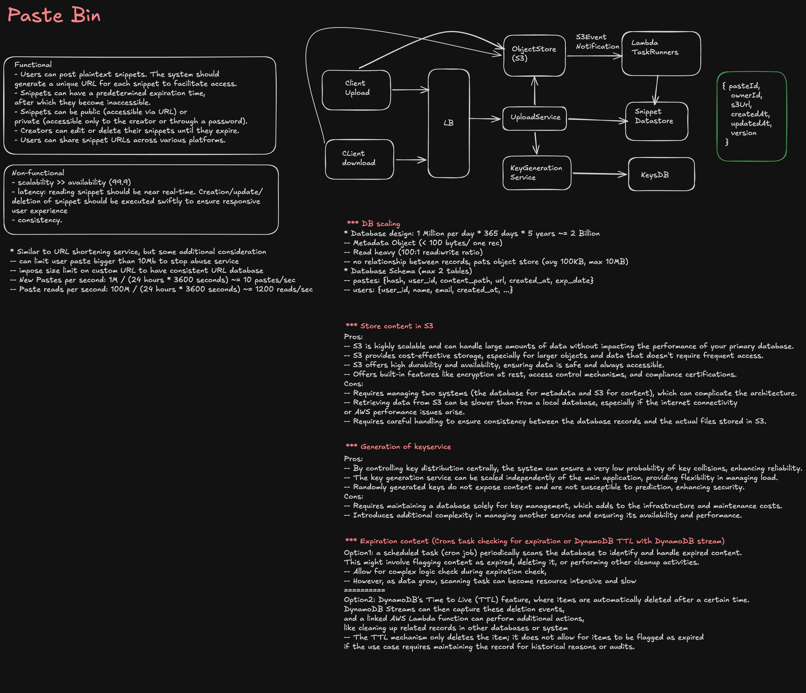
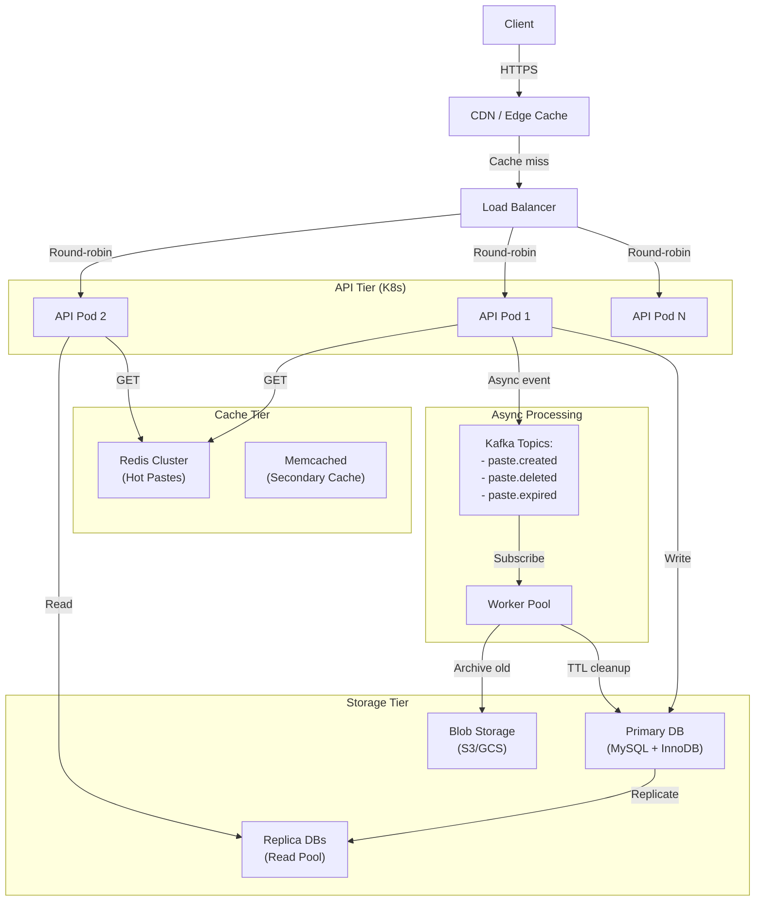

# PasteBin System Design

A distributed system for storing and sharing code snippets, text, and documents with short URLs.

## System Diagram

---

## Functional Requirements

### Core Features

| Feature                 | Details                                                                        |
| ----------------------- | ------------------------------------------------------------------------------ |
| **Create Paste**        | User submits text/code, system generates unique short URL, returns immediately |
| **Read Paste**          | Retrieve paste by short URL; display content and metadata                      |
| **Delete Paste**        | User can delete their own paste; purge from storage                            |
| **Expiration**          | Pastes can expire after TTL (hours/days) or time-based scheduled deletion      |
| **Access Control**      | Public (anyone with URL), private (requires auth token), or password-protected |
| **Syntax Highlighting** | Language detection and optional client-side rendering                          |
| **Sharing**             | Generate share links with custom expiration, view counts, analytics            |

### Secondary Features

- **Paste History** — authenticated users can see their paste timeline
- **Clone/Fork** — allow users to clone a paste and create a new one
- **Trending** — show recently created or most-viewed pastes
- **Search** — find pastes by tags or content (optional; privacy-sensitive)
- **APIs** — programmatic paste creation/retrieval for CI/CD, tools, scripts

---

## Non-Functional Requirements

### Scale

| Metric                   | Target                       |
| ------------------------ | ---------------------------- |
| **Pastes Created/Day**   | 10M                          |
| **QPS (Read)**           | 100K                         |
| **QPS (Write)**          | 5K                           |
| **Avg Paste Size**       | 10 KB                        |
| **Data Stored (1 year)** | ~50 TB (with 3x replication) |

### Performance

- **Write Latency** — P99 < 200ms (short URL generation + storage)
- **Read Latency** — P99 < 50ms (cache hit); P99 < 500ms (cold read from DB)
- **Availability** — 99.9% uptime (SLA 3 nines minimum)

### Durability & Safety

- **Data Durability** — 99.999999% (11 nines) across replicas
- **Replication** — 3x across zones or regions
- **Backup** — daily snapshots, 30-day retention
- **PITR** (Point-In-Time Recovery) — 7 days minimum

### Compliance & Security

- **Encryption** — TLS in transit; at-rest encryption for sensitive content
- **GDPR** — right to be forgotten; comply with EU data residency
- **Rate Limiting** — prevent abuse (spam pastes, scraping)
- **DDoS Protection** — geo-distributed, CDN integration
- **Content Moderation** — detect and flag illegal/abusive content

---

## Capacity Planning

### Storage

```
Daily write: 10M pastes × 10 KB = 100 GB/day
Annual: 100 GB × 365 = 36.5 TB
With 3x replication: ~110 TB/year
```

**DB Strategy:**

- Hot data (< 30 days): SSD, fast access
- Warm data (30 days – 1 year): HDD, archival tier
- Cold data (> 1 year): blob storage (S3/GCS)

### Bandwidth

```
Peak read: 100K QPS × 10 KB avg = 1 TB/sec
Requires: multi-region CDN + edge caching
```

---

## High-Level Architecture



---

## Key Design Decisions

### 1. URL Shortening Strategy

**Option A: Sequential IDs**

```
Pros: Simple, predictable, cache-friendly
Cons: Enumerable (security risk — can guess URLs)
```

**Option B: Cryptographic Hash (MD5/SHA-256 prefix)**

```
Pros: Difficult to guess, privacy-preserving
Cons: Collision handling needed; can't reverse lookup
```

**Option C: Random Base62/Base64 String**

```
Pros: Non-enumerable, good entropy
Cons: Collision checks needed; no inherent meaning
Recommended: 6-character Base62 = 62^6 = 56 trillion unique IDs
```

**Chosen: Option C** (6-char Base62)

- Generate candidate ID
- Check collision in Redis (fast check)
- On collision, retry (expected &lt;1% collision rate at scale)

---

### 2. Database Schema

```sql
-- Pastes table
CREATE TABLE pastes (
  id BIGINT PRIMARY KEY AUTO_INCREMENT,
  short_url VARCHAR(10) UNIQUE NOT NULL,
  user_id BIGINT NULLABLE,
  title VARCHAR(255),
  content LONGBLOB,           -- binary or text
  language VARCHAR(50),        -- "python", "javascript", etc.
  is_public BOOLEAN DEFAULT true,
  password_hash VARCHAR(255) NULLABLE,
  view_count INT DEFAULT 0,
  created_at TIMESTAMP DEFAULT CURRENT_TIMESTAMP,
  expires_at TIMESTAMP NULLABLE,  -- TTL for auto-delete
  updated_at TIMESTAMP DEFAULT CURRENT_TIMESTAMP ON UPDATE CURRENT_TIMESTAMP,
  INDEX idx_user_id (user_id, created_at),
  INDEX idx_expires_at (expires_at)  -- for batch cleanup
) ENGINE=InnoDB;

-- Paste access log (optional, for analytics)
CREATE TABLE paste_views (
  paste_id BIGINT,
  viewer_ip VARCHAR(45),
  accessed_at TIMESTAMP DEFAULT CURRENT_TIMESTAMP,
  INDEX idx_paste_time (paste_id, accessed_at)
) ENGINE=InnoDB;
```

### 3. Caching Strategy

**Cache Layers (read-through):**

1. **CDN (Geo-distributed, 24h TTL)**
   - Serves public pastes directly
   - Reduces load on origin

2. **Redis Hot Cache (In-memory, 1h TTL)**
   - Top 1% of pastes (by view count)
   - Handles 80% of reads
   - Automatic eviction via LRU

3. **Replica Database (Read Pool)**
   - Scales horizontal read replicas
   - Warm reads for non-cached pastes

4. **Blob Storage (S3, Archive)**
   - Old pastes (>90 days) stored as-is
   - Accessed via 302 redirect or background fetch

---

### 4. Expiration & Cleanup

**Strategy: Lazy + Active Deletion**

```
Lazy Delete (on read):
  - Check expires_at timestamp
  - If expired, return 404 (don't fetch content)
  - Mark for async cleanup

Active Delete (background):
  - Kafka topic: paste.expired
  - Worker consumes, deletes from DB and cache
  - Runs daily via cron (off-peak hours)
```

**Rationale:** Lazy prevents serving expired content; active cleanup frees storage.

---

### 5. Consistency & Replication

**Choice: Eventual Consistency**

```
Write Path:
  1. Client POSTs paste to API
  2. API writes to Primary DB
  3. API writes short_url to Redis (optimistic)
  4. Returns short_url immediately to client
  5. Primary replicates to Replicas (async, &lt;1s)

Read Path:
  1. Check Redis (cache hit → P99 &lt;50ms)
  2. Check Replica DB (cache miss → P99 &lt;500ms)
  3. Stale read risk: &lt;1 second during primary failure

Trade-off: Prioritize availability & low latency over strict consistency
(Paste data is immutable; no updates after creation)
```

---

## API Endpoints

### Write

```http
POST /api/v1/pastes
Content-Type: application/json

{
  "content": "print('hello')",
  "language": "python",
  "title": "Quick test",
  "is_public": true,
  "expires_in_hours": 24,
  "password": "optional-password"
}

Response:
{
  "short_url": "abc123",
  "url": "https://pastebin.local/abc123",
  "created_at": "2026-08-01T12:00:00Z",
  "expires_at": "2026-08-02T12:00:00Z"
}
```

### Read

```http
GET /api/v1/pastes/{short_url}

Response (if public):
{
  "short_url": "abc123",
  "content": "print('hello')",
  "language": "python",
  "title": "Quick test",
  "created_at": "2026-08-01T12:00:00Z",
  "view_count": 42
}

Response (if password protected):
{
  "status": "password_required"
}

POST /api/v1/pastes/{short_url}/unlock
{
  "password": "user-password"
}
```

### Delete

```http
DELETE /api/v1/pastes/{short_url}
Authorization: Bearer {user_token}

Response: 204 No Content
```

---

## Scaling Challenges & Solutions

| Challenge              | Solution                                                           |
| ---------------------- | ------------------------------------------------------------------ |
| **Write bottleneck**   | Shard by user_id or paste ID prefix; distribute across DB clusters |
| **Cache invalidation** | TTL + active deletion via Kafka; no manual cache purge             |
| **Hot pasta spike**    | Auto-scale API tier via K8s HPA; burst capacity via CDN            |
| **Storage growth**     | Tiered storage: SSD (hot) → HDD (warm) → archival (cold)           |
| **Replication lag**    | Async replication < 1s acceptable; SLA allows eventual consistency |
| **Regional outage**    | Multi-region deployment; failover via DNS (Route53/Cloud DNS)      |

---

## Monitoring & Observability

### Key Metrics

```
P99 latency (write, read, delete)
Cache hit ratio (target: >90%)
Database replication lag
Paste expiration rate
View count distribution (for trending)
QPS breakdown by endpoint
Error rates (4xx, 5xx)
```

### Alerting

```yaml
Thresholds:
  - P99 write latency > 500ms
  - Cache hit ratio < 80%
  - Replication lag > 5s
  - 5XX error rate > 0.1%
  - Disk usage > 80%
```

---

## Trade-offs & Decisions

| Decision                     | Rationale                                                                |
| ---------------------------- | ------------------------------------------------------------------------ |
| **Eventual consistency**     | Lower latency & higher availability; paste data immutable after creation |
| **Random Base62 URLs**       | Non-enumerable; better privacy; simpler than cryptographic hash          |
| **Redis hot cache**          | Sub-50ms reads for top 1% pastes; 80/20 rule pays off                    |
| **Lazy + active expiration** | Avoids serving stale data; background cleanup for storage efficiency     |
| **Async replication**        | Faster writes; acceptable &lt;1s lag given immutable pastes              |
| **CDN + origin**             | Geo-distribution reduces latency & DDoS surface                          |

---

## Follow-up Questions

1. **How do you handle abuse?** — Rate limiting per IP/user, content moderation via ML, DMCA compliance
2. **How do you scale to 100M pastes/day?** — Sharding, multi-region, tiered storage, CDN
3. **How do you ensure privacy?** — Encryption at rest, GDPR deletion, audit logs
4. **How do you prevent enumeration attacks?** — Rate limiting, CAPTCHA after N failed requests, randomized URLs
5. **How do you handle large pastes (>1GB)?** — Stream to blob storage directly; impose size limits (256 MB)
