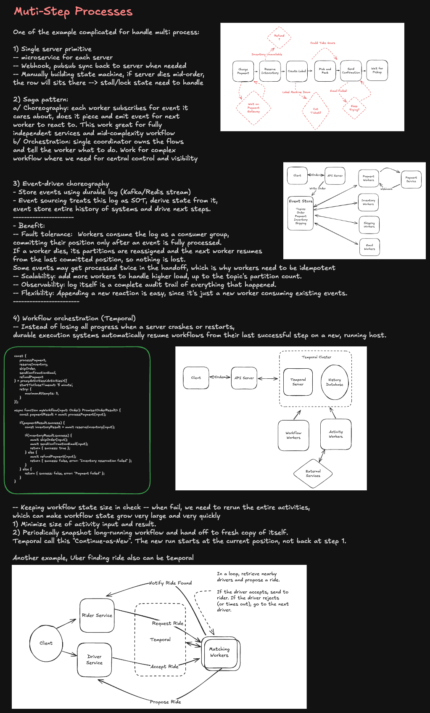
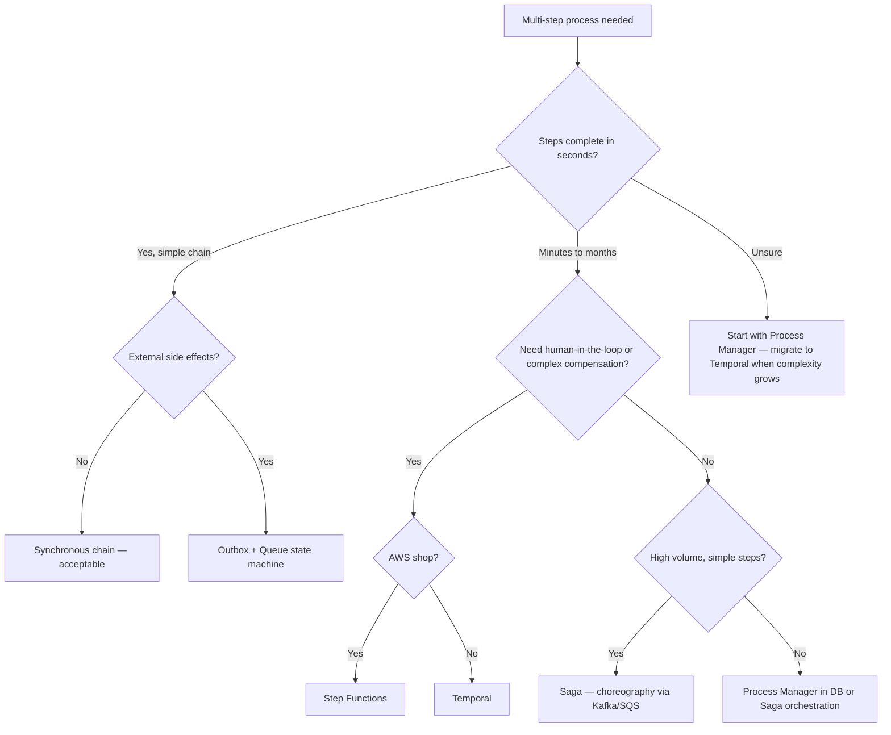

# Handling Multi-Step Processes



---

## The Problem Space

Any business process spanning more than one service call is a multi-step process. Examples:

- **Order fulfillment** — validate → charge → reserve inventory → ship → notify
- **User onboarding** — create account → send welcome email → provision workspace → assign trial plan
- **Video processing** — upload → transcode → generate thumbnails → index → notify
- **Loan approval** — submit → credit check → fraud check → underwriter review → decision → disburse

These processes share failure modes that don't exist in single-step calls:

- Any step can fail independently
- The system can crash _between_ steps, leaving partial state
- Steps may need to be retried, skipped, or compensated (undone)
- Steps may take seconds, minutes, or days (human approval)
- Concurrent instances of the same process must not interfere

**Staff-level framing:** The question is never "should I handle this differently?" It's "which consistency model, failure boundary, and operational surface area is acceptable for this problem?"

---

## Technique 1: Synchronous Chain (Naive — Know When to Reject It)

The simplest approach: call each step in sequence in a single request handler.

```
POST /checkout
  → validateCart()
  → chargeCard()         // Stripe API call
  → reserveInventory()   // DB write
  → sendConfirmEmail()   // SendGrid API call
  → return 200
```

**When it works:** Workflows that complete in &lt;2s, non-critical side effects, low volume.

**Why it breaks at scale:**

- A crash after `chargeCard()` but before `reserveInventory()` leaves the customer charged with no order
- HTTP timeout (30s) is shorter than some workflow steps
- No retry without re-running already-completed steps (double charge risk)
- Long workflows block a thread/connection for their entire duration

**Verdict:** Never use for workflows with external side effects in production systems at scale.

---

## Technique 2: Saga Pattern

Sagas decompose a long transaction into a sequence of local transactions, each with a compensating transaction that undoes its effect if a later step fails.

```
T1: Reserve inventory    ←  C1: Release reservation
T2: Charge credit card   ←  C2: Issue refund
T3: Ship order           ←  C3: Cancel shipment
T4: Send confirmation    ←  (no compensation — email already sent, log it)
```

On step N failure: execute C(N-1), C(N-2), ... C(1) in reverse order.

### Choreography-based Saga

Each service listens for domain events and reacts independently. No central coordinator.

```
OrderService emits: OrderCreated
  → InventoryService listens: reserves stock → emits InventoryReserved
  → PaymentService listens: charges card → emits PaymentProcessed
  → ShippingService listens: schedules shipment → emits ShipmentScheduled
  → NotificationService listens: sends email → emits EmailSent

On failure:
PaymentService fails → emits PaymentFailed
  → InventoryService listens: releases reservation → emits InventoryReleased
  → OrderService listens: marks order as failed
```

**Pros:** Loose coupling, each service owns its domain, no single point of failure.

**Cons:** Workflow logic is distributed across services — hard to trace end-to-end. Hard to answer "what is the current state of order 123?" Cyclic dependencies can emerge. Testing is complex.

**When to use:** Bounded services with clear domain events, teams that own their services independently, eventual consistency is acceptable.

### Orchestration-based Saga

A central orchestrator (a dedicated service or workflow engine) directs each step and handles compensation.

```
OrderOrchestrator:
  1. call InventoryService.reserve(orderId)
  2. call PaymentService.charge(orderId, amount)
     on failure → call InventoryService.release(orderId)
  3. call ShippingService.schedule(orderId)
     on failure → call PaymentService.refund(orderId)
                  call InventoryService.release(orderId)
  4. call NotificationService.sendConfirmation(orderId)
```

**Pros:** Workflow logic in one place. Easy to trace, debug, and modify. Clear state ownership.

**Cons:** Orchestrator is a coordination bottleneck. Becomes a "God service" if not carefully bounded.

**When to use:** Complex workflows with many steps, cross-team coordination, when you need a clear audit trail.

---

## Technique 3: Outbox Pattern (Reliable Event Emission)

The root cause of many saga failures: writing to your DB succeeds but publishing the event to the message broker fails (or vice versa). The outbox pattern makes event emission atomic with the DB write.

```
Within the same DB transaction:
  INSERT INTO orders (id, status) VALUES (?, 'pending');
  INSERT INTO outbox (event_type, payload) VALUES ('OrderCreated', ?);
COMMIT;

Separate relay process:
  SELECT * FROM outbox WHERE processed = false ORDER BY created_at LIMIT 100;
  FOR each event:
    publish to Kafka/SQS
    UPDATE outbox SET processed = true WHERE id = ?
```

**Guarantees:** At-least-once delivery. The event is _always_ published if the DB transaction commits — the relay retries until the broker acknowledges.

**Idempotency requirement:** Consumers must handle duplicate events (idempotency key on every step).

**Implementation:** Debezium CDC (reads Postgres WAL, publishes to Kafka) is the production-grade version — zero polling overhead, sub-second latency.

---

## Technique 4: Queue-Based Step Processing (State Machine + Queue)

Model the workflow as a state machine. Each step transition is a message in a queue.

```
DB: orders.status = 'pending' | 'inventory_reserved' | 'paid' | 'shipped' | 'failed'

Queue messages:
  { orderId, step: 'RESERVE_INVENTORY' }
  { orderId, step: 'CHARGE_PAYMENT' }
  { orderId, step: 'SCHEDULE_SHIPMENT' }

Worker:
  consume message
  check orders.status to ensure correct sequence
  execute step
  update orders.status
  enqueue next step message
  ack message
```

**Pros:** Durable (messages survive crashes), horizontally scalable workers, natural backpressure via queue depth, simple mental model.

**Cons:** No built-in retry backoff logic beyond what SQS/Kafka provides. Long workflows require many queue round-trips. State reconstruction requires querying DB. Hard to implement timeouts and human-in-the-loop steps.

**When to use:** High-volume workflows, each step is fast (&lt;1s), steps are independent services, you want minimal infrastructure.

---

## Technique 5: Temporal (Workflow-as-Code)

Temporal is a durable execution platform. You write workflow logic as ordinary code; Temporal ensures it runs to completion even across crashes, restarts, and network failures.

```typescript
// This looks like regular sequential code
// but Temporal persists every step's result to durable storage
export async function orderFulfillmentWorkflow(order: Order): Promise<void> {
  await reserveInventory(order.id, order.items); // Activity

  try {
    await chargePayment(order.id, order.totalAmount); // Activity
  } catch (e) {
    await releaseInventory(order.id); // Compensation
    throw e;
  }

  try {
    await scheduleShipment(order.id); // Activity
  } catch (e) {
    await refundPayment(order.id); // Compensation
    await releaseInventory(order.id);
    throw e;
  }

  await sendConfirmationEmail(order.customerId, order.id); // Activity
}
```

### How Temporal Works Internally

```
Workflow Worker  ←──── Temporal Server (event history) ────► Activity Worker
     │                         │                                    │
     │   replay event history  │  records every event               │
     │◄────────────────────────│  (scheduled, started, completed)   │
     │                         │                                     │
     └── deterministic code ───┴── durable state ─────────────────►┘
```

The workflow code is **replayed** from event history on every restart. Non-deterministic operations (API calls, DB writes, time) are wrapped in Activities, which are the unit of retry/failure isolation.

### Temporal Key Concepts

| Concept            | Description                                                               |
| ------------------ | ------------------------------------------------------------------------- |
| **Workflow**       | Durable, long-running business process; written as code; survives crashes |
| **Activity**       | A single step (API call, DB write); has retry policy, timeout, heartbeat  |
| **Signal**         | External event sent to a running workflow (e.g., "payment approved")      |
| **Query**          | Read current state of a running workflow without side effects             |
| **Timer**          | `await sleep(days(30))` — persisted, survives server restarts             |
| **Child Workflow** | Spawn sub-workflows; compose complex processes                            |

### Retry and Timeout Configuration

```typescript
const chargePayment = proxyActivities<PaymentActivities>({
  startToCloseTimeout: '30s', // individual attempt timeout
  scheduleToCloseTimeout: '5m', // total time including all retries
  retry: {
    initialInterval: '1s',
    backoffCoefficient: 2,
    maximumInterval: '30s',
    maximumAttempts: 5,
    nonRetryableErrorTypes: ['InvalidCardError', 'InsufficientFundsError'],
  },
});
```

### Human-in-the-Loop with Signals

```typescript
// Workflow waits indefinitely for a signal
export async function loanApprovalWorkflow(applicationId: string) {
  await submitToUnderwriter(applicationId);

  // Wait up to 72 hours for human decision
  const decision = await condition(() => receivedDecision !== undefined, '72h');

  if (decision === 'approved') {
    await disburseFunds(applicationId);
  } else {
    await notifyRejection(applicationId);
  }
}

// External system (underwriter UI) sends signal
temporalClient.signal(workflowId, 'approvalDecision', { decision: 'approved' });
```

**When to use Temporal:**

- Workflows lasting seconds to months
- Human approval steps
- Complex compensation logic
- You need full audit history of every step
- Multi-step workflows across many services

**Trade-offs:** Additional infrastructure (Temporal cluster). Workers must be deterministic. Learning curve. Not suited for sub-millisecond workflows.

---

## Technique 6: Step Functions (AWS-Managed Orchestration)

AWS Step Functions is a fully managed state machine service. You define workflow as JSON (Amazon States Language); AWS manages durability, retries, and parallel execution.

```json
{
  "Comment": "Order fulfillment",
  "StartAt": "ReserveInventory",
  "States": {
    "ReserveInventory": {
      "Type": "Task",
      "Resource": "arn:aws:lambda:us-east-1:123:function:ReserveInventory",
      "Retry": [{ "ErrorEquals": ["States.ALL"], "MaxAttempts": 3 }],
      "Catch": [{ "ErrorEquals": ["States.ALL"], "Next": "HandleFailure" }],
      "Next": "ChargePayment"
    },
    "ChargePayment": { ... },
    "ScheduleShipment": { ... },
    "HandleFailure": { "Type": "Task", "Resource": "..." }
  }
}
```

**Pros:** Zero infrastructure management, native AWS integrations (Lambda, SQS, DynamoDB, ECS), visual workflow editor, built-in audit history.

**Cons:** Workflow logic in JSON (not code) — harder to test and version. AWS lock-in. Price per state transition at high volume. Workflow definition separate from application code.

**When to use:** AWS-native shops, workflows with many Lambda steps, teams that prefer managed infrastructure over operational complexity.

---

## Technique 7: Process Manager Pattern (DB-Driven)

For simpler workflows without dedicated orchestration infrastructure — store workflow state in the DB, use a scheduler to drive progress.

```sql
CREATE TABLE workflow_instances (
  id            UUID PRIMARY KEY,
  type          TEXT NOT NULL,          -- 'order_fulfillment'
  current_step  TEXT NOT NULL,          -- 'reserve_inventory'
  status        TEXT NOT NULL,          -- 'running' | 'failed' | 'complete'
  context       JSONB NOT NULL,         -- order data, intermediate results
  next_run_at   TIMESTAMPTZ,            -- for scheduled retries
  attempts      INT DEFAULT 0,
  created_at    TIMESTAMPTZ DEFAULT now(),
  updated_at    TIMESTAMPTZ DEFAULT now()
);
```

Worker loop (runs every few seconds):

```
SELECT * FROM workflow_instances
  WHERE status = 'running' AND next_run_at <= now()
  FOR UPDATE SKIP LOCKED
  LIMIT 10;

FOR each instance:
  execute current_step handler
  on success: advance current_step, reset attempts
  on failure: increment attempts, set next_run_at = now() + backoff(attempts)
              if attempts > max: set status = 'failed'
```

**Pros:** No external dependencies, full control, works on any DB, easy to inspect/debug state, natural idempotency via `FOR UPDATE SKIP LOCKED`.

**Cons:** You're building your own retry/backoff/timeout/scheduling logic. Polling adds DB load. Limited to workflows that fit in a DB row.

**When to use:** Low-to-medium volume, teams that want to avoid Temporal/Step Functions, existing Postgres infrastructure.

---

## Comparison Matrix

| Technique            | Durability       | Complexity  | Human Steps    | Long-Running   | Volume     |
| -------------------- | ---------------- | ----------- | -------------- | -------------- | ---------- |
| Synchronous chain    | ❌ None          | Low         | ❌             | ❌             | Low        |
| Saga (choreography)  | ✅ Via broker    | Medium      | ❌             | Limited        | High       |
| Saga (orchestration) | ✅ Via broker    | Medium-High | Limited        | Limited        | High       |
| Outbox + Queue       | ✅ DB + broker   | Medium      | ❌             | Limited        | Very High  |
| Temporal             | ✅ Event history | High        | ✅             | ✅ Days/months | High       |
| Step Functions       | ✅ AWS-managed   | Low-Medium  | ✅ (wait task) | ✅             | Medium     |
| Process Manager      | ✅ DB            | Medium      | ✅             | ✅             | Low-Medium |

---

## Decision Framework



---

## Staff Interview Follow-ups

**"How do you handle idempotency across retried steps?"**
Every activity/step must be idempotent. Use an idempotency key (workflow ID + step name + attempt number) in every external call. Check if the operation was already applied before executing. For payment APIs, pass `idempotency_key` in the request header. For DB writes, use `INSERT ... ON CONFLICT DO NOTHING` or upsert patterns.

**"What's the difference between choreography and orchestration?"**
Choreography: services react to events — no central brain, high coupling through event contracts. Orchestration: a coordinator directs each step — single source of truth for workflow logic, single point of change. Choreography scales better; orchestration debugs better. Use choreography for loosely coupled domains, orchestration when you need workflow visibility.

**"How do you handle a step that cannot be compensated?"**
Emails sent, SMS delivered, external webhooks fired — these can't be undone. Design compensating actions that are logically equivalent: send a "cancellation" email rather than "unsending." Move non-compensatable side effects to the last step so compensation never needs to undo them. If you can't, mark the saga as "partially failed" and trigger a manual remediation workflow.

**"How does Temporal guarantee exactly-once execution?"**
It doesn't — Temporal guarantees at-least-once activity execution. Activities must be idempotent. What Temporal _does_ guarantee is that the workflow _makes progress_ and its recorded history is consistent. The workflow code is replayed deterministically from history, so the same logical path is always followed.

**"When would you NOT use Temporal?"**
Sub-millisecond workflows (Temporal adds latency per step), very high-volume simple tasks (bulk data processing is better served by Spark/Flink), teams without Go/Java/TypeScript expertise (SDK requirement), or when the operational overhead of running a Temporal cluster exceeds the problem complexity (use Step Functions or DB process manager instead).
