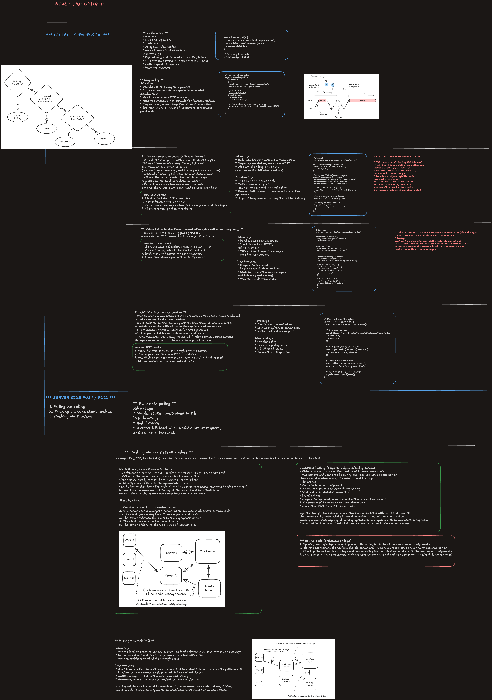

# Real-Time Updates Pattern

Real-time systems differ significantly in their communication direction, latency requirements, fan-out patterns, consistency guarantees, and conflict-resolution needs.

The transport choice should follow the application behavior rather than defaulting to WebSockets for every use case.

## Use-Case Comparison

| Use Case                                | Recommended Transport                                                            | Communication Pattern                              | Key Architecture Components                                                                          | Main Scaling Challenge                                                     | Consistency / Conflict Handling                                                                 | Interview Deep-Dive Points                                                                                       |
| --------------------------------------- | -------------------------------------------------------------------------------- | -------------------------------------------------- | ---------------------------------------------------------------------------------------------------- | -------------------------------------------------------------------------- | ----------------------------------------------------------------------------------------------- | ---------------------------------------------------------------------------------------------------------------- |
| **Chat Applications**                   | WebSocket                                                                        | Bidirectional, low-latency                         | WebSocket gateway, chat service, pub/sub broker, message store, presence service                     | Routing messages across many servers and large group fan-out               | Per-conversation sequence number, idempotent message ID, reconnect and missed-message recovery  | Message ordering, acknowledgments, offline messages, typing indicators, presence, reconnect, backpressure        |
| **Live Comments**                       | WebSocket or SSE                                                                 | Client submissions with high-volume server fan-out | Ingestion API, moderation pipeline, stream processor, hierarchical pub/sub, regional fan-out servers | Millions of users publishing and receiving comments during the same event  | Global ordering is usually unnecessary; preserve ordering within a channel or partition         | Batching, sampling, ranking, moderation, rate limiting, partitioning, hot-channel mitigation                     |
| **Collaborative Document Editing**      | WebSocket                                                                        | High-frequency bidirectional updates               | Collaboration gateway, document session service, operation log, snapshot store, presence service     | Concurrent edits to the same document and high-frequency character updates | Operational Transformation or CRDTs reconcile concurrent operations and converge document state | Conflict resolution, operation versioning, cursor presence, selections, snapshots, reconnect, undo and redo      |
| **Live Dashboards and Analytics**       | Server-Sent Events                                                               | One-way server-to-client stream                    | Metrics pipeline, stream processor, aggregation service, SSE gateway, cache                          | Large numbers of dashboards subscribing to frequently changing metrics     | Latest-value semantics often matter more than processing every intermediate event               | Aggregation intervals, coalescing, `Last-Event-ID`, stale-data indicators, real-time SLA                         |
| **Gaming and Interactive Applications** | WebRTC for peer traffic; WebSocket or UDP-based protocol for server coordination | Bidirectional, extremely low-latency               | Matchmaking, authoritative game server, state synchronization, relay or TURN servers, regional edge  | Maintaining low latency while synchronizing rapidly changing game state    | Authoritative server, prediction, interpolation, reconciliation, tick or sequence numbers       | Update frequency, client-side prediction, lag compensation, cheating prevention, packet loss, regional placement |

---

## 1. Chat Applications

Chat is the classic real-time application.

Messages should appear immediately across all participants, while the platform must also support reconnects, offline users, ordering, and delivery guarantees.

### Recommended Architecture

```text
Client
  │
  ▼
WebSocket Gateway
  │
  ├── Authentication
  ├── Connection Registry
  ├── Rate Limiting
  └── Backpressure
  │
  ▼
Chat Service
  │
  ├── Persist Message
  ├── Assign Sequence Number
  └── Publish Event
  │
  ▼
Pub/Sub Broker
  │
  └── Route to Gateways Hosting Conversation Participants
  │
  ▼
Recipient Clients
```

### Core Components

- **WebSocket gateway** manages persistent client connections.
- **Chat service** validates, stores, and sequences messages.
- **Pub/sub broker** distributes messages across gateway instances.
- **Message store** provides durable history and offline recovery.
- **Presence service** tracks online, offline, and last-seen state.

### Important Design Concerns

#### Message Ordering

Use a monotonically increasing sequence number scoped to a conversation.

```ts
type ChatMessage = {
  messageId: string;
  conversationId: string;
  senderId: string;
  sequenceNumber: number;
  content: string;
  createdAt: string;
};
```

Clients can buffer out-of-order messages until missing sequence numbers arrive.

#### Delivery Semantics

A practical design usually provides **at-least-once delivery**.

Each message should have an idempotency key so clients and servers can safely deduplicate retries.

#### Typing Indicators

Typing indicators are ephemeral and should not be persisted.

They can tolerate loss and should be:

- rate-limited
- debounced
- expired with a short TTL
- sent through a lightweight pub/sub path

#### Presence

Presence is eventually consistent.

Store connection leases with TTLs instead of treating a socket close event as perfectly reliable.

---

## 2. Live Comments

Live comments create an extreme fan-out problem because a large number of viewers may publish and consume comments at the same time.

The goal is usually to preserve the feeling of liveness rather than deliver every comment to every viewer.

### Recommended Architecture

```text
Comment Producers
  │
  ▼
Regional Ingestion Layer
  │
  ├── Authentication
  ├── Rate Limiting
  └── Abuse Filtering
  │
  ▼
Moderation Pipeline
  │
  ▼
Partitioned Event Stream
  │
  ▼
Ranking / Sampling / Aggregation
  │
  ▼
Regional Fan-Out Tier
  │
  ▼
WebSocket or SSE Clients
```

### Scaling Techniques

#### Partition by Event or Channel

Use an event identifier as the primary partition key.

```text
partition = hash(eventId) % partitionCount
```

This preserves local ordering for a live event while distributing different events across partitions.

#### Hierarchical Fan-Out

Avoid publishing directly from one broker partition to millions of clients.

Use multiple layers:

```text
Global Stream
  → Regional Aggregators
    → Fan-Out Servers
      → Client Connections
```

#### Batching and Coalescing

Comments can be delivered in small batches every 100–500 milliseconds.

This reduces serialization and network overhead while preserving a live user experience.

#### Ranking and Sampling

For very large events, each viewer does not need every comment.

The system can select comments based on:

- relevance
- language
- moderation status
- engagement
- social relationship
- sampling probability

#### Hot-Channel Protection

A single major event can overload one partition.

Possible mitigations include:

- partitioning by `eventId + shardId`
- hierarchical aggregation
- adaptive sampling
- per-user delivery limits
- regional replication

---

## 3. Collaborative Document Editing

Collaborative editing requires both low-latency propagation and deterministic conflict resolution.

Multiple users may edit the same location at nearly the same time, so simple last-write-wins behavior is usually insufficient.

### Recommended Architecture

```text
Editor Clients
  │
  ▼
Collaboration Gateway
  │
  ▼
Document Session Service
  │
  ├── Validate Operation
  ├── Transform or Merge
  ├── Assign Version
  └── Broadcast Operation
  │
  ├── Operation Log
  ├── Snapshot Store
  └── Presence Service
```

### Operation Model

```ts
type DocumentOperation = {
  operationId: string;
  documentId: string;
  actorId: string;
  baseVersion: number;
  operationType: 'insert' | 'delete' | 'format';
  position: number;
  value?: string;
  length?: number;
};
```

### Conflict-Resolution Options

| Approach                       | Core Idea                                                                             | Advantages                                                                       | Trade-Offs                                                                                                  |
| ------------------------------ | ------------------------------------------------------------------------------------- | -------------------------------------------------------------------------------- | ----------------------------------------------------------------------------------------------------------- |
| **Operational Transformation** | Transform concurrent operations relative to operations already accepted by the server | Proven in centralized document systems; operations can remain compact            | Transformation logic becomes complex as operation types grow; often depends on a central ordering authority |
| **CRDT**                       | Use data structures whose concurrent updates merge deterministically                  | Supports offline editing and decentralized collaboration; guarantees convergence | More metadata, higher memory cost, compaction complexity, and possible tombstone management                 |

### Operational Transformation Example

Assume two users start with:

```text
CAT
```

User A inserts `B` at position `0`.

```text
BCAT
```

User B inserts `S` at position `3` based on the original version.

The system transforms User B's operation to account for User A's insertion.

```text
BCATS
```

### CRDT Concept

Each inserted character may have a stable identifier rather than relying only on a numeric position.

```ts
type CRDTCharacter = {
  id: string;
  value: string;
  leftId: string | null;
  deleted: boolean;
};
```

Concurrent inserts can then be ordered deterministically by identifier.

### Additional Real-Time State

Cursor positions and text selections are ephemeral presence information.

```ts
type CursorPresence = {
  userId: string;
  documentId: string;
  anchor: number;
  focus: number;
  color: string;
  updatedAt: number;
};
```

Cursor updates should be throttled and should not share the same durability path as document operations.

### Snapshot and Replay

The system should periodically create snapshots.

On reconnect:

1. Load the latest snapshot.
2. Replay operations after the snapshot version.
3. Subscribe to live operations.

This prevents replaying the entire operation history.

---

## 4. Live Dashboards and Analytics

Live dashboards usually consume server-generated data and rarely need a persistent bidirectional channel.

Server-Sent Events are a strong fit because they provide one-way streaming over HTTP and browser-managed reconnection.

### Recommended Architecture

```text
Data Sources
  │
  ▼
Event Stream
  │
  ▼
Stream Processing
  │
  ├── Windowed Aggregation
  ├── Filtering
  └── Metric Computation
  │
  ▼
Dashboard Query / Subscription Service
  │
  ▼
SSE Gateway
  │
  ▼
Browser Dashboard
```

### SSE Event Example

```text
id: metric-10583
event: metric-update
data: {"metric":"activeUsers","value":43120}
```

### Reconnection

The browser remembers the last event ID and sends it during reconnection.

```http
Last-Event-ID: metric-10583
```

The server can then:

1. replay retained events after that ID
2. return a fresh snapshot when replay history has expired
3. resume the live stream

### Real-Time Enough

Not every dashboard needs updates every millisecond.

Example update intervals:

| Dashboard Type                  | Typical Update Interval |
| ------------------------------- | ----------------------: |
| Executive business metrics      | 30 seconds to 5 minutes |
| Operational service health      |         1 to 10 seconds |
| Incident debugging              | Sub-second to 2 seconds |
| Billing and financial reporting |        Minutes to hours |

### Coalescing

When metric updates arrive faster than the browser can render them, keep only the newest value.

```ts
const latestMetrics = new Map<string, MetricValue>();

function onMetric(metric: MetricValue) {
  latestMetrics.set(metric.name, metric);
}
```

This is appropriate when intermediate values are not individually meaningful.

### Staleness

The UI should display:

- last successful update time
- connection status
- stale-data warning
- retry state
- partial-data indicators

---

## 5. Gaming and Interactive Applications

Multiplayer games need very low latency and often tolerate occasional packet loss better than delayed delivery.

Different game data requires different reliability levels.

### Communication Strategy

| Data Type                | Suggested Transport Behavior           |
| ------------------------ | -------------------------------------- |
| Player movement          | Unreliable and unordered when possible |
| Match result             | Reliable and ordered                   |
| Inventory update         | Reliable and ordered                   |
| Voice or video           | WebRTC media channels                  |
| Matchmaking              | HTTPS or WebSocket                     |
| Server authority updates | WebSocket, QUIC, or UDP-based protocol |

### Recommended Architecture

```text
Clients
  │
  ├── WebRTC Peer / Media Traffic
  └── Game Protocol
       │
       ▼
Regional Game Server
  │
  ├── Authoritative Simulation
  ├── Tick Processing
  ├── Collision Validation
  └── Anti-Cheat Controls
  │
  ▼
State Distribution
```

### Authoritative Server

Clients send player intent.

```ts
type PlayerInput = {
  playerId: string;
  sequenceNumber: number;
  direction: {
    x: number;
    y: number;
  };
  clientTimestamp: number;
};
```

The server determines the canonical game state and sends snapshots or deltas back to clients.

### Client-Side Prediction

The client applies its own input immediately to avoid waiting for the network.

When the server response arrives:

1. compare the authoritative position with the predicted position
2. correct divergence
3. replay any unacknowledged local inputs

### Interpolation

Remote players can be rendered slightly behind the latest known server time so the client can interpolate smoothly between snapshots.

### Different Update Frequencies

Not every object needs the same update frequency.

| Game Element          |       Example Frequency |
| --------------------- | ----------------------: |
| Local player movement |    30–60 updates/second |
| Nearby players        |    10–30 updates/second |
| Distant players       |     2–10 updates/second |
| Static environment    | On load or when changed |
| Scoreboard            |      1–2 updates/second |

---

## Transport Selection Summary

| Transport              | Best Fit                                                | Strengths                                                                        | Limitations                                                                              |
| ---------------------- | ------------------------------------------------------- | -------------------------------------------------------------------------------- | ---------------------------------------------------------------------------------------- |
| **WebSocket**          | Chat, collaboration, game coordination                  | Full-duplex, low latency, persistent connection                                  | Stateful connection management, reconnect complexity, scaling gateways, and backpressure |
| **Server-Sent Events** | Dashboards, notifications, one-way streams              | Simple HTTP model, automatic browser reconnect, `Last-Event-ID` support          | Server-to-client only, text-based messages, browser connection constraints               |
| **WebRTC**             | Peer-to-peer gaming, audio, video, direct data channels | Very low latency, peer-to-peer paths, supports unreliable and unordered delivery | NAT traversal, signaling complexity, TURN cost, difficult debugging                      |
| **Polling**            | Low-frequency updates and compatibility fallback        | Simple request-response model and stateless servers                              | Repeated requests, higher latency, inefficient at high frequency                         |
| **Long Polling**       | Compatibility fallback when streaming is unavailable    | Near-real-time behavior over standard HTTP                                       | Reconnection overhead, request churn, less efficient than persistent streaming           |

---

## Transport Decision Framework

Use the following questions during an interview.

### 1. Is communication one-way or bidirectional?

- One-way server-to-client: consider SSE.
- Bidirectional: consider WebSocket.
- Peer-to-peer audio, video, or low-latency data: consider WebRTC.

### 2. What latency is required?

- Minutes or tens of seconds: polling may be enough.
- Seconds: SSE, long polling, or WebSocket.
- Sub-second interactive updates: WebSocket.
- Extremely low-latency peer traffic: WebRTC or a UDP-based protocol.

### 3. Must every event be delivered?

- Durable business event: persist before publishing and support replay.
- Ephemeral presence event: allow loss.
- Latest-value metric: coalesce older updates.
- Game movement: allow packet loss but prefer the newest state.

### 4. Is ordering required?

Ordering may be scoped rather than global.

Examples:

- chat: per conversation
- comments: per event partition
- documents: per document version
- games: per entity or simulation tick
- dashboards: often latest-value only

### 5. What happens after reconnect?

A production design should define:

- resume token or last event ID
- replay buffer
- snapshot fallback
- deduplication
- idempotency
- stale-session expiration

### 6. How will the system handle backpressure?

Possible strategies include:

- bounded client queues
- dropping stale updates
- batching
- coalescing
- slowing producers
- disconnecting slow consumers
- degrading update frequency

---

## Interview Summary

A strong interview answer should connect the transport to the application semantics.

- **Chat** uses WebSockets because both clients and servers initiate events. Pub/sub supports routing across gateway instances.
- **Live comments** require hierarchical fan-out, batching, moderation, sampling, and protection against hot events.
- **Collaborative editing** requires WebSockets plus OT or CRDTs because low latency alone does not solve concurrent-edit conflicts.
- **Live dashboards** are often best served by SSE because communication is primarily one-way and reconnection is built into the browser.
- **Gaming** uses different protocols and update frequencies depending on reliability and latency requirements. WebRTC can reduce peer latency, while an authoritative server protects consistency and limits cheating.

The main design questions are not only which protocol to use, but also how to handle ordering, replay, durability, fan-out, conflict resolution, backpressure, and degraded network conditions.

---

## Excalidraw-Friendly Summary

```text
┌──────────────────────────────────────────────────────────────────────────────────────────────┐
│                              REAL-TIME APPLICATION PATTERNS                                  │
├────────────────────┬─────────────────┬────────────────────┬──────────────────────────────────┤
│ Use Case           │ Transport       │ Primary Challenge  │ Important Design Topics          │
├────────────────────┼─────────────────┼────────────────────┼──────────────────────────────────┤
│ Chat               │ WebSocket       │ Fan-out + ordering │ Presence, typing, reconnect       │
│ Live Comments      │ WS / SSE        │ Extreme fan-out    │ Batching, moderation, hot events  │
│ Collaborative Docs │ WebSocket       │ Concurrent edits   │ OT/CRDT, cursors, snapshots       │
│ Live Dashboards    │ SSE             │ Update volume      │ Aggregation, coalescing, resume    │
│ Gaming             │ WebRTC + WS     │ Ultra-low latency  │ Prediction, ticks, reconciliation │
└────────────────────┴─────────────────┴────────────────────┴──────────────────────────────────┘
```

## One-Minute Interview Answer

> I choose the real-time transport based on communication direction, latency, and delivery semantics. Chat and collaborative editing generally use WebSockets because they require bidirectional communication. Live dashboards often use SSE because updates are primarily server-to-client and browser reconnection is built in. Live comments require more than a transport choice: they need hierarchical fan-out, batching, moderation, and hot-channel protection. Collaborative editors also need OT or CRDTs to resolve concurrent changes. Gaming has the strictest latency requirements, so I separate reliable events such as inventory changes from high-frequency state such as movement and use prediction, interpolation, and authoritative servers to keep gameplay responsive and consistent.
