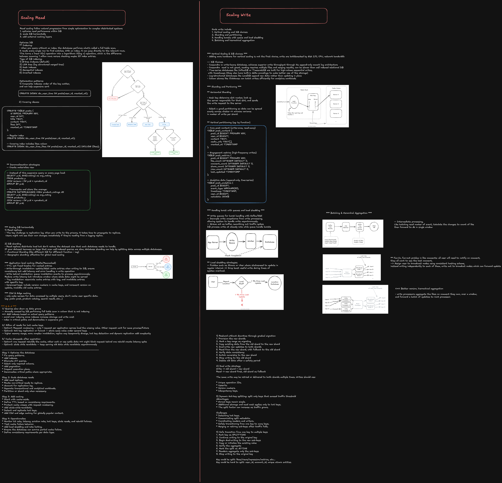
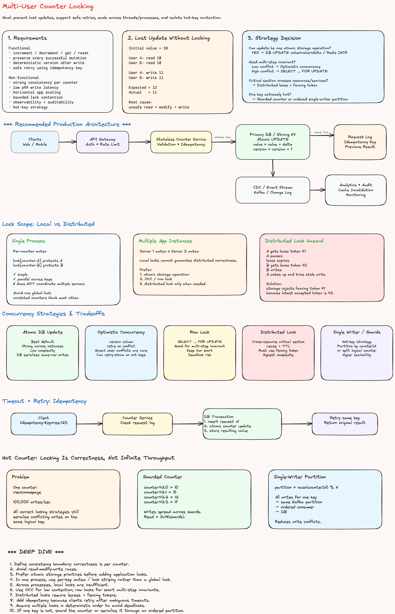
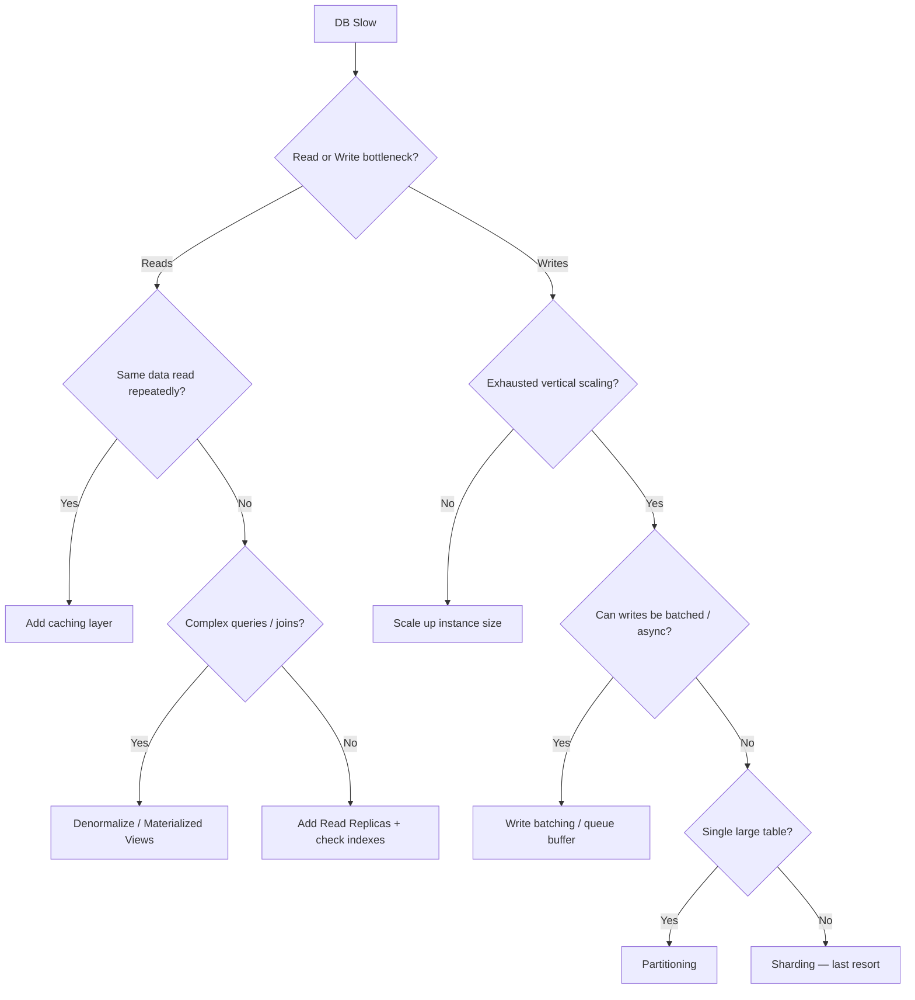

# Scaling DB Read & Write





---

## Why This Matters at Staff Level

Most systems fail not because of bad code, but because the database becomes the bottleneck. A staff engineer needs to reason about _which_ bottleneck they're solving (reads vs. writes vs. both), _when_ each technique applies, and _what trade-offs_ are introduced. Throwing read replicas at a write-heavy system accomplishes nothing. Blindly sharding before exhausting vertical scaling creates operational debt for years.

The framework: **Diagnose → Choose the right lever → Understand the cost.**

---

## Diagnosing the Bottleneck First

Before proposing any solution, characterize the workload:

| Signal                                            | Likely Problem                         |
| ------------------------------------------------- | -------------------------------------- |
| High `SELECT` latency, low `INSERT` load          | Read bottleneck                        |
| High `INSERT`/`UPDATE` latency, replication lag   | Write bottleneck                       |
| Both slow, disk I/O saturated                     | Storage/throughput bottleneck          |
| Queries fast individually, slow under concurrency | Lock contention                        |
| Queries always slow                               | Missing indexes or schema design issue |

**Tools to reach for:** `EXPLAIN ANALYZE`, slow query log, `pg_stat_activity`, CloudWatch/Datadog DB metrics, replication lag dashboards.

> At the staff level, you're expected to name the metric you'd look at, not just say "add a cache."

---

## Scaling Reads

### 1. Read Replicas

Offload `SELECT` queries to one or more read-only replicas that stream changes from the primary via replication.

```
                 ┌─────────────┐
Writes ──────►  │   Primary   │
                 └──────┬──────┘
                        │ replication (async/sync)
            ┌───────────┼───────────┐
            ▼           ▼           ▼
         Replica 1   Replica 2   Replica 3
            ▲           ▲           ▲
Reads ──────┴───────────┴───────────┘
```

**When to use:** Read-heavy workload (>80% reads), reporting queries, analytics, search.

**Trade-offs:**

- **Replication lag** — async replicas may serve stale data. Acceptable for feeds, not for "read your own write" scenarios.
- **Read-after-write consistency** — route writes + the immediately following reads to the primary, or use synchronous replication (higher write latency).
- **Operational cost** — each replica doubles storage and increases failover complexity.

**Mitigation for lag:** Route session reads to primary for N seconds post-write, or use a version token / logical clock check.

---

### 2. Caching Layer

Serve reads from an in-memory cache (Redis, Memcached) in front of the DB.

```
Client → Cache hit? → Return cached value
               │
               └─ Cache miss → Query DB → Populate cache → Return
```

**Patterns:**

| Pattern           | Description                                 | Best For                                  |
| ----------------- | ------------------------------------------- | ----------------------------------------- |
| **Cache-aside**   | App checks cache, falls back to DB          | General purpose, flexible TTL             |
| **Read-through**  | Cache fetches from DB on miss automatically | Simpler app code                          |
| **Write-through** | Write to cache + DB synchronously           | Strong consistency, lower cache miss rate |
| **Write-behind**  | Write to cache, async flush to DB           | High write throughput, risk of data loss  |

**When to use:** Repeated reads of the same data (hot keys), expensive aggregations, session data.

**Trade-offs:**

- **Cache invalidation** is famously hard. Stale reads happen if invalidation is delayed or missed.
- **Cache stampede** — many requests hit DB simultaneously on cold start or expiry. Use probabilistic early expiry or request coalescing.
- **Memory cost** — cache only what's hot; eviction policies (LRU, LFU) matter at scale.

---

### 3. Denormalization & Materialized Views

Pre-compute expensive joins and aggregations, store the result.

```sql
-- Instead of joining 5 tables on every read:
CREATE MATERIALIZED VIEW user_feed_summary AS
  SELECT u.id, u.name, COUNT(p.id) AS post_count, MAX(p.created_at) AS last_post
  FROM users u LEFT JOIN posts p ON p.user_id = u.id
  GROUP BY u.id, u.name;
```

**When to use:** Dashboards, leaderboards, analytics with complex aggregations that don't need real-time accuracy.

**Trade-offs:** Data is eventually consistent with the source. Refresh costs write I/O.

---

### 4. Indexes

Before any infrastructure change, verify indexes cover the query pattern.

```sql
-- Composite index for common filter + sort
CREATE INDEX idx_posts_user_created ON posts(user_id, created_at DESC);

-- Partial index for sparse conditions
CREATE INDEX idx_active_users ON users(email) WHERE active = true;
```

**Staff-level nuance:** Indexes speed reads but slow writes (each write updates all covering indexes). Index bloat on high-write tables is real — monitor `pg_stat_user_indexes` for unused indexes.

---

## Scaling Writes

### 1. Vertical Scaling (Scale Up)

Increase CPU, RAM, and IOPS on the primary. Simple, no code change.

**When it's the right answer:** You haven't hit hardware limits yet. Many "scaling problems" at mid-size companies are solved by going from `db.t3.medium` to `db.r6g.4xlarge`. Exhaust this before sharding.

**Ceiling:** AWS RDS max is ~128 vCPU / 1TB RAM. Beyond that, you need a distributed strategy.

---

### 2. Write Batching & Buffering

Coalesce many small writes into fewer large writes.

```
User actions ──► In-memory buffer (Redis / app-level queue)
                          │
                   batch every 100ms
                          │
                          ▼
                     Single bulk INSERT
```

**Techniques:**

- **Bulk INSERT** — `INSERT INTO ... VALUES (...), (...), (...)` — orders of magnitude faster than N individual inserts.
- **Async writes** — acknowledge the user immediately, persist in background (acceptable for non-critical data like analytics events, view counts).
- **Message queue buffer** — Kafka/SQS absorbs write spikes, DB consumes at sustainable rate.

**Trade-offs:** Async writes risk data loss on crash. Not suitable for financial transactions.

---

### 3. Write-Optimized Storage Engines

Switch storage engines or DB types for write-heavy patterns:

| Technology                  | Write Optimization                                    | Use Case                                         |
| --------------------------- | ----------------------------------------------------- | ------------------------------------------------ |
| **Cassandra / ScyllaDB**    | LSM tree — writes go to memtable, flushed to SSTables | Time-series, append-heavy, high write throughput |
| **ClickHouse**              | Column-oriented, batch inserts, merge-tree            | Analytics, event logs                            |
| **PostgreSQL + BRIN index** | Block Range indexes for monotonically increasing data | Timestamped event tables                         |
| **TimescaleDB**             | Hypertables, automatic partitioning by time           | Metrics, IoT                                     |

---

### 4. Partitioning (Within One DB)

Split a large table into smaller physical partitions without changing the application query logic.

```sql
-- Range partition by month
CREATE TABLE events (
  id BIGSERIAL,
  user_id BIGINT,
  created_at TIMESTAMPTZ
) PARTITION BY RANGE (created_at);

CREATE TABLE events_2025_01 PARTITION OF events
  FOR VALUES FROM ('2025-01-01') TO ('2025-02-01');
```

**Benefits:** Partition pruning speeds queries, old partitions can be dropped instantly (vs. `DELETE` on millions of rows), maintenance operations (VACUUM, ANALYZE) run per-partition.

**When to use:** Time-series data, large tables with natural range keys (date, region, tenant).

---

### 5. Sharding (Horizontal Scaling)

Distribute data across multiple independent DB instances, each owning a subset of the keyspace.

```
Shard key: user_id % 4

user_id 0,4,8...  → Shard 0 (primary + replicas)
user_id 1,5,9...  → Shard 1 (primary + replicas)
user_id 2,6,10... → Shard 2 (primary + replicas)
user_id 3,7,11... → Shard 3 (primary + replicas)
```

**Shard key selection — the most critical decision:**

| Shard Key        | Risk                                                         |
| ---------------- | ------------------------------------------------------------ |
| `user_id` (hash) | Hot shard if a few users have massive data                   |
| `created_at`     | Hot shard — all current writes go to latest shard            |
| `tenant_id`      | Good for multi-tenant SaaS; uneven if tenants differ in size |
| Consistent hash  | Even distribution, easier rebalancing when adding shards     |

**Cross-shard queries:** JOINs across shards require scatter-gather (fan out to all shards, merge results in app). Avoid them by designing queries to stay within one shard — this forces you to choose the shard key based on your most common query pattern.

**Resharding:** Adding shards after the fact is painful. Plan capacity with 2–4x headroom.

**When to use:** After exhausting vertical scaling, read replicas, and caching. Sharding introduces significant operational complexity — treat it as a last resort for write scaling.

---

### 6. CQRS (Command Query Responsibility Segregation)

Maintain separate models optimized for reads and writes.

```
Write path:  Command → Write Model (normalized, ACID) → Event
Read path:   Event   → Async projection → Read Model (denormalized, optimized)
                                              │
                                         Client queries read model
```

**When to use:** Systems where read and write patterns are fundamentally different and at odds (e.g., an order management system where writes need strict ACID, reads need aggregated summaries across joins).

**Trade-offs:** Eventual consistency between write and read models. Additional infrastructure to maintain projections.

---

## Decision Framework



---

## Common Interview Follow-ups

**"How do you handle read-after-write consistency with replicas?"**
Route writes and the user's subsequent reads to the primary for a short window (sticky primary reads), or use synchronous replication for critical paths while keeping async for everything else.

**"How do you avoid a hot shard?"**
Use consistent hashing with virtual nodes so load distributes evenly. Add a salt/secondary key if a small number of entities are disproportionately large.

**"What's the difference between partitioning and sharding?"**
Partitioning splits a table within a single DB instance — the DB engine manages it, queries are transparent. Sharding splits data across multiple DB instances — the application (or a proxy like Vitess/Citus) routes queries. Partitioning is a schema optimization; sharding is a distributed systems problem.

**"When would you NOT add a cache?"**
Write-heavy data that changes on every read (real-time counters, live leaderboards). The invalidation overhead exceeds the cache benefit. Use atomic DB counters or a purpose-built store (Redis sorted sets) instead.

**"How do you monitor if your scaling strategy is working?"**
Track: DB CPU %, I/O wait %, replication lag, slow query rate, p99 query latency, connection pool saturation, cache hit rate. Alert thresholds, not just averages.
