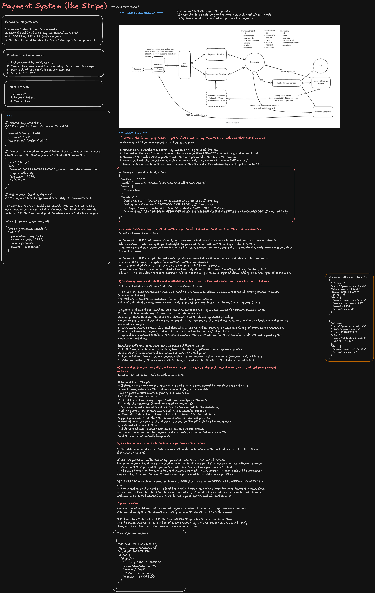
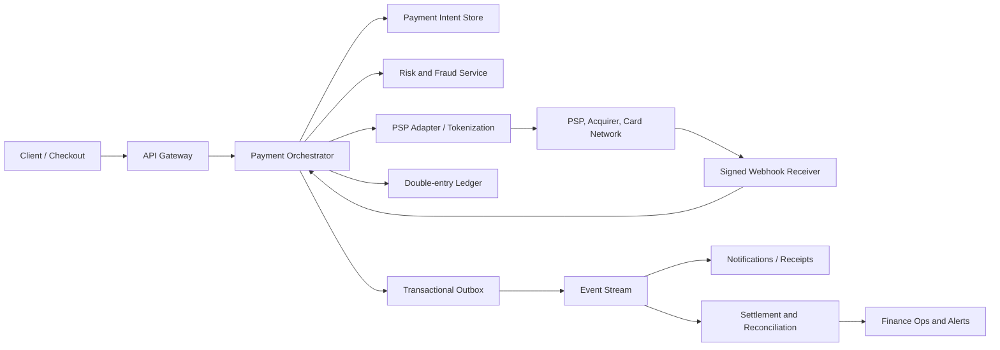

# Payment System Design

A payment system safely moves money between a customer, merchant, payment service provider (PSP), acquiring bank, card network, and issuing bank. At staff level, the main challenge is not calling a PSP API; it is maintaining correct internal financial state when every network call, webhook, and client retry can be delayed, duplicated, or lost.

## Interview framing

Clarify the product and money movement first:

- Are we accepting card payments, marketplace payouts, subscriptions, refunds, wallet transfers, or all of them?
- Are we merchant of record, or do we delegate card handling and settlement to a PSP?
- Do we need authorization only, immediate capture, delayed capture, partial capture, or recurring billing?
- What currencies, countries, payment methods, and regulatory requirements are in scope?
- Is the system expected to be strongly consistent for available balances? It usually must be.
- What is the dispute/chargeback and refund policy?

State the core invariant explicitly: **never create, destroy, or double-count money in the internal ledger.**

## Requirements

### Functional requirements

- Create payment intents for a purchase amount, currency, merchant, and customer.
- Support authorize, capture, void, refund, partial refund, and payment status lookup.
- Accept asynchronous PSP updates through signed webhooks.
- Guarantee client retries do not create duplicate charges.
- Track merchant balances, fees, settlement, payout, dispute, and adjustment events.
- Provide receipts, transaction history, support tooling, and audit trails.

### Non-functional requirements

| Requirement  | Target                                                                                |
| ------------ | ------------------------------------------------------------------------------------- |
| Correctness  | Ledger remains balanced and every money movement is attributable                      |
| Availability | Checkout degrades safely; no silent charge duplication                                |
| Latency      | Create payment intent in tens to low hundreds of milliseconds excluding bank approval |
| Durability   | Payment intent and ledger writes survive regional/process failure                     |
| Security     | Do not store raw card PAN/CVV; meet PCI scope requirements                            |
| Auditability | Reconstruct state from immutable financial events                                     |

## High-level architecture



Keep the responsibilities separate:

- **Payment orchestrator:** payment state machine, idempotency, PSP routing, and control flow.
- **Ledger:** immutable, balanced accounting entries; source of truth for money.
- **PSP adapter:** provider-specific API and webhook normalization.
- **Reconciliation:** compares internal records against PSP and bank settlement files.
- **Risk service:** decides allow, block, challenge, review, or delayed capture.

## Payment lifecycle and state machine

Do not model a payment as only `success` or `failure`. Authorization and capture are separate in many flows.

```text
CREATE -> REQUIRES_PAYMENT_METHOD -> REQUIRES_ACTION
       -> PROCESSING -> AUTHORIZED -> CAPTURED -> SETTLED
                           |              |
                         VOIDED         REFUNDED

Any asynchronous failure can lead to FAILED or UNKNOWN_PENDING_RECONCILIATION.
```

- `AUTHORIZED`: issuer reserved funds; merchant has not necessarily received money.
- `CAPTURED`: merchant submitted the charge for settlement.
- `SETTLED`: PSP/bank reports final funds movement.
- `VOIDED`: authorization released before capture.
- `REFUNDED`: a new, linked reverse money movement—not deletion of the original payment.

Use conditional versioned transitions so an old webhook cannot move a payment backward. Keep the PSP event ID and event timestamp for deduplication and ordering analysis.

## Idempotency: prevent duplicate charges

Every client write request must carry a client-generated idempotency key. Scope it to merchant/customer and operation type.

```text
Idempotency-Key: 7c0d...
POST /payment-intents/{id}/confirm
```

On receipt:

1. Atomically store `idempotency_key`, request hash, and the in-progress response record.
2. If the same key and request hash already completed, return the original response.
3. If the key exists with a different request hash, reject it as a conflict.
4. Reuse the same provider idempotency key when calling the PSP.
5. Persist the final result before responding.

Idempotency must cover the boundary with the PSP. A database transaction alone cannot undo a successful external card charge after an application timeout.

## Double-entry ledger

The payment-intent state is workflow state. The ledger is the financial source of truth.

Each accepted money movement writes at least two immutable entries in one database transaction:

```text
Capture $100.00 USD, fee $3.00

Debit:  customer clearing account       100.00
Credit: merchant payable account          97.00
Credit: platform fee revenue account       3.00
```

For a refund, append compensating entries; never mutate or delete prior financial entries.

Ledger controls:

- Debits equal credits per currency and transaction.
- Amounts are integer minor units; never use floating point for money.
- Each entry has transaction ID, account ID, currency, direction, amount, timestamp, and immutable reference.
- Use a unique business operation key so a replay cannot post the same ledger transaction twice.
- Compute balances from ledger entries or a transactionally maintained balance projection.

## Authorize, capture, and reservation handling

For physical goods, use `authorize` at checkout and `capture` when shipping. For digital goods, capture immediately after risk checks.

Important edge cases:

- Authorization expires; capture can fail after an earlier authorization success.
- Partial capture may release the unused authorization amount.
- Multiple capture attempts must use a capture idempotency key.
- A merchant cancellation should void an authorization rather than issue a refund when possible.
- If a request times out after sending capture, mark it `UNKNOWN_PENDING_RECONCILIATION`; do not automatically retry blindly.

## Webhooks and asynchronous truth

PSP results can arrive through the synchronous response, a later webhook, or settlement files. Treat webhooks as at-least-once and possibly out of order.

Webhook receiver rules:

- Verify provider signature, timestamp, replay tolerance, and source policy.
- Store the raw event durably before processing.
- Deduplicate using provider event ID.
- Process asynchronously and acknowledge quickly.
- Apply state transitions conditionally against payment version/current state.
- Emit internal events through a transactional outbox after state changes commit.

Never trust the frontend alone to determine final payment success.

## Reconciliation

Reconciliation is the safety net that catches bugs, missing webhooks, duplicates, provider outages, and settlement discrepancies.

At least daily, compare:

1. Internal payment intents and ledger postings.
2. PSP transaction/export records.
3. Acquirer/bank settlement and payout records.

Classify exceptions:

| Discrepancy                            | Action                                                                         |
| -------------------------------------- | ------------------------------------------------------------------------------ |
| PSP succeeded, internal record missing | Create investigation record; post only through controlled repair workflow      |
| Internal capture missing from PSP      | Mark pending/failed after confirmation; never assume reversal without evidence |
| Amount or currency mismatch            | Freeze payout impact and route to finance operations                           |
| Duplicate PSP charge                   | Refund/void with idempotent compensation and notify support                    |
| Settlement fee mismatch                | Post an adjustment with audit trail                                            |

Use a suspense/clearing account for amounts that are expected but not yet reconciled. Do not “fix” a mismatch by editing historical ledger rows.

## Refunds, disputes, and payouts

### Refunds

Refunds are linked to captured amounts. Enforce `total_refunded <= total_captured`, make requests idempotent, and allow multiple partial refunds only when product policy permits.

### Disputes and chargebacks

Model disputes as a separate lifecycle. Reserve or debit merchant payable balance when a dispute opens, collect evidence, then post the final win/loss outcome as compensating ledger entries.

### Merchant payouts

Payout eligibility depends on settled balance, rolling reserve, refund/dispute exposure, KYC status, and payout schedule. Payout generation must be idempotent and reconciled against the bank transfer provider.

## Security, compliance, and fraud

- Use PSP-hosted fields/tokenization so card PAN and CVV do not pass through application servers where possible.
- Never log secrets, payment method tokens, PAN, CVV, or full webhook payloads containing sensitive data.
- Encrypt sensitive data at rest and in transit; use strict IAM and audit access.
- Verify webhook signatures and rotate provider secrets.
- Apply 3DS/SCA flows when required.
- Evaluate fraud signals: velocity, device, IP, BIN, account age, amount, geography, and historical behavior.
- Separate duties: engineers should not be able to create arbitrary ledger adjustments without audited approvals.

## Failure behavior and recovery

| Failure                          | Safe behavior                                                                           |
| -------------------------------- | --------------------------------------------------------------------------------------- |
| Client retries confirmation      | Return idempotent payment result                                                        |
| PSP timeout after request sent   | Mark unknown; query PSP or wait for webhook before retrying                             |
| Webhook delivery duplicated      | Deduplicate by provider event ID                                                        |
| Webhook delayed or lost          | Reconcile against PSP exports/API                                                       |
| Ledger DB unavailable            | Do not claim final payment success; retry internal persistence safely                   |
| Event publish fails after commit | Transactional outbox retries publication                                                |
| Region failure                   | Recover durable intent/ledger state; do not replay external charges without idempotency |

Failing checkout is preferable to charging a customer twice. Clearly surface `processing` state to the client when outcome is uncertain.

## Observability and operations

Track:

- Authorization, capture, refund, and payment-success rates by PSP, method, country, and merchant.
- Processing latency and PSP timeout/error rates.
- Idempotency replays, conflicts, unknown outcomes, and webhook lag.
- Ledger imbalance assertions (should always be zero).
- Reconciliation mismatch count, age, and money value.
- Fraud declines, chargeback rate, refund rate, payout failures, and reserve utilization.

Alert immediately on ledger imbalance, duplicate-charge signals, reconciliation discrepancies above threshold, PSP degradation, webhook signature failures, and payment outcomes stuck in processing beyond SLA.

Every support and operations action—refund, void, adjustment, payout hold, retry—must produce an immutable audit event with actor, reason, approval, and correlation IDs.

## Staff-level trade-offs

- **Synchronous confirmation vs. asynchronous completion:** synchronous responses improve UX, but webhooks and reconciliation remain the final truth for many methods.
- **Single PSP vs. multi-PSP routing:** one provider is simpler; multiple providers improve resiliency and regional acceptance but multiply reconciliation and operational complexity.
- **Strong balance consistency vs. availability:** merchant balance and payout eligibility should be strongly consistent; analytics can be eventually consistent.
- **Immediate capture vs. delayed capture:** capture immediately for digital fulfillment; delay for inventory/shipping flows to reduce refunds and authorization misuse.
- **Automated repair vs. human review:** automatically retry safe, idempotent operations; require controlled review for financial discrepancies and non-idempotent side effects.

The staff-level answer should repeatedly connect a design choice to the money invariant: use idempotency to prevent duplicate external effects, an immutable double-entry ledger to preserve accounting truth, and reconciliation to detect anything the distributed workflow misses.
