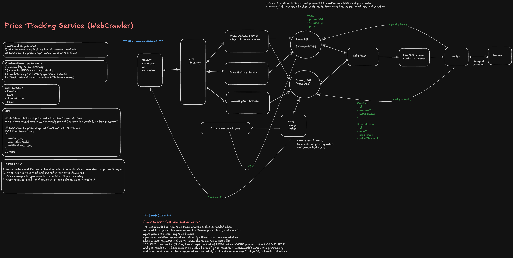

> **Editable diagram:** [Open in Excalidraw](https://excalidraw.com/#room=e3d31c353908222fd131,-Tf7VoZukA4QCzoTUCW1rw)



---

## Interview Summary

| Component                | Challenge                                                                      | Solution                                                                                                      |
| ------------------------ | ------------------------------------------------------------------------------ | ------------------------------------------------------------------------------------------------------------- |
| **Crawling at scale**    | Millions of product URLs; Amazon rate-limits and blocks scrapers               | Distributed crawler fleet, rotating IPs/proxies, respectful crawl rate per domain                             |
| **Crawl scheduling**     | Not all products change price equally often; can't recrawl everything hourly   | Adaptive scheduling based on historical volatility & user demand                                              |
| **Anti-bot detection**   | Amazon uses CAPTCHAs, fingerprinting, honeypots                                | Headless browser pool, proxy rotation, human-like request patterns, fallback to official APIs where available |
| **Price parsing**        | Amazon page layout varies by category/locale/A-B test                          | Resilient selectors + fallback parsers + anomaly detection on parsed price                                    |
| **Change detection**     | Must detect real price drops vs parsing noise (currency symbols, sale banners) | Normalize price, compare against last-known-good value, require N consecutive confirmations                   |
| **Notification fan-out** | One price drop might need to notify 100k+ watchers instantly                   | Pub/sub fan-out + push/email/SMS worker pool                                                                  |
| **Data storage**         | Petabytes of historical price points across products                           | Time-series storage (partitioned by product+time), downsampling for old data                                  |
| **Freshness vs cost**    | Crawling more often = fresher data but higher infra + ban risk                 | Tiered crawl frequency by product popularity and price volatility                                             |

**The core challenge:** _Crawl millions of pages within TOS/rate constraints, reliably detect true price changes among noisy HTML, and fan out notifications to affected users within minutes — all without getting the crawler fleet blocked._

---

## High-Level Architecture

```
┌────────────────────────────────────────────────────────────────┐
│                     User-Facing API                             │
│  - Add product to watchlist (URL or ASIN)                      │
│  - Set target price / threshold                                │
│  - View price history                                          │
└───────────────┬──────────────────────────────────────────────────┘
                │
                ↓
      ┌───────────────────┐
      │  Product Registry  │  (product_id, url, category, last_price,
      │     (Postgres)     │   crawl_frequency, watcher_count)
      └─────────┬──────────┘
                │
                ↓
   ┌─────────────────────────────────────────────────────────┐
   │            Crawl Scheduler (Priority Queue)              │
   │  - Assigns next-crawl-time per product                  │
   │  - Priority = f(watcher_count, volatility, staleness)    │
   └─────────┬─────────────────────────────────────────────────┘
             │  emits crawl jobs
             ↓
   ┌─────────────────────────────────────────────────────────┐
   │              Distributed Crawl Queue (Kafka/SQS)         │
   └─────────┬─────────────────────────────────────────────────┘
             │
    ┌────────┴────────┬─────────────────┬────────────────────┐
    ↓                 ↓                 ↓                    ↓
┌─────────┐      ┌─────────┐      ┌─────────┐          ┌─────────┐
│Crawler  │      │Crawler  │      │Crawler  │   ...    │Crawler  │
│Worker 1 │      │Worker 2 │      │Worker 3 │          │Worker N │
│(Proxy A)│      │(Proxy B)│      │(Proxy C)│          │(Proxy N)│
└────┬────┘      └────┬────┘      └────┬────┘          └────┬────┘
     │                │                │                     │
     └────────────────┴────────────────┴─────────────────────┘
                       ↓
          ┌─────────────────────────────┐
          │   Price Parser & Validator   │
          │  - Extract price from HTML  │
          │  - Normalize currency        │
          │  - Anomaly detection         │
          └─────────────┬────────────────┘
                        │
              ┌─────────┴─────────┐
              ↓                   ↓
     ┌──────────────────┐  ┌──────────────────┐
     │ Price History DB  │  │ Change Detector  │
     │ (Time-series)     │  │ (compare to last)│
     └──────────────────┘  └────────┬──────────┘
                                     │ price dropped
                                     ↓
                        ┌─────────────────────────┐
                        │  Notification Fan-out   │
                        │  (Pub/Sub → workers)     │
                        └────────┬────────────────┘
                                 │
                    ┌────────────┼────────────┐
                    ↓            ↓            ↓
               ┌────────┐  ┌──────────┐  ┌─────────┐
               │  Push  │  │  Email   │  │   SMS   │
               └────────┘  └──────────┘  └─────────┘
```

---

## The Five Critical Decisions

### 1. Adaptive Crawl Scheduling

**The problem:** With 50M tracked products, you cannot recrawl everything every hour — that's ~14k requests/sec sustained just for Amazon, which will get you banned instantly. Most products don't change price often.

**Solution:** Priority-based scheduling where crawl frequency adapts to:

- **Watcher count** — products with more watchers get crawled more often
- **Historical volatility** — products that change price frequently get crawled more often
- **Staleness** — products not crawled in a long time get bumped up
- **User urgency** — "notify me at $X" with tight threshold gets crawled more

```javascript
function computeNextCrawlInterval(product) {
  const baseInterval = 6 * 60 * 60 * 1000; // 6 hours default

  // More watchers => crawl more often (down to a floor)
  const watcherFactor = Math.max(0.1, 1 / Math.log2(product.watcherCount + 2));

  // Volatile products (many price changes historically) get crawled more
  const volatilityFactor = Math.max(0.2, 1 - product.changeFrequencyScore);

  // Popular categories (electronics on sale season) get boosted
  const categoryBoost = product.category === 'electronics' && isSaleSeasonActive() ? 0.5 : 1;

  const interval = baseInterval * watcherFactor * volatilityFactor * categoryBoost;

  // Clamp between 15 min (hot items) and 48 hours (cold items)
  return Math.min(Math.max(interval, 15 * 60 * 1000), 48 * 60 * 60 * 1000);
}
```

**Priority queue implementation:**

```javascript
// Min-heap keyed by nextCrawlTime
class CrawlScheduler {
  async scheduleNext(product) {
    const interval = computeNextCrawlInterval(product);
    const nextCrawlTime = Date.now() + interval;

    await redis.zadd('crawl-schedule', nextCrawlTime, product.id);
  }

  async getDueJobs(limit = 1000) {
    const now = Date.now();
    // Get all products due for crawl
    const dueProductIds = await redis.zrangebyscore('crawl-schedule', 0, now, 'LIMIT', 0, limit);

    // Remove them from schedule (will be re-added after crawl)
    if (dueProductIds.length > 0) {
      await redis.zrem('crawl-schedule', ...dueProductIds);
    }

    return dueProductIds;
  }
}
```

### 2. Avoiding Bot Detection (Respectful & Resilient Crawling)

**The problem:** Amazon actively detects and blocks scrapers via CAPTCHAs, IP rate limiting, fingerprinting, and honeypot links. Getting banned means losing crawl capacity for that IP/account.

**Solution:**

- **Distributed proxy pool** — residential/datacenter proxies rotated per request
- **Rate limiting per domain/proxy** — never exceed N requests/min per IP
- **Human-like behavior** — randomized delays, realistic headers, occasional mouse-move simulation via headless browser
- **Respect robots.txt** where applicable, use official Product Advertising API when available (preferred, TOS-compliant)
- **Circuit breaker per proxy** — if a proxy gets CAPTCHA'd, cool it down / rotate out

```javascript
class CrawlerWorker {
  async fetchProductPage(url) {
    const proxy = await this.proxyPool.getHealthyProxy();

    try {
      // Rate limit per proxy: max 10 req/min
      await this.rateLimiter.acquire(proxy.id);

      const response = await this.httpClient.get(url, {
        proxy: proxy.address,
        headers: this.buildRealisticHeaders(),
        timeout: 15000,
      });

      if (this.isCaptchaPage(response.body)) {
        await this.proxyPool.markUnhealthy(proxy.id, { cooldownMs: 30 * 60 * 1000 });
        throw new CaptchaDetectedError(url);
      }

      await this.proxyPool.markHealthy(proxy.id);
      return response.body;
    } catch (err) {
      if (err instanceof CaptchaDetectedError) {
        // Retry with different proxy, exponential backoff
        return this.retryWithNewProxy(url, { maxRetries: 3 });
      }
      throw err;
    }
  }

  buildRealisticHeaders() {
    return {
      'User-Agent': this.rotateUserAgent(),
      Accept: 'text/html,application/xhtml+xml,application/xml;q=0.9,*/*;q=0.8',
      'Accept-Language': 'en-US,en;q=0.9',
      Referer: 'https://www.google.com/',
    };
  }
}
```

**Preferred approach:** Use Amazon's **Product Advertising API (PA-API)** for any officially supported use case — it's TOS-compliant, rate-limited but predictable, and returns structured JSON (no HTML parsing needed). Fall back to headless-browser scraping only for products/fields not covered by the API, and clearly separate that code path since it carries legal/ToS risk.

### 3. Resilient Price Parsing

**The problem:** Amazon's page structure varies by category, locale, and ongoing A/B tests. A single CSS selector breaks constantly. You also need to distinguish the "real" price from strikethrough/list prices, subscription prices, or "other sellers" prices.

**Solution:** Multi-strategy parser with fallback chain + confidence scoring.

```javascript
const priceParsers = [
  parseFromStructuredData, // JSON-LD / microdata (most reliable)
  parseFromKnownSelectors, // Curated CSS selectors, versioned per layout
  parseFromRegexFallback, // Regex over visible text near "$"/"Price"
];

async function extractPrice(html, product) {
  for (const parser of priceParsers) {
    const result = parser(html, product);
    if (result && isPlausiblePrice(result.price, product)) {
      return { price: result.price, confidence: result.confidence, source: parser.name };
    }
  }
  // All parsers failed or gave implausible results
  await alertParsingFailure(product, html);
  return null;
}

function isPlausiblePrice(price, product) {
  if (price <= 0 || price > 1_000_000) return false;
  // Reject if wildly different from last known price without explanation
  const lastPrice = product.lastKnownPrice;
  if (lastPrice && Math.abs(price - lastPrice) / lastPrice > 0.9) {
    return false; // >90% swing is suspicious — likely parsing error, flag for review
  }
  return true;
}
```

### 4. Change Detection: Avoiding False Positives

**The problem:** A parsing hiccup (e.g., grabbing "$0.00" from a hidden element, or a flash sale price shown for 1 second) must not trigger a false notification to 100k users.

**Solution:**

- **N-of-M confirmation** — require the new price to be observed in 2 consecutive crawls before declaring a "confirmed" change
- **Anomaly bounds** — reject price deltas outside plausible range (see `isPlausiblePrice`)
- **Separate "observed" vs "confirmed" price** in the data model
- **Debounce window** — don't notify again for the same product within a cooldown (e.g., 1 hour) even if price flickers

```javascript
async function processCrawlResult(product, observedPrice) {
  await priceHistoryDB.insertObservation(product.id, observedPrice, Date.now());

  const pending = await getPendingConfirmation(product.id);

  if (pending && pending.price === observedPrice) {
    pending.confirmations += 1;
    if (pending.confirmations >= 2) {
      await confirmPriceChange(product, observedPrice);
      await clearPendingConfirmation(product.id);
    }
  } else if (observedPrice !== product.confirmedPrice) {
    // New candidate price, start confirmation window
    await setPendingConfirmation(product.id, { price: observedPrice, confirmations: 1 });
  } else {
    // Matches confirmed price, nothing to do
    await clearPendingConfirmation(product.id);
  }
}

async function confirmPriceChange(product, newPrice) {
  const oldPrice = product.confirmedPrice;
  await productRegistry.updatePrice(product.id, newPrice);

  if (newPrice < oldPrice) {
    await publishPriceDropEvent(product.id, oldPrice, newPrice);
  }
}
```

### 5. Notification Fan-out at Scale

**The problem:** A popular product (e.g., a PS5 restock at a lower price) might have 500k watchers. All of them need a notification within minutes, without overloading push/email providers or the DB.

**Solution:**

- **Pub/Sub event** (`price-drop-events` topic) decoupled from the fan-out workers
- **Fan-out workers** pull watcher lists in paginated batches from a `product_watchers` index (not a full table scan)
- **Per-channel worker pools** (push, email, SMS) with rate limits per provider
- **Idempotency** — dedupe notification per (user, product, price) to avoid double-send on retry

```javascript
async function handlePriceDropEvent(event) {
  const { productId, oldPrice, newPrice } = event;

  let cursor = null;
  do {
    const { watchers, nextCursor } = await watcherIndex.getPage(productId, cursor, 1000);
    cursor = nextCursor;

    const eligible = watchers.filter((w) => newPrice <= w.targetPrice);

    await Promise.all(
      eligible.map((watcher) =>
        notificationQueue.enqueue({
          userId: watcher.userId,
          channel: watcher.preferredChannel,
          dedupeKey: `${watcher.userId}:${productId}:${newPrice}`,
          payload: { productId, oldPrice, newPrice },
        })
      )
    );
  } while (cursor);
}
```

---

## Data Model

```
products
  id, url, asin, category, confirmed_price, last_crawled_at,
  crawl_interval_ms, change_frequency_score

price_history (time-series, partitioned by product_id + day)
  product_id, price, observed_at, source, confidence

watchers
  user_id, product_id, target_price, preferred_channel, created_at
  (indexed by product_id for fan-out)

pending_confirmations
  product_id, candidate_price, confirmations, first_seen_at
```

---

## Anti-Patterns & Solutions

| Anti-pattern                                             | Problem                                                           | Solution                                                                     |
| -------------------------------------------------------- | ----------------------------------------------------------------- | ---------------------------------------------------------------------------- |
| **Fixed crawl interval for all products**                | Wastes crawl budget on dead products, misses fast-moving hot ones | Adaptive scheduling by volatility/watcher count                              |
| **Single price parser / brittle CSS selector**           | Breaks silently on layout A/B tests                               | Fallback chain: structured data → selectors → regex, with confidence scoring |
| **Notify on every observed price**                       | False positives from parsing glitches spam users                  | Require N-of-M confirmation before declaring a confirmed change              |
| **Full table scan for watchers**                         | O(n) scan per price drop, doesn't scale to millions of watchers   | Indexed `product_id → watchers` with paginated cursor reads                  |
| **No proxy rotation / rate limiting**                    | Crawler fleet gets IP-banned, entire pipeline halts               | Distributed proxy pool, per-domain/per-proxy rate limits, circuit breaker    |
| **Scraping fields covered by an official API**           | Unnecessary legal/TOS risk and fragility                          | Prefer PA-API/official feeds; scrape only as fallback                        |
| **Storing every observation forever at full resolution** | Storage blows up over years                                       | Downsample old data (e.g., daily rollups after 90 days)                      |

---

## Interview Follow-ups

1. **"How do you scale to 50M tracked products with a bounded crawler fleet?"**
   - Answer: Adaptive scheduling shifts crawl budget toward high-value/volatile products. Compute required throughput = sum(1/interval) across products; size the crawler fleet (and proxy pool) to match that aggregate rate, with headroom for retries/backoff.

2. **"What happens if Amazon changes their HTML structure overnight?"**
   - Answer: Confidence-scored parser fallback chain absorbs most breakage. Structured data (JSON-LD) is the most stable signal and rarely changes. Monitor parser success rate per domain/category; alert on-call if success rate drops below a threshold (e.g., 95%), and ship a hotfix selector update.

3. **"How do you avoid legal/TOS issues with scraping Amazon?"**
   - Answer: Prefer the official Product Advertising API wherever it covers the need. For any scraping fallback, respect robots.txt, keep request rates conservative, and consult legal before scaling beyond API-covered use cases. This is a real risk area — most production price trackers rely heavily on official APIs plus affiliate partnerships rather than aggressive scraping.

4. **"How would you detect and handle a fake/inflated 'was' price used for deceptive discounts?"**
   - Answer: Track full price history per product; a "40% off" claim is only meaningful if the reference price was sustained for a reasonable period (e.g., 30+ days), not just spiked right before a "sale." Surface the actual historical price chart to users so they can judge for themselves (similar to CamelCamelCamel).

5. **"How do you keep notification latency low (minutes, not hours) for a viral price drop?"**
   - Answer: Pub/Sub decouples detection from fan-out so detection isn't blocked by notification work. Fan-out workers scale horizontally and read watchers via paginated index rather than scanning. Push notifications are near-instant; email/SMS have their own rate-limited worker pools so a large email batch doesn't delay push delivery.

6. **"How do you handle multi-region price differences (e.g., Amazon.com vs Amazon.de)?"**
   - Answer: Treat each (product, locale) pair as a distinct trackable entity with its own price history and currency. Normalize all prices to a common currency (with daily FX rates) only for cross-region comparison features; store raw local-currency price as source of truth.

7. **"What's your strategy for backfilling price history when a new product is added?"**
   - Answer: No historical data exists before tracking starts. Optionally, integrate with third-party historical price databases (where licensed) for immediate context, otherwise clearly show "tracking started on X date" to set user expectations.
