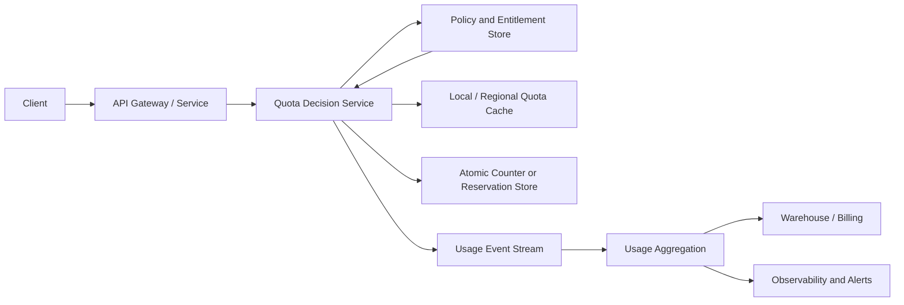

# Quota Management System Design

Quota management controls how much of a shared resource a principal can consume during a defined period. It protects infrastructure, enforces plans and contracts, prevents noisy neighbors, and gives customers predictable limits.

Examples include API requests per minute, tokens per day, storage bytes per organization, background jobs per account, seats per workspace, and GPU minutes per project.

Start by clarifying the business and correctness contract. “Quota” often means different things:

- **Hard quota:** Reject work once the limit is consumed. Examples: paid API credits, storage capacity, compliance limits.
- **Soft quota:** Allow temporary overage but meter it, degrade service, or bill later.
- **Rate limit:** Limits consumption _rate_ over time, usually for protection.
- **Concurrency limit:** Limits simultaneous in-flight work.
- **Budget quota:** Limits a cumulative total over a billing or policy window.

The most important design decision is whether a request must be rejected with strict global correctness or whether bounded overshoot is acceptable. Strict global enforcement costs latency and availability; approximate local enforcement scales more easily.

## Requirements to clarify

### Functional requirements

- Define quotas by tenant, organization, user, API key, project, or resource.
- Support multiple dimensions: requests, bytes, tokens, jobs, storage, concurrency, and cost.
- Support fixed, rolling, calendar, and billing-cycle windows.
- Allow plan defaults plus overrides, temporary grants, and administrator changes.
- Enforce admission before expensive work begins.
- Return remaining quota, reset time, and a machine-readable rejection reason.
- Provide usage history, alerts, audit trails, and usage export for billing.

### Non-functional requirements

| Requirement      | Example target                                                                     |
| ---------------- | ---------------------------------------------------------------------------------- |
| Decision latency | P99 under 5–20 ms on the request path                                              |
| Availability     | Quota service should not become a global outage dependency                         |
| Correctness      | No overshoot for hard financial/compliance quotas; bounded overshoot where allowed |
| Scale            | Millions of checks per second and high-cardinality tenant keys                     |
| Freshness        | Plan changes visible within seconds or a documented propagation delay              |
| Auditability     | Reconstruct why a request was allowed or denied                                    |

## High-level architecture



Separate the request-path decision from analytics:

- **Decision path:** evaluates policy and atomically consumes or reserves quota.
- **Usage pipeline:** receives immutable events for billing, reporting, anomaly detection, and reconciliation.
- **Control plane:** manages plans, overrides, grants, policy versions, and administrative actions.

Do not rely on asynchronous analytics counters alone to enforce hard limits. They may be delayed, duplicated, or reordered.

## Data model

Represent each quota as a versioned policy:

```text
quota_policy
	policy_id
	scope: tenant | user | project | api_key
	metric: requests | tokens | bytes | jobs | storage_bytes
	limit: 1_000_000
	window: calendar_month | rolling_24h | fixed_1m | billing_cycle
	enforcement: hard | soft
	overage_policy: reject | throttle | queue | bill
	version
```

The hot-path counter key must include every dimension that affects enforcement:

```text
{scope_id}:{metric}:{window_start}:{policy_version}
```

For a request costing more than one unit, include an explicit `amount` and an idempotency key:

```text
quota_key       = org-42:tokens:2026-08-14:policy-v7
amount          = 850
idempotency_key = request-uuid
```

## Enforcement algorithm

For a hard quota, use an atomic **check-and-consume** operation:

1. Load the effective policy from cache or entitlement store.
2. Compute the current quota-window key.
3. Atomically verify `used + amount <= limit`.
4. If allowed, increment usage or create a reservation.
5. Emit an immutable usage event with the decision and policy version.
6. Return remaining quota and reset metadata.

The atomic step must run in one serialization domain: a Redis Lua script, a strongly consistent database transaction, a compare-and-set record, or a dedicated quota partition leader.

Pseudocode:

```text
if idempotency_key was already accepted:
	return original decision

atomically:
	current = read(quota_key)
	if current.used + amount > limit:
		reject
	else:
		current.used += amount
		store idempotency_key -> accepted decision
		accept
```

## Reserve, commit, and release

For work whose final cost is unknown until completion (LLM tokens, file processing, exports), use reservations.

1. **Reserve** an upper bound before starting work.
2. Execute the work.
3. **Commit** actual usage when it completes.
4. **Release** unused reservation capacity.
5. Expire abandoned reservations with a TTL and reconciliation job.

Reservations prevent unlimited in-flight work, but they create leak risk. Store reservation IDs, expiration, owner, and state. Releasing must be idempotent, and expired reservations need an audit record so finance/support can explain adjustments.

## Distributed enforcement choices

### Central strongly consistent counter

All requests call a single logical quota store.

- Pros: strict hard limits, simple reasoning, immediate plan changes.
- Cons: hot keys, regional latency, availability dependency.
- Use for: money, compliance, low-volume critical quotas.

### Regional counters with quota allocation

Allocate each region a portion of global capacity. Regions enforce locally and periodically request more tokens from a global allocator.

- Pros: low latency and regional resilience.
- Cons: unused allocation can strand capacity; global utilization is not exact in real time.
- Use for: global high-QPS APIs where bounded overshoot or allocation fragmentation is acceptable.

### Token leasing / escrow

The global allocator grants a signed or durable lease for N units to a region or worker. Local consumption does not need global coordination until the lease runs low.

- Pros: scales with bounded overshoot equal to outstanding leases.
- Cons: requires lease expiry, reclaim policy, and careful accounting.
- Use for: high-throughput hard-ish quotas with a known overshoot budget.

### Eventual counters plus reconciliation

Allow requests locally, stream usage events, and reconcile later.

- Pros: cheapest and most available.
- Cons: can substantially overshoot; duplicate events must be deduplicated.
- Use for: dashboards, advisory thresholds, and billable soft quotas—not strict blocking.

## Multi-dimensional quotas and ordering

One request may consume several quotas: request count, tokens, and per-model budget. Evaluate all policies before committing any consumption.

For strict multi-key consumption, either:

- keep related dimensions in the same transaction/partition;
- reserve all dimensions, then commit; or
- use a deterministic lock/key order and compensating release on partial failure.

Avoid consuming request quota first and discovering later that token quota is exhausted unless the first consumption can be released safely.

## Concurrency quotas

Concurrency limits need a lease rather than a monotonically increasing counter:

1. Atomically acquire a slot if `active < limit`.
2. Attach a lease ID and expiry to the operation.
3. Renew while work is in flight.
4. Release on success, failure, cancellation, or expiration.

Without lease expiry, crashed workers leak slots indefinitely. Do not decrement blindly: a stale worker must not release a slot that has already been reassigned. Use lease/fencing tokens.

## Plan changes, overrides, and resets

Policy changes are operationally sensitive:

- Version every policy and include its version in decisions and events.
- Propagate invalidations to regional/local caches.
- Define whether an upgrade is immediate and whether a downgrade applies to in-flight reservations.
- Keep overrides and promotional grants as separate ledger entries rather than mutating history.
- Use a canonical timezone and explicit window boundaries for daily/monthly resets.

For calendar windows, create a new key per window instead of resetting a shared counter in place. This avoids race conditions at midnight and retains auditability.

## Failure behavior

Choose fail-open or fail-closed per quota class:

| Scenario                  | Hard financial/compliance quota                 | Protective API quota                       |
| ------------------------- | ----------------------------------------------- | ------------------------------------------ |
| Quota store unavailable   | Fail closed or use a small verified local lease | Often fail open with emergency rate limits |
| Policy cache stale        | Use last-known-safe policy or fail closed       | Use cached policy with short TTL           |
| Usage event pipeline down | Continue only if decision ledger is durable     | Buffer events and alert                    |
| Duplicate client retry    | Return idempotent original decision             | Return idempotent original decision        |

Make this a product decision. A generic fail-open policy can create unbounded spend; a generic fail-closed policy can cause a broad customer outage.

## Error responses and developer experience

Return actionable metadata when rejecting:

```json
{
  "code": "QUOTA_EXCEEDED",
  "metric": "tokens",
  "scope": "organization",
  "limit": 1000000,
  "remaining": 0,
  "resetsAt": "2026-09-01T00:00:00Z",
  "retryAfterSeconds": 15320,
  "policyVersion": "v7"
}
```

Use HTTP 429 for temporary rate/concurrency limits and a documented 4xx response for exhausted long-window quota. Include headers when applicable, such as `Retry-After`, `RateLimit-Limit`, `RateLimit-Remaining`, and `RateLimit-Reset`.

## Observability, alerts, and reconciliation

Track both system health and quota business health:

- Decision latency, availability, cache hit rate, and counter-store errors.
- Allowed/denied decisions by metric, plan, region, and policy version.
- Remaining-quota distribution and customers approaching exhaustion.
- Reservation age, abandoned reservation count, and release failures.
- Overshoot, reconciliation adjustments, and duplicate-event rate.
- Hot keys, skewed tenants, regional allocation exhaustion, and allocator contention.

Alert on:

- Elevated quota-store errors or fail-open/fail-closed activations.
- Overshoot beyond the documented bound.
- Rapid deny-rate increase after a policy rollout.
- Reservation leaks or stuck concurrency leases.
- Event lag that risks billing/reporting correctness.
- A single tenant consuming an abnormal share of a shared resource.

Maintain an append-only decision ledger. It should answer: which policy allowed/denied this request, what was the counter state, which idempotency key was used, and what adjustment happened later.

## Staff-level trade-offs to articulate

- **Strictness vs. availability:** Global serializable counters are correct but can add latency and become a dependency. Leased regional capacity provides bounded overshoot.
- **Accuracy vs. cost:** Per-request atomic writes are precise; batching and asynchronous aggregation reduce cost but weaken enforcement.
- **Fairness vs. utilization:** Static regional allocations isolate failures but waste idle capacity. Dynamic allocation improves utilization but adds coordination.
- **Simple counters vs. reservations:** Counters work for known costs; reservations are required for variable-cost and long-running work but need expiration/reconciliation.
- **Central policy vs. local autonomy:** Central policy ensures consistent contracts; local cached policy keeps request latency low and needs versioned invalidation.

The recommended default is a fast cached policy lookup plus an atomic regional check-and-consume operation, backed by immutable usage events. For globally strict quotas, use a strongly consistent counter; for high-QPS global workloads, use leased regional capacity and state the maximum possible overshoot explicitly.
