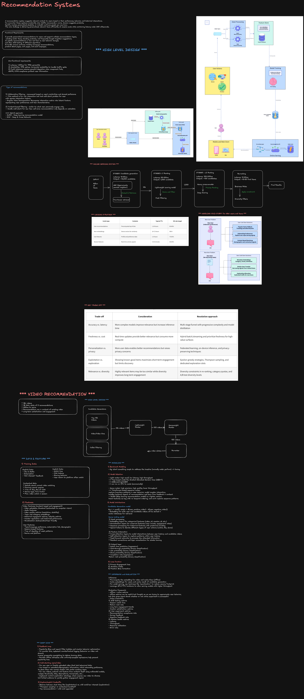
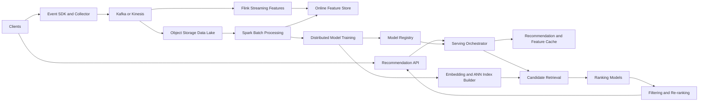

> **Editable diagram:** [Open in Excalidraw](https://excalidraw.com/#room=0fdef544c345fe2179ca,JwSrEJ_CQWSLhFig0ifiDw)



## 1. Clarify the problem

A staff engineer starts by defining the product surface and the decisions the system must make.

### Functional requirements

- Return personalized recommendations for surfaces such as the home page, product detail page, cart, search, and email.
- Support multiple strategies: personalized recommendations, similar items, trending items, frequently bought together, and recently viewed.
- Incorporate clicks, views, searches, add-to-cart events, purchases, ratings, skips, and negative feedback.
- Update short-term intent in near real time.
- Support anonymous users through session-based recommendations.
- Apply inventory, geography, policy, age, seller, and sponsored-content constraints.
- Support model and feature A/B testing with reproducible assignments.
- Log impressions and outcomes for training, attribution, and debugging.

### Non-functional requirements

For an initial global deployment, establish assumptions with the interviewer:

| Requirement  | Target                                                                    |
| ------------ | ------------------------------------------------------------------------- |
| Availability | 99.9% or higher for recommendation APIs                                   |
| Latency      | P99 below 200 ms; target 50–100 ms for cached requests                    |
| Scale        | Millions of requests per second globally; billions of events per day      |
| Catalog      | Hundreds of millions of active items                                      |
| Freshness    | Seconds for session signals, minutes for aggregates, hours for full lists |
| Consistency  | Eventual consistency is acceptable for recommendations                    |
| Privacy      | GDPR/CCPA controls, deletion propagation, consent-aware processing        |

The exact numbers matter less than showing how they change the architecture. Ask which surfaces are latency-sensitive, whether recommendations directly affect revenue, whether users are logged in, and whether inventory must be strongly current.

## 2. High-level architecture

The system has an offline path for expensive computation and an online path for low-latency serving.



### Online components

1. **API gateway:** authenticates requests, applies rate limits, propagates trace and experiment identifiers, and routes to a healthy region.
2. **Serving orchestrator:** determines the surface, loads user and session context, fans out to candidate sources, invokes ranking, and enforces the latency deadline.
3. **Candidate services:** retrieve candidates from precomputed lists, collaborative signals, content similarity, trending lists, and vector search.
4. **Feature service:** provides low-latency user, item, and context features using an online feature store and cache.
5. **Ranking service:** evaluates progressively more expensive models as the candidate set becomes smaller.
6. **Policy and re-ranking service:** removes unavailable or unsafe items and applies diversity, freshness, promotional, and business constraints.
7. **Fallback service:** returns cached, popular, category-level, or editorial recommendations when dependencies fail.

### Offline and nearline components

- The event pipeline persists an immutable event log and publishes events to stream consumers.
- Batch jobs compute long-term features, item statistics, embeddings, and training datasets.
- Streaming jobs update session features, counters, recent interactions, and high-velocity trends.
- Training jobs produce candidate-generation and ranking models.
- A model registry tracks versions, feature contracts, evaluation metrics, and rollout state.
- Index builders publish versioned item-embedding indices atomically to serving clusters.

## 3. Event and data model

Use a versioned schema so producers can evolve independently from consumers. A recommendation impression must be logged as carefully as a click.

```json
{
  "event_id": "uuid",
  "event_type": "impression|view|click|cart|purchase|skip",
  "user_id": "hashed-or-null",
  "session_id": "uuid",
  "item_id": "sku-123",
  "surface": "home|detail|cart|email",
  "request_id": "uuid",
  "model_version": "ranker-2026-08-11",
  "experiment": "ranking-v4-treatment",
  "timestamp": "2026-08-11T12:00:00Z",
  "context": {
    "country": "US",
    "device": "mobile"
  }
}
```

Partition the event stream by user or session when ordering matters. Keep raw events immutable in object storage for replay and auditability. Use a schema registry, dead-letter queue, deduplication by `event_id`, and data-quality checks for missing IDs, invalid timestamps, and unexpected event rates.

Separate personally identifiable information from behavioral data. Prefer pseudonymous identifiers, encryption in transit and at rest, short retention windows, access controls, and deletion workflows that cover raw data, features, embeddings, caches, and backups.

## 4. Recommendation approaches

A production system uses multiple candidate sources rather than betting on one algorithm.

### Collaborative filtering

Collaborative filtering learns from user-item interactions. Matrix factorization is simple and effective for mature catalogs, while neural collaborative filtering captures more complex interactions. It performs poorly for new users and items with little history.

### Content-based retrieval

Content-based models use category, brand, text, image, price, and other item attributes. They are valuable for new items and explainability, but can over-specialize and create filter bubbles.

### Hybrid retrieval

Combine collaborative, content, session, popularity, and editorial sources. A hybrid candidate pool improves recall and provides resilience when one source is unavailable.

### Two-tower retrieval

A user tower maps user history, profile, context, and session features to a vector. An item tower maps item metadata and behavior to a vector. The item vectors are precomputed and indexed. At request time, the system computes one user vector and performs approximate nearest-neighbor search.

The two-tower model is effective because expensive item computation happens offline and the online request performs only one user encoding plus an index lookup. Negative sampling, hard-negative mining, and time-aware training examples are important to avoid popularity bias and leakage.

## 5. Multi-stage ranking funnel

Ranking every catalog item with a large model is impossible. A funnel progressively reduces the set while increasing model cost.

### Stage 0: eligibility

Remove items that cannot be shown: out-of-stock products, restricted content, deleted sellers, unavailable regions, already purchased items where appropriate, and items blocked by user preferences.

### Stage 1: candidate generation

Retrieve roughly 1,000–10,000 candidates from several sources:

- Two-tower vector retrieval using FAISS, ScaNN, or HNSW.
- Item-to-item similarity for product pages.
- Co-view and co-purchase graphs.
- User history and category affinity.
- Trending and editorial candidates.
- Exploration candidates for new items.

This stage optimizes recall and must be highly parallelizable. ANN trades a small amount of recall for much lower latency and memory cost than an exact scan.

### Stage 2: lightweight ranking

Reduce the pool to a few hundred candidates using a fast model such as logistic regression, gradient-boosted trees, or a small neural network. Features include user-item affinity, popularity, freshness, price, availability, device, time, and session intent.

### Stage 3: heavy ranking

Apply a more expressive model to tens or hundreds of candidates. Cross features, sequence features, and calibrated purchase or engagement probabilities can be used here. A cross-encoder can jointly evaluate user and item context, but it should not be used for the full catalog because of its cost.

### Stage 4: policy and re-ranking

The final list is not simply the highest model scores. Re-ranking applies hard constraints and optimizes a multi-objective function:

- Diversity across categories, brands, and sellers.
- Freshness and controlled exploration.
- Inventory, margin, shipping, and promotion rules.
- Frequency caps and deduplication across carousels.
- Safety, policy, age, and regional restrictions.
- Fair exposure for creators or sellers where required.

Use a deterministic policy layer for hard constraints and an experiment-controlled optimizer for soft objectives. This keeps product and policy changes decoupled from model retraining.

## 6. Latency and caching strategy

A 200 ms P99 budget should be divided before implementation. For example:

| Operation                  | Budget |
| -------------------------- | -----: |
| Gateway and network        |  20 ms |
| User/session feature reads |  20 ms |
| Candidate retrieval        |  30 ms |
| Ranking                    |  80 ms |
| Filtering and response     |  20 ms |
| Safety margin              |  30 ms |

Run independent candidate and feature reads in parallel. Use deadlines, connection pooling, request batching, model warmup, and bounded queues. Do not allow a slow optional source to block the response.

Use separate caches for different data lifetimes:

- **Precomputed user recommendations:** minutes to hours, keyed by user, surface, experiment, and model version.
- **Session features:** seconds to minutes, updated from the stream processor.
- **Item metadata and embeddings:** hours to days, invalidated on catalog changes.
- **Trending and fallback lists:** seconds to minutes, replicated by region.

Avoid caching only by user ID. Include locale, device, surface, experiment, eligibility context, and model version when they affect the result. Prevent cache stampedes with request coalescing, jittered TTLs, stale-while-revalidate, and per-key rate limits.

## 7. Cold start and exploration

### New users

Use session behavior, referral context, locale, device, onboarding preferences, and popularity by category. Ask for explicit preferences only when the product experience supports it. Anonymous users can receive a session embedding based on their recent sequence.

### New items

Generate an initial item embedding from metadata, text, image, and taxonomy. Allocate controlled exploration traffic so the system collects feedback without exposing users to low-quality results.

### Exploration versus exploitation

Reserve a small, measurable portion of slots for new or uncertain items. Epsilon-greedy, UCB, and Thompson sampling are possible strategies, but guard them with eligibility and safety rules. Evaluate exploration on long-term metrics rather than only immediate clicks.

## 8. Reliability and failure handling

Recommendations should degrade gracefully rather than make the primary product unavailable.

- Use multi-AZ replicated Kafka, feature stores, caches, and model-serving instances.
- Maintain at least two compatible model and index versions during rollout.
- Publish vector indices atomically and verify checksums before activation.
- Use circuit breakers, timeouts, bulkheads, and load shedding.
- Fall back in order: fresh personalized cache, stale personalized cache, category popularity, regional popularity, and editorial defaults.
- Keep recommendation calls isolated from checkout and other critical transactional paths.
- Replay events from the immutable log after consumer failure.
- Monitor freshness lag and disable stale personalization when feature age exceeds a safety threshold.

A fallback is a product decision, not just an infrastructure detail. The fallback should be relevant to the surface and should never violate inventory, privacy, or safety policies.

## 9. Model training and serving consistency

Training-serving skew is a common production failure. Define features once, materialize them for offline training and online serving, and attach feature versions to every model artifact.

The training pipeline should include:

1. Event validation and point-in-time correct dataset construction.
2. Feature generation with leakage checks.
3. Negative sampling that reflects the serving distribution.
4. Offline evaluation by user cohort, surface, geography, and catalog age.
5. Fairness, safety, and calibration checks.
6. Model registration and reproducible artifact storage.
7. Shadow traffic, canary rollout, and automatic rollback thresholds.

Point-in-time correctness matters: a training example must use only features available before the impression or conversion being predicted. Otherwise offline metrics will look strong while production performance fails.

## 10. Storage and scale choices

- **Object storage/data lake:** immutable events, training datasets, model artifacts, and historical snapshots.
- **Kafka or Kinesis:** durable event transport and replay.
- **Flink or Kafka Streams:** session features, counters, and real-time aggregates.
- **Spark or distributed SQL:** batch aggregates and training data.
- **Online feature store:** low-latency user and item features with TTLs.
- **Redis or Memcached:** hot recommendations, session state, and fallback lists.
- **Cassandra/DynamoDB:** horizontally scalable profiles and feature materializations.
- **FAISS, ScaNN, HNSW, or a managed vector service:** ANN retrieval.
- **Model serving:** GPU only where necessary; CPU quantization, batching, and distillation for simpler models.

Shard by user for user state and by item or vector partition for catalog retrieval. Watch for hot keys caused by viral items and popular users. Replicate hot items, use admission control, and separate popular-item traffic from general traffic.

## 11. Global deployment

Route users to the nearest healthy serving region. Keep user data in the required residency boundary and replicate only permitted aggregates or model artifacts. Train centrally when policy permits, then distribute signed model and index versions to regional clusters.

Recommendations usually tolerate eventual consistency across regions. However, inventory, policy, and deletion signals may require stronger guarantees or synchronous checks. Version the model, feature snapshot, and index together so a region never combines incompatible artifacts.

## 12. Monitoring and evaluation

Track technical, model, and business metrics together.

### Technical metrics

- P50, P95, and P99 latency by surface and dependency.
- Availability, timeout rate, error rate, and fallback rate.
- Cache hit rate, ANN latency, feature freshness, and stream lag.
- Candidate recall, ranking throughput, CPU/GPU utilization, and queue depth.

### Model metrics

- Precision@K, Recall@K, NDCG, MAP, calibration, and coverage.
- Diversity, novelty, catalog concentration, and cold-start performance.
- Performance by cohort, geography, device, seller, and item age.

### Business metrics

- Click-through rate, add-to-cart rate, conversion rate, revenue per session, and average order value.
- Retention, repeat purchase, customer lifetime value, and complaint or hide rates.
- Guardrail metrics such as out-of-stock exposure, policy violations, and seller concentration.

Log every response with request ID, candidate sources, model versions, scores or score ranges, filtering reasons, and impression position. This enables attribution and debugging without storing unnecessary personal data.

A/B tests should use stable randomization, account for repeated users, define primary and guardrail metrics in advance, and roll out gradually: shadow, 1%, 10%, 50%, then 100%. Watch for novelty effects and long-term regressions.

## 13. Staff-engineer trade-offs

| Trade-off                             | Staff-level resolution                                                                        |
| ------------------------------------- | --------------------------------------------------------------------------------------------- |
| Accuracy vs. latency                  | Use a funnel, distillation, quantization, and selective heavy ranking.                        |
| Freshness vs. cost                    | Stream high-value signals and batch stable features; do not recompute everything per request. |
| Personalization vs. privacy           | Minimize data, honor consent, isolate identity, and provide non-personalized fallbacks.       |
| Relevance vs. diversity               | Apply tunable re-ranking constraints and measure long-term engagement.                        |
| Exploration vs. revenue               | Allocate bounded exploration slots with safety and business guardrails.                       |
| Centralization vs. regional autonomy  | Centralize training where possible; serve and enforce residency regionally.                   |
| Model velocity vs. operational safety | Require versioned artifacts, shadowing, canaries, rollback, and lineage.                      |

## 14. Interview walkthrough

A strong staff-level answer should make the reasoning visible:

1. Clarify the recommendation surfaces, scale, latency, freshness, and business objective.
2. Define event semantics and the feedback loop before choosing models.
3. Separate offline training from online serving.
4. Explain why candidate generation and ranking are separate stages.
5. Add caches, ANN retrieval, deadlines, and fallbacks to meet latency.
6. Cover cold start, exploration, inventory, safety, privacy, and regional behavior.
7. Describe model validation, A/B testing, observability, and rollback.
8. State the major trade-offs and identify what you would prototype first.

The central design principle is to spend computation where it changes the decision. Retrieve broadly and cheaply, rank narrowly and accurately, then apply deterministic business and safety constraints before returning a response.
