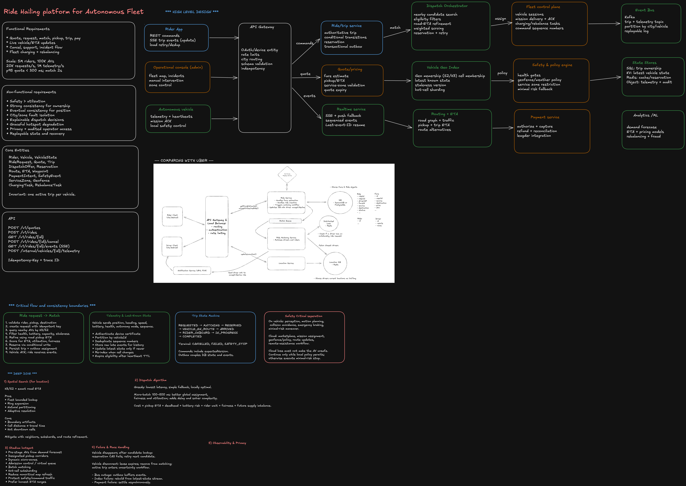

# Design a Ride-Hailing Platform for an Autonomous Fleet

## 1. Problem framing

Design a multi-city platform where riders request trips and autonomous vehicles are quoted, matched, routed, monitored, charged, maintained, and paid for.

The key difference from a conventional ride-hailing marketplace is that the platform owns both the marketplace and the fleet control plane. The architecture must separate cloud orchestration from safety-critical driving.

## 2. Clarifying questions

1. Are all vehicles autonomous, or must the platform also support human drivers?
2. Is the system city-limited initially, or globally multi-region?
3. What are the p95 targets for quote, match, and rider updates?
4. Are rides private only, or is pooling required?
5. Which constraints affect eligibility: seats, accessibility, battery, health, cargo, autonomy mode?
6. How long may vehicle location be stale?
7. What should happen when cloud connectivity is lost during a trip?
8. May a remote operator directly drive, or only advise?
9. How accurate must pickup ETA and pricing be?
10. Is city-level isolation an acceptable failure boundary?

## 3. Assumptions

- 5 million riders and 100,000 AVs.
- 20,000 ride requests per second at global peak.
- 1 million telemetry events per second.
- Quote p95 below 300 ms; match p95 below 2 seconds.
- Rider trip updates below 1 second p95.
- Vehicle position is eventually consistent.
- Reservation and trip ownership are strongly consistent.
- Each city is an operational ownership and failure-isolation unit.
- One vehicle has at most one active reservation or trip.

## 4. Requirements

### Functional

- Quote price, pickup ETA, and trip ETA.
- Request, match, track, cancel, complete, and pay for a ride.
- Real-time pickup and trip events.
- Vehicle telemetry, mission delivery, and acknowledgements.
- Charging, maintenance, cleaning, and fleet rebalancing.
- Safety events, remote assistance, support, and incident audit.

### Non-functional

- Safety over utilization.
- No double assignment.
- City and zone fault containment.
- Horizontal scaling for telemetry and requests.
- Replayable state and deterministic recovery.
- Explainable dispatch decisions.
- Graceful overload behavior.
- Least-privilege access to precise locations.

## 5. Core entities

```ts
type VehicleState = {
  vehicleId: string;
  cityId: string;
  location: { lat: number; lng: number };
  spatialCell: string;
  batteryPct: number;
  health: 'HEALTHY' | 'DEGRADED' | 'UNAVAILABLE';
  autonomyMode: string;
  availability: 'AVAILABLE' | 'RESERVED' | 'ON_TRIP' | 'OFFLINE';
  sequenceNumber: number;
  observedAt: string;
  receivedAt: string;
  version: number;
};

type Ride = {
  rideId: string;
  riderId: string;
  pickup: { lat: number; lng: number };
  dropoff: { lat: number; lng: number };
  quoteId: string;
  state: RideState;
  assignedVehicleId?: string;
  version: number;
};

type DispatchDecision = {
  decisionId: string;
  rideId: string;
  candidateVehicleIds: string[];
  exclusionReasons: Record<string, string>;
  scoreComponents: Record<string, number>;
  selectedVehicleId?: string;
};
```

## 6. APIs

```http
POST /v1/quotes
Idempotency-Key: quote-7f8

{
  "pickup": {"lat": 37.334, "lng": -121.889},
  "dropoff": {"lat": 37.789, "lng": -122.401},
  "requirements": {"seats": 2}
}
```

```http
POST /v1/rides
Idempotency-Key: ride-82c

{
  "quoteId": "q_123",
  "pickup": {...},
  "dropoff": {...}
}
```

```http
GET /v1/rides/{rideId}/events
Accept: text/event-stream
Last-Event-ID: 181
```

```http
POST /internal/v1/vehicles/{vehicleId}/telemetry
Vehicle-Sequence: 918281
```

## 7. High-level components

| Component             | Responsibility                                              |
| --------------------- | ----------------------------------------------------------- |
| API Gateway           | Auth, rate limits, city routing, schema checks, idempotency |
| Ride/Trip Service     | Authoritative ride state machine and ownership              |
| Quote/Pricing         | Fare, pickup ETA, trip ETA, quote expiry                    |
| Dispatch Orchestrator | Candidate retrieval, filtering, scoring, reservation        |
| Vehicle Geo Index     | H3/S2 cell membership and latest vehicle state              |
| Routing/ETA           | Road graph, traffic, pickup and trip routes                 |
| Fleet Control Plane   | Vehicle sessions, mission commands, ACKs, heartbeats        |
| Safety/Policy Engine  | Health gates, weather, geofence, service-zone policy        |
| Realtime Service      | SSE events, replay, push fallback                           |
| Payment Service       | Authorization, capture, refund, reconciliation              |
| Event Bus             | Replayable trip, telemetry, command, and audit events       |
| Analytics/ML          | Demand forecast, ETA, pricing, rebalancing, fraud           |

## 8. Ride request and match flow

1. Validate rider, service zone, pickup, and destination.
2. Create a ride using an idempotency key.
3. Query nearby available vehicles using H3/S2 cells.
4. Filter by location staleness, capacity, accessibility, battery, health, autonomy mode, service-zone policy, and maintenance state.
5. Calculate road-network pickup ETA for a bounded candidate set.
6. Score candidates by pickup ETA, deadhead distance, battery risk, rider wait, fairness, and future supply imbalance.
7. Reserve the best vehicle using a conditional write.
8. Persist the trip-to-vehicle binding and an outbox record in one transaction.
9. Publish the mission to Fleet Control.
10. Vehicle acknowledges the mission.
11. Realtime Service streams the assignment and ETA to the rider.

## 9. Spatial search

Use H3 or S2 as a candidate index, not the final distance metric.

1. Map pickup coordinates to a cell.
2. Read available vehicle IDs from that cell.
3. Expand to neighboring rings until enough candidates exist.
4. Deduplicate candidates.
5. Load latest vehicle state and reject stale entries.
6. Refine the remaining set using road-network pickup ETA.

### Advantages

- Bounded and fast lookup.
- Natural city/cell partitioning.
- Ring expansion supports adaptive radius.
- Easy hot-cell metrics and sharding.

### Disadvantages

- Cell-boundary artifacts.
- Geometric proximity differs from travel time.
- Cell transitions create write amplification.
- Downtown cells become hot.

Mitigate with neighbor lookup, finer-resolution cells, per-cell subshards, and exact routing refinement.

## 10. Dispatch tradeoff

### Greedy per-request matching

**Pros:** lowest latency, simple implementation, deterministic fallback.

**Cons:** locally optimal, may drain supply from a zone, weaker fairness and fleet utilization.

### Micro-batched matching

Collect requests for 100–500 ms per zone and solve constrained bipartite assignment.

**Pros:** better aggregate pickup time, utilization, fairness, and battery planning.

**Cons:** adds latency, requires solver deadlines, harder to operate.

Use micro-batching normally and fall back to greedy matching under overload.

A representative cost function is:

```text
cost =
  w1 * pickupETA
+ w2 * deadheadDistance
+ w3 * batteryRisk
+ w4 * riderWait
+ w5 * fairnessPenalty
+ w6 * futureSupplyImbalance
```

## 11. Preventing double assignment

Candidate lookup is advisory. Vehicle ownership is established only by a strongly consistent conditional write.

```sql
UPDATE vehicles
SET availability = 'RESERVED',
    active_trip_id = :tripId,
    version = version + 1
WHERE vehicle_id = :vehicleId
  AND availability = 'AVAILABLE'
  AND version = :expectedVersion;
```

Only one dispatcher succeeds. A distributed lock by itself is not the source of truth because lease expiry and partitions can create ambiguous ownership.

## 12. Trip state machine

```text
REQUESTED → MATCHING → RESERVED
→ VEHICLE_EN_ROUTE → ARRIVED
→ RIDER_ONBOARD → IN_PROGRESS
→ COMPLETED
```

Exceptional states:

```text
CANCELLED, FAILED, NO_SHOW, SAFETY_STOP, VEHICLE_REASSIGNING
```

Each command includes expected state, expected version, actor, reason, and idempotency key. A transactional outbox couples committed state with published events.

## 13. Telemetry and out-of-order events

Partition telemetry by `vehicleId` to preserve per-vehicle ordering.

For every event:

1. Authenticate the vehicle certificate.
2. Deduplicate by vehicle and sequence number.
3. Append raw telemetry to a replayable log.
4. Update latest state only when the sequence/version is newer.
5. Preserve late events for history and debugging.
6. Update spatial cell membership only for accepted latest state.

Store both `observedAt` and `receivedAt`. Their difference exposes network delay and clock drift.

Eligibility requires both fresh location and heartbeat:

```text
now - observedAt <= maxLocationAge
AND now - lastHeartbeat <= heartbeatTTL
```

## 14. Safety boundary

### On vehicle

- Perception and prediction.
- Motion planning.
- Collision avoidance.
- Emergency braking.
- Minimal-risk maneuver.
- Immediate local policy enforcement.

### In cloud

- Marketplace and matching.
- Mission assignment.
- Service-zone and geofence policy.
- Route recommendation.
- Fleet rebalancing.
- Remote-assistance workflow.

Loss of cloud connectivity must not make the vehicle unsafe. The AV continues only while local policy permits; otherwise it enters a minimal-risk state. After reconnect, mission state is reconciled using command and trip versions.

## 15. Vehicle command channel

Use a bidirectional, authenticated, long-lived connection for vehicle commands and acknowledgements.

Every command has:

- Command ID.
- Vehicle ID.
- Mission version.
- Sequence number.
- Expiry.
- Required acknowledgement.

Commands must be idempotent. Duplicate delivery cannot trigger duplicate physical action.

SSE is preferable for rider updates because the rider channel is mainly server-to-client. WebSocket or a similar bidirectional transport is preferable for vehicle sessions.

## 16. Stadium-scale hotspot

A stadium exit produces synchronized demand, dense vehicle updates, road restrictions, and unsafe curb contention.

Use:

- Forecasting and pre-staging.
- Designated pickup corridors.
- Dynamic micro-zones.
- Rider admission control and a virtual queue.
- Batch matching.
- Optional pooling by gate or direction.
- Hot-cell subsharding.
- Local zone dispatchers.
- Lower frequency for noncritical map refreshes.
- Dedicated capacity for safety and vehicle-command traffic.
- Honest ETA ranges rather than unstable exact values.

The goal is safe throughput, not simply maximum instantaneous matches.

## 17. Vehicle removal racing with a query

A candidate can become reserved, stale, unhealthy, offline, or outside the service zone after lookup.

The conditional reservation detects the race. On failure:

1. Record the reason.
2. Try the next scored candidate.
3. Refresh the candidate set when exhausted.
4. Widen the search radius.
5. Update the rider when the wait estimate materially changes.

## 18. Cancellation semantics

- Before reservation: stop matching and mark the ride cancelled.
- After reservation: conditionally cancel the trip, release the vehicle, and send mission cancellation.
- After rider boarding: convert cancellation to a safe early drop-off workflow.

Cancellation and mission acknowledgement can race. Expected trip versions make one transition win and force the other to reload state.

## 19. Payments

1. Validate payment method before ride creation.
2. Optionally authorize an estimated amount.
3. Complete the trip independently of processor availability.
4. Calculate final fare.
5. Capture asynchronously with durable retry.
6. Release excess authorization.
7. Reconcile processor and internal ledger.

Do not make safe trip completion depend on synchronous payment success.

## 20. Storage

| Data                       | Store                                |
| -------------------------- | ------------------------------------ |
| Trip and vehicle ownership | Strong relational or distributed SQL |
| Latest vehicle state       | Low-latency KV store                 |
| Spatial membership         | In-memory/Redis-like cell index      |
| Raw telemetry              | Kafka/Pulsar plus object storage     |
| Rider event resume history | Partitioned event store              |
| Payment ledger             | Relational ledger database           |
| Audit evidence             | Immutable object storage             |
| Analytics                  | Lakehouse or warehouse               |

Shard active operational data by city, then by trip or vehicle ID. Avoid cross-region writes on the active-trip path.

## 21. Multi-region strategy

Give each city active ownership of:

- Vehicle sessions.
- Dispatch.
- Trip writes.
- Spatial index.
- Routing cache.
- Local safety policy.

Global services handle identity, payments, analytics, configuration distribution, and support.

Do not transparently fail an active vehicle command session to another region unless mission and control ownership can move safely. Degrading new ride intake is safer than ambiguous vehicle control.

## 22. Charging and rebalancing

A planning service predicts demand over geography and time and creates rebalancing, charging, maintenance, and cleaning tasks.

Dispatch considers future constraints. The nearest AV may not be best when its battery is low, a charger queue is forming, or the trip would empty a high-demand zone.

Charging optimization includes charger availability, queue time, deadhead distance, predicted demand, battery health, and minimum reserve.

## 23. Failure recovery

### Event bus outage

Trip writes continue and transactional outbox records buffer events.

### Spatial index failure

Rebuild from latest vehicle-state snapshots or the replayable telemetry stream. Reduce ride admission while confidence is low.

### Routing failure

Use cached estimates with wider uncertainty. Avoid false precision.

### Dispatch overload

- Apply zone admission control.
- Bound candidate counts.
- Fall back to greedy matching.
- Use a virtual queue.
- Protect safety and command capacity.

### Vehicle disconnect

Expire its availability lease and remove it from new matching. An active trip enters a connectivity-uncertain workflow while the vehicle follows local safety policy.

### Payment outage

Persist trip completion and settle asynchronously.

## 24. Observability

### Product metrics

- Quote conversion.
- Match success.
- Pickup wait.
- Rider cancellation.
- Trip completion.
- Vehicle utilization.
- Unmatched demand.

### Reliability metrics

- Quote and match latency.
- Reservation conflict rate.
- Stale vehicle percentage.
- Command acknowledgement latency.
- Trip transition conflicts.
- Event publication lag.
- ETA error.

### Safety metrics

- Safety-stop frequency.
- Remote-assistance requests.
- Geofence violations.
- Health-policy exclusions.
- Connectivity loss during active trips.

Trace using rideId, tripId, vehicleId, cityId, zoneId, dispatchDecisionId, commandId, and traceId. Persist candidate exclusions and score components so dispatch decisions are explainable.

## 25. Privacy and authorization

- Rider clients access only their own trip.
- Vehicles use mutual TLS and hardware-backed identity.
- Dispatch receives only operationally necessary rider and vehicle fields.
- Precise coordinates have short default retention.
- Analytics receives de-identified or aggregated data.
- Operations access is role-based, time-bounded, and audited.
- Safety/legal retention is separated from general analytics retention.

## 26. Staff-level closing statement

> I divide the architecture into three consistency domains. Telemetry and map position are extremely high-volume and eventually consistent. Vehicle reservation and trip state are lower-volume scarce-resource ownership and therefore strongly consistent. Safety-critical driving stays local to the autonomous vehicle and must not depend on cloud availability. Spatial cells generate candidates, road ETA ranks them, and a conditional reservation establishes ownership. City-level control provides scale and fault isolation without creating ambiguous cross-region vehicle control.
