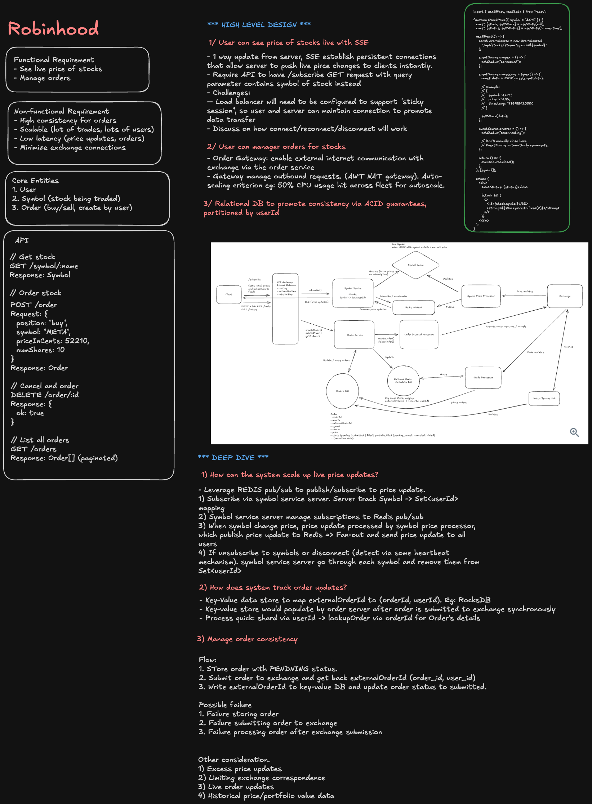
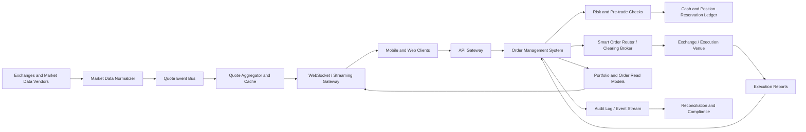

> **Editable diagram:** [Open in Excalidraw](https://excalidraw.com/#json=5mmc-Fb36urZ1ZVu4TbZN,YvhFt2qcdj4Mk8hhO9QVlQ)



# Robinhood System Design: Live Prices and Stock Orders

Design a brokerage platform where users can:

1. View live stock prices.
2. Create and cancel market and limit orders.
3. Track order execution and portfolio state.

At staff level, separate the system into two different consistency domains:

- **Market data:** extremely high throughput, low latency, eventually consistent display is usually acceptable.
- **Orders, cash, and positions:** lower throughput but correctness-critical, auditable, and strongly controlled.

Never use a UI-displayed quote as proof of execution price. A market order executes at the best available price when it reaches an exchange or broker-dealer, which can differ from the last price shown to the user.

## Interview framing

Clarify product and regulatory assumptions first:

- Are we a broker-dealer or routing through a clearing broker?
- Which assets are supported: equities, ETFs, options, crypto, fractional shares?
- Are orders regular-hours only, or extended-hours too?
- Do we support market, limit, stop, stop-limit, day, good-til-cancelled, and fractional orders?
- What is the expected quote throughput and concurrent user count?
- Are quotes real-time, delayed, or entitlement-controlled by exchange agreement?
- What pre-trade checks are required: buying power, holdings, market hours, price bands, regulatory restrictions?

Core invariant: **an accepted order must be represented exactly once, and cash/positions must never be overspent, oversold, or double-counted.**

## Requirements

### Functional requirements

- Stream live bid, ask, last trade, volume, and market status for symbols.
- Show watchlists and current portfolio values.
- Create market and limit buy/sell orders.
- Cancel open orders before they are fully executed.
- Track partial fills, fills, cancellations, rejections, and corporate actions.
- Enforce buying power, available shares, account status, and trading restrictions.
- Notify clients in real time when quote, order, or portfolio state changes.

### Non-functional requirements

| Requirement       | Target                                                                        |
| ----------------- | ----------------------------------------------------------------------------- |
| Quote latency     | Low tens to hundreds of milliseconds from provider to connected clients       |
| Order API latency | Validate and accept/reject within low hundreds of milliseconds                |
| Order correctness | Idempotent creation, serialized state transitions, durable audit trail        |
| Availability      | Quote degradation must not corrupt order acceptance; order path fails safely  |
| Scale             | Millions of quote updates per second; far fewer but critical order operations |
| Compliance        | Complete regulatory/audit record, entitlement enforcement, retention policy   |

## High-level architecture



The quote path and order path must be independently scalable and isolated. A market-data spike should not delay pre-trade checks or execution reports.

## Live market-data pipeline

### Ingestion and normalization

Market-data vendors or exchanges publish trades and quote updates. Normalize provider-specific messages into one canonical event:

```text
quote_event
	symbol
	exchange
	sequence_number
	event_time
	bid_price / bid_size
	ask_price / ask_size
	last_trade_price / last_trade_size
	cumulative_volume
```

Validate sequencing, drop duplicates, and detect gaps per source/symbol. Preserve raw feed events in durable storage for replay and audit.

### Aggregation and serving

The quote aggregator maintains the latest quote per symbol and optionally computes:

- national best bid and offer (NBBO),
- daily high/low/open/close,
- percentage change,
- rolling volume and chart candles.

Use in-memory or Redis-like caches for latest snapshot reads. Push deltas over WebSocket/SSE to subscribed clients; do not poll a database for every quote update.

### Subscription fanout

Partition subscriptions by symbol or symbol shard:

1. Client subscribes to a bounded watchlist or active detail screen.
2. Gateway records subscription in local shard state.
3. Quote events route only to gateways with interested subscribers.
4. Send coalesced updates when client/network capacity is constrained.

Use backpressure. For a slow client, drop intermediate quote updates and send the newest snapshot rather than accumulating an unbounded queue.

### Quote freshness and display

Return metadata with each quote:

```text
symbol, last_price, bid, ask, event_time, received_at, source, stale_flag
```

If stream freshness exceeds an SLA, mark the quote stale in the UI. Do not present stale or delayed data as executable price certainty.

## Order model

```text
order
	order_id
	client_order_id / idempotency_key
	account_id
	symbol
	side: BUY | SELL
	type: MARKET | LIMIT
	quantity / fractional_quantity
	limit_price (required for LIMIT)
	time_in_force: DAY | GTC
	status
	reserved_cash / reserved_quantity
	version
	created_at
```

```text
execution
	execution_id
	order_id
	venue_execution_id
	fill_quantity
	fill_price
	fee
	executed_at
```

Store money as integer minor units or fixed-point decimals, never binary floating point. Use an immutable event log for all order transitions and executions.

## Order lifecycle

```text
CLIENT_SUBMITTED
	-> PENDING_RISK_CHECK
	-> ACCEPTED
	-> ROUTED
	-> OPEN
	-> PARTIALLY_FILLED
	-> FILLED

OPEN or PARTIALLY_FILLED
	-> CANCEL_REQUESTED
	-> CANCELLED

Any pre-trade failure -> REJECTED
Unknown venue/network outcome -> PENDING_RECONCILIATION
```

State transitions must be conditional and versioned. An execution report can arrive while a cancel is in flight; the final state may be partially filled then cancelled, not simply cancelled.

## Create order flow

### 1. Client idempotency

Require a client-generated idempotency key for order creation:

```text
POST /orders
Idempotency-Key: client-uuid
```

Persist request hash and response before returning. Retries with the same key return the original order; retries with a different payload are rejected.

### 2. Validation and pre-trade risk

Validate:

- Account is active, KYC-approved, and not restricted.
- Symbol is tradable and market session permits the requested order type.
- Quantity, fraction, and limit price satisfy market rules.
- Buy order has sufficient settled/approved buying power.
- Sell order has sufficient available position after accounting for other open sell orders.
- Price collars, restricted lists, pattern-day-trading, and risk controls pass.

### 3. Atomic reservation

Before routing, reserve resources in a strongly consistent ledger:

- Buy: reserve estimated order value plus fees/buffer.
- Sell: reserve available shares.

The order record and reservation must commit atomically. If routing fails before venue acceptance, release the reservation idempotently.

### 4. Route and report

Send an idempotent venue order request through the smart order router or clearing broker. Persist the broker/venue order ID. Execution reports asynchronously update the order and post final cash/position movements.

## Market orders

A market order has no user-specified limit price. It should execute quickly at the best available venue price, but execution price is uncertain.

Design safeguards:

- Reserve a configurable worst-case notional buffer for buys.
- Apply price collars or convert extreme volatility cases to review/reject policy.
- Tell users the displayed price is indicative, not guaranteed.
- Reconcile the final fill price and release unused reserved buying power.

## Limit orders

A buy limit order executes only at or below its limit; a sell limit order only at or above its limit.

For an open limit order:

- keep the cash/shares reservation until filled, cancelled, or expired;
- update displayed order state from venue acknowledgements and fills;
- support partial fills and preserve remaining quantity;
- expire day orders at market close according to venue rules;
- process corporate actions or symbol changes through controlled adjustment workflows.

## Cancel order flow

Cancellation is a request, not a guaranteed immediate fact.

1. Client submits `POST /orders/{id}/cancel` with an idempotency key.
2. OMS validates the order is cancellable and transitions to `CANCEL_REQUESTED`.
3. OMS sends cancel request to broker/venue.
4. Venue returns either cancel acknowledgement, a fill, partial fill, reject, or an ambiguous outcome.
5. OMS applies the latest valid execution/cancel event and updates reservations.

Race condition to state in an interview: an order can fill after the customer pressed cancel but before the venue processed cancellation. Never promise “cancelled” until the execution venue confirms it.

## Cash, positions, and ledger correctness

Maintain a double-entry or similarly auditable ledger:

```text
Buy 10 shares at $50

At reservation:
	Debit available buying power
	Credit reserved buying power

At fill:
	Debit reserved buying power
	Credit clearing payable
	Debit pending position
	Credit executed trade inventory / clearing
```

Exact accounts vary by broker model, but every state change must balance. Do not derive available buying power from eventually consistent order read models.

On partial fills, consume only the filled portion and maintain reservation for remaining quantity. On cancellation/expiration, release the unfilled amount.

## Execution reports and reconciliation

Execution reports are at-least-once and can arrive late or out of order. Deduplicate by venue execution ID and version order state transitions.

Reconcile internal records against:

1. Broker/clearing order status exports.
2. Venue execution reports.
3. Clearing/settlement files.
4. Internal cash, position, and reservation ledger.

When an order status is uncertain, use `PENDING_RECONCILIATION`; do not blindly re-route or release funds. A controlled repair workflow should append compensating ledger entries, never edit historical financial records.

## Reliability and failure handling

| Failure                           | Safe behavior                                                                             |
| --------------------------------- | ----------------------------------------------------------------------------------------- |
| Client retries create order       | Return original order through idempotency key                                             |
| OMS timeout after routing request | Query broker or wait for execution report before retrying                                 |
| Quote feed lag                    | Serve last snapshot with stale indicator; do not block order risk checks on quote UI data |
| Venue outage                      | Stop accepting affected order type/symbol or queue only if policy permits                 |
| Worker/region failure             | Recover from durable order events and reservations                                        |
| Duplicate execution report        | Deduplicate by venue execution ID                                                         |
| Cancel/fill race                  | Apply confirmed venue outcome; release only unused reservation                            |

Failing an order safely is better than overselling a position or accepting an order without sufficient buying power.

## Compliance, security, and abuse controls

- Authenticate every account action and enforce step-up authentication for sensitive flows.
- Keep immutable audit events for order creation, cancellation, approval, routing, execution, and manual operations.
- Encrypt PII and brokerage credentials; apply least-privilege access.
- Enforce market-data exchange entitlements and delayed/realtime labels.
- Screen accounts and orders for sanctions, AML, manipulation, wash-sale, and velocity rules as applicable.
- Rate limit order APIs and detect account takeover patterns.
- Use strict separation of duties for manual corrections and ledger adjustments.

## Observability and alerts

Track separately for quotes and orders:

- Feed lag, sequence gaps, stale-symbol ratio, subscription count, fanout drop/coalescing rate.
- Order create/cancel latency, reject rate by reason, routing failures, execution latency, partial-fill rate.
- Reservation mismatch, negative available balance attempts, duplicate idempotency conflicts.
- Orders stuck in `PENDING_RISK_CHECK`, `ROUTED`, `CANCEL_REQUESTED`, or `PENDING_RECONCILIATION`.
- Reconciliation breaks by count and notional value.

Alert immediately on ledger imbalance, stale market data above SLA, broker connectivity loss, large reconciliation variance, unexpected order-rejection spikes, or cancel/fill state anomalies.

## Staff-level trade-offs

- **Quote freshness vs. fanout cost:** send every tick only to active subscribers; coalesce for background clients.
- **Strict order correctness vs. latency:** reserve cash/shares synchronously, while portfolio analytics may update asynchronously.
- **Single broker vs. multi-broker routing:** one broker is simpler; multi-broker improves resiliency/best execution but complicates routing, settlement, and reconciliation.
- **Client simplicity vs. truthful state:** show responsive optimistic UI only as `submitted`; final status must come from the OMS and execution venue.
- **Immediate cancellation UX vs. venue reality:** represent cancellation as requested until confirmed.

The strongest staff-level answer makes the distinction explicit: market-data delivery can be approximate and fast; order, reservation, execution, and ledger workflows must be durable, idempotent, versioned, and reconciled.
