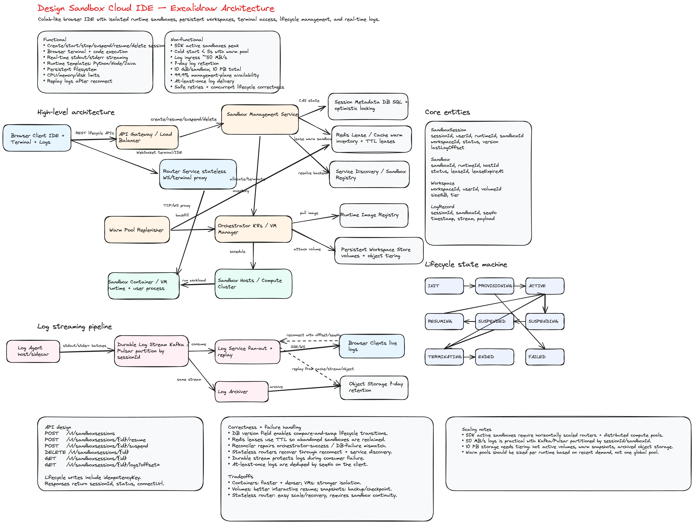
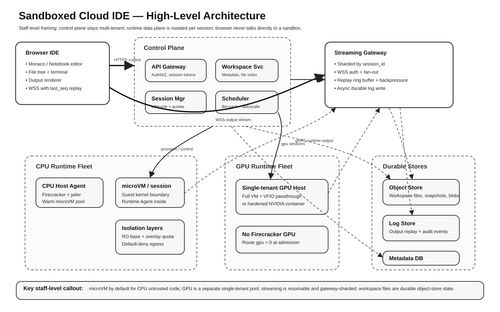
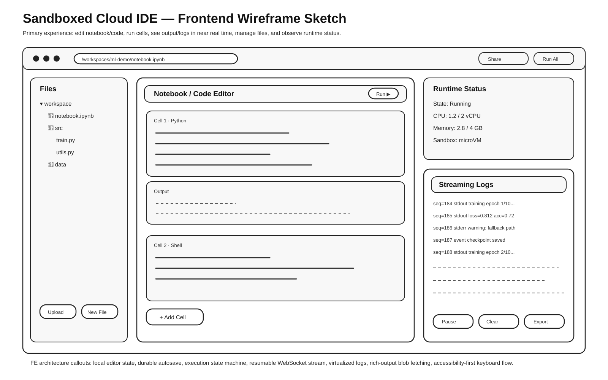
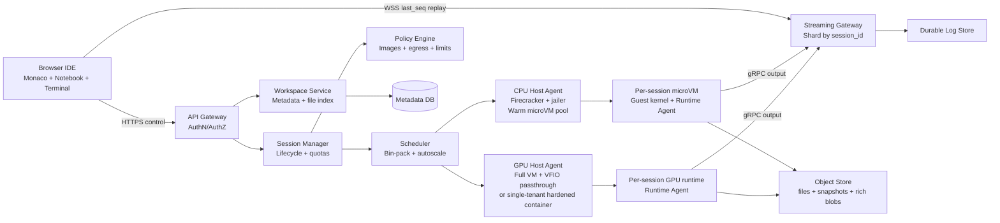
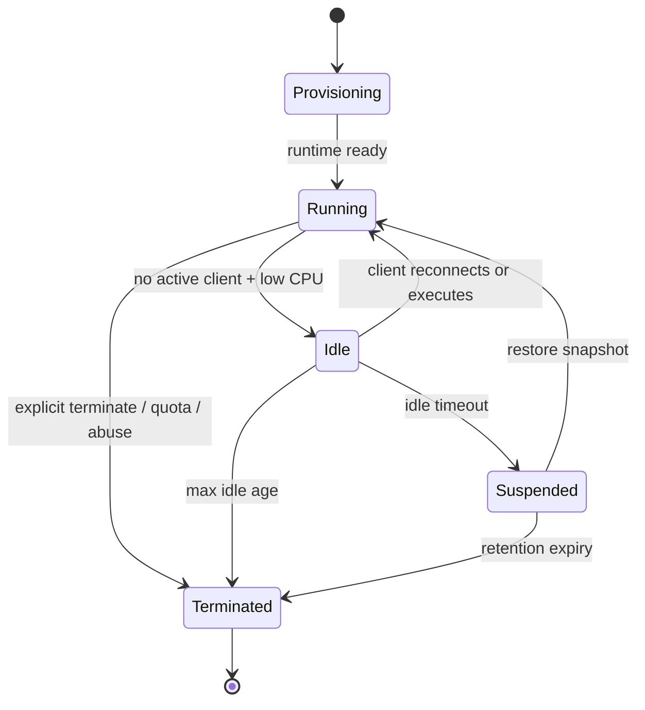
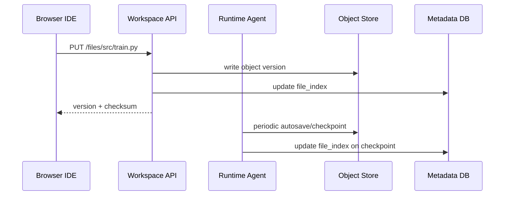
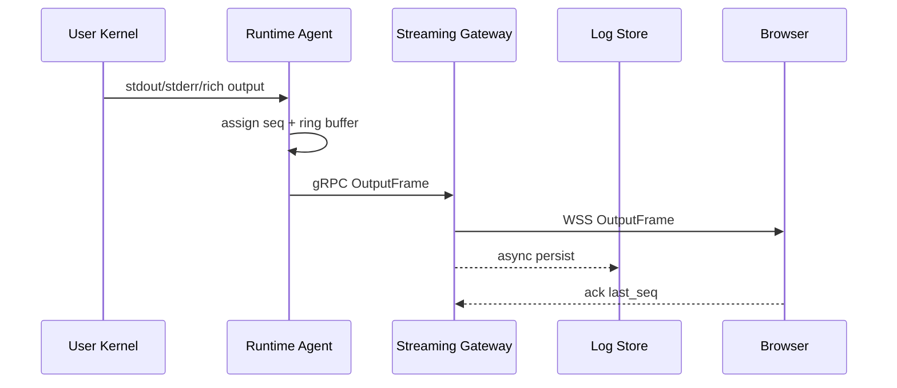
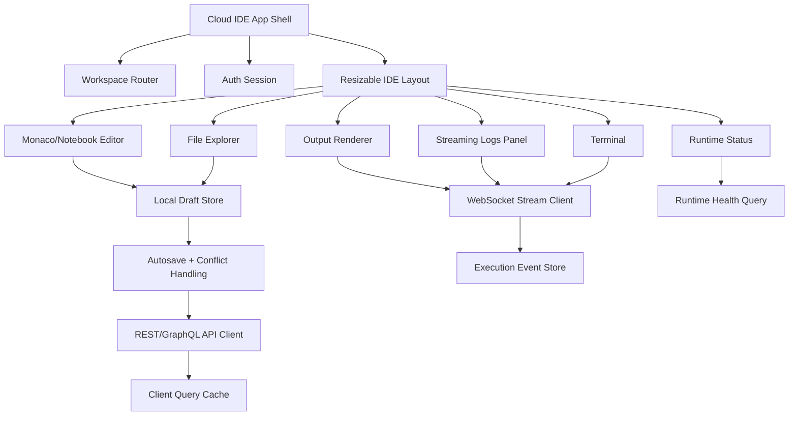
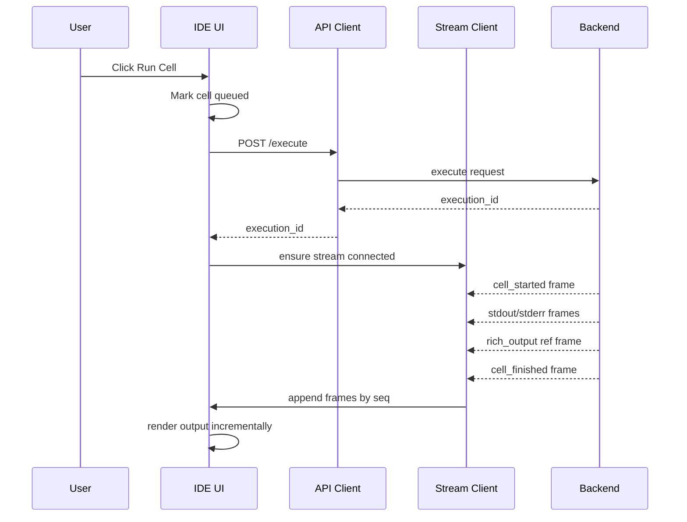

# Design a Sandboxed Cloud IDE

> **Interview prompt:** Design a multi-tenant, browser-based cloud IDE/notebook that lets users edit code, run cells or commands in an isolated sandbox, stream stdout/stderr/rich output to the browser, manage workspace files, and persist state.

This is a **staff software engineer** answer. The central design principle is:

> **Security is the product constraint.** Everything else — startup latency, density, cost, and UX — is optimized only after strong tenant isolation is preserved.







---

## 1. Requirements

### Functional requirements

1. User opens a workspace or notebook in the browser.
2. User edits code with a rich editor experience.
3. User starts or resumes an isolated runtime session.
4. User runs cells or shell commands.
5. UI renders stdout, stderr, structured events, and rich output.
6. User can view streaming logs while code is running.
7. User can upload, download, create, rename, and delete workspace files.
8. Workspace state survives runtime termination or host failure.
9. Collaboration is optional. In the base design, execution is single-owner; shared editing can be added with CRDT/OT later.

### Non-functional requirements

| Requirement     | Design target                                                   |
| --------------- | --------------------------------------------------------------- |
| Isolation       | Strong tenant isolation; assume all user code is hostile.       |
| Startup latency | p95 fresh session interactive in single-digit seconds.          |
| Streaming       | Near-real-time output with reconnect and replay.                |
| Durability      | Workspace files survive host death.                             |
| Autoscaling     | Scale active compute separately from idle/suspended workspaces. |
| Fairness        | Enforce per-user and per-org quotas.                            |
| Observability   | Metrics, tracing, security audit logs, abuse signals.           |

---

## 2. Assumptions and rough scale

Use these numbers to ground tradeoffs during an interview:

- **100k registered users**.
- **5k concurrent active sessions** at peak.
- **50k idle/suspended sessions** in the long tail.
- Typical CPU session: **1–2 vCPU, 2–4 GB RAM**.
- Peak active CPU demand: **5k–10k vCPU** and **10–20 TB RAM**.
- With 64–128 vCPU hosts, we need roughly **80–150 CPU hosts**, plus headroom for fragmentation, failures, and warm pools.
- GPU sessions are a minority and are scheduled from a separate GPU pool.
- Workloads are bursty and interactive: short cells, long idle gaps.

The scale implies one key cost lever: **idle sessions must not keep consuming CPU/RAM**. That drives snapshot/suspend for CPU sessions.

---

## 3. High-level architecture

The system is split into two planes:

1. **Control plane:** multi-tenant services for auth, workspace metadata, session lifecycle, scheduling, quota, policy, and API orchestration.
2. **Data plane:** per-session isolated compute runtimes, host agents, streaming gateway, object store, and log store.



### Component responsibilities

| Component         | Responsibility                                                        |
| ----------------- | --------------------------------------------------------------------- |
| Browser IDE       | Editor, notebook UI, terminal, file tree, logs, runtime controls.     |
| API Gateway       | Auth, request validation, token minting, routing to services.         |
| Workspace Service | Workspace metadata, file index, object-store version pointers.        |
| Session Manager   | Create, resume, idle, suspend, terminate; enforce quotas.             |
| Scheduler         | Choose CPU/GPU/high-memory pool; bin-pack by resource requirements.   |
| Policy Engine     | Runtime image policy, egress policy, resource caps, abuse response.   |
| Host Agent        | Launch runtimes, attach overlays, snapshot/restore, health reporting. |
| Runtime Agent     | Executes code, manages files, captures output, reports health.        |
| Streaming Gateway | WSS auth, fan-out, replay, backpressure, durable output persistence.  |
| Object Store      | Durable workspace files, snapshots, large rich-output blobs.          |
| Log Store         | Durable output replay, audit/debug logs.                              |

The browser **never talks directly to a runtime**. All runtime access goes through controlled internal channels.

---

## 4. Compute substrate decision

For untrusted code, shared host kernel exposure is the primary risk. A container escape can compromise all tenants on a host. That pushes the default CPU substrate toward **microVMs**.

| Option             |  Isolation |                         Cold start | Density | Fit                                                    |
| ------------------ | ---------: | ---------------------------------: | ------: | ------------------------------------------------------ |
| Plain container    |       Weak |                                 ms | Highest | Not acceptable alone for arbitrary untrusted code.     |
| Hardened container |     Medium |                                 ms |    High | Useful for trusted/internal jobs, still shared kernel. |
| gVisor             |   Stronger |                        10s–100s ms |    High | Good cheaper tier, but has syscall/perf tradeoffs.     |
| **microVM**        | **Strong** | ~100 ms boot; faster with snapshot |    High | **Default CPU sandbox.**                               |
| Full VM            |  Strongest |                            seconds |   Lower | Best for GPU passthrough or high-risk workloads.       |

### Default CPU path: microVM

Use Firecracker or Cloud Hypervisor, ideally hidden behind a Kubernetes-compatible abstraction such as Kata Containers.

CPU runtime properties:

- One runtime per session.
- Each runtime has its own guest kernel.
- Host uses Firecracker `jailer` or equivalent isolation.
- Dedicated cgroup, UID/GID, chroot, and network namespace per runtime.
- Warm microVM pools keep startup latency low.
- Snapshot/restore supports fast resume.

### GPU exception

GPU is the important exception. The default microVM path usually cannot expose a GPU device cleanly because minimal microVM device models do not support the same PCIe/VFIO passthrough path as full VMs.

For `gpu > 0`, route at admission to a separate GPU pool:

1. **Preferred:** full VM with VFIO PCIe passthrough of a dedicated GPU or MIG slice.
2. **Fallback:** hardened NVIDIA-stack container on a single-tenant GPU host.

The fallback is weaker because it shares the host kernel, so the blast radius is controlled by **single-tenant host placement**.

Interview sound bite:

> CPU sessions use microVMs by default. GPU sessions are a separate substrate because the device model and isolation tradeoffs are different.

---

## 5. Isolation model

Security uses defense in depth. No single layer is trusted to be perfect.

### Process and kernel isolation

- Each session runs in its own guest kernel.
- User code runs unprivileged inside the guest.
- Apply seccomp, dropped Linux capabilities, PID limits, CPU limits, and memory limits.
- OOM-kill the user process or kernel, not the host.
- Host never trusts the guest.

### Filesystem isolation

- Read-only base image: language toolchain, package manager, runtime agent.
- Writable overlay: workspace files, installed packages, cache.
- Overlay has a per-session disk quota.
- No host paths are mounted into the runtime.
- Workspace source of truth lives in object store, not the runtime disk.

### Network isolation

The network is the most-attacked path.

- Runtime gets isolated network namespace and veth/NAT path.
- No inbound internet traffic to runtime.
- Runtime is reachable only by Host Agent, Runtime Agent control channel, and Streaming Gateway over private network.
- Egress is default-deny.
- Egress proxy allowlists package repos such as PyPI, npm, conda, apt mirrors.
- Block metadata endpoints such as `169.254.169.254` and link-local ranges at host firewall.
- Also enforce token-based metadata access such as IMDSv2 on hosts as defense in depth.

### Credentials and identity

- Never inject node-level or cloud-wide credentials into the guest.
- Mint short-lived, narrowly scoped session tokens.
- Tokens expire on idle, suspend, or terminate.
- On snapshot restore, re-seed entropy and issue fresh identity tokens.

### Supply-chain protection

- Base images are signed and scanned.
- Package installs flow through the egress proxy for caching, scanning, and rate limiting.
- Known crypto-mining signatures, suspicious syscalls, and mass-egress attempts feed abuse detection.

---

## 6. Backend lifecycle design



### Provisioning

1. API authenticates request.
2. Session Manager checks user/org quotas.
3. Policy Engine validates image, resource request, and egress policy.
4. Scheduler chooses CPU or GPU pool.
5. Host Agent claims warm runtime or restores base snapshot.
6. Workspace overlay attaches.
7. Runtime Agent becomes healthy.
8. Session record returns gateway endpoint and scoped session token.

### Running

- Runtime Agent accepts execute, interrupt, file, and health requests.
- Output goes to Streaming Gateway, not directly to browser.
- Runtime reports resource usage for fairness and idle detection.

### Idle

A session is idle when:

- no active WebSocket client is attached, and
- no command/cell is running, and
- CPU usage stays below threshold for a grace period.

### Suspend and resume

CPU sessions:

- Snapshot memory and disk overlay.
- Store snapshot locally first for fast resume.
- Tier older snapshots to object store.
- Free host CPU/RAM.
- On resume, restore snapshot and mint fresh identity/entropy.

GPU sessions:

- Do not rely on full device-state snapshot.
- Checkpoint workspace files and tear down the runtime.
- Recreate GPU runtime when user resumes.

### Termination

- Flush workspace checkpoints.
- Persist final logs.
- Destroy runtime.
- Delete or expire local overlay.
- Revoke session tokens.
- Emit audit events.

---

## 7. Data persistence model

Do not conflate workspace files, runtime overlay, and live memory.

| Data class        | Source of truth        | Durability                     | Purpose                         |
| ----------------- | ---------------------- | ------------------------------ | ------------------------------- |
| Workspace files   | Versioned object store | Durable                        | Code, notebooks, user files.    |
| Runtime overlay   | Local disk + snapshot  | Best-effort cache              | Installed packages, temp cache. |
| Live memory       | microVM snapshot       | Best-effort resume accelerator | Fast resume after idle.         |
| Rich output blobs | Object store           | Durable or TTL-based           | Large plots, images, tables.    |
| Output logs       | Log store              | Durable / TTL                  | Replay, debug, audit.           |

### Workspace file flow



### Strategy

- Autosave notebook and file edits frequently.
- Checkpoint on suspend and terminate.
- Store content-addressed object versions with checksums.
- Use local disk for fast interactive IO, but treat it as disposable.
- Paid tier may add persistent network volumes for large datasets.

Tradeoff:

- Network volumes simplify persistence but can become expensive and slower under high IOPS.
- Object store plus local ephemeral disk is cheaper and scales better, but resume may need rehydration.

---

## 8. Execution model

Runtime Agent is the platform-controlled entrypoint inside the sandbox.

Internal Runtime Agent API:

```http
POST /execute
Content-Type: application/json

{
  "execution_id": "exec_123",
  "kind": "cell",
  "language": "python",
  "code": "print('hello')"
}
```

```http
POST /interrupt
GET  /health
GET  /fs/{path}
PUT  /fs/{path}
DELETE /fs/{path}
```

Execution events are typed:

```ts
type OutputFrame = {
  sessionId: string;
  executionId: string;
  seq: number;
  type: 'stdout' | 'stderr' | 'event' | 'rich_output';
  mime?: 'text/plain' | 'text/html' | 'image/png' | 'application/json';
  data?: string;
  objectKey?: string;
  sizeBytes?: number;
};
```

Large rich output should not block stdout streaming. Apply a threshold, for example 256 KB:

- Small payload: inline on stream.
- Large payload: write to object store, stream `{objectKey, mime, sizeBytes}`.
- Browser fetches blob out-of-band.

---

## 9. Streaming architecture

Goal: low-latency, ordered, resumable output streaming.



### Ordering and replay

- Each stream has monotonic `seq`.
- Browser stores latest acknowledged `seq`.
- On reconnect, browser sends `last_seq`.
- Gateway replays from memory ring buffer.
- If buffer is missing, gateway rehydrates from durable log store.
- Delivery is at-least-once; client deduplicates by `seq`.

### Gateway sharding

Streaming Gateway is stateful, so make state explicit.

- Consistent-hash by `session_id`.
- Browser and Runtime Agent both route to the same gateway shard.
- Session record stores `gateway_shard` or a shard-stable endpoint.
- If the shard restarts, it replays from durable log store.

### Backpressure

When output is faster than the client can consume:

- Maintain bounded per-session buffer.
- Drop oldest text/events after cap.
- Emit explicit truncation frame.
- Continue execution unless output-flood policy kills the job.
- Large rich-output blobs do not count against text stream cap because they are side-loaded.

---

## 10. Backend APIs

### Workspace and file APIs

```http
POST /v1/workspaces
GET  /v1/workspaces/{workspaceId}
GET  /v1/workspaces/{workspaceId}/files
PUT  /v1/workspaces/{workspaceId}/files/{path}
GET  /v1/workspaces/{workspaceId}/files/{path}
DELETE /v1/workspaces/{workspaceId}/files/{path}
```

### Session lifecycle APIs

```http
POST /v1/workspaces/{workspaceId}/sessions
{
  "image": "python-3.12-datascience",
  "cpu": 2,
  "memGb": 4,
  "gpu": 0
}
```

```http
GET  /v1/sessions/{sessionId}
POST /v1/sessions/{sessionId}:suspend
POST /v1/sessions/{sessionId}:resume
POST /v1/sessions/{sessionId}:terminate
```

### Execution APIs

```http
POST /v1/sessions/{sessionId}/execute
{
  "kind": "cell",
  "language": "python",
  "code": "import pandas as pd\nprint('ready')"
}
```

```http
POST /v1/sessions/{sessionId}/interrupt
```

### Streaming API

```http
GET wss://gateway.example.com/v1/sessions/{sessionId}/stream?token=...&last_seq=...
```

Server frame:

```json
{
  "type": "stdout",
  "execution_id": "exec_123",
  "seq": 184,
  "mime": "text/plain",
  "data": "training epoch 1/10..."
}
```

Large rich output frame:

```json
{
  "type": "rich_output",
  "execution_id": "exec_123",
  "seq": 221,
  "mime": "image/png",
  "object_key": "outputs/ws_1/sess_1/exec_123/plot.png",
  "size_bytes": 981331
}
```

---

## 11. Control-plane data model

```sql
workspace(
  id,
  owner_id,
  org_id,
  name,
  env_spec,
  default_image,
  created_at,
  last_active_at
);

session(
  id,
  workspace_id,
  host_id,
  runtime_id,
  substrate, -- microvm | gpu_vm | gpu_container
  state,     -- provisioning | running | idle | suspended | terminated
  image,
  cpu,
  mem_gb,
  gpu,
  gateway_shard,
  token_id,
  created_at,
  idle_since,
  expires_at
);

snapshot(
  id,
  session_id,
  kind, -- disk | memory
  location,
  size_bytes,
  created_at
);

file_index(
  workspace_id,
  path,
  object_key,
  version,
  size_bytes,
  checksum,
  updated_at
);

quota(
  subject_id,
  subject_type, -- user | org
  max_concurrent,
  max_vcpu,
  max_mem_gb,
  max_gpu,
  tier
);

audit_event(
  id,
  actor_id,
  action,
  session_id,
  image,
  substrate,
  network_policy,
  ts
);
```

---

# Frontend Design

## 12. Frontend product surface

The UI should feel like a notebook plus IDE:

- Left panel: workspace file tree.
- Main panel: notebook/cell editor or code editor.
- Right panel: runtime status, logs, variables, resources.
- Bottom panel: terminal/output drawer.
- Top bar: workspace name, runtime state, run controls, share button.


---

## 13. Frontend architecture



### Frontend layers

| Layer              | Responsibility                                                            |
| ------------------ | ------------------------------------------------------------------------- |
| App shell          | Routing, auth, layout persistence, top-level error boundaries.            |
| Workspace domain   | Workspace metadata, file tree, environment settings.                      |
| Editor domain      | Monaco model, notebook cells, dirty state, undo/redo, keyboard shortcuts. |
| Execution domain   | Execute requests, interrupt, execution state, output frames.              |
| Stream domain      | WebSocket connection, reconnect, replay, dedupe, backpressure UI.         |
| Persistence domain | Autosave, conflict detection, upload/download.                            |
| Observability      | Frontend metrics, client logs, stream lag, user action traces.            |

---

## 14. Frontend state model

Keep durable document state separate from ephemeral runtime state.

```ts
type WorkspaceState = {
  workspaceId: string;
  files: Record<string, FileMeta>;
  activePath: string | null;
  dirtyFiles: Set<string>;
};

type RuntimeState = {
  sessionId: string | null;
  state:
    | 'disconnected'
    | 'provisioning'
    | 'running'
    | 'idle'
    | 'suspended'
    | 'terminated'
    | 'error';
  substrate?: 'microvm' | 'gpu_vm' | 'gpu_container';
  cpuUsed?: number;
  memUsedGb?: number;
  lastHeartbeatAt?: number;
};

type ExecutionState = {
  activeExecutionId: string | null;
  executions: Record<
    string,
    {
      status: 'queued' | 'running' | 'succeeded' | 'failed' | 'interrupted';
      startedAt?: number;
      finishedAt?: number;
      exitCode?: number;
    }
  >;
};

type StreamState = {
  connection: 'connecting' | 'open' | 'reconnecting' | 'closed';
  lastSeq: number;
  framesByExecution: Record<string, OutputFrame[]>;
  truncatedExecutions: Set<string>;
};
```

### Why this separation matters

- Editor state must remain responsive even if runtime is down.
- Runtime can be terminated without losing files.
- Streaming output can be replayed and deduped independently.
- Autosave can continue even if execution is unavailable.

---

## 15. Frontend execution flow



### Run button behavior

- Disabled while session is provisioning.
- Shows queued/running/succeeded/failed per cell.
- Supports keyboard shortcut, such as `Shift+Enter`.
- Allows interrupt while command is running.
- Shows reconnecting badge if stream drops.

---

## 16. Frontend streaming client

```ts
class OutputStreamClient {
  private ws: WebSocket | null = null;
  private lastSeq = 0;
  private reconnectAttempt = 0;

  constructor(
    private readonly sessionId: string,
    private readonly getToken: () => Promise<string>,
    private readonly onFrame: (frame: OutputFrame) => void
  ) {}

  async connect() {
    const token = await this.getToken();
    const url = `/v1/sessions/${this.sessionId}/stream?token=${token}&last_seq=${this.lastSeq}`;
    this.ws = new WebSocket(url);

    this.ws.onmessage = (event) => {
      const frame = JSON.parse(event.data) as OutputFrame;
      if (frame.seq <= this.lastSeq) return; // dedupe replay
      this.lastSeq = frame.seq;
      this.onFrame(frame);
    };

    this.ws.onclose = () => this.reconnectWithBackoff();
  }

  private reconnectWithBackoff() {
    const delay = Math.min(1000 * 2 ** this.reconnectAttempt, 15_000);
    this.reconnectAttempt += 1;
    window.setTimeout(() => this.connect(), delay);
  }
}
```

Production improvements:

- Reset backoff after successful open.
- Add token refresh.
- Add heartbeat/ping timeout.
- Store `lastSeq` per session in memory and optionally session storage.
- Surface reconnecting state in the UI.

---

## 17. Frontend performance design

### Editor performance

- Use Monaco models per file.
- Lazy-load language workers.
- Keep notebook cells virtualized if notebook is large.
- Persist layout and editor tabs locally.
- Avoid re-rendering the full notebook on each output frame.

### Log/output performance

- Virtualize logs with windowing.
- Batch stream frames into animation-frame updates.
- Store frames append-only by execution ID.
- Render rich output lazily when visible.
- Fetch large blobs out-of-band.
- Apply UI truncation markers when backend reports truncation.

### File tree performance

- Lazy-load folders.
- Use optimistic updates for rename/create/delete.
- Debounce autosave.
- Compare file checksums or versions to detect conflicts.

---

## 18. Frontend accessibility

A staff-level frontend answer should call this out explicitly:

- Full keyboard navigation for file tree, editor tabs, cells, terminal, and panels.
- Announce run status changes with `aria-live` regions.
- Provide non-color-only indicators for running, success, failure, reconnecting.
- Respect reduced motion.
- Manage focus after running a cell or opening output.
- Ensure terminal and log panels expose readable text to assistive tech.
- Support high-contrast themes.

---

# Backend Design

## 19. Scheduler, autoscaling, and fairness

### Admission control

Admission happens before any host work:

1. Is the user/org allowed to create another session?
2. Does the requested image satisfy policy?
3. Does the requested CPU/memory/GPU fit tier limits?
4. Is the requested egress policy allowed?
5. Is there capacity now, or should the request queue?

### Scheduling

Separate pools:

- CPU microVM pool.
- GPU single-tenant pool.
- High-memory pool.
- Optional trusted/internal container pool.

Scheduler preferences:

1. Correct substrate first.
2. Host with warm runtime/image second.
3. Bin-pack by CPU and memory third.
4. Avoid noisy-neighbor hotspots.
5. Preserve failure-domain diversity for enterprise orgs.

### Autoscaling

Scale based on:

- Active sessions.
- Queued provisioning requests.
- Warm-pool depletion rate.
- Host utilization.
- Snapshot restore latency.
- GPU queue depth.

CPU fleet scales with **active** sessions, because suspended sessions consume only storage.

GPU fleet scales separately because idle GPU sessions should usually be torn down.

### Fairness

- Per-user and per-org quotas.
- Weighted fair sharing for enterprise orgs.
- Free tier idle timeout and wall-clock caps.
- Preempt-to-suspend longest-idle CPU sessions under pressure.
- Hard GPU quotas; do not oversubscribe GPUs casually.

---

## 20. Observability

### Metrics

| Metric                             | Why it matters                    |
| ---------------------------------- | --------------------------------- |
| Session start p50/p95/p99          | Measures user-perceived latency.  |
| Warm-pool hit rate                 | Explains cold-start regressions.  |
| Snapshot restore latency           | Measures resume quality.          |
| Running/idle/suspended sessions    | Capacity and cost visibility.     |
| CPU/memory/GPU utilization         | Fleet scaling signals.            |
| Streaming lag                      | Output UX health.                 |
| Dropped/truncated output frames    | Backpressure and flood detection. |
| Gateway reconnect/rehydration rate | Streaming reliability.            |
| Denied egress attempts             | Security/audit signal.            |
| Metadata endpoint hits             | High-severity security signal.    |
| Token mint/revoke events           | Credential lifecycle audit.       |

### Tracing

Trace the critical session-start path:

```text
create_session
  -> authenticate
  -> quota_check
  -> policy_check
  -> choose_substrate
  -> schedule_host
  -> claim_warm_runtime
  -> attach_workspace_overlay
  -> runtime_agent_ready
  -> stream_gateway_assigned
```

This makes cold-start regressions diagnosable.

### Audit logs

Audit events should include:

- Actor ID and org ID.
- Workspace/session ID.
- Runtime image and digest.
- Substrate selected.
- Egress policy.
- Token mint/revoke events.
- Denied network attempts.
- Suspicious syscall or abuse signal.
- Admin/operator actions.

---

## 21. Failure modes and mitigations

| Failure mode             | Mitigation                                                                 |
| ------------------------ | -------------------------------------------------------------------------- |
| Host dies mid-session    | Workspace files are durable; recreate session and replay logs best-effort. |
| Gateway shard dies       | Client reconnects with `last_seq`; gateway rehydrates from log store.      |
| Infinite stdout loop     | Agent output cap + gateway truncation + abuse policy.                      |
| Fork bomb                | PID cgroup limit; terminate session.                                       |
| User fills disk          | Overlay disk quota; error in runtime, not host.                            |
| Crypto mining            | CPU/GPU sustained-use detection, egress denial, throttle/kill.             |
| Snapshot identity leak   | Re-seed entropy and mint fresh tokens on restore.                          |
| Metadata credential leak | Block link-local metadata endpoint and enforce tokenized metadata access.  |
| Cold start regression    | Warm pools, base image caching, post-import snapshots.                     |
| GPU demand spike         | Separate queue, hard quota, clear pending state in UI.                     |

---

## 22. Optional collaboration design

Keep collaboration separate from execution.

### Shared editing

- Use CRDT or OT service over WebSocket.
- Sync notebook cell text, file edits, cursors, and comments.
- Store durable file versions in object store.

### Shared execution

Simplest safe model:

- One owner runtime per notebook.
- Collaborators can view streamed output.
- Only owner or authorized users can execute.
- Execution requests are queued to avoid kernel contention.

For true parallel execution, give each collaborator their own runtime and share files through versioned workspace state.

---

## 23. Staff-level tradeoffs to say out loud

1. **Containers are cheap but not enough for hostile code.** Use microVMs for default CPU isolation.
2. **GPU is not just another resource flag.** It changes the substrate, scheduler, cost model, and blast radius.
3. **Workspace files are not runtime disk.** Durable source of truth must live outside the sandbox.
4. **Streaming gateway is intentionally stateful.** Shard by session and make replay explicit.
5. **Idle tail drives economics.** Suspend-to-snapshot lets the fleet scale with active sessions, not registered users.
6. **Network egress is the biggest attack path.** Default deny, proxy allowlists, and metadata endpoint protection are mandatory.
7. **Frontend must be resilient to backend lifecycle.** Editor state, file saves, runtime state, and stream state should be independently recoverable.

---

## 24. Interview answer summary

I would design the cloud IDE as a two-plane system: a stateless multi-tenant control plane for auth, workspace metadata, session lifecycle, scheduling, quotas, and policy; and a per-session runtime data plane where untrusted code executes in isolated sandboxes. The default CPU sandbox is a microVM, run under a jailed host agent with a read-only base image, quota-limited writable overlay, no host mounts, no broad credentials, and default-deny egress through a policy proxy. GPU sessions are routed to a separate single-tenant GPU pool using full VMs with PCIe passthrough, or hardened containers only when host-level single tenancy is acceptable.

For UX, the browser uses a notebook/code-editor shell with file tree, editor, output renderer, runtime status, and streaming logs. Execution output is sent from the Runtime Agent to a session-sharded Streaming Gateway over gRPC, then to the browser over WebSocket. Every frame has a monotonic sequence number so reconnects can replay from memory or durable logs. Large rich outputs are written to object store and referenced from the stream.

For persistence, workspace files are durable in versioned object storage, runtime overlays are rebuildable caches, and live VM memory snapshots are best-effort resume accelerators. CPU sessions can suspend to snapshot to make idle sessions cheap, while GPU sessions are usually checkpointed and torn down. Observability covers session-start latency, warm-pool hit rate, streaming lag, resource utilization, denied egress, metadata endpoint hits, and audit events.

---

## 25. Follow-up questions and strong answers

### What breaks first at 100k active sessions?

Likely bottlenecks are the host fleet, scheduler throughput, and streaming gateway state. I would shard the scheduler by pool/region, use async provisioning queues, keep gateway sharded by `session_id`, and scale host pools off active sessions plus queue depth. Object store and log store must be partitioned by workspace/session prefix.

### Why not just use Kubernetes containers?

Kubernetes containers share the host kernel. For arbitrary hostile code, a kernel escape can compromise the host and other tenants. Containers are useful for trusted jobs or single-tenant GPU fallback, but the default untrusted CPU substrate should provide a stronger kernel boundary, such as microVMs.

### How do you prevent output floods?

Use agent-side output rate limits, bounded gateway buffers, truncation events, and client virtualization. Execution continues unless the output flood is classified as abuse, in which case the session can be throttled or terminated.

### How do you recover from gateway failure?

The client reconnects with `last_seq`. Routing maps the session back to its gateway shard or replacement. The gateway replays from its ring buffer; if missing, it rehydrates from durable log store. Client dedupes by sequence number.

### How do you handle secrets?

The runtime never receives node or cloud-wide credentials. It only receives short-lived, scoped tokens for its workspace prefix or approved resources. Tokens are audited, expire on lifecycle transitions, and are regenerated after snapshot restore.
