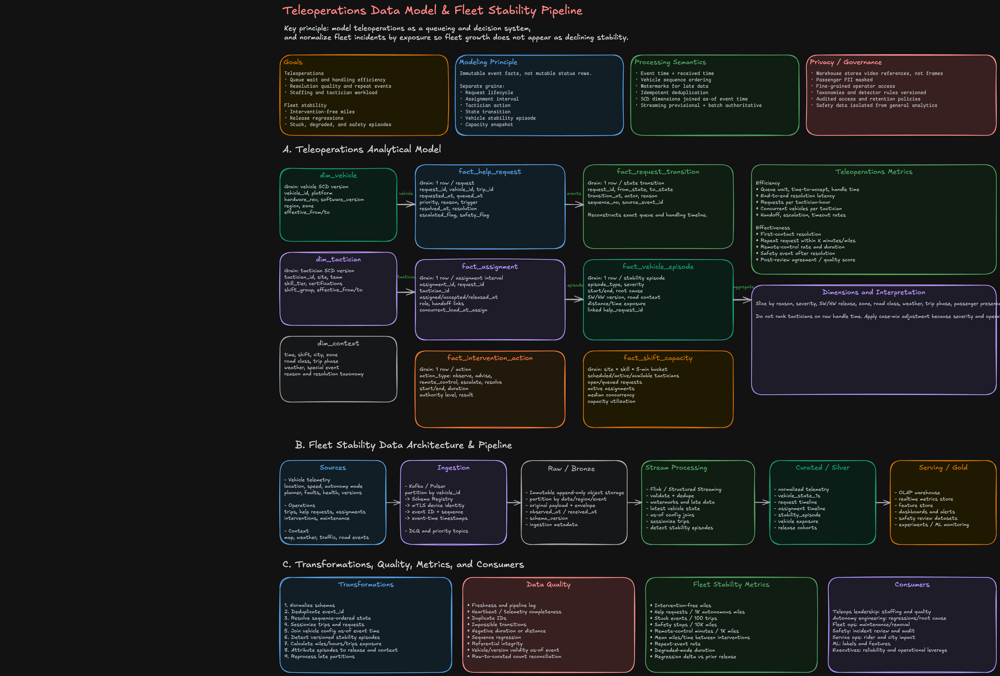
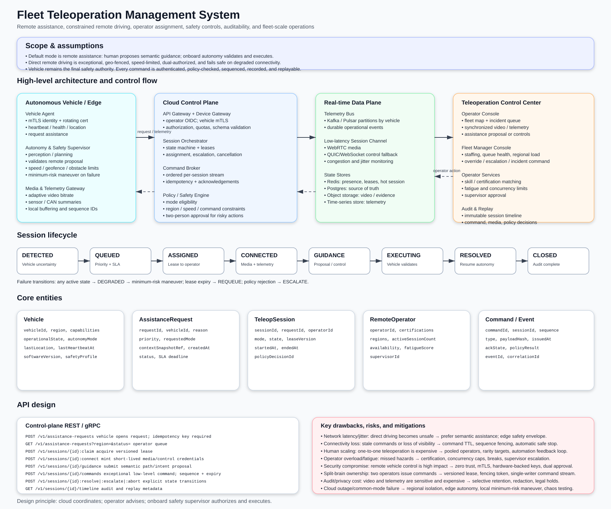

# Teleoperations System Design — Technology Deep Dive

---

## Interview Summary — What to Focus On

**The one-line framing:** Teleoperations is a **human-in-the-loop assistance system for autonomous vehicles** — the cloud advises and authorizes, the vehicle validates and executes. Everything else in the design follows from that boundary.

### The four planes (lead with this structure)

| Plane                    | Responsibility                                                                                                        | Key tech                                            |
| ------------------------ | --------------------------------------------------------------------------------------------------------------------- | --------------------------------------------------- |
| **Vehicle safety plane** | Collision avoidance, emergency braking, minimal-risk maneuvers, command validation — stays on-vehicle, never in cloud | Onboard autonomy stack                              |
| **Control plane**        | Help-request lifecycle, queue, tactician assignment, command authorization, audit trail                               | Postgres (authoritative), Redis (rebuildable index) |
| **Media plane**          | Low-latency live video, isolated from workflow/command traffic                                                        | WebRTC over mTLS                                    |
| **Event & data plane**   | Immutable telemetry, replay, stream processing, fleet-stability analytics                                             | Kafka, Flink, lakehouse + OLAP                      |

### The five decisions that earn staff-level signal

1. **Safety boundary** — network loss must never make the vehicle unsafe. Cloud recommends; vehicle validates and can reject expired/unsafe/inconsistent commands.
2. **Conditional ownership of help requests** — prevent double assignment via a conditional write (compare-and-swap on `assigned_tactician`), not a distributed lock.
3. **Idempotent vehicle commands** — every command carries a command ID + expiry; replays are deduped, stale commands are rejected on-vehicle.
4. **Media/control isolation** — video congestion must never delay a command or heartbeat; separate transport, separate scaling, separate failure domain.
5. **Exposure-normalized fleet metrics** — interventions per 1,000 miles (not raw counts), so release-over-release comparison is fair.

### Technology choices and why

| Choice                                     | Rationale                                                                                                  |
| ------------------------------------------ | ---------------------------------------------------------------------------------------------------------- |
| **WebRTC** for video                       | Sub-second glass-to-glass latency; SRT/HLS buffer too much for a human making driving decisions            |
| **gRPC / WebSocket over mTLS** for control | Persistent bidirectional channel for help requests, heartbeats, commands, ACKs                             |
| **Postgres** for workflow state            | Help-request lifecycle needs ACID + auditable transitions; volume is low (requests/sec, not telemetry/sec) |
| **Redis** for queue/index                  | Low-latency prioritization; treated as rebuildable cache, never source of truth                            |
| **Kafka** as event backbone                | Durable, replayable, partitioned by `vehicle_id` for per-vehicle ordering                                  |
| **Flink** for stream processing            | Event-time windowing with watermarks for late/out-of-order telemetry                                       |
| **Lakehouse + OLAP**                       | Historical fleet-stability analysis; separate from the operational hot path                                |

### Failure scenarios to volunteer proactively

- **Network loss** → vehicle continues approved mission, waits safely, or executes minimal-risk stop (policy + state dependent)
- **Tactician disconnects mid-session** → request returns to queue with elevated priority, session state preserved for resume
- **Redis fails** → rebuild queue from Postgres; degraded latency, not lost work
- **Kafka fails** → operational path continues (Postgres is authoritative); analytics lags and backfills on recovery
- **Video plane fails** → control plane still functional; tactician falls back to telemetry-only advice or escalates to safe stop

### Common traps

- Putting safety-critical control in the cloud (biggest red flag)
- Making Redis authoritative for assignment state
- Using raw intervention counts instead of exposure-normalized rates
- Sharing one transport for video and commands
- Forgetting command expiry — a delayed command executing late is a safety incident

---

## 1. Start with the safety boundary

The first architectural decision is not Kafka versus Pulsar or WebSocket versus gRPC. It is defining which decisions belong in the vehicle and which belong in the cloud.

### On-vehicle responsibilities

The vehicle remains responsible for:

- Collision avoidance
- Emergency braking
- Local path planning
- Obstacle handling
- Minimal-risk maneuvers
- Validation of remote commands
- Rejecting expired, unsafe, or inconsistent commands

### Cloud teleoperations responsibilities

The cloud provides:

- Help-request intake
- Queue prioritization
- Tactician assignment
- Live location and video access
- High-level advice
- Mission updates
- Remote-control authorization
- Audit history
- Operational analytics

A network failure must never cause the vehicle to become unsafe. Depending on current policy and vehicle state, the vehicle either continues the approved mission, waits safely, or performs a minimal-risk stop.

### Staff checkpoint

> I would explicitly separate the safety control loop from the teleoperations workflow. The cloud may recommend or authorize an action, but the vehicle autonomy stack validates and safely executes it.

---

## 2. Vehicle-to-cloud communication

### Choice: gRPC or WebSocket over mTLS

The vehicle needs a persistent, bidirectional connection for:

- Help requests
- Heartbeats
- Command delivery
- Command acknowledgements
- Vehicle status
- Session health

### Why gRPC streaming

- Strong Protobuf schemas
- Efficient binary serialization
- Bidirectional streaming
- Deadline and cancellation support
- Good internal service interoperability
- Easier compatibility management than custom socket messages

### Why WebSocket may still be used

WebSocket can be useful when:

- Existing vehicle gateways already support it
- Browser-compatible tooling is required
- The protocol needs to work through common network infrastructure
- Lightweight bidirectional messaging is sufficient

### Why not REST polling

Polling creates:

- Higher command latency
- Unnecessary request volume
- Synchronization problems
- Poor disconnection detection
- Thundering-herd behavior after recovery

### Reliability model

Each vehicle command should contain:

```ts
type VehicleCommand = {
  commandId: string;
  vehicleId: string;
  missionId: string;
  expectedMissionVersion: number;
  commandType: string;
  expiresAt: string;
  issuedBy: string;
  policyDecisionId: string;
};
```

The vehicle returns an acknowledgement:

```ts
type CommandAcknowledgement = {
  commandId: string;
  vehicleId: string;
  status: 'RECEIVED' | 'ACCEPTED' | 'REJECTED' | 'EXECUTING' | 'COMPLETED';
  reasonCode?: string;
  vehicleMissionVersion: number;
  acknowledgedAt: string;
};
```

Commands must be:

- Idempotent
- Versioned
- Expiring
- Auditable
- Safe to redeliver

### Staff checkpoint

> I assume at-least-once command delivery. Exactly-once network delivery is unrealistic, so command IDs and expected mission versions provide exactly-once effects.

---

## 3. Live video technology

### Choice: WebRTC with an SFU

Teleoperations video needs interactive latency. A tactician cannot safely reason about an environment using video delayed by several seconds.

### Why WebRTC

- Low-latency media transport
- Adaptive bitrate
- Congestion control
- Packet-loss handling
- NAT traversal using ICE, STUN, and TURN
- Browser support
- Encrypted media transport

### Why an SFU

An SFU forwards media streams rather than decoding and recomposing them.

#### Advantages

- Lower latency than an MCU
- Lower server compute
- Supports multiple tacticians or supervisors
- Allows selective video quality
- Enables forwarding different camera streams

#### Disadvantages

- More bandwidth than server-side composition
- Session orchestration is complex
- TURN relay costs can be high
- Large numbers of simultaneous camera feeds create capacity pressure

### Video session flow

1. Tactician is assigned a request.
2. Console requests a video-session token.
3. Authorization verifies the assignment and certification.
4. Media service creates a short-lived session.
5. Vehicle and tactician establish a WebRTC connection through the SFU.
6. TURN is used when direct connectivity fails.
7. Session metadata is recorded for audit.

The analytical warehouse should generally store:

- Session ID
- Start and end times
- Camera identifiers
- Quality metrics
- Accessing tactician
- Recording reference, when recording is permitted

It should not directly store raw video blobs.

### Why not HLS

HLS is appropriate for scalable delayed playback, but usually introduces too much latency for interactive teleoperations.

### Staff checkpoint

> I would separate media from control traffic. A video-quality degradation should not block help-request transitions or vehicle commands.

---

## 4. Help-request source of truth

### Choice: PostgreSQL

Help requests, assignments, and intervention actions require:

- Transactions
- State-transition validation
- Referential integrity
- Version checks
- Strong auditability

Example request state machine:

```text
REQUESTED
  → QUEUED
  → ASSIGNED
  → ACCEPTED
  → OBSERVING
  → ADVISING | REMOTE_CONTROL
  → ESCALATED | RESOLVED
```

### Why PostgreSQL

- Strong transactional semantics
- Conditional updates
- Constraints
- Mature operational tooling
- Reliable analytical change capture
- Good fit for request-level operational data

### Why not use Kafka as the source of truth

Kafka is an excellent event log, but it is less convenient for:

- Current request lookup
- Unique active ownership
- Referential constraints
- Transactional workflow commands
- Operator-facing reads

Kafka records what happened. PostgreSQL determines the authoritative current workflow state.

### Example conditional transition

```sql
UPDATE help_requests
SET state = 'ACCEPTED',
    assigned_tactician_id = :tactician_id,
    version = version + 1,
    accepted_at = NOW()
WHERE request_id = :request_id
  AND state = 'ASSIGNED'
  AND version = :expected_version;
```

Only one competing action succeeds.

### Transactional outbox

When the request state changes:

1. Update the request.
2. Insert an outbox event in the same transaction.
3. A publisher sends the event to Kafka.
4. Mark the outbox record as published.

This prevents the dual-write failure where the database commits but Kafka publication fails.

### Staff checkpoint

> I use the relational database for scarce-resource ownership and workflow state. Kafka distributes immutable facts after those transitions commit.

---

## 5. Queue and assignment system

### Choice: durable workflow state plus a fast scheduling index

The queue must consider more than FIFO order.

Potential assignment inputs include:

- Request severity
- Passenger presence
- Time in queue
- Vehicle state
- Tactician certification
- Current tactician load
- Language requirements
- Location or service zone
- Remote-control authorization
- Existing familiarity with the incident

### Redis role

Redis can maintain:

- Priority sorted sets
- Available tactician sets
- Active session leases
- Fast workload counts
- Short-lived assignment offers

### PostgreSQL role

PostgreSQL owns:

- Request state
- Assignment records
- Assignment acceptance
- Handoffs
- Final ownership
- Audit history

Redis is an acceleration structure, not the source of truth.

### Assignment flow

1. Request becomes `QUEUED`.
2. Scheduler calculates eligible tacticians.
3. Candidate tacticians are scored.
4. A short-lived assignment offer is created.
5. The tactician accepts.
6. PostgreSQL conditionally commits ownership.
7. Redis indexes are updated.
8. An assignment event is published.

### Push versus pull assignment

#### Push model

The scheduler assigns requests directly.

**Advantages**

- Better control of SLA
- Centralized workload balancing
- Easier priority enforcement

**Disadvantages**

- Requires accurate tactician availability
- More complicated reassignment
- Can interrupt tactician workflow

#### Pull model

Tacticians select the next request.

**Advantages**

- Simpler
- Gives operators autonomy

**Disadvantages**

- High-severity requests may wait
- Cherry-picking is possible
- Load becomes uneven

A hybrid model works well:

- Critical requests are pushed.
- Normal requests can be offered or pulled.
- Supervisors can override assignments.

### Staff checkpoint

> The assignment algorithm should optimize the system, not only the next request. I balance severity, waiting time, skill eligibility, and tactician cognitive load.

---

## 6. Tactician concurrency

A tactician may observe multiple vehicles, but remote control or a severe event may require exclusive attention.

Model workload as weighted concurrency.

| Activity                            | Workload weight |
| ----------------------------------- | --------------: |
| Passive observation                 |             0.2 |
| Active advice                       |             0.6 |
| Remote control                      |             1.0 |
| Safety escalation                   |             1.0 |
| Waiting for vehicle acknowledgement |             0.1 |

A tactician with five passive observations may still have capacity, while a tactician performing remote control should likely receive no additional assignments.

### Better metric

Do not use only:

```text
active request count
```

Use:

```text
weighted load =
Σ active assignment workload weight
```

### Staff checkpoint

> Concurrency is not binary. I would model cognitive load based on intervention type and severity rather than assuming every active vehicle consumes equal capacity.

---

## 7. Event backbone

### Choice: Kafka or Pulsar

The system produces:

- Vehicle telemetry
- Help-request events
- Assignment events
- Tactician actions
- Vehicle commands
- Command acknowledgements
- Safety events
- Video-session metadata

### Why Kafka

- High throughput
- Durable ordered partitions
- Replayability
- Strong ecosystem
- Schema-registry integration
- Mature stream-processing support

### Partition keys

| Event type             | Partition key                     |
| ---------------------- | --------------------------------- |
| Vehicle telemetry      | `vehicle_id`                      |
| Help-request lifecycle | `request_id`                      |
| Vehicle commands       | `vehicle_id`                      |
| Assignment events      | `request_id`                      |
| Tactician activity     | `tactician_id` or `assignment_id` |

Ordering is guaranteed only inside a partition.

### Separate critical topics

Do not mix high-volume telemetry with safety or control events.

Possible topics:

```text
vehicle.telemetry.high_rate
vehicle.health
vehicle.safety_events
teleop.help_requests
teleop.assignments
teleop.actions
vehicle.commands
vehicle.command_acks
```

Each category can have independent:

- Retention
- Replication
- Consumer priority
- Access policy
- Capacity reservation

### Kafka versus Pulsar

Kafka is a strong choice when:

- The organization already operates it
- Ecosystem maturity is important
- Flink and Kafka Streams are common
- Partition-based scale is acceptable

Pulsar may be preferable when:

- Very large topic counts are expected
- Compute and storage separation is valuable
- Multi-tenancy is central
- Geo-replication is a first-class requirement

### Staff checkpoint

> I would choose based on the organization’s operational maturity. The architectural requirement is a replayable, partitioned event log—not a specific vendor.

---

## 8. Stream processing

### Choice: Apache Flink

The pipeline must handle:

- Late telemetry
- Out-of-order events
- Per-vehicle state
- Request sessionization
- Assignment intervals
- Stability-episode detection
- Near-real-time metrics

### Why Flink

- Native event-time processing
- Watermarks
- Stateful operators
- Timers
- Checkpointing
- Exactly-once state updates with supported sinks
- Good fit for long-running vehicle sessions

### Example vehicle state logic

For each `vehicle_id`:

1. Maintain the highest accepted sequence number.
2. Persist every event to raw storage.
3. Update the serving state only when the event is newer.
4. Track heartbeat gaps.
5. Detect transitions into degraded or stuck states.
6. Emit stability episodes.

### Watermarks

Suppose most telemetry arrives within 10 seconds, but mobile connectivity may delay events for several minutes.

Use two concepts:

- A short operational watermark for live dashboards.
- A longer analytical correction window for final metrics.

A dashboard can mark results as provisional.

### Why not only Spark batch

Spark is excellent for historical recomputation, but batch-only processing cannot support:

- Live fleet monitoring
- Immediate stuck-event detection
- Queue SLA alerts
- Release regression alerts

Use Flink for continuous processing and Spark or SQL engines for backfills and heavy recomputation.

### Staff checkpoint

> Streaming results are provisional. I would recompute authoritative daily facts from the immutable raw layer so late data and detector changes do not permanently corrupt metrics.

---

## 9. Operational serving stores

### Choice: Redis for current state

Use Redis for:

- Latest vehicle position
- Heartbeat leases
- Active tactician sessions
- Queue indexes
- Assignment offers
- Short-lived map data

#### Advantages

- Very low latency
- TTL support
- Sorted sets
- Atomic operations
- Good fit for ephemeral state

#### Risks

- Memory cost
- Hot keys
- Failover consistency
- Accidental use as the system of record

Mitigations:

- Partition by region or vehicle
- Use TTLs
- Maintain rebuildable indexes
- Persist authoritative state elsewhere
- Track cache freshness

### Choice: ClickHouse or Pinot for operational analytics

Use an OLAP serving store for:

- Current queue dashboards
- SLA percentiles
- Request counts by zone
- Tactician workload
- Stability events by software release

#### ClickHouse advantages

- Fast analytical SQL
- Strong compression
- High ingest rate
- Flexible query patterns

#### ClickHouse disadvantages

- Operational tuning
- Updates require care
- Distributed joins can be expensive

#### Pinot advantages

- Very low-latency realtime aggregation
- Good event-stream integration
- Strong dashboard use case

#### Pinot disadvantages

- More constrained analytical model
- Operational complexity
- Less flexible than a general warehouse

### Staff checkpoint

> Redis serves current operational state. ClickHouse or Pinot serves aggregated operational questions. Neither should replace the transactional workflow database.

---

## 10. Analytical storage

### Choice: object storage plus Iceberg or Delta Lake

The raw layer contains immutable events in object storage.

The curated layer contains:

- Request facts
- Assignment facts
- Action facts
- State-transition facts
- Vehicle-stability episodes
- Exposure tables
- Release cohorts

### Why a lakehouse table format

- Schema evolution
- Partition pruning
- ACID table operations
- Time travel
- Upserts
- Reprocessing
- Support for multiple compute engines

### Iceberg versus Delta Lake

Iceberg is attractive when:

- Multiple engines are used
- Open ecosystem interoperability matters
- Hidden partitioning is valuable

Delta Lake is attractive when:

- The platform is Databricks-heavy
- Deep Spark integration is important
- Operational simplicity inside that ecosystem matters

### Why Snowflake may still be used

Snowflake is suitable for:

- Business intelligence
- Ad hoc analysis
- Governed semantic models
- Executive reporting
- Cross-domain joins

The lakehouse can hold detailed operational history, while Snowflake holds modeled or aggregated analytical datasets.

### Staff checkpoint

> I would not copy every high-frequency telemetry point into the warehouse. I retain raw telemetry in cost-efficient object storage and publish downsampled states, episodes, and exposure facts for analytics.

---

## 11. Teleoperations data model choices

### Keep separate fact grains

Do not build one giant `teleoperations_events` table and force every metric to derive from it.

### `fact_help_request`

One row per request.

Good for:

- Request counts
- Final outcome
- Overall latency
- Repeat-request analysis

### `fact_request_state_transition`

One row per transition.

Good for:

- Queue timing
- Workflow reconstruction
- State-machine validation
- Audit

### `fact_assignment`

One row per assignment interval.

Good for:

- Tactician ownership
- Handoffs
- Concurrency
- Assignment duration

### `fact_intervention_action`

One row per tactician action.

Good for:

- Observation duration
- Advice frequency
- Remote-control time
- Escalation patterns

### `fact_shift_capacity`

One row per site, skill tier, and time bucket.

Good for:

- Staffing
- Queueing analysis
- Utilization
- Capacity planning

### Staff checkpoint

> Different business processes have different grains. Separating them prevents double counting and allows queue, workload, and intervention metrics to evolve independently.

---

## 12. Fleet stability metrics

Raw help-request counts are misleading because fleet exposure changes.

Normalize using:

- Autonomous miles
- Autonomous hours
- Trips
- Passenger miles
- Empty miles
- Operational vehicle hours

Examples:

```text
help_requests_per_1k_miles =
help_requests / autonomous_miles × 1,000
```

```text
remote_control_minutes_per_1k_miles =
remote_control_minutes / autonomous_miles × 1,000
```

```text
mean_distance_between_interventions =
autonomous_miles / intervention_count
```

Important metrics:

- Intervention-free miles
- Stuck events per 100 trips
- Safety stops per 10,000 miles
- Remote-control minutes per 1,000 miles
- Repeat help requests
- Fleet unavailable minutes
- Passenger-impacting intervention rate
- Stability by software and hardware version

### Staff checkpoint

> The numerator is the incident. The denominator is exposure. Without exposure normalization, fleet growth appears to reduce stability even when reliability improves.

---

## 13. Software-release attribution

A help request occurring after a release does not automatically mean the release caused it.

Control for:

- Vehicle hardware
- City and service zone
- Road class
- Weather
- Traffic
- Vehicle age
- Maintenance state
- Passenger versus empty trip
- Time of day
- Exposure volume

Use:

- Matched cohorts
- Phased rollouts
- Canary fleets
- Difference-in-differences
- Confidence intervals
- Severity-weighted event rates

### Staff checkpoint

> I would separate correlation dashboards from release-go/no-go decisions. Release attribution should control for cohort and environmental differences.

---

## 14. Failure scenarios

### Kafka unavailable

- Operational workflow continues through PostgreSQL.
- Transactional outbox accumulates events.
- Publisher catches up after recovery.
- Dashboards may be stale, but request handling continues.

### Redis unavailable

- Rebuild queue and current-state indexes from PostgreSQL and Kafka.
- Fall back to slower database queries.
- Reduce assignment throughput if necessary.
- Preserve high-priority request handling.

### Video unavailable

- Continue audio, telemetry, and map access.
- Tactician may advise based on other sensors if policy permits.
- Remote control may be disabled.
- Escalate or request minimal-risk behavior.

### Tactician disconnects

- Assignment lease expires.
- Request returns to the queue.
- Command privileges are revoked.
- Another qualified tactician is assigned.
- Complete audit history remains available.

### Vehicle disconnects

- Mark vehicle state stale.
- Stop issuing commands.
- The vehicle follows local safety policy.
- Notify the tactician and supervisor.
- Reconcile mission version after reconnect.

### Duplicate command

- Vehicle recognizes `commandId`.
- It returns the prior result.
- The physical action is not repeated.

### Out-of-order telemetry

- Raw history accepts the event.
- Latest-state cache changes only for a higher sequence number.
- Analytical processing may revise historical episodes.

---

## 15. Staff-level discussion checklist

### Product and operations

- What triggers a help request?
- What actions can a tactician perform?
- Can one request have multiple tacticians?
- Can one tactician handle multiple vehicles?
- How are high-severity requests prioritized?
- What is the expected staffing ratio?

### Safety

- Which decisions stay on the vehicle?
- Can the vehicle reject a remote command?
- What happens during network loss?
- Who can authorize remote control?
- How is every intervention audited?

### Consistency

- Which state requires strong consistency?
- How is double assignment prevented?
- How are command duplicates handled?
- How do request and event publication remain consistent?
- How are assignment races resolved?

### Realtime communication

- Why WebRTC for video?
- Why gRPC or WebSocket for commands?
- How are sessions authenticated?
- How are reconnect and resume handled?
- How are media and control traffic isolated?

### Data platform

- What are the event partition keys?
- How are late and out-of-order events handled?
- Which layer is authoritative?
- How are facts rebuilt?
- Which metrics are provisional versus final?

### Scale

- How many active vehicles?
- Telemetry events per second?
- Simultaneous video sessions?
- Help requests per second?
- Tactician concurrency?
- How are regions isolated?

### Analytics

- What is each table’s grain?
- How are handoffs represented?
- How is tactician workload measured?
- How are incidents normalized by exposure?
- How are software releases compared fairly?

### Reliability

- What happens when Kafka fails?
- What happens when Redis fails?
- What happens when the video plane fails?
- What happens when a tactician disconnects?
- What happens when a vehicle disconnects?

---

## 16. Recommended interview presentation order

1. Safety boundary
2. Help-request lifecycle
3. Queue and tactician assignment
4. Video and vehicle communication
5. Consistency and command idempotency
6. Event and analytics pipeline
7. Fleet stability metrics
8. Failure scenarios
9. Tradeoffs and future evolution

---

## 17. Strong closing statement

> I divide the system into four planes.
>
> The **control plane** manages help requests, assignments, command authorization, and auditable state transitions.
>
> The **media plane** provides low-latency WebRTC video and is isolated from workflow and command processing.
>
> The **event and data plane** captures immutable telemetry and operational events for replay, stream processing, and fleet-stability analytics.
>
> The **vehicle safety plane** remains on the robotaxi and validates or rejects cloud instructions.
>
> I use PostgreSQL for authoritative workflow state, Redis for rebuildable low-latency indexes, Kafka for durable event distribution, Flink for event-time processing, WebRTC for live video, and a lakehouse plus OLAP serving layer for historical and operational analytics.
>
> The most important design decisions are the safety boundary, conditional ownership of requests, idempotent vehicle commands, media/control isolation, and exposure-normalized fleet reliability metrics.
