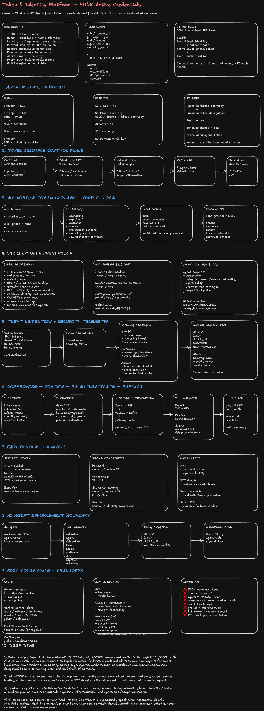

# Token & Identity Platform — Humans, Pipelines, and AI Agents

## 0. Interview framing

We need an authentication and authorization platform that can safely support roughly **500K active credentials/tokens** while clearly distinguishing:

```text
HUMAN
PIPELINE / WORKLOAD
AI AGENT
```

The design must:

```text
1. Authenticate the principal before issuing credentials.
2. Issue least-privilege, audience-bound, short-lived tokens.
3. Avoid long-lived static bearer tokens wherever possible.
4. Prevent stolen tokens from being replayed.
5. Detect suspicious token use quickly.
6. Revoke compromised access.
7. Require fresh authentication / workload attestation before issuing replacement credentials.
8. Preserve an auditable delegation chain for agents acting for users.
```

This is primarily an **identity, token, authorization, and security telemetry platform**.

---

# 1. Clarifying questions

```text
Scale
- Does "500K tokens" mean concurrently active or total registered credentials?
- Peak issuance / refresh QPS?
- Peak API authorization QPS?
- Number of tenants / services / regions?

Humans
- Existing enterprise SSO / OIDC?
- MFA / WebAuthn available?
- Browser, CLI, and native clients?

Pipelines
- Kubernetes, VM, GitHub Actions, Jenkins, cloud CI?
- Can workloads obtain federated identity instead of stored secrets?

Agents
- Are agents autonomous workloads or always delegated by a human?
- Can an agent call external tools?
- Is human approval required for high-risk actions?

Security
- Maximum acceptable stolen-token exposure?
- How quickly must emergency revocation propagate?
- Required audit retention?
```

---

# 2. Working assumptions

```text
~500K concurrently active access tokens
Millions of API authorization checks/day or more
Multi-region
Access token TTL: usually 5–15 minutes
Refresh/grant/session state is server-side
Emergency revocation propagation target: seconds
```

Do **not** interpret 500K active tokens as a reason to create 500K long-lived API secrets.

The safer architecture is:

```text
long-lived identity
      ↓ authenticate
short-lived credential
      ↓
short-lived scoped access token
```

---

# 3. Principal model

Every credential and token carries an explicit principal type.

```ts
type PrincipalType = 'HUMAN' | 'PIPELINE' | 'AI_AGENT';

type Principal = {
  principalId: string;
  principalType: PrincipalType;
  tenantId: string;

  status: 'ACTIVE' | 'SUSPENDED' | 'COMPROMISED';

  // Increment to invalidate all previously issued tokens.
  securityEpoch: number;

  createdAt: string;
};
```

Never infer identity type from naming convention such as:

```text
"ci-*"
"bot-*"
"agent-*"
```

It must be a first-class signed authorization claim.

---

# 4. Token claims

Example access-token claims:

```ts
type AccessTokenClaims = {
  iss: string;
  sub: string; // principal ID
  aud: string[]; // permitted target services
  exp: number;
  iat: number;
  nbf?: number;

  jti: string; // unique token ID

  tenant_id: string;
  principal_type: 'HUMAN' | 'PIPELINE' | 'AI_AGENT';

  scopes: string[];

  // Token invalid when older than principal.securityEpoch.
  security_epoch: number;

  // Sender-constrained token.
  cnf?: {
    jkt?: string; // DPoP key thumbprint
    'x5t#S256'?: string; // mTLS certificate thumbprint
  };

  // Agent delegation.
  actor_id?: string;
  on_behalf_of?: string;
  delegation_id?: string;
  task_id?: string;

  // Useful for authorization policy.
  auth_context?: string[];
};
```

Important principle:

```text
Authentication:
"Who are you?"

Authorization:
"What may this identity do?"

Delegation:
"Who is this agent acting for, for what task, and with what authority?"
```

---

# 5. Identity-specific authentication

## HUMAN

Preferred flow:

```text
Browser / CLI
  ↓
Enterprise IdP / OIDC
  ↓
MFA / WebAuthn / passkey when required
  ↓
Authorization Code + PKCE
  ↓
Token Service
```

For browsers, prefer:

```text
Browser
  ↓
BFF
  ↓
OAuth tokens

Browser stores:
Secure + HttpOnly + SameSite session cookie

Avoid:
long-lived bearer access token in localStorage
```

Human access token:

```text
TTL: short
Scope: user role + requested resource
Audience: specific APIs
Optional DPoP binding
```

---

## PIPELINE / WORKLOAD

Do not distribute static API keys to 100K CI jobs.

Preferred:

```text
CI runner / Kubernetes workload / VM
           ↓
platform identity / OIDC / SPIFFE identity
           ↓
attestation
           ↓
Security Token Service (STS)
           ↓
short-lived workload access token
```

Examples of useful identity attributes:

```text
repo
branch
workflow
environment
cluster
namespace
service account
runner identity
deployment
```

Policy can say:

```text
repo=payments
workflow=deploy-prod
environment=production

may receive:

deploy:payments
aud=deployment-api
TTL=5m
```

No permanent secret needs to live in the pipeline configuration.

---

## AI AGENT

An agent must have its **own workload identity**.

Do not pretend the agent is the human.

Use:

```text
Human identity
      +
Agent workload identity
      +
Task / delegation grant
      ↓
Token Exchange / STS
      ↓
Agent delegated access token
```

Result:

```text
sub             = agent identity
principal_type  = AI_AGENT
actor_id        = agent identity
on_behalf_of    = human identity
delegation_id   = delegation record
task_id         = current task
scopes          = attenuated subset
aud             = target tool/API
```

This provides:

```text
who initiated the task
which agent executed it
which tools were permitted
what authority was delegated
```

---

# 6. High-level architecture

```text
                         ┌──────────────────┐
Human ─────────────────► │ Enterprise IdP   │
                         │ OIDC + MFA       │
                         └────────┬─────────┘
                                  │
Pipeline ── Workload Identity ────┤
                                  │
Agent ───── Workload Identity ────┤
                                  ▼
                      ┌─────────────────────┐
                      │ Identity / STS      │
                      │ Token Service       │
                      └─────────┬───────────┘
                                │
                         policy evaluation
                                ▼
                    ┌────────────────────────┐
                    │ Authorization Policy   │
                    │ RBAC + ABAC + scopes  │
                    └──────────┬─────────────┘
                               │
                        short-lived token
                               ▼
                 ┌────────────────────────────┐
                 │ API Gateway / Resource API │
                 │ signature + aud + exp      │
                 │ cnf + epoch + policy       │
                 └────────────┬───────────────┘
                              │
                     auth telemetry events
                              ▼
             ┌────────────────────────────────┐
             │ Risk / Detection / SIEM        │
             │ anomaly + replay detection     │
             └───────────────┬────────────────┘
                             │
                       compromise event
                             ▼
                  ┌──────────────────────┐
                  │ Revocation Service   │
                  │ session / family /   │
                  │ epoch invalidation   │
                  └──────────────────────┘
```

---

# 7. Token issuance flow

## Common path

```text
1. Authenticate identity.
2. Determine principal type.
3. Load authorization policy.
4. Determine requested audience + scopes.
5. Attenuate privilege.
6. Bind token to sender when possible.
7. Sign short-lived access token.
8. Record grant/session metadata.
9. Emit issuance audit event.
```

Pseudo-code:

```ts
async function issueAccessToken(authentication: VerifiedAuthentication, request: TokenRequest) {
  const principal = await principalStore.get(authentication.principalId);

  if (principal.status !== 'ACTIVE') {
    throw new Error('principal_not_active');
  }

  const grant = await policyEngine.authorize({
    principal,
    requestedScopes: request.scopes,
    audience: request.audience,
    delegation: request.delegation,
  });

  const claims = {
    sub: principal.principalId,
    principal_type: principal.principalType,
    tenant_id: principal.tenantId,
    scopes: grant.scopes,
    aud: grant.audience,

    security_epoch: principal.securityEpoch,

    jti: crypto.randomUUID(),
    iat: now(),
    exp: now() + grant.ttlSeconds,

    cnf: authentication.proofOfPossession,

    ...grant.delegationClaims,
  };

  return signer.sign(claims);
}
```

---

# 8. Why short-lived tokens matter

Assume bearer token A is stolen at:

```text
13:00
```

With a 24-hour token:

```text
potential replay window ≈ 24 hours
```

With a 10-minute token:

```text
potential replay window ≤ ~10 minutes
```

Then add:

```text
sender binding
+ anomaly detection
+ emergency revocation
```

to reduce the practical exposure further.

---

# 9. Prevent stolen-token replay

Defense in depth:

```text
1. Short access-token TTL.
2. Narrow audience.
3. Least-privilege scopes.
4. Sender-constrained tokens.
5. Secure browser token handling.
6. Workload identity instead of static secrets.
7. Refresh-token rotation.
8. Secrets never written to logs.
9. KMS/HSM-backed signing keys.
10. Key rotation + JWKS caching.
```

---

# 10. Sender-constrained tokens

A normal bearer token means:

```text
whoever possesses token → can use token
```

Sender-constrained token:

```text
token
  +
proof that caller owns specific private key/certificate
```

Two common mechanisms:

```text
DPoP
or
mTLS certificate-bound access tokens
```

Resource server validates:

```text
token signature
exp / nbf
aud
scope
security_epoch
cnf binding
proof signature / certificate
```

So merely stealing the access-token string is insufficient.

---

# 11. Human browser token storage

Prefer:

```text
Browser
  |
  | Secure + HttpOnly cookie
  v
BFF
  |
  | access token
  v
Backend APIs
```

Benefits:

```text
JavaScript cannot directly read HttpOnly cookie
token remains server-side
centralized refresh/revocation
reduced XSS token exfiltration surface
```

Still protect against:

```text
CSRF
session fixation
XSS
cookie theft
```

---

# 12. Pipeline credential security

Bad:

```yaml
env:
  API_TOKEN: 'long-lived-secret'
```

Better:

```text
CI runner
   ↓
obtain signed workload identity
   ↓
STS exchange
   ↓
5-minute deployment token
```

Policy may bind token issuance to:

```text
repository
workflow SHA
branch
environment
runner pool
cloud account
namespace
```

A stolen token from one job should not become a reusable organization-wide secret.

---

# 13. AI-agent privilege attenuation

Suppose the human can:

```text
read:any-project
write:project-A
delete:project-A
billing:update
```

The agent task only needs:

```text
read:project-A
write:draft:project-A
```

Issue only:

```text
agent token scopes =
intersection(
  human delegated authority,
  agent's own policy,
  task-required scopes,
  target-tool policy
)
```

Never:

```text
agent gets all scopes of delegating human
```

---

# 14. High-risk agent actions

Policy can require step-up approval.

Example:

```text
Agent wants:
production:deploy

Policy:
requires fresh human WebAuthn approval
within last 5 minutes
```

Flow:

```text
Agent request
   ↓
Policy engine says STEP_UP_REQUIRED
   ↓
Human authenticates / approves
   ↓
one-time or very-short-lived capability issued
   ↓
agent executes exact approved action
```

---

# 15. Token state model

Do not store 500K raw access-token strings.

Store:

```ts
type GrantRecord = {
  grantId: string;
  principalId: string;
  principalType: PrincipalType;

  refreshFamilyId?: string;

  status: 'ACTIVE' | 'REVOKED' | 'COMPROMISED';

  createdAt: string;
  expiresAt: string;
};

type PrincipalSecurityState = {
  principalId: string;
  securityEpoch: number;
  status: 'ACTIVE' | 'SUSPENDED' | 'COMPROMISED';
};
```

JWT access tokens can be verified locally.

Stateful data is primarily:

```text
principal
grant/session
refresh-token family
security epoch
compromise/revocation state
audit events
```

---

# 16. Refresh-token rotation

For humans or approved long-lived clients:

```text
refresh-1
   ↓ use
access token + refresh-2

refresh-2
   ↓ use
access token + refresh-3
```

If `refresh-1` is seen again after it was consumed:

```text
possible token theft / replay
```

Response:

```text
revoke entire refresh-token family
require fresh authentication
```

Never store raw refresh tokens server-side.

Store:

```text
hash(refresh_token)
family_id
status
rotation_counter
```

---

# 17. Detecting stolen credentials

Every authorization event emits metadata such as:

```ts
type AuthEvent = {
  timestamp: string;

  jti: string;
  principalId: string;
  principalType: PrincipalType;
  tenantId: string;

  audience: string;
  scopes: string[];

  sourceIp?: string;
  deviceId?: string;
  workloadId?: string;
  clusterId?: string;

  dpopThumbprint?: string;
  certThumbprint?: string;

  result: 'ALLOW' | 'DENY';
  reason?: string;
};
```

Do not include the raw access token.

---

# 18. Detection signals by principal type

## HUMAN

```text
new device + unusual location
impossible travel
sudden ASN / IP change
DPoP key mismatch
refresh-token reuse
access pattern far outside baseline
privileged API burst
```

## PIPELINE

```text
token used outside expected repo/workflow
token used outside allowed cluster/cloud account
unexpected environment
new certificate/key
production action from dev runner
token appears after workflow ended
```

## AI AGENT

```text
tool call outside allowlist
scope escalation attempt
high-risk API sequence
unexpected target tenant
unexpected task_id
calls after task expiration
dramatic call-volume / spend increase
attempt to bypass approval gate
```

---

# 19. Detection architecture

```text
API Gateways
Token Service
Policy Engine
CI Identity
Agent Tool Gateway
       │
       │ security events
       ▼
Kafka / Event Bus
       │
       ├────► Streaming Rules
       │       replay
       │       cnf mismatch
       │       rate anomaly
       │
       ├────► Risk Engine
       │       user/workload baseline
       │
       └────► SIEM / Audit Lake
               investigation
               compliance
```

Critical signals should not wait for an offline batch.

---

# 20. Compromise response

When token theft is suspected:

```text
1. Block the specific JTI immediately.
2. Revoke grant / refresh-token family.
3. Increment principal securityEpoch if broader compromise suspected.
4. Publish invalidation event globally.
5. API gateways update emergency revocation cache.
6. Suspend high-risk capabilities.
7. Alert security + identity owner.
8. Require fresh authentication / attestation.
9. Only after successful auth, issue a replacement credential.
```

---

# 21. Security epoch

This is useful for fast invalidation.

Principal:

```json
{
  "principalId": "human-42",
  "securityEpoch": 18
}
```

Existing token:

```json
{
  "sub": "human-42",
  "security_epoch": 17
}
```

Gateway compares:

```ts
if (token.security_epoch < currentSecurityEpoch) {
  deny('token_revoked');
}
```

Compromise:

```text
securityEpoch: 17 → 18
```

All older tokens become invalid.

This avoids storing every access token in a central revocation table forever.

---

# 22. How gateways learn new security epochs

Do not query the database on every API request.

Use:

```text
Security State DB
      │
      ├── cache
      │
      └── invalidation event
             ↓
       Kafka / PubSub
             ↓
      API gateway caches
```

Normal request:

```text
JWT verification = local
epoch lookup      = local cache
```

On emergency revocation:

```text
publish security_state_changed event
→ update gateway cache in seconds
```

---

# 23. Specific JTI emergency denylist

For a single compromised token:

```text
jti → revoked until token.exp
```

Store in fast distributed cache:

```text
Redis / equivalent
```

TTL:

```text
token.exp - now
```

The denylist remains bounded because entries disappear when the original token would have expired anyway.

Use:

```text
JTI denylist
```

for narrow revocation.

Use:

```text
securityEpoch bump
```

for broader principal/session compromise.

---

# 24. Recovery MUST require fresh authentication

This is the critical requirement.

Bad recovery:

```text
stolen token
  ↓
POST /rotate
  ↓
new token
```

The attacker who stole the credential can now rotate it too.

Correct:

```text
compromise detected
      ↓
old token blocked
      ↓
fresh identity verification
      ↓
new credential issued
```

---

# 25. Recovery by identity type

## HUMAN

Require:

```text
fresh OIDC login
+ MFA/WebAuthn for elevated recovery
```

The compromised access token is not sufficient proof.

Flow:

```text
Alert
  ↓
user starts recovery
  ↓
IdP authentication
  ↓
step-up factor
  ↓
revoke old session/refresh family
  ↓
new session
```

---

## PIPELINE

Require **fresh workload attestation**:

```text
runner/workload
  ↓
cloud/Kubernetes/SPIFFE identity
  ↓
STS verifies workload
  ↓
old credential revoked
  ↓
new short-lived token
```

Do not email an API token or ask an operator to paste a new permanent secret into CI.

---

## AI AGENT

Require:

```text
fresh agent workload identity
+
valid delegation/task
+
fresh human approval if policy requires it
```

A compromised agent token alone cannot bootstrap another agent token.

---

# 26. Recovery API

```http
POST /v1/security/recover
```

The endpoint requires a **fresh-authentication context**, not the compromised token.

Conceptually:

```ts
async function recoverCredential(freshAuth: FreshAuthentication, incidentId: string) {
  const incident = await incidents.get(incidentId);

  assertFresh(freshAuth);
  assertMatchesPrincipal(freshAuth, incident.principalId);

  await revokeCompromisedGrant(incident.grantId);
  await bumpSecurityEpoch(incident.principalId);

  return issueReplacementCredential({
    authentication: freshAuth,
    reason: 'SECURITY_RECOVERY',
  });
}
```

---

# 27. APIs

## Human auth

```http
GET /oauth/authorize
POST /oauth/token
POST /oauth/revoke
```

## Workload / agent exchange

```http
POST /v1/token/exchange
```

Example:

```json
{
  "subjectToken": "<workload-identity>",
  "audience": "deployment-api",
  "requestedScopes": ["deploy:payments"]
}
```

## Agent delegation

```http
POST /v1/delegations
```

```json
{
  "agentId": "agent-research-7",
  "taskId": "task-991",
  "audience": "docs-api",
  "scopes": ["docs:read", "draft:write"],
  "expiresInSeconds": 600
}
```

## Security

```http
POST /v1/tokens/revoke
POST /v1/security/incidents
POST /v1/security/recover
GET  /v1/security/events
```

---

# 28. Authorization

Use both:

```text
RBAC
+
ABAC
```

RBAC example:

```text
HUMAN / admin
PIPELINE / deployment-worker
AI_AGENT / support-agent
```

ABAC adds:

```text
tenant
resource owner
environment
repo
branch
cluster
task
risk level
approval context
time
device/workload attestation
```

Example policy:

```text
ALLOW when:

principal_type == PIPELINE
AND repo == "payments"
AND workflow == "deploy"
AND environment == "prod"
AND audience == "deployment-api"
AND scope == "deploy:payments"
```

---

# 29. Authorization flow at API gateway

```ts
function authorize(token: AccessTokenClaims, request: RequestContext, state: CachedSecurityState) {
  verifySignature(token);

  assertNotExpired(token);
  assertAudience(token, request.service);
  assertScopes(token, request.requiredScopes);

  if (token.security_epoch < state.securityEpoch) {
    throw new Error('revoked');
  }

  if (state.revokedJtis.has(token.jti)) {
    throw new Error('revoked');
  }

  verifySenderConstraint(token, request);

  return policyEngine.evaluate({
    token,
    resource: request.resource,
    action: request.action,
  });
}
```

---

# 30. Data stores

## Principal / grant store

Strongly consistent relational or distributed KV store.

Contains:

```text
principal
principal type
tenant
status
security epoch
delegation
refresh family
credential metadata
```

## Token access verification

Do not require central DB lookup for every request.

Use:

```text
signed short-lived token
+
local JWKS
+
local security cache
```

## Audit / security events

Append-only stream + warehouse/object store.

Contains:

```text
issuance
exchange
authorization decision
revoke
recovery
policy changes
admin actions
```

Never log:

```text
raw access token
raw refresh token
private key
```

---

# 31. Key management

Signing keys:

```text
HSM / managed KMS
```

Token service:

```text
signing operation
      ↓
KMS/HSM
```

Publish public keys:

```text
JWKS
```

Resource services cache public keys.

Support:

```text
key ID (kid)
overlapping old/new public keys
safe rotation window
emergency key rollover
```

---

# 32. Scaling to ~500K active tokens

The key design choice:

```text
Do not centralize every authorization check.
```

Otherwise:

```text
API request
  ↓
token introspection service
```

can become a fleet-wide bottleneck.

Prefer:

```text
API request
   ↓
local signature verification
local audience/scope validation
local revocation/epoch cache
   ↓
policy
```

Control-plane operations:

```text
token issuance
refresh
exchange
revocation
policy changes
```

are centralized or partitioned.

Data-plane authorization stays mostly local.

---

# 33. Token service partitioning

Partition metadata by:

```text
tenantId
or
hash(principalId)
```

Do not partition by token ID alone if most operational actions are by:

```text
principal
tenant
grant
```

Cache:

```text
JWKS
principal security epoch
policy snapshot/version
JTI emergency denylist
```

---

# 34. Multi-region

Architecture:

```text
Region A token endpoints
Region B token endpoints
Region C token endpoints
         │
         ▼
global signing / delegated regional signing
         │
         ▼
replicated principal/security state
```

Emergency revocation:

```text
compromise detected in region A
        ↓
global invalidation topic
        ↓
A / B / C gateway caches update
```

Design for:

```text
eventual normal replication
fast-path security invalidation
```

---

# 35. Availability vs revocation tradeoff

Self-contained JWT:

```text
+ local validation
+ very high availability
- difficult immediate revocation
```

Opaque token + introspection:

```text
+ immediate central revocation
+ central policy
- network hop
- central dependency
```

Recommended hybrid:

```text
short-lived signed access tokens
+ refresh/grant state centrally
+ emergency JTI denylist
+ principal security epoch
+ invalidation events
```

---

# 36. Security-event severity

Example:

```text
SEV-1
private signing key suspected compromised
large-scale token replay
cross-tenant authorization failure

SEV-2
refresh-token reuse
human impossible travel + privileged action
pipeline token from wrong runtime
agent bypassing approval gate

SEV-3
unusual but successfully sender-bound behavior
repeated authorization denial
```

---

# 37. Alert + automated containment

Example:

```text
Risk engine detects refresh-token reuse
        ↓
mark family COMPROMISED
        ↓
revoke refresh family
        ↓
bump session/principal epoch
        ↓
publish invalidation
        ↓
gateways deny old access tokens
        ↓
notify human/security owner
        ↓
fresh auth required
```

For automation, distinguish:

```text
detect
contain
recover
```

Do not automatically issue replacement credentials as part of containment.

---

# 38. Audit trail for agents

Every high-value agent action should be reconstructable.

Audit:

```text
human initiator
agent identity
delegation ID
task ID
prompt/request reference
tool invoked
resource
scope
policy decision
approval ID
token JTI
result
timestamp
```

The goal is:

```text
"Agent X deployed service Y"
```

is insufficient.

Need:

```text
"Agent X, acting for Human H under Delegation D and Approval A,
used scope deploy:Y to call deployment-api at time T."
```

---

# 39. Agent tool gateway

For sensitive systems, do not give agents arbitrary direct network access.

Use:

```text
Agent
  ↓
Tool Gateway
  ↓
Policy + approval
  ↓
Downstream API
```

Tool Gateway validates:

```text
agent identity
delegation
task
scope
target
risk level
approval
rate/cost limit
```

This becomes a strong enforcement and audit boundary.

---

# 40. Threat model

## Token copied from logs

Mitigation:

```text
redaction
structured secret scanners
never log Authorization header
short TTL
sender binding
```

## Human browser XSS

Mitigation:

```text
BFF
HttpOnly cookie
CSP
short sessions
step-up auth
```

## Pipeline secret leaked in repository

Mitigation:

```text
no static secret
workload identity federation
short-lived STS exchange
secret scanner for legacy credentials
```

## Agent token leaked through tool/plugin

Mitigation:

```text
per-tool audiences
very narrow scope
short TTL
tool gateway
sender binding
```

## Signing key compromised

Mitigation:

```text
KMS/HSM
restricted signing API
kid rotation
emergency JWKS rollover
invalidate affected token generations
```

---

# 41. Standards-oriented choices

Use modern OAuth security principles:

```text
Authorization Code + PKCE for interactive clients
short-lived access tokens
sender-constrained tokens where feasible
asymmetric client/workload authentication
token exchange for delegation
```

Useful standards:

```text
RFC 9700 — OAuth 2.0 Security Best Current Practice
RFC 9449 — DPoP
RFC 8705 — OAuth mutual-TLS / certificate-bound tokens
RFC 8693 — OAuth 2.0 Token Exchange
NIST SP 800-207 / 800-207A — Zero Trust architecture guidance
SPIFFE/SPIRE — workload identity pattern
```

---

# 42. Staff-level tradeoffs

## JWT vs opaque tokens

| Choice | Benefits                                   | Costs                         |
| ------ | ------------------------------------------ | ----------------------------- |
| JWT    | local verification, low latency, resilient | harder instant revoke         |
| Opaque | immediate central state/policy             | introspection dependency      |
| Hybrid | performance + emergency revoke             | more control-plane complexity |

Choose:

```text
short-lived JWT + centrally managed grants + fast emergency invalidation
```

---

## One token type for everything?

No.

Use common envelope semantics, but different authentication roots.

```text
Human
root of trust = IdP + user authentication

Pipeline
root of trust = workload/cloud/CI attestation

AI Agent
root of trust = workload identity + delegation/task authority
```

The token format can be similar while issuance policy differs.

---

# 43. What I would NOT do

```text
❌ 500K permanent API keys
❌ one shared CI secret
❌ let AI agent impersonate a human invisibly
❌ 24-hour bearer tokens for privileged APIs
❌ store browser bearer token in localStorage by default
❌ log Authorization headers
❌ rely only on JWT expiration for emergency response
❌ allow compromised token to rotate itself
❌ use prompt instructions as agent authorization
❌ query central DB for every API request
```

---

# 44. Interview deep dives

## Q: Why distinguish HUMAN, PIPELINE, and AI_AGENT?

Because the trust roots and risk models differ.

```text
Human:
interactive authentication, MFA, device/user risk

Pipeline:
non-human workload attestation, repo/workflow/environment

Agent:
non-human workload identity + delegated authority + task context
```

Treating them all as `"service-account"` destroys useful policy and audit context.

---

## Q: Why not just use a 5-minute JWT and forget revocation?

Because five minutes may still be unacceptable for:

```text
production deletion
payment
cross-tenant access
admin operations
```

Emergency revocation gives us:

```text
JTI denylist
security epoch
invalidation events
```

while keeping normal authorization local.

---

## Q: How do you rotate a stolen token?

You do **not** trust the stolen credential to authorize its own replacement.

Require:

```text
human → fresh IdP + MFA/WebAuthn
pipeline → fresh workload attestation
agent → fresh workload identity + valid delegation/approval
```

Then revoke old grants and issue new credentials.

---

## Q: What if revocation event propagation is delayed?

Defense in depth:

```text
short TTL
sender binding
local denylist cache
periodic security-state refresh
risk-based denial
```

For extremely sensitive endpoints, require:

```text
online introspection / fresh authorization
```

rather than relying solely on cached JWT state.

---

## Q: How does this scale to 500K tokens?

500K signed access tokens do not imply 500K synchronous central checks.

The request path is:

```text
local signature verification
+ cached security state
+ cached policy
```

Central systems handle issuance and security changes.

---

# 45. 2-minute staff-level answer

```text
I would start by making principal type first-class: HUMAN, PIPELINE, or
AI_AGENT. The token format can be common, but the authentication root is
different.

Humans authenticate through the enterprise IdP using authorization code
plus PKCE and step-up MFA or WebAuthn for high-risk operations. Pipelines
do not receive permanent API keys; they obtain an attested workload
identity and exchange it through an STS for a short-lived token. Agents
also authenticate as workloads, but their access tokens include a
delegation chain identifying the human or service they act for, the task,
target audience, and attenuated scopes.

At 500K active tokens, I would keep the authorization data plane mostly
stateless. APIs verify signatures, audience, expiry, scope, sender
binding, and cached security state locally. Access tokens are short
lived and preferably sender constrained using DPoP or mTLS. Stateful
control-plane data tracks principals, grants, refresh families,
delegations, and a security epoch.

For theft detection, every issuance and authorization decision emits
security telemetry. We look for refresh-token reuse, sender-binding
mismatches, human geo/device anomalies, pipeline execution outside its
expected repo or cluster, and agents using unexpected tools or scopes.

For emergency response, I use a short-lived JTI denylist for a single
token and increment a principal or session security epoch for broader
compromise. Revocation events fan out to gateway caches globally.

Most importantly, a compromised token cannot mint its own replacement.
Recovery requires fresh proof of identity: IdP plus MFA/WebAuthn for a
human, workload re-attestation for a pipeline, and fresh agent workload
identity plus valid delegation or human approval for an agent. Only
after that authentication succeeds do we issue the replacement token.
```

---

# 46. One-line architecture

```text
Authenticate principal
→ identify HUMAN / PIPELINE / AI_AGENT
→ policy + least privilege
→ short-lived sender-bound token
→ local API validation
→ security telemetry
→ detect theft
→ revoke / invalidate
→ fresh authentication
→ replacement credential
```
