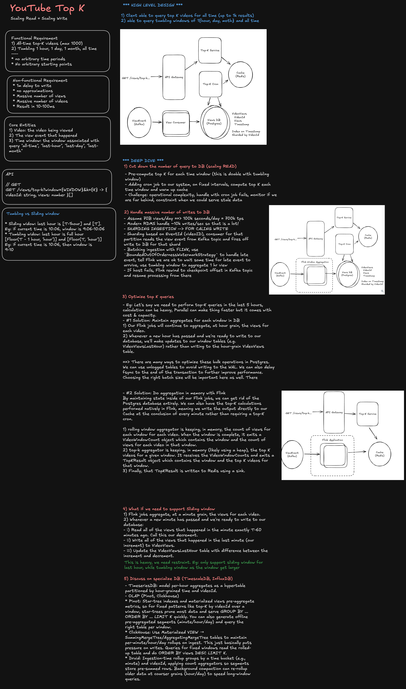
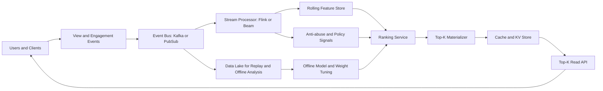

# YouTube Top-K System Design

Design a system that continuously returns the top `K` trending videos for different scopes (global, country, language, category, channel segment) with low latency and high freshness.

At staff level, this is not just “find top K.” It is a streaming ranking system under bursty traffic, eventual consistency, anti-fraud constraints, and product rules.

## Interview framing

Clarify what “top” means before discussing data structures.

- Is top-K based on views only, or a weighted score (views, watch time, completion, likes, shares, recency)?
- Is the ranking window 5 minutes, 1 hour, 24 hours, or mixed windows?
- Is this for homepage trending, search boosters, or creator dashboards?
- Do we need per-region and per-language lists?
- How stale can results be: seconds, minutes, or hours?
- Are we optimizing for strict correctness or product relevance and freshness?

Define one explicit product contract, for example:

- Return top 100 videos per region and category.
- Update every 30 seconds.
- Rank by weighted trend score over the last 60 minutes with recency decay.
- Exclude policy-violating and spam-flagged videos.

## Requirements

### Functional requirements

- Ingest user events: impression, click, play, watch duration, like, share, comment.
- Compute rolling per-video trend features in near real time.
- Produce top-K lists for multiple segments (global, region, category, language).
- Apply policy filters, deduplication, and anti-abuse checks.
- Serve top-K with low-latency read APIs and caching.
- Support replay/backfill when data pipeline incidents happen.

### Non-functional requirements

| Requirement  | Target                                               |
| ------------ | ---------------------------------------------------- |
| Read latency | P99 under 20-50 ms from cache/API                    |
| Freshness    | 10-60 seconds for trending surfaces                  |
| Throughput   | Millions of events per second globally               |
| Availability | Degrade to last good snapshot during compute outages |
| Correctness  | Deterministic ranking for same snapshot/version      |
| Auditability | Explain why a video appears in top-K                 |

## High-level architecture



Key split:

- Streaming path computes fresh metrics and candidate scores.
- Materializer writes immutable ranking snapshots and cache-friendly lists.
- Serving layer reads precomputed lists, not raw events.

## Ranking score design

A typical trend score is weighted and time-decayed:

$$
score(v, t)=w_1\cdot views_{60m}+w_2\cdot watchTime_{60m}+w_3\cdot likes_{60m}+w_4\cdot shares_{60m}
$$

Apply recency decay and anti-spam dampening:

$$
finalScore = score\cdot e^{-\lambda\Delta t}\cdot qualityFactor\cdot abusePenalty
$$

Staff-level points to discuss:

- Watch time is often more robust than raw views.
- New videos need exploration boosts to avoid rich-get-richer lock-in.
- Clamp suspicious spikes until abuse review completes.
- Keep scoring versioned so rankings are reproducible.

## Top-K computation strategy

For each partition key (for example `region:US:category:music`):

1. Maintain rolling aggregates per video in stream state.
2. Compute incremental score deltas per event batch.
3. Update candidate set and maintain a min-heap of size `K` for fast local top-K.
4. Periodically emit ranked snapshots with a monotonically increasing version.

### Distributed top-K merge

When multiple workers compute local top-K for the same segment:

- each worker emits local top `K_local`;
- aggregator performs a K-way merge to compute global top `K`;
- publish final ordered list with snapshot timestamp and version.

This reduces memory and network compared to shipping full candidate sets.

## Windowing and freshness

Use event-time windows with lateness handling:

- Sliding window, e.g., 60 min with 1-min slide.
- Watermarks for out-of-order events.
- Allowed lateness to absorb delayed mobile uploads.
- Correction path for late-but-valid events.

Product trade-off:

- Smaller windows improve freshness but increase volatility.
- Larger windows stabilize ranking but feel stale.

Many production systems blend short and medium windows, e.g.,

- fast momentum signal: 5-15 min,
- stability signal: 1-6 hours.

## Data model

```text
video_metric_state
	segment_key
	video_id
	window_start
	window_end
	views
	watch_time_seconds
	likes
	shares
	quality_factor
	abuse_penalty
	score
	score_version
```

```text
topk_snapshot
	segment_key
	snapshot_version
	generated_at
	items: [video_id, score, rank, reason_codes]
	expires_at
```

Reason codes help support explainability, e.g., `HIGH_WATCH_TIME`, `REGION_TRENDING`, `FRESHNESS_BOOST`.

## Serving path

The API should serve from precomputed snapshots:

- Cache key: `topk:{segment_key}:{snapshot_version}`.
- Fast path: memory cache/Redis.
- Fallback: previous snapshot if newest is unavailable.
- Return metadata: `snapshot_version`, `generated_at`, `staleness_ms`.

Do not compute top-K on the synchronous request path.

## Abuse and integrity controls

Trending surfaces are abuse targets. Add trust boundaries:

- Bot and replay detection on event ingestion.
- Device/account trust scoring and velocity checks.
- Minimum data-quality thresholds before eligibility.
- Policy moderation gates before top-K publish.
- Delayed promotion for suspicious high-velocity spikes.

Use dual-state scoring:

- provisional score for candidates under review,
- confirmed score for publishable rankings.

## Reliability and failure handling

### Failures to design for

- Event bus lag or partition outage.
- Stream processor restart and state recovery.
- Clock skew and watermark misconfiguration.
- Cache invalidation bugs and stale snapshots.
- Partial region outage.

### Safe behavior

- Keep last known good snapshot and serve with staleness metadata.
- Replay from durable event log to recover state.
- Version every ranking snapshot; never mutate old versions in place.
- Use idempotent writes keyed by `(segment_key, snapshot_version)`.

## Observability and alerting

Track:

- Event ingestion QPS, lag, and drop rate.
- Stream watermark delay and state checkpoint latency.
- Snapshot generation cadence and publish latency.
- Top-K churn rate (rank instability).
- Cache hit ratio and API p95/p99 latency.
- Abuse suppression rate and false-positive review rate.

Alert on:

- missing snapshot updates per segment,
- sudden global ranking churn spikes,
- segment-level empty top-K lists,
- stream lag beyond freshness SLA,
- significant mismatch between offline and online score distributions.

## Staff-level trade-offs

- **Exactness vs freshness:** exact global ordering at all times is expensive; bounded approximation with rapid refresh is usually better for user experience.
- **Per-event updates vs micro-batching:** per-event updates are freshest but costly; micro-batches reduce overhead with small freshness loss.
- **Global ranking vs regional fairness:** pure global top-K can suppress local relevance; segmented top-K improves relevance and creator diversity.
- **Aggressive anti-abuse vs creator latency:** strict filters reduce abuse but may delay legitimate breakout content.
- **High churn vs stable UX:** freshness increases churn; use hysteresis or rank-stability dampening for better user trust.

## Practical interview summary

A strong staff-level answer should emphasize:

- clear ranking objective,
- segmented streaming aggregation,
- versioned top-K snapshot materialization,
- low-latency cached serving,
- robust abuse controls,
- deterministic replay and recovery,
- and explicit freshness/correctness trade-offs.

Top-K at YouTube scale is a ranking-and-reliability problem more than a heap problem.
