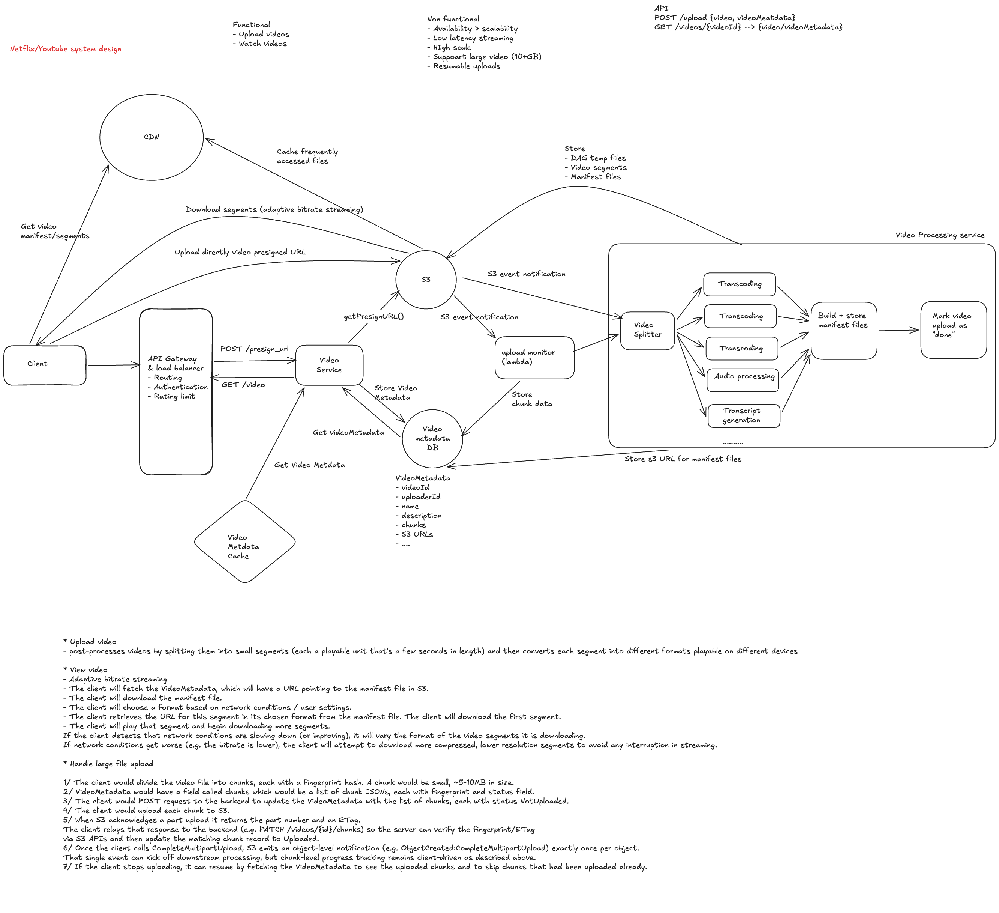
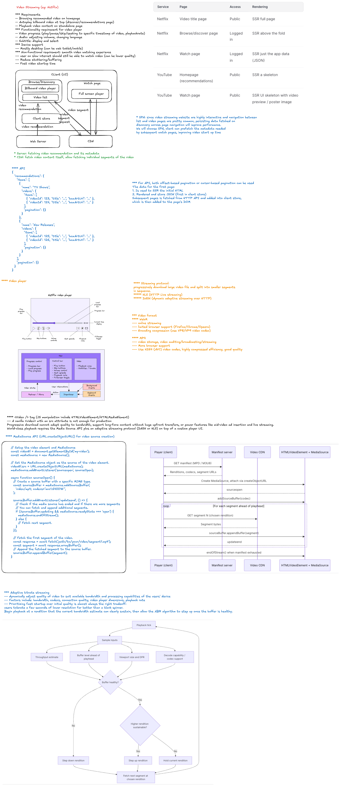

# Netflix Video Player System Design

## Interview Framing

Design a Netflix-style website where users can browse a catalog and watch
on-demand video across desktop, mobile web, smart TVs, and constrained
networks.

At staff level, do more than draw components. Clarify the product scope,
identify the highest-risk quality attributes, define ownership boundaries,
and explain the trade-offs behind each major decision.

## 1. Clarify the Requirements

### Functional requirements

- Browse personalized rows of movies and shows.
- Search and open a title details page.
- Start, pause, seek, and resume video playback.
- Select audio tracks, subtitles, and playback speed.
- Adapt video quality to network and device conditions.
- Continue watching from the last confirmed position.
- Support episodes, autoplay, skip intro, and play next.
- Support full-screen, picture-in-picture, and keyboard controls.
- Enforce subscription, regional, and parental-control restrictions.
- Collect playback quality and engagement telemetry.

### Non-functional requirements

- Fast startup, ideally first frame within one to two seconds on a healthy connection.
- Minimal buffering and stable playback quality.
- Graceful degradation on slow or unstable networks.
- High availability across regions and CDN failures.
- Accessibility for keyboard, screen-reader, caption, and low-vision users.
- Content protection through authorization, signed URLs, and DRM.
- Support for a wide matrix of browsers, codecs, devices, and screen sizes.

### Questions to ask the interviewer

- Is the scope video playback only, or catalog browsing as well?
- Is this video on demand, live streaming, or both?
- Which platforms and browsers are required?
- Are downloads and offline playback in scope?
- Do we need profiles, recommendations, or parental controls?
- What scale should we design for: concurrent viewers, regions, and catalog size?
- What startup-time, buffering, and availability targets matter most?
- Are ads, group watching, or interactive content required?

## 2. Define the Core User Journey

Focus the design on the critical path:

1. User opens a title page.
2. Client requests playback authorization.
3. Playback service returns a manifest URL, DRM information, and session metadata.
4. Player loads the manifest and selects an initial representation.
5. Client requests media segments from the nearest CDN edge.
6. Segments are downloaded, decrypted, decoded, and rendered.
7. Adaptive bitrate logic adjusts quality throughout playback.
8. Progress and quality-of-experience events are reported asynchronously.

## 3. High-Level Architecture

```text
Browser / TV Application
  |
  +-- Catalog and recommendation APIs
  +-- Playback session API
  +-- Progress and telemetry APIs
  |
API Gateway / Backend for Frontend
  |
  +-- Authentication and entitlement service
  +-- Playback session service
  +-- Metadata and recommendation services
  +-- Viewing progress service
  +-- Telemetry ingestion
  |
Video Delivery
  |
  +-- Origin storage
  +-- Transcoding and packaging pipeline
  +-- Multi-CDN routing
  +-- CDN edge cache
  +-- DRM license service
```

The control plane handles metadata, authorization, configuration, and
telemetry. The data plane delivers manifests, media segments, subtitles, and
images through the CDN. Keeping these paths separate prevents API traffic from
becoming a bottleneck for high-volume video delivery.

## 4. Frontend Architecture

### Main modules

| Module            | Responsibility                                                     |
| ----------------- | ------------------------------------------------------------------ |
| Application shell | Routing, authentication, profiles, and global error boundaries     |
| Catalog UI        | Personalized rows, search, title details, and lazy-loaded artwork  |
| Player controller | Playback state machine and user commands                           |
| Media adapter     | Wraps native video, Media Source Extensions, or a player library   |
| ABR controller    | Chooses bitrate using bandwidth, buffer, and device signals        |
| Track manager     | Audio, subtitles, captions, and alternate language tracks          |
| DRM adapter       | Encrypted Media Extensions and license acquisition                 |
| Session manager   | Playback token, heartbeat, concurrency, and entitlement state      |
| Progress manager  | Checkpointing, resume position, and cross-device reconciliation    |
| Telemetry client  | Startup, buffering, errors, quality changes, and engagement events |

### Player state machine

Model playback as explicit states rather than scattered booleans:

```text
idle -> authorizing -> loading -> ready -> playing
                                  |        |
                                  v        v
                                error   buffering
                                           |
                                           v
                                        playing

playing -> paused -> playing
playing -> ended
any active state -> error
```

The state machine makes race conditions visible. Examples include seeking
while buffering, switching episodes during license acquisition, or receiving
a stale response after the user leaves the page.

### State ownership

- Keep high-frequency playback values outside global React state.
- Read `currentTime`, buffered ranges, and dropped frames from the media layer.
- Publish throttled snapshots to React for visible controls.
- Store account, profile, entitlement, and title metadata in application state.
- Treat the server as the source of truth for durable progress.
- Use URL state only for shareable navigation, not sensitive playback tokens.

## 5. Video Streaming Decisions

### Adaptive bitrate streaming

Use HLS or MPEG-DASH with short media segments and several encoded
representations. The player downloads a manifest describing available codecs,
resolutions, bitrates, audio tracks, and subtitles.

The adaptive bitrate algorithm should consider:

- Estimated network throughput.
- Current buffer duration.
- Recent rebuffering events.
- Screen size and device pixel ratio.
- Decoder capability and dropped-frame rate.
- Data-saver or user-selected quality.
- Cost of switching between quality levels.

Avoid choosing quality from bandwidth alone. A buffer-aware strategy is more
stable when throughput changes quickly.

### Segment duration

Short segments improve adaptation speed and seeking but increase request and
packaging overhead. Longer segments improve compression and CDN efficiency but
react more slowly to network changes. For video on demand, a typical starting
point is a few seconds per segment, followed by measurement on representative
devices.

### Codec strategy

Discuss codec negotiation rather than selecting one universal format:

- H.264 offers broad compatibility.
- HEVC can reduce bandwidth but has licensing and browser limitations.
- VP9 and AV1 improve compression on supported devices.
- Maintain fallback representations for unsupported decoders.

Codec selection should balance compression savings against encoding cost,
device support, decode power consumption, and startup latency.

## 6. Playback Performance

### Startup optimization

- Fetch entitlement and playback configuration in parallel where possible.
- Preconnect to API, license, image, and media CDN origins.
- Load player code only on routes that need playback.
- Use a conservative initial bitrate to reduce time to first frame.
- Cache manifests and initialization segments when policy permits.
- Preload metadata or the first segment only when user intent is strong.
- Avoid autoplaying expensive previews on data-saving connections.

### Buffering strategy

- Maintain a target buffer appropriate for device memory and network stability.
- Keep a smaller forward buffer on memory-constrained devices.
- Pause segment requests when the page is hidden if playback is stopped.
- Abort stale segment requests after seeks or quality changes.
- Prefer uninterrupted playback over maximum visual quality.

### Catalog performance

- Virtualize long rows and large result lists.
- Serve responsive artwork with reserved dimensions to prevent layout shift.
- Lazy-load off-screen images and route bundles.
- Cache metadata using stale-while-revalidate behavior.
- Prioritize title and playback resources above below-the-fold recommendations.

## 7. Reliability and Failure Handling

Design explicit recovery behavior for:

| Failure                  | Recovery                                                           |
| ------------------------ | ------------------------------------------------------------------ |
| Manifest request fails   | Retry with backoff, refresh the playback session, or switch CDN    |
| Segment times out        | Retry at a lower representation or alternate CDN                   |
| DRM license fails        | Refresh authorization once, then show an actionable error          |
| Network goes offline     | Preserve state, show reconnecting status, and resume when possible |
| Decoder error            | Try a compatible codec or representation if available              |
| Progress update fails    | Queue the latest checkpoint and retry idempotently                 |
| Telemetry endpoint fails | Batch locally with strict memory and retention limits              |
| API region fails         | Route control-plane requests to a healthy region                   |

Use bounded retries with jitter. Retrying forever can amplify an outage and
drain device resources.

## 8. Resume Playback and Data Consistency

- Send progress checkpoints periodically, on pause, on page hide, and near exit.
- Throttle writes to avoid one request per playback event.
- Include title ID, episode ID, profile ID, position, duration, and session ID.
- Make updates idempotent and reject obviously stale checkpoints.
- Define a completion threshold, such as marking a title watched near the end.
- Resolve cross-device conflicts using server timestamps and playback-session context.
- Never block playback on a progress-write failure.

## 9. Security and Content Protection

- Authorize playback separately from ordinary catalog access.
- Return short-lived playback tokens and signed manifest or segment URLs.
- Use DRM through Encrypted Media Extensions where required.
- Keep license requests bound to the user, device, session, and title.
- Apply geographic, subscription, parental, and concurrent-stream policies.
- Protect APIs against token replay, enumeration, and abusive automation.
- Avoid logging raw tokens, license payloads, or sensitive profile data.
- Use Content Security Policy and trusted media origins.

Clarify that DRM raises the cost of unauthorized copying but cannot make
client-delivered media impossible to capture.

## 10. Accessibility and Controls

- Provide captions and subtitles with clear language labels.
- Support audio descriptions and alternate audio tracks.
- Make every control keyboard accessible with visible focus.
- Give icon-only controls accessible names.
- Announce playback errors and important state changes appropriately.
- Maintain sufficient contrast and large interaction targets.
- Avoid hiding controls before keyboard and screen-reader users can reach them.
- Respect reduced-motion preferences for transitions and previews.

## 11. Observability and Quality of Experience

Technical availability is not enough. Measure whether users can actually
watch.

### Key metrics

- Video start failure rate.
- Time to first frame.
- Rebuffer ratio and rebuffer count.
- Average bitrate and resolution.
- Quality-switch frequency.
- Playback error rate by browser, device, codec, CDN, ISP, and region.
- Dropped frames and decode failures.
- Seek latency.
- DRM license latency and failure rate.
- Completion rate and playback abandonment.

Use a playback session ID to connect client events with entitlement, CDN,
manifest, license, and backend logs. Sample routine events, but preserve rare
failures with privacy-aware limits.

## 12. Scale and Capacity Factors

For a back-of-the-envelope estimate, state assumptions:

- Peak concurrent viewers.
- Average delivered bitrate.
- Requests per viewer based on segment duration.
- Playback session API requests per second.
- Progress checkpoints per minute.
- Telemetry events per session.
- Popular-title cache hit ratio.

The largest bandwidth burden belongs on CDN edges rather than application
servers. The control plane should scale independently from media delivery.

## 13. Testing Strategy

- Unit-test player state transitions and ABR decisions.
- Use integration tests with synthetic manifests and mocked license servers.
- Test slow, lossy, offline, and rapidly changing network profiles.
- Validate seeks, track changes, episode transitions, and stale-request cancellation.
- Run compatibility tests across browser, codec, DRM, and device matrices.
- Test keyboard navigation, captions, screen readers, and reduced motion.
- Use canary playback and synthetic probes from multiple regions.
- Chaos-test CDN, entitlement, license, and telemetry failures.

## 14. Important Trade-offs to Discuss

1. Faster startup versus higher initial quality.
2. Larger buffers versus memory usage and live-edge delay.
3. Short segments versus request overhead and encoding efficiency.
4. Aggressive prefetching versus bandwidth and data usage.
5. Custom player implementation versus a proven playback library.
6. One CDN versus multi-CDN cost and operational complexity.
7. Rich client telemetry versus privacy, cost, and battery usage.
8. Strong progress consistency versus a playback path that never blocks.
9. Newer codecs versus compatibility and encoding expense.
10. Client-side decisions versus remotely configurable playback policies.

## 15. Staff-Level Discussion Points

A staff engineer should make the design evolvable:

- Define contracts between the product UI, player core, playback service, and CDN.
- Make codec, CDN, buffering, and ABR policies remotely configurable.
- Separate platform-specific adapters from shared playback logic.
- Establish quality-of-experience service-level objectives and ownership.
- Plan safe rollout through feature flags, canaries, and automatic rollback signals.
- Standardize telemetry schemas across web, mobile, and TV clients.
- Explain migration paths rather than assuming a complete rewrite.
- Identify organizational dependencies across media, security, data, and product teams.

## Interview Summary

Start with the playback critical path, then go deep on adaptive streaming,
frontend state ownership, reliability, security, and quality-of-experience
metrics. The strongest answer connects technical choices to user-visible
outcomes: fast startup, little buffering, stable quality, accessible controls,
and graceful recovery when networks or services fail.
