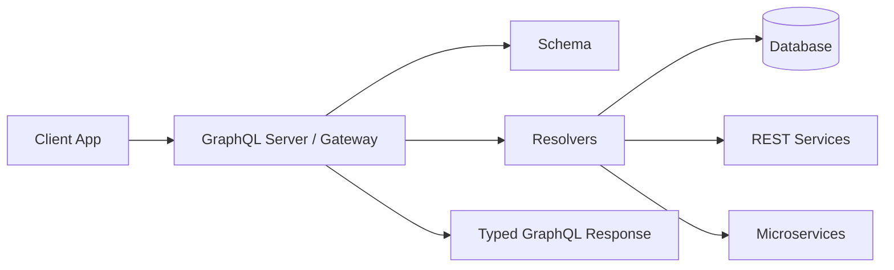
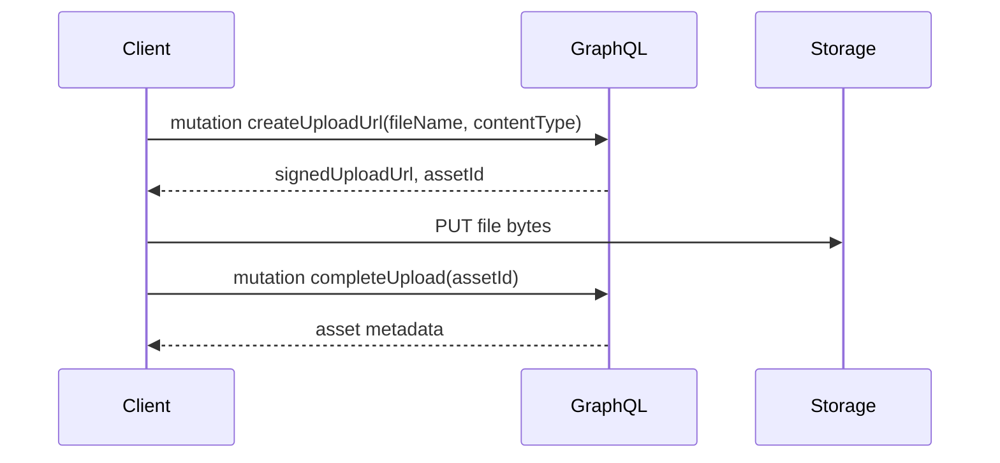
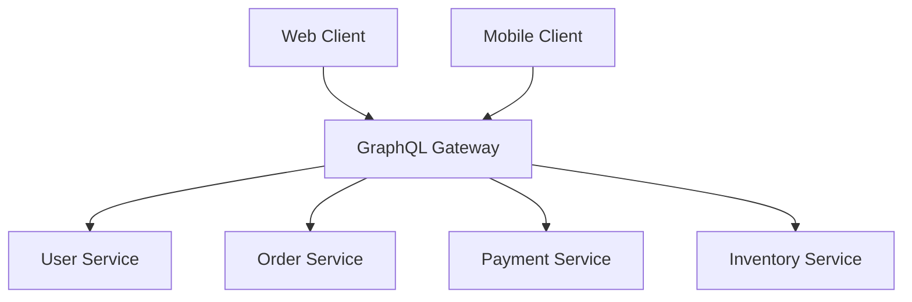
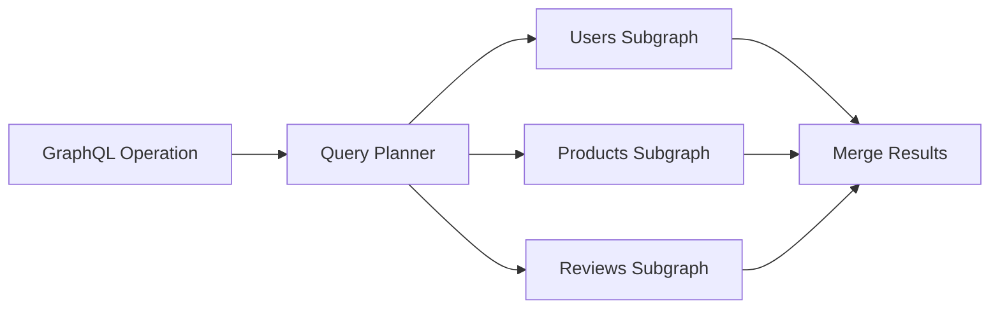
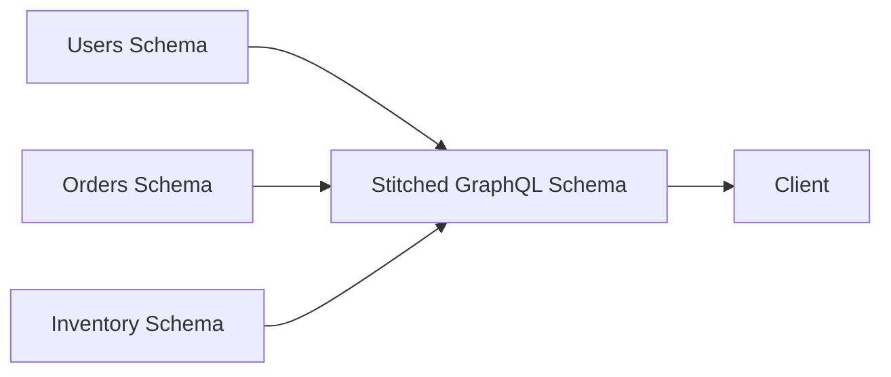
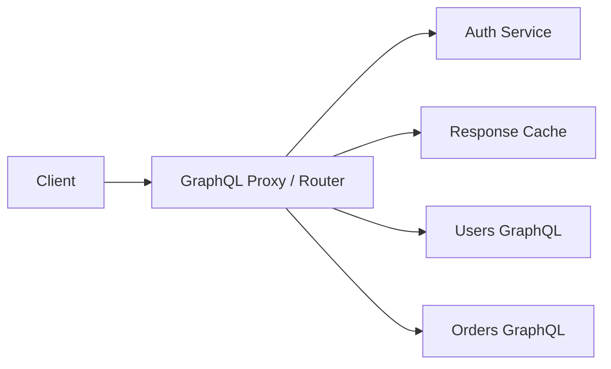
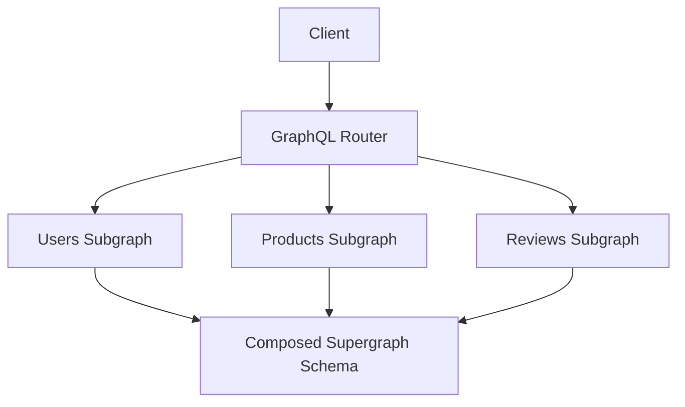
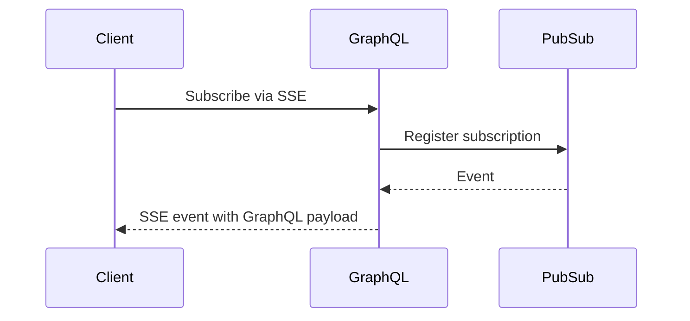
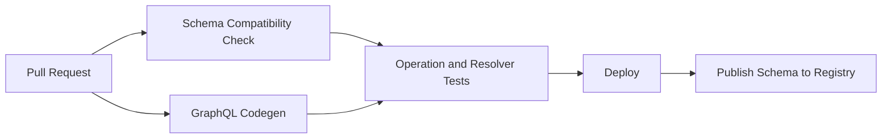

import Tabs from '@theme/Tabs';
import TabItem from '@theme/TabItem';

# 100 GraphQL Interview Questions

This guide is structured as an interview preparation document. Each question includes a practical answer, key talking points, and examples where useful.

## How to Use This Guide

For interviews, try to answer each question in this order:

1. Start with a concise definition.
2. Explain the tradeoff or why it matters.
3. Give a small schema, query, resolver, or architecture example.
4. Mention production concerns such as performance, security, caching, observability, or schema evolution.

## GraphQL Fundamentals

### 1. What is GraphQL and how does it differ from REST?

GraphQL is a query language and runtime for APIs where clients ask for exactly the fields they need. REST usually exposes multiple resource-oriented endpoints, while GraphQL commonly exposes a single endpoint with a strongly typed schema.

In REST, a client might call `/users/1`, `/users/1/posts`, and `/posts/10/comments`. In GraphQL, the client can request the user, posts, and comments in one operation.

```graphql
query GetUserProfile($id: ID!) {
  user(id: $id) {
    id
    name
    posts {
      id
      title
      commentCount
    }
  }
}
```

Key differences:

- REST is endpoint/resource oriented; GraphQL is schema/field oriented.
- REST responses are usually fixed by the server; GraphQL responses are shaped by the client query.
- REST may cause over-fetching or under-fetching; GraphQL reduces both when used well.
- GraphQL requires stronger query governance because clients can request deeply nested data.

### 2. Explain the main components of the GraphQL architecture.

A GraphQL system usually has these components:

- **Schema**: The contract that defines types, fields, queries, mutations, and subscriptions.
- **Operations**: Client requests such as queries, mutations, and subscriptions.
- **Resolvers**: Server-side functions that know how to fetch or compute each field.
- **Context**: Request-scoped data such as user identity, auth tokens, loaders, and tracing metadata.
- **Data sources**: Databases, REST APIs, microservices, queues, or external systems.
- **Execution engine**: Parses, validates, and executes the operation against the schema.



### 3. Can you describe the structure of a GraphQL query?

A GraphQL query has an optional operation name, variables, arguments, fields, nested selections, aliases, directives, and fragments.

```graphql
query GetUser($id: ID!, $includePosts: Boolean!) {
  user(id: $id) {
    id
    displayName: name
    posts @include(if: $includePosts) {
      ...PostPreview
    }
  }
}

fragment PostPreview on Post {
  id
  title
  createdAt
}
```

In this example:

- `GetUser` is the operation name.
- `$id` and `$includePosts` are variables.
- `user(id: $id)` uses a field argument.
- `displayName: name` is an alias.
- `@include` is a directive.
- `PostPreview` is a reusable fragment.

### 4. What are the core features of GraphQL?

Core features include:

- Strongly typed schema.
- Client-selected response shape.
- Hierarchical nested queries.
- Introspection for tooling and documentation.
- Queries, mutations, and subscriptions.
- Field-level resolvers.
- Fragments for reusable selections.
- Arguments, variables, aliases, directives, interfaces, and unions.

In an interview, emphasize that GraphQL is not just a transport format. Its value comes from the schema contract, client-driven selection, tooling ecosystem, and predictable execution model.

### 5. What is a GraphQL schema and why is it important?

A GraphQL schema is the typed contract between clients and the server. It defines what data can be queried, what operations are allowed, and how types relate to each other.

```graphql
schema {
  query: Query
  mutation: Mutation
}

type Query {
  user(id: ID!): User
}

type User {
  id: ID!
  name: String!
  email: String
}
```

The schema is important because it enables validation, documentation, code generation, type-safe clients, mocking, and API evolution.

### 6. Explain the concept of fields in GraphQL.

A field is the smallest unit of data a client can request. Every field belongs to a type and has a return type.

```graphql
type User {
  id: ID!
  name: String!
  posts(limit: Int): [Post!]!
}
```

Here, `id`, `name`, and `posts` are fields. A field can be scalar, object, list, nullable, non-null, or accept arguments. On the server, each field can map to a resolver.

### 7. How does GraphQL handle data types?

GraphQL handles data through a type system. Built-in scalar types include `Int`, `Float`, `String`, `Boolean`, and `ID`. It also supports object types, input types, enums, interfaces, unions, lists, and non-null wrappers.

```graphql
type Product {
  id: ID!
  name: String!
  price: Float!
  status: ProductStatus!
}

enum ProductStatus {
  ACTIVE
  OUT_OF_STOCK
  DISCONTINUED
}
```

The type system lets the server validate queries before execution and lets clients generate safer TypeScript, Swift, Kotlin, or Java models.

### 8. In GraphQL, what are queries and mutations?

A **query** reads data. A **mutation** changes data. Both are GraphQL operations, but mutations are expected to represent writes and are usually executed serially at the top level.

```graphql
query GetProduct($id: ID!) {
  product(id: $id) {
    id
    name
  }
}

mutation RenameProduct($id: ID!, $name: String!) {
  renameProduct(id: $id, name: $name) {
    id
    name
  }
}
```

A good mutation returns the updated object or a structured payload so the client can update its cache safely.

### 9. Describe how you would fetch data with a GraphQL query.

The client sends a GraphQL document and variables to the GraphQL endpoint. The server parses and validates the document, executes resolvers, and returns JSON matching the query shape.

```ts
const response = await fetch('/graphql', {
  method: 'POST',
  headers: { 'Content-Type': 'application/json' },
  body: JSON.stringify({
    query: `
      query GetUser($id: ID!) {
        user(id: $id) {
          id
          name
        }
      }
    `,
    variables: { id: '123' },
  }),
});

const { data, errors } = await response.json();
```

In production, prefer generated typed documents, persisted queries, auth headers, retry rules, and normalized client caching.

### 10. What are scalar types in GraphQL?

Scalars are leaf values in a GraphQL response. Built-in scalars are:

- `Int`
- `Float`
- `String`
- `Boolean`
- `ID`

```graphql
type User {
  id: ID!
  name: String!
  age: Int
  isActive: Boolean!
}
```

GraphQL also supports custom scalars such as `DateTime`, `URL`, `JSON`, or `Email`, but those require custom parsing, validation, and serialization.

### 11. Explain the role of resolvers in GraphQL.

Resolvers are functions that return data for schema fields. They connect the schema to actual data sources.

```ts
const resolvers = {
  Query: {
    user: async (_parent, args, context) => {
      return context.db.user.findById(args.id);
    },
  },
  User: {
    posts: async (user, _args, context) => {
      return context.loaders.postsByUserId.load(user.id);
    },
  },
};
```

Resolvers receive the parent object, arguments, context, and execution info. In interviews, mention using DataLoader or batching to avoid the N+1 problem.

### 12. What are the advantages of using GraphQL over other API query languages?

GraphQL advantages include:

- Flexible client-defined selection sets.
- Strong schema contract and introspection.
- Better developer tooling.
- Easier aggregation across services.
- Code generation for type safety.
- Single graph abstraction over many backends.

The tradeoff is added server complexity. Teams must manage query cost, authorization, caching, schema governance, and observability carefully.

### 13. How do you pass arguments to fields in GraphQL queries?

Arguments are passed inside parentheses after a field name.

```graphql
query GetPosts($limit: Int!, $after: String) {
  posts(limit: $limit, after: $after) {
    edges {
      node {
        id
        title
      }
    }
    pageInfo {
      hasNextPage
      endCursor
    }
  }
}
```

Arguments should be used for filtering, pagination, sorting, or selecting a specific resource. For user-provided values, prefer variables instead of string interpolation.

### 14. What is a fragment in GraphQL and how are they used?

A fragment is a reusable selection set. It helps avoid duplicated field lists across queries.

```graphql
fragment UserCard on User {
  id
  name
  avatarUrl
}

query TeamPage {
  team(id: "t1") {
    owner {
      ...UserCard
    }
    members {
      ...UserCard
    }
  }
}
```

Fragments also support type conditions, which are useful with interfaces and unions.

### 15. How does GraphQL handle caching?

GraphQL does not provide caching automatically. Common caching layers include:

- **Client normalized cache**: Apollo Client, Relay, urql graphcache.
- **HTTP caching**: More effective for persisted queries and GET requests.
- **Server-side caching**: Resolver-level, data-source-level, response cache, or entity cache.
- **DataLoader request cache**: Avoids repeated loads within one request.

Caching is harder than REST because many queries can produce different response shapes. Stable IDs, type names, persisted queries, and cache invalidation policies are critical.

### 16. What are enums in GraphQL, and when would you use them?

Enums define a fixed set of allowed values.

```graphql
enum OrderStatus {
  PENDING
  PAID
  SHIPPED
  CANCELLED
}

type Order {
  id: ID!
  status: OrderStatus!
}
```

Use enums when the set of values is known and stable. Avoid enums for highly dynamic values controlled by users or external systems.

### 17. Describe the concept of schema-first development in GraphQL.

Schema-first development means designing the GraphQL schema before implementing resolvers. The schema becomes the API contract shared by frontend, backend, product, and platform teams.

Benefits:

- Faster frontend/backend parallel work.
- Better API review process.
- Easier mock servers.
- Stronger compatibility checks.

Tradeoff: The schema can become too idealized if not grounded in data-source reality, so teams should validate it against performance and ownership constraints early.

### 18. How would you handle errors in a GraphQL API?

GraphQL responses can contain both `data` and `errors`. Field-level failures can return partial data if the schema allows nullable fields.

```json
{
  "data": {
    "user": null
  },
  "errors": [
    {
      "message": "User not found",
      "path": ["user"],
      "extensions": {
        "code": "NOT_FOUND"
      }
    }
  ]
}
```

Best practices:

- Use `extensions.code` for machine-readable error types.
- Avoid leaking internal stack traces.
- Model expected business errors in mutation payloads when needed.
- Log errors with operation name, request ID, user ID, and resolver path.

### 19. Explain the purpose of introspection in GraphQL.

Introspection lets clients and tools query the schema itself. It powers IDE autocomplete, documentation explorers, code generation, and schema validation.

Example introspection-style query:

```graphql
query IntrospectTypes {
  __schema {
    types {
      name
      kind
    }
  }
}
```

In production, some teams restrict introspection for public APIs and rely on schema registries or documentation portals instead.

### 20. What is the difference between an operation and a field in GraphQL?

An **operation** is the top-level request type: `query`, `mutation`, or `subscription`. A **field** is an item selected inside an operation or type.

```graphql
query GetViewer {
  viewer {
    id
    name
  }
}
```

Here, `query GetViewer` is the operation. `viewer`, `id`, and `name` are fields.

## GraphQL Schema and Types

### 21. How do you define object types in GraphQL?

Object types are defined using the `type` keyword. They contain fields and field return types.

```graphql
type User {
  id: ID!
  name: String!
  email: String
  posts: [Post!]!
}

type Post {
  id: ID!
  title: String!
  author: User!
}
```

An object type represents a domain entity or view model that clients can select fields from.

### 22. What is the difference between an Interface and a Union in GraphQL?

An **interface** defines common fields that implementing object types must provide. A **union** represents one of several object types but does not define shared fields.

```graphql
interface Node {
  id: ID!
}

type User implements Node {
  id: ID!
  name: String!
}

type Organization implements Node {
  id: ID!
  name: String!
}

union SearchResult = User | Organization | Repository
```

Use interfaces when types share a contract. Use unions when results can be different shapes without guaranteed common fields beyond `__typename`.

### 23. Can you illustrate how GraphQL implements polymorphism?

GraphQL supports polymorphism with interfaces and unions. Clients use inline fragments to select fields specific to each concrete type.

```graphql
query Search($term: String!) {
  search(term: $term) {
    __typename
    ... on User {
      id
      name
    }
    ... on Repository {
      id
      name
      starCount
    }
    ... on Issue {
      id
      title
      status
    }
  }
}
```

On the server, type resolution determines the concrete object type at runtime.

### 24. What is the significance of the `!` mark in GraphQL types?

`!` means non-null. It tells clients that the field should never be `null` if the parent object exists.

```graphql
type User {
  id: ID!
  name: String!
  email: String
}
```

Here, `id` and `name` are non-null, while `email` can be null. Be careful with non-null fields: if a resolver returns null for a non-null field, GraphQL nulls the nearest nullable parent and returns an error.

### 25. How do you perform validation in GraphQL?

GraphQL validation happens at several levels:

- **Syntax validation**: Is the document valid GraphQL?
- **Schema validation**: Do requested fields and argument types exist?
- **Variable validation**: Do variables match expected types?
- **Business validation**: Are inputs allowed by product rules?
- **Security validation**: Is query depth, complexity, or authorization acceptable?

```ts
function validateCreateUserInput(input: CreateUserInput) {
  if (!input.email.includes('@')) {
    throw new UserInputError('Invalid email');
  }
}
```

Use schema validation for shape and custom resolver logic for business rules.

### 26. Describe the role of input types in GraphQL.

Input types define structured arguments for queries and mutations.

```graphql
input CreateUserInput {
  name: String!
  email: String!
  role: UserRole = MEMBER
}

type Mutation {
  createUser(input: CreateUserInput!): CreateUserPayload!
}
```

Input types improve readability, reuse, and compatibility. They are separate from object types because input and output types have different semantics.

### 27. How do you extend a GraphQL schema?

You can extend a schema by adding new types, fields, enum values, directives, or subgraph contributions.

```graphql
extend type User {
  recentOrders(limit: Int = 10): [Order!]!
}

extend type Query {
  order(id: ID!): Order
}
```

In large systems, schema extension is often governed by schema checks, ownership rules, and backward compatibility tests.

### 28. What are custom scalar types and when might you use them?

Custom scalars represent primitive values not covered by built-in scalars.

```graphql
scalar DateTime
scalar URL
scalar JSON

type Event {
  id: ID!
  startsAt: DateTime!
  meetingUrl: URL
  metadata: JSON
}
```

Use custom scalars when you need validation and serialization for values such as dates, URLs, money, email, UUIDs, or JSON blobs. Avoid overusing `JSON` because it weakens type safety.

### 29. Explain the use of directives in GraphQL.

Directives annotate parts of a GraphQL document or schema with extra behavior.

Client query directives:

```graphql
query GetUser($withEmail: Boolean!) {
  viewer {
    id
    name
    email @include(if: $withEmail)
  }
}
```

Schema directives:

```graphql
directive @deprecated(reason: String) on FIELD_DEFINITION | ENUM_VALUE

type User {
  oldName: String @deprecated(reason: "Use name instead")
  name: String!
}
```

Custom directives can support auth, rate limiting, formatting, federation metadata, or validation.

### 30. How does GraphQL support pagination and how is it implemented?

GraphQL supports pagination through schema design. The two most common styles are offset pagination and cursor pagination.

Cursor pagination is preferred for large or changing datasets.

```graphql
type Query {
  posts(first: Int!, after: String): PostConnection!
}

type PostConnection {
  edges: [PostEdge!]!
  pageInfo: PageInfo!
}

type PostEdge {
  cursor: String!
  node: Post!
}

type PageInfo {
  hasNextPage: Boolean!
  endCursor: String
}
```

Cursor pagination is more stable when new items are inserted while the user is paginating.

## GraphQL Operations and Performance

### 31. How do you optimize query performance in GraphQL?

Optimize GraphQL performance by attacking the problem at multiple layers:

- Batch and cache data fetches with DataLoader.
- Avoid resolver waterfalls.
- Push filtering and pagination to the database.
- Add query depth and complexity limits.
- Use persisted queries for hot paths.
- Monitor slow fields and operation names.
- Design schema fields around real access patterns.

```ts
const userLoader = new DataLoader(async (ids: readonly string[]) => {
  const users = await db.users.findByIds([...ids]);
  return ids.map((id) => users.find((user) => user.id === id));
});
```

### 32. Describe how GraphQL handles batch operations.

GraphQL can batch work in a few ways:

- A single operation can request many resources.
- Resolvers can batch backend calls using DataLoader.
- Clients can send multiple operations in one HTTP request if the server supports batching.
- Mutations can accept list inputs for bulk actions.

```graphql
mutation BulkArchive($ids: [ID!]!) {
  archivePosts(ids: $ids) {
    archivedIds
    failures {
      id
      reason
    }
  }
}
```

For writes, return partial failure details instead of failing the entire batch when product behavior allows it.

### 33. Explain how you might manage large lists of data in a GraphQL response.

Large lists should not be returned as unbounded arrays. Use pagination, filters, sorting, and server limits.

```graphql
query SearchProducts($first: Int!, $after: String) {
  products(first: $first, after: $after) {
    edges {
      cursor
      node {
        id
        name
      }
    }
    pageInfo {
      hasNextPage
      endCursor
    }
  }
}
```

Also consider streaming with `@defer` or `@stream` where supported, background exports for huge datasets, and aggregate fields for dashboards.

### 34. How do subscriptions work in GraphQL?

Subscriptions allow clients to receive real-time updates after an initial subscription operation. They are commonly implemented over WebSocket, Server-Sent Events, or a managed real-time transport.

```graphql
subscription OnMessageAdded($roomId: ID!) {
  messageAdded(roomId: $roomId) {
    id
    text
    author {
      id
      name
    }
  }
}
```

A typical architecture connects the GraphQL subscription server to a pub/sub system such as Redis, Kafka, NATS, or a cloud event bus.

### 35. What is the N+1 problem and how can it be solved in GraphQL?

The N+1 problem happens when one parent query loads `N` records, then each child resolver makes another request.

Bad pattern:

```txt
1 query for 100 users
100 queries for posts by each user
```

Solution: batch child loads with DataLoader or prefetch joins.

```ts
const postsByUserLoader = new DataLoader(async (userIds: readonly string[]) => {
  const posts = await db.posts.findByUserIds([...userIds]);

  return userIds.map((userId) => posts.filter((post) => post.userId === userId));
});
```

Note: Prisma’s built-in ORM methods (e.g., findMany with include), Prisma would automatically batch and optimize these queries via DataLoader, preventing N+1 issues.

### 36. How do you handle file uploads with GraphQL?

GraphQL itself does not define file upload behavior. Common approaches are:

- Use a signed URL flow: GraphQL creates an upload URL, client uploads directly to object storage.
- Use the GraphQL multipart request specification if your server supports it.
- Use a separate REST endpoint for uploads and GraphQL for metadata.

Preferred production flow:



Signed URLs keep large binary traffic away from the GraphQL server.

### 37. Describe how you would use GraphQL with microservices.

GraphQL can act as an API composition layer over microservices. The graph hides backend complexity and exposes a client-friendly schema.



Important concerns:

- Service ownership of schema fields.
- Latency and fan-out control.
- Error boundaries and partial data.
- Auth propagation.
- Tracing across services.
- Schema federation or stitching strategy.

### 38. How are real-time updates managed in GraphQL?

Real-time updates are usually managed with subscriptions, polling, live queries, or server-sent events.

Use subscriptions when the client needs event-driven updates, such as chat messages or order status changes. Use polling when real-time precision is not critical. Use live queries only when your platform supports invalidation-aware re-execution.

```graphql
subscription OrderStatusChanged($orderId: ID!) {
  orderStatusChanged(orderId: $orderId) {
    id
    status
    updatedAt
  }
}
```

In production, design for reconnects, backpressure, auth revalidation, and event ordering.

### 39. What is a query planner and optimizer in the context of GraphQL?

A query planner decides how to execute a GraphQL operation efficiently. In federated GraphQL, it determines which subgraphs to call, in what order, and how to join the results.



An optimizer may remove redundant selections, batch entity fetches, push filters down to services, or reuse cached query plans.

### 40. How can you limit the depth or complexity of queries in GraphQL?

Limit query cost with validation rules and runtime controls:

- Maximum depth.
- Maximum field count.
- Complexity scoring per field.
- Pagination caps.
- Timeout limits.
- Rate limits by user or token.
- Persisted query allowlists for public clients.

```ts
const complexityByField = {
  'Query.search': 10,
  'User.posts': 5,
  'Post.comments': 5,
};
```

Depth limits are simple but not enough. Complexity scoring is better because not all fields have equal cost.

## Advanced GraphQL Concepts

### 41. What is Apollo Client and how does it interact with GraphQL?

Apollo Client is a GraphQL client library that sends operations, manages loading/error states, and maintains a normalized cache.

```tsx
const GET_VIEWER = gql`
  query GetViewer {
    viewer {
      id
      name
    }
  }
`;

function Profile() {
  const { data, loading, error } = useQuery(GET_VIEWER);

  if (loading) return <p>Loading...</p>;
  if (error) return <p>Something went wrong.</p>;

  return <h1>{data.viewer.name}</h1>;
}
```

Apollo Client interacts with GraphQL through links, cache policies, generated types, and hooks like `useQuery` and `useMutation`.

### 42. Describe schema stitching and when it is useful.

Schema stitching combines multiple GraphQL schemas into one unified schema. It was popular before federation and is still useful when composing schemas from internal services or legacy systems.



Use it when teams need a single graph but do not have full federation infrastructure. For large organizations, federation is often preferred because ownership and composition are more explicit.

### 43. How do you handle authentication and authorization in GraphQL?

Authentication identifies the user. Authorization decides what the user can access.

Common pattern:

1. Validate token at the gateway or server.
2. Add user identity and permissions to `context`.
3. Check permissions in resolvers, directives, or service layer.
4. Enforce field-level access for sensitive data.

```ts
const resolvers = {
  Query: {
    adminReport: (_parent, _args, context) => {
      if (!context.user?.roles.includes('ADMIN')) {
        throw new ForbiddenError('Not allowed');
      }

      return context.reports.getAdminReport();
    },
  },
};
```

Do not rely only on frontend hiding. Authorization must be enforced on the server.

### 44. What are the best practices for securing a GraphQL API?

Best practices include:

- Authenticate every request that needs identity.
- Enforce authorization at object and field level.
- Disable or restrict introspection for public production APIs when needed.
- Use query depth and complexity limits.
- Use persisted queries or allowlists for public clients.
- Sanitize and validate inputs.
- Rate limit by identity and operation.
- Avoid exposing internal error messages.
- Monitor suspicious operations.

Security should be designed into schema fields, not added only at the transport layer.

### 45. How do you implement server-side caching in GraphQL?

Server-side caching can happen at multiple levels:

- Resolver-level cache.
- Data source cache.
- Full response cache.
- Entity cache.
- CDN cache for persisted GET queries.

```ts
const resolvers = {
  Query: {
    product: async (_parent, { id }, context) => {
      return context.cache.wrap(
        `product:${id}`,
        () => {
          return context.productService.getById(id);
        },
        { ttl: 60 }
      );
    },
  },
};
```

Cache keys must include identity, permissions, locale, arguments, and any field-affecting context. Incorrect cache scoping can leak data.

### 46. Explain how to use GraphQL over HTTP.

GraphQL over HTTP commonly uses `POST /graphql` with a JSON body containing `query`, `variables`, and optionally `operationName`.

```http
POST /graphql HTTP/1.1
Content-Type: application/json
Authorization: Bearer <token>
```

```json
{
  "query": "query GetUser($id: ID!) { user(id: $id) { id name } }",
  "variables": {
    "id": "123"
  },
  "operationName": "GetUser"
}
```

GET can be used for cacheable persisted queries, but mutations should use POST.

### 47. What are persisted queries, and why would you use them in GraphQL?

Persisted queries replace sending the full query text with a stable query ID or hash. The server stores or recognizes the query.

Benefits:

- Smaller request payloads.
- Better CDN caching.
- Query allowlisting.
- Reduced attack surface.
- Easier operation analytics.

```json
{
  "extensions": {
    "persistedQuery": {
      "version": 1,
      "sha256Hash": "abc123..."
    }
  },
  "variables": {
    "id": "123"
  }
}
```

Persisted queries are especially useful for mobile and public web clients.

### 48. How do you handle state management with GraphQL on the client side?

GraphQL clients often manage remote state through normalized caching. Local UI state can remain in React state, Zustand, Redux, or the GraphQL client cache depending on complexity.

Good separation:

- Server state: GraphQL client cache.
- Form state: local component or form library.
- UI state: local state or lightweight store.
- Cross-page app state: shared store when needed.

Do not force all state into GraphQL. Use the right state owner for each type of state.

### 49. Explain the concept of optimistic UI with GraphQL.

Optimistic UI updates the client immediately before the server confirms the mutation. If the mutation fails, the client rolls back or reconciles.

```ts
updateTodo({
  variables: { id: '1', completed: true },
  optimisticResponse: {
    updateTodo: {
      __typename: 'Todo',
      id: '1',
      completed: true,
    },
  },
});
```

Use optimistic UI for low-risk actions like toggles, likes, and simple status changes. Avoid it for actions with complex validation or high failure probability.

### 50. How does GraphQL integrate with existing code and APIs?

GraphQL can wrap existing REST APIs, databases, RPC services, message systems, and legacy applications. Resolvers act as adapters.

```ts
const resolvers = {
  Query: {
    weather: async (_parent, { city }, context) => {
      return context.weatherRestClient.get(`/weather?city=${city}`);
    },
  },
};
```

This is useful for gradual migration. Teams can introduce GraphQL as a facade without rewriting all backend services immediately.

## GraphQL Clients and Server Integration

### 51. How would you set up a GraphQL server?

A typical server setup includes schema definitions, resolvers, context, plugins/middleware, and a transport layer.

```ts
import { ApolloServer } from '@apollo/server';

const typeDefs = `#graphql
  type Query {
    hello: String!
  }
`;

const resolvers = {
  Query: {
    hello: () => 'Hello GraphQL',
  },
};

const server = new ApolloServer({
  typeDefs,
  resolvers,
});
```

For production, add auth, logging, tracing, depth limits, schema checks, health checks, and safe error formatting.

### 52. What are the popular GraphQL client libraries?

Popular GraphQL client libraries include:

- **Apollo Client**: Feature-rich client with normalized caching.
- **Relay**: Strong conventions, compiler-driven, excellent for large React apps.
- **urql**: Lightweight and extensible.
- **graphql-request**: Minimal request client.
- **TanStack Query with GraphQL fetchers**: Useful when you want query management without a normalized GraphQL cache.

The right choice depends on app size, caching needs, team familiarity, and schema conventions.

### 53. How can you cache GraphQL queries on the client side?

Client caching strategies include:

- Normalized entity caching by `__typename` and `id`.
- Request/result caching.
- Field policy caching.
- Pagination merge policies.
- Cache invalidation after mutations.
- Persisted cache for offline or startup performance.

```ts
const cache = new InMemoryCache({
  typePolicies: {
    Product: {
      keyFields: ['id'],
    },
  },
});
```

A stable global object identity is the foundation of reliable normalized caching.

### 54. Describe the process of linking a GraphQL client with a React application.

The typical React integration wraps the app with a provider and uses hooks inside components.

```tsx
import { ApolloClient, InMemoryCache, ApolloProvider } from '@apollo/client';

const client = new ApolloClient({
  uri: '/graphql',
  cache: new InMemoryCache(),
});

export function AppRoot() {
  return (
    <ApolloProvider client={client}>
      <App />
    </ApolloProvider>
  );
}
```

Then components use hooks such as `useQuery`, `useMutation`, and `useSubscription`.

### 55. What are the options for hosting a GraphQL server?

GraphQL can be hosted in many environments:

- Node.js server such as Express, Fastify, or standalone Apollo.
- Serverless functions.
- Edge runtime, with limitations.
- Kubernetes service.
- Managed platforms.
- API gateway or federated graph router.

For high-throughput APIs, consider cold starts, connection pooling, subscription support, query cost, and observability before choosing serverless or edge.

### 56. How do you test a GraphQL API?

Testing should cover several layers:

- Schema validation and snapshot tests.
- Resolver unit tests.
- Integration tests against test databases or mocked data sources.
- Operation tests using real GraphQL documents.
- Contract tests for breaking schema changes.
- Authorization tests.
- Performance tests for expensive queries.

```ts
const result = await executeOperation({
  query: `query { viewer { id name } }`,
  contextValue: { user: testUser },
});

expect(result.body.singleResult.data.viewer.name).toBe('Khanh');
```

### 57. Explain how you might handle offline functionality with GraphQL.

Offline support usually belongs mostly on the client. Common strategies:

- Persist the normalized cache locally.
- Queue mutations while offline.
- Retry mutations on reconnect.
- Use conflict resolution for concurrent edits.
- Show stale data indicators.
- Use optimistic updates carefully.

For collaboration-heavy apps, define version numbers or conflict policies in the schema.

```graphql
type Document {
  id: ID!
  content: String!
  version: Int!
  updatedAt: DateTime!
}
```

### 58. What are the considerations for scaling a GraphQL backend?

Scaling concerns include:

- Resolver performance and batching.
- Query complexity and rate limiting.
- Horizontal scaling of stateless servers.
- Backend service fan-out.
- Caching and CDN strategy.
- Schema ownership and governance.
- Observability by operation and field.
- Federation or modular schema design.

GraphQL scaling is less about the number of endpoints and more about controlling the shape, cost, and fan-out of operations.

### 59. Discuss how a GraphQL proxy layer works and its use cases.

A GraphQL proxy sits between clients and backend GraphQL services. It can perform routing, authentication, persisted query lookup, logging, caching, schema composition, and traffic shaping.



Use cases include federated routing, migration from legacy APIs, central governance, observability, and edge caching.

### 60. How do you monitor and log GraphQL queries?

Monitor GraphQL by operation name, field path, latency, error code, user/client identity, complexity score, and downstream calls.

Useful metrics:

- Request count by operation.
- P50/P95/P99 latency.
- Error rate by resolver path.
- Slow fields.
- Query complexity distribution.
- Backend fan-out.
- Cache hit rate.

Logs should include request ID, operation name, variables redacted as needed, user ID, client name/version, and trace ID.

## GraphQL Tools and Ecosystem

### 61. Name some GraphQL IDEs and their features.

Common GraphQL IDEs include:

- **GraphiQL**: In-browser IDE with autocomplete and docs.
- **Apollo Sandbox**: Explorer for Apollo-based graphs.
- **Postman**: GraphQL request testing and collections.
- **Insomnia**: API client with GraphQL support.
- **GraphQL Playground**: Older IDE, still seen in some projects.

Important features include schema introspection, autocomplete, query formatting, variables panel, headers panel, documentation explorer, and operation history.

### 62. What is GraphQL Code Generator and how can it be used?

GraphQL Code Generator generates typed artifacts from schema and operation documents.

Typical generated output:

- TypeScript types for queries and mutations.
- React hooks.
- Typed document nodes.
- Resolver type signatures.
- Schema types.

```yaml
schema: http://localhost:4000/graphql
documents: src/**/*.graphql
generates:
  src/generated/graphql.ts:
    plugins:
      - typescript
      - typescript-operations
      - typed-document-node
```

This reduces runtime errors and keeps frontend code aligned with the schema.

### 63. Explain how the GraphiQL tool is used.

GraphiQL is an interactive GraphQL IDE. Developers use it to write operations, explore schema docs, test variables and headers, inspect responses, and debug fields.

```graphql
query TryGraphiQL {
  __typename
}
```

In production, teams may restrict access to GraphiQL or require authentication, especially for private schemas.

### 64. What is Orchestra and how does it pertain to GraphQL?

In GraphQL discussions, **Orchestra** may refer to orchestration tooling or a platform-specific GraphQL orchestration layer. The general idea is coordinating multiple services, schemas, or data sources behind one GraphQL API.

A good interview answer should clarify the context:

> “If by Orchestra you mean a GraphQL orchestration layer, it typically composes data from multiple services, coordinates resolver execution, and exposes a unified graph to clients.”

Because “Orchestra” is not a universal GraphQL specification term, ask for context if the interviewer expects a specific product.

### 65. Describe the role of DataLoader in GraphQL.

DataLoader batches and caches data fetches during a single request. It is commonly used to solve the N+1 problem.

```ts
const userByIdLoader = new DataLoader(async (ids: readonly string[]) => {
  const users = await userService.getUsersByIds([...ids]);
  return ids.map((id) => users.find((user) => user.id === id) ?? null);
});
```

DataLoader cache should usually be request-scoped, not global, to avoid leaking data across users.

### 66. Discuss the use cases for AST, Abstract Syntax Tree, in GraphQL.

The GraphQL parser converts a query document into an AST. Tools and servers use the AST to inspect, validate, transform, and execute operations.

Use cases:

- Query validation.
- Depth and complexity analysis.
- Persisted query hashing.
- Operation analytics.
- Schema transformation.
- Code generation.
- Linting GraphQL documents.

```ts
import { parse, visit } from 'graphql';

const ast = parse(`
  query GetViewer {
    viewer {
      id
      name
    }
  }
`);

visit(ast, {
  Field(node) {
    console.log(node.name.value);
  },
});
```

### 67. What are mock functions in GraphQL, and when might you use them?

Mock functions return fake data for schema fields. They are useful before backend implementation, during frontend development, in tests, and for design reviews.

```ts
const mocks = {
  String: () => 'Mock value',
  User: () => ({
    id: 'user-1',
    name: 'Mock User',
  }),
};
```

Mocking works best when the schema is stable enough for frontend teams to build against it.

### 68. How do you manage database migrations with GraphQL-centric development?

GraphQL schema changes and database migrations should be coordinated but decoupled.

Safe migration pattern:

1. Add database column or table.
2. Backfill data if needed.
3. Add resolver support.
4. Add GraphQL field as nullable first if data is incomplete.
5. Update clients.
6. Make field non-null only after all data and clients are safe.
7. Deprecate old fields before removal.

Avoid exposing database tables directly as GraphQL types without considering API stability.

### 69. Explain how you might organize a GraphQL schema in a large project.

Large schemas should be organized by domain and ownership.

```txt
src/graphql/
  schema/
    user.graphql
    order.graphql
    product.graphql
  resolvers/
    userResolvers.ts
    orderResolvers.ts
    productResolvers.ts
  loaders/
    userLoaders.ts
    orderLoaders.ts
  directives/
  generated/
```

Use schema checks, naming conventions, ownership metadata, and generated resolver types to keep the project maintainable.

### 70. What is Relay and how does it compare to Apollo Client?

Relay is a GraphQL client framework designed around strong conventions, compiler-generated artifacts, fragments, normalized caching, and the Relay Cursor Connections pagination model.

Apollo Client is more flexible and easier to adopt incrementally. Relay is more opinionated and can be very powerful for large React applications with strict data dependencies.

Choose Relay when your team wants strong conventions and compiler-driven safety. Choose Apollo when flexibility and ecosystem familiarity matter more.

## GraphQL Best Practices

### 71. How do you version a GraphQL API?

GraphQL usually avoids URL versions like `/v1` and evolves the schema gradually.

Best practices:

- Add fields instead of changing field meaning.
- Deprecate fields before removing them.
- Keep old fields working while clients migrate.
- Use schema registry checks.
- Track field usage.
- Avoid breaking changes to types, nullability, and enum values.

```graphql
type User {
  fullName: String @deprecated(reason: "Use displayName instead")
  displayName: String!
}
```

### 72. What are some common anti-patterns in GraphQL and how would you avoid them?

Common anti-patterns:

- Exposing database schema directly.
- Returning unbounded lists.
- Putting authorization only in the frontend.
- Using `JSON` scalar for everything.
- Adding fields without ownership.
- Allowing unlimited query depth.
- Ignoring operation names.
- Using GraphQL for large binary uploads without a signed URL strategy.

Avoid them with schema review, query limits, typed fields, auth enforcement, observability, and lifecycle governance.

### 73. Explain the significance of field deprecation in GraphQL.

Field deprecation lets API owners mark fields as discouraged without immediately breaking clients.

```graphql
type Product {
  oldPrice: Float @deprecated(reason: "Use price.amount instead")
  price: Money!
}
```

A mature deprecation process includes client usage tracking, migration documentation, deadlines, and safe removal only after usage is gone.

### 74. Discuss how you would manage access control with GraphQL.

Access control can be enforced at several levels:

- Operation level.
- Object level.
- Field level.
- Row/resource level.
- Data source level.

```ts
function canViewEmail(user, targetUser) {
  return user.id === targetUser.id || user.roles.includes('ADMIN');
}

const resolvers = {
  User: {
    email: (targetUser, _args, context) => {
      return canViewEmail(context.user, targetUser) ? targetUser.email : null;
    },
  },
};
```

For sensitive fields, prefer deny-by-default and centralized policy helpers.

### 75. What are the guidelines for effective error handling in a GraphQL API?

Effective GraphQL error handling should:

- Use consistent error codes.
- Preserve partial data when safe.
- Avoid exposing internals.
- Separate user errors from system errors.
- Add resolver path and trace IDs to logs.
- Return structured mutation payload errors for expected validation failures.

```graphql
type CreateUserPayload {
  user: User
  errors: [UserError!]!
}

type UserError {
  field: String
  message: String!
  code: String!
}
```

### 76. How do you organize the file structure for a GraphQL project?

A maintainable file structure separates schema, resolvers, data loaders, services, generated types, and tests.

```txt
src/
  graphql/
    typeDefs/
    resolvers/
    loaders/
    directives/
    context.ts
    server.ts
  services/
  db/
  tests/
```

For large teams, organize by domain rather than technical layer when ownership boundaries matter.

### 77. What is the significance of naming conventions in GraphQL?

Naming conventions make schemas easier to understand and evolve.

Common conventions:

- Types use PascalCase: `UserProfile`.
- Fields use camelCase: `createdAt`.
- Enums use UPPER_SNAKE_CASE: `PENDING_REVIEW`.
- Mutations use verb-object names: `createUser`, `archivePost`.
- Connection fields use consistent pagination names: `edges`, `node`, `pageInfo`.

Good names are part of the API contract and reduce documentation burden.

### 78. When should you use variables in GraphQL and how are they implemented?

Use variables for dynamic values such as IDs, filters, pagination cursors, and mutation inputs.

```graphql
query GetUser($id: ID!) {
  user(id: $id) {
    id
    name
  }
}
```

Variables are sent separately:

```json
{
  "id": "user-123"
}
```

Variables improve security, caching, reuse, and readability. Avoid building query strings with user input.

### 79. What do you need to consider when documenting your GraphQL API?

Good GraphQL documentation includes:

- Field descriptions in the schema.
- Examples of common operations.
- Auth and permission rules.
- Error codes.
- Pagination conventions.
- Deprecation guidance.
- Rate limit and complexity rules.
- Ownership and support channels.

```graphql
type Query {
  """
  Returns the currently authenticated user.
  """
  viewer: User
}
```

Schema descriptions power generated documentation in IDEs and developer portals.

### 80. How would you design mutations for complex write operations?

Use structured input and payload types. Keep mutation names explicit and return enough data for cache updates.

```graphql
input CheckoutInput {
  cartId: ID!
  paymentMethodId: ID!
  shippingAddressId: ID!
}

type CheckoutPayload {
  order: Order
  errors: [CheckoutError!]!
}

type Mutation {
  checkout(input: CheckoutInput!): CheckoutPayload!
}
```

For complex writes, consider idempotency keys, validation errors, transaction boundaries, and partial failure behavior.

## GraphQL Specification and Advanced Topics

### 81. What is the GraphQL specification and how does it impact API development?

The GraphQL specification defines the language, type system, validation rules, execution semantics, introspection, and response format. It gives implementations and tools a common standard.

For API development, the spec ensures that schemas, queries, and responses behave consistently across servers and clients. However, things like transport details, authorization, caching, and file uploads are mostly outside the core spec and require implementation decisions.

### 82. How do you extend the GraphQL spec with custom directives?

You do not literally change the spec; you define custom schema directives that your server tooling understands.

```graphql
directive @auth(role: Role!) on FIELD_DEFINITION

enum Role {
  ADMIN
  MEMBER
}

type Query {
  adminDashboard: Dashboard! @auth(role: ADMIN)
}
```

The server must implement directive behavior through schema transforms, resolver wrappers, or framework-specific directive support.

### 83. Explain the process of contributing to the GraphQL spec.

At a high level, contributing to the GraphQL spec involves discussing proposals with the GraphQL working group, writing RFC-style proposals, iterating with implementers, building consensus, and updating reference materials or tests.

In an interview, the key point is that GraphQL evolves through community and working group processes, not through a single product vendor.

### 84. Describe how GraphQL can be used for schema federation.

Schema federation composes multiple independently owned subgraph schemas into one supergraph. Each team owns part of the graph, and a gateway/router plans operations across subgraphs.



Federation is useful for large organizations where one central GraphQL server would become a bottleneck.

### 85. What are possible considerations for internationalization in GraphQL APIs?

Internationalization considerations include:

- Locale in context or arguments.
- Translated text fields.
- Currency and number formatting.
- Time zone handling.
- Search and sorting rules.
- Fallback locales.
- Caching by locale.

```graphql
type Product {
  id: ID!
  name(locale: Locale): String!
  price(currency: Currency): Money!
}
```

Avoid mixing display formatting with canonical data when clients need control over presentation.

### 86. How does GraphQL manage de-duplication of client requests?

De-duplication can happen in the client, gateway, or resolver layer.

Examples:

- Apollo Client can deduplicate identical in-flight queries.
- DataLoader deduplicates repeated entity loads in one request.
- Persisted query caches can reuse responses.
- Normalized caches avoid refetching known entities.

```ts
const userLoader = new DataLoader(async (ids) => batchUsers(ids), {
  cache: true,
});
```

De-duplication must respect variables, headers, user identity, permissions, and cache policy.

### 87. Discuss how custom middleware can be used in GraphQL.

Custom middleware can handle cross-cutting concerns such as auth, logging, tracing, rate limiting, input validation, and error formatting.

```ts
async function createContext({ req }) {
  const user = await authenticate(req.headers.authorization);

  return {
    user,
    requestId: req.headers['x-request-id'],
    loaders: createLoaders(user),
  };
}
```

Resolver middleware can wrap fields, but be careful: too many wrappers can make execution hard to debug.

### 88. Explain the concept of incremental delivery in the context of GraphQL.

Incremental delivery lets the server send parts of a response over time instead of waiting for everything. Common directives include `@defer` and `@stream` in implementations that support them.

```graphql
query ProductPage($id: ID!) {
  product(id: $id) {
    id
    name
    reviews @defer {
      id
      body
    }
  }
}
```

This improves perceived performance for pages where some sections are slower or less critical.

### 89. What is the relationship between GraphQL and service workers?

Service workers can intercept GraphQL network requests and support offline caching, request replay, background sync, and mock responses.

Use cases:

- Cache query responses for offline mode.
- Queue mutations while offline.
- Serve mock data in development.
- Add network resilience for flaky connections.

Be careful with sensitive data, cache invalidation, and user-specific responses.

### 90. How can GraphQL be used in conjunction with server-sent events?

GraphQL subscriptions or live updates can be transported over Server-Sent Events, especially when the communication is server-to-client only.



SSE can be simpler than WebSockets for one-way updates and works well with HTTP infrastructure, but it is less suitable for bidirectional real-time protocols.

## GraphQL Industry Use Cases

### 91. How have large-scale applications implemented GraphQL, and what can be learned from them?

Large-scale GraphQL deployments often use the graph as a product API layer over many backend services. Lessons include:

- Strong schema governance is required.
- Field ownership must be clear.
- Observability by operation and field is critical.
- Query cost controls are not optional.
- Client code generation improves reliability.
- Federation or modular schemas help teams scale ownership.

The major takeaway: GraphQL is most successful when treated as a platform, not just a library.

### 92. Explain how GraphQL can be leveraged in e-commerce platforms.

E-commerce platforms use GraphQL to compose product, inventory, pricing, cart, promotion, checkout, and recommendation data.

```graphql
query ProductPage($id: ID!) {
  product(id: $id) {
    id
    name
    price {
      amount
      currency
    }
    inventoryStatus
    recommendations(first: 6) {
      id
      name
    }
  }
}
```

GraphQL helps different clients request tailored data for product pages, search pages, checkout, and mobile experiences.

### 93. Describe the use of GraphQL in content management systems.

In content management systems, GraphQL exposes typed content models to websites, mobile apps, and preview tools.

Example use cases:

- Fetch page content by slug.
- Preview draft content.
- Compose reusable content blocks.
- Localize content.
- Query media assets.

```graphql
query PageBySlug($slug: String!, $locale: String!) {
  page(slug: $slug, locale: $locale) {
    title
    blocks {
      __typename
      ... on HeroBlock {
        heading
        imageUrl
      }
      ... on TextBlock {
        body
      }
    }
  }
}
```

### 94. How can GraphQL streamline workflows in enterprise applications?

Enterprise applications often have fragmented systems: identity, CRM, permissions, billing, reporting, and internal tools. GraphQL can provide a unified API layer that reduces client complexity.

Benefits:

- One schema over many systems.
- Better developer velocity.
- Fine-grained data fetching.
- Stronger typed contracts.
- Easier internal tool development.

The challenge is governance: enterprise graphs need ownership, security, auditing, and lifecycle management.

### 95. Discuss how GraphQL has transformed frontend development practices.

GraphQL changed frontend development by letting UI components declare their data needs directly. This improves collaboration between frontend and backend teams.

Practical changes:

- Component-driven data fragments.
- Generated TypeScript types.
- Fewer custom REST endpoints for each screen.
- Better local mocking.
- Stronger schema contracts.
- More frontend autonomy.

The tradeoff is that frontend engineers must understand caching, query cost, schema design, and error handling more deeply.

## GraphQL and Modern Development Workflows

### 96. How does GraphQL fit into a CI/CD pipeline?

GraphQL fits into CI/CD through schema checks, operation validation, code generation, tests, and deployment gates.



A mature pipeline prevents breaking schema changes before they reach production.

### 97. What role does GraphQL play in serverless architectures?

GraphQL can be deployed as serverless functions or used as an API layer over serverless services.

Advantages:

- Fast iteration.
- Pay-per-use scaling.
- Easy integration with managed services.

Challenges:

- Cold starts.
- Database connection pooling.
- Subscription support.
- Large dependency bundles.
- Query fan-out across many functions.

For high-traffic graphs, a long-running router or gateway may be more predictable.

### 98. How do you manage database access and ORM tooling with GraphQL?

Resolvers should not become a thin ungoverned wrapper over ORM models. Use service layers, loaders, and repository patterns to control access.

```ts
const resolvers = {
  Query: {
    order: (_parent, { id }, context) => {
      return context.orderService.getOrderForUser({
        orderId: id,
        userId: context.user.id,
      });
    },
  },
};
```

ORM access should respect authorization, transaction boundaries, batching, pagination, and data-shaping rules.

### 99. What is the role of GraphQL in edge computing and IoT applications?

GraphQL can provide a unified query interface for edge and IoT systems, where clients need selective data from many devices or regions.

Use cases:

- Device status dashboards.
- Selective telemetry fetching.
- Edge configuration management.
- Aggregated sensor data.
- Real-time alerts through subscriptions.

Challenges include intermittent connectivity, small payload requirements, auth at the edge, and time-series data volume.

### 100. Describe the future prospects of GraphQL—what new developments and patterns are emerging?

Emerging GraphQL patterns include:

- Federation and supergraph governance.
- Persisted query allowlists for security and performance.
- Incremental delivery with `@defer` and `@stream`.
- Better typed client artifacts.
- GraphQL at the edge.
- Live queries and real-time transports.
- Schema registries and contract checks.
- AI-assisted API exploration and schema documentation.

A strong future-looking answer should balance optimism with operational reality: GraphQL will keep growing where teams need typed API composition, but success depends on governance, performance controls, and developer experience.

## Quick Review Checklist

Before a GraphQL interview, make sure you can explain:

- Query vs mutation vs subscription.
- Schema, resolver, context, and DataLoader.
- Object, scalar, enum, input, interface, and union types.
- Nullability and the impact of `!`.
- Pagination with connections and cursors.
- N+1 and batching.
- Client caching and normalized cache identity.
- Auth at field and object level.
- Persisted queries, query complexity, and depth limits.
- Federation, schema governance, and observability.
