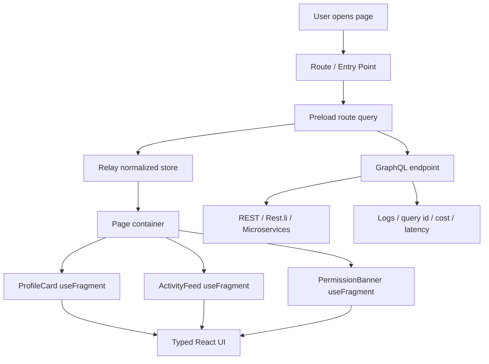
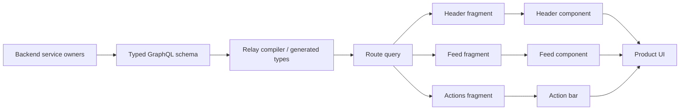

# Leadership Story: Building a Frontend GraphQL Ecosystem

> Interview framing: “Tell me about a time you led a frontend architecture change that improved developer velocity and product reliability.”

## 1. Executive Summary

As a Staff Frontend Engineer, I led the frontend adoption of a GraphQL ecosystem that changed how product teams fetched, composed, tested, and owned data dependencies. The goal was not to replace every REST API. The goal was to give product engineers a safer, typed, component-driven data layer while preserving the reliability and ownership model of existing backend services.

The leadership challenge was balancing three forces:

1. **Product velocity** — teams needed to ship rich pages without stitching many REST endpoints manually.
2. **Frontend ownership** — components needed to declare their own data needs instead of relying on large page-level payloads.
3. **Production safety** — query cost, schema compatibility, partial failures, and error handling needed strong guardrails.

We standardized around a Relay-style model:

- **Route-level queries** use `usePreloadedQuery` when we can fetch before render.
- **Small or non-critical queries** may use `useLazyLoadQuery`, but only with clear performance guardrails.
- **Reusable components** use `useFragment` so each component owns its data contract.
- **Expected business failures** return typed result objects instead of throwing top-level GraphQL errors.
- **Unexpected infrastructure failures** go through network errors, GraphQL `errors`, logging, and error boundaries.

---

## 2. Situation

Our frontend application had grown into a large product surface with many teams contributing pages, cards, dashboards, and reusable UI modules. The REST API model worked well for simple screens, but product pages increasingly needed data from many backend services.

The pain looked like this:

- One page needed user, permissions, recommendations, notifications, analytics, and status metadata.
- REST endpoints were often either too coarse or too narrow.
- Teams created page-specific backend-for-frontend endpoints that duplicated logic.
- Frontend components could not easily declare their own data needs.
- A small UI change often required backend payload changes and cross-team coordination.
- Partial failures were hard to model consistently across multiple REST calls.

LinkedIn’s public GraphQL architecture article describes a similar organizational problem: clients had to talk to several microservices, handle multiple round trips, manage partial failure, and avoid duplicated downstream calls when resolving a tree of data. It also describes why LinkedIn preserved its existing Rest.li investment by generating GraphQL types from Rest.li artifacts instead of forcing every team to rewrite schemas manually.

References:

- LinkedIn Engineering: [How LinkedIn Adopted A GraphQL Architecture for Product Development](https://www.linkedin.com/blog/engineering/architecture/how-linkedin-adopted-a-graphql-architecture-for-product-developm)
- Relay docs: [useLazyLoadQuery](https://relay.dev/docs/api-reference/use-lazy-load-query/), [usePreloadedQuery](https://relay.dev/docs/api-reference/use-preloaded-query/), [useFragment](https://relay.dev/docs/api-reference/use-fragment/)
- GraphQL docs: [Response format and errors](https://graphql.org/learn/response/)

---

## 3. Task

My role was to lead the frontend architecture and adoption path for GraphQL, not just introduce a library.

I owned five outcomes:

1. Define when frontend engineers should use GraphQL vs REST.
2. Define how React components should fetch and compose GraphQL data.
3. Prevent query waterfalls and performance regressions.
4. Create a consistent error-handling model for product and infrastructure errors.
5. Drive adoption across teams through examples, lint rules, starter templates, and review checklists.

The real staff-level problem was organizational: if every team used GraphQL differently, we would only replace REST sprawl with GraphQL sprawl.

---

## 4. Action: Architecture We Built

### 4.1 Frontend GraphQL Ecosystem



The design principle was:

> Fetch at the route boundary, read at the component boundary.

That meant page-level or route-level components were responsible for **starting data fetches early**, while reusable child components were responsible for declaring **exactly what data they need** through fragments.

---

## 5. Hook Decision Framework

### 5.1 `usePreloadedQuery`: Default for Route-Level Data

`usePreloadedQuery` is the default for important page data because it supports the **render-as-you-fetch** pattern. Relay’s documentation describes it as a hook that reads data fetched by an earlier `loadQuery` or `useQueryLoader` call, and recommends this pattern over `useLazyLoadQuery` because data fetching can start earlier and avoid blocking render.

Use `usePreloadedQuery` when:

- The query belongs to a route, page, tab, modal, or major product surface.
- The user action is known before render, such as navigation, hover intent, or opening a drawer.
- The page has strict latency requirements.
- The query powers above-the-fold content.
- You want Suspense boundaries and error boundaries at predictable places.

Example:

```tsx
import { Suspense } from 'react';
import { graphql, useQueryLoader, usePreloadedQuery } from 'react-relay';
import type { ProfilePageQuery as ProfilePageQueryType } from './__generated__/ProfilePageQuery.graphql';

const ProfilePageQuery = graphql`
  query ProfilePageQuery($memberId: ID!) {
    member(id: $memberId) {
      ...ProfileHeader_member
      ...ProfileActivity_member
      ...ProfilePermissions_member
    }
  }
`;

export function ProfileRoute({ memberId }: { memberId: string }) {
  const [queryRef, loadQuery] = useQueryLoader<ProfilePageQueryType>(ProfilePageQuery);

  useEffect(() => {
    loadQuery({ memberId }, { fetchPolicy: 'store-or-network' });
  }, [memberId, loadQuery]);

  return (
    <Suspense fallback={<ProfileSkeleton />}>
      {queryRef ? <ProfilePage queryRef={queryRef} /> : <ProfileSkeleton />}
    </Suspense>
  );
}

function ProfilePage({ queryRef }: { queryRef: PreloadedQuery<ProfilePageQueryType> }) {
  const data = usePreloadedQuery(ProfilePageQuery, queryRef);

  if (!data.member) {
    return <NotFoundState />;
  }

  return (
    <main>
      <ProfileHeader member={data.member} />
      <ProfileActivity member={data.member} />
      <ProfilePermissions member={data.member} />
    </main>
  );
}
```

Staff-level explanation:

> I use `usePreloadedQuery` when latency matters because the fetch can start before the component renders. This avoids a common frontend GraphQL failure mode where every component starts fetching only after React reaches it, creating a waterfall.

---

### 5.2 `useLazyLoadQuery`: Useful, but Guarded

`useLazyLoadQuery` fetches during render. Relay’s documentation explicitly warns that it can create nested or waterfalling round trips if used without caution and recommends preferring `usePreloadedQuery` for better performance.

Use `useLazyLoadQuery` when:

- The query is small, isolated, and not above the fold.
- The component is not part of the critical path.
- The query is behind an interaction where preloading is not worth the complexity.
- You are building a prototype or migration bridge.
- You wrap it with a Suspense boundary and error boundary.

Avoid `useLazyLoadQuery` when:

- Multiple child components each call it independently.
- It is used inside lists or repeated cards.
- It is needed for route-level rendering.
- It creates a request after layout has already started.

Example:

```tsx
const TooltipQuery = graphql`
  query MemberTooltipQuery($memberId: ID!) {
    member(id: $memberId) {
      name
      headline
      profilePictureUrl
    }
  }
`;

function MemberTooltip({ memberId }: { memberId: string }) {
  const data = useLazyLoadQuery(TooltipQuery, { memberId }, {
    fetchPolicy: 'store-or-network',
  });

  return <TooltipContent member={data.member} />;
}
```

Staff-level explanation:

> I do not ban `useLazyLoadQuery`, but I make it the exception. It is fine for small, interaction-scoped UI, but dangerous as a default because it couples fetch start time to render time.

---

### 5.3 `useFragment`: Default for Reusable Components

`useFragment` lets a component declare its own data needs and read data from the Relay store using a fragment reference. Relay describes fragments as a way for each component to declare its own data independently while retaining the efficiency of a single query.

Use `useFragment` when:

- A component is reusable across pages.
- A child component needs only part of a parent query.
- You want colocated data dependencies.
- You want type-safe props generated from GraphQL.
- You want to avoid large page-level prop objects.

Example:

```tsx
import { graphql, useFragment } from 'react-relay';
import type { ProfileHeader_member$key } from './__generated__/ProfileHeader_member.graphql';

const ProfileHeaderFragment = graphql`
  fragment ProfileHeader_member on Member {
    id
    name
    headline
    profilePictureUrl
  }
`;

export function ProfileHeader({ member }: { member: ProfileHeader_member$key }) {
  const data = useFragment(ProfileHeaderFragment, member);

  return (
    <header>
      
      <h1>{data.name}</h1>
      <p>{data.headline}</p>
    </header>
  );
}
```

Staff-level explanation:

> I use `useFragment` to make data ownership match component ownership. The page query composes fragments, but the component defines what it needs. That makes refactoring safer because moving a component does not require manually rediscovering its data dependencies.

---

## 6. Decision Matrix

| Use case | Recommended hook | Why |
|---|---:|---|
| Route page initial load | `usePreloadedQuery` | Fetch starts before render; avoids waterfall |
| Modal opened from a button | `useQueryLoader` + `usePreloadedQuery` | Fetch on intent/click, render when ready |
| Reusable card inside many pages | `useFragment` | Component owns data contract |
| Small tooltip or low-risk popover | `useLazyLoadQuery` | Simpler, acceptable if not critical path |
| Infinite list pagination | `usePaginationFragment` | Pagination state belongs to fragment |
| Filter/refetch inside a section | `useRefetchableFragment` | Refetch local component data without full page query rewrite |
| Mutation result handling | `useMutation` + typed payload | Keep optimistic update and error mapping colocated |

---

## 7. Error Handling Strategy

GraphQL has two important error channels:

1. **Protocol/runtime errors** — network failure, invalid query, authorization failure, resolver exception, timeout.
2. **Business/domain errors** — expected product outcomes such as invalid input, duplicate item, permission denied, quota exceeded, or partial validation failure.

The GraphQL response format allows `data`, `errors`, and `extensions`. It can return partial data with errors when field execution fails. That is powerful, but it can become hard to reason about if product errors and infrastructure errors are mixed together.

### 7.1 Principle

> Throw unexpected errors. Return expected errors as typed data.

### 7.2 Object-Return Error Pattern

For expected product failures, return an object or union from the schema instead of throwing a top-level GraphQL error.

Bad pattern for expected business error:

```graphql
mutation AddMember($teamId: ID!, $memberId: ID!) {
  addMember(teamId: $teamId, memberId: $memberId) {
    id
    name
  }
}
```

If the member is already on the team, throwing a GraphQL error makes the client treat a normal product outcome like an infrastructure failure.

Better pattern:

```graphql
type AddMemberSuccess {
  team: Team!
  addedMember: Member!
}

type AddMemberError {
  code: AddMemberErrorCode!
  message: String!
  field: String
  retryable: Boolean!
}

enum AddMemberErrorCode {
  ALREADY_MEMBER
  MEMBER_NOT_FOUND
  PERMISSION_DENIED
  TEAM_LOCKED
}

type AddMemberPayload {
  success: Boolean!
  data: AddMemberSuccess
  error: AddMemberError
}

type Mutation {
  addMember(teamId: ID!, memberId: ID!): AddMemberPayload!
}
```

Frontend handling:

```tsx
function handleAddMemberResult(payload: AddMemberPayload) {
  if (payload.success && payload.data) {
    showToast('Member added');
    return;
  }

  switch (payload.error?.code) {
    case 'ALREADY_MEMBER':
      showInlineWarning('This person is already on the team.');
      break;
    case 'PERMISSION_DENIED':
      showPermissionDialog();
      break;
    case 'TEAM_LOCKED':
      showInlineWarning('This team is locked and cannot be edited.');
      break;
    default:
      showGenericError();
  }
}
```

### 7.3 Union Result Pattern

For more type-safety, use a union result:

```graphql
union AddMemberResult = AddMemberSuccess | AddMemberUserError

type AddMemberSuccess {
  team: Team!
  addedMember: Member!
}

type AddMemberUserError {
  code: AddMemberErrorCode!
  message: String!
  field: String
}
```

Frontend handling:

```tsx
switch (result.__typename) {
  case 'AddMemberSuccess':
    showToast(`${result.addedMember.name} added`);
    break;
  case 'AddMemberUserError':
    showInlineError(result.message);
    break;
}
```

### 7.4 When to Use Top-Level GraphQL Errors

Use GraphQL `errors` for:

- Invalid operation shape.
- Authentication failure at request level.
- Authorization failure that prevents resolving the field.
- Resolver exception.
- Backend timeout.
- Dependency unavailable.
- Corrupt or inconsistent server state.

Client handling:

```tsx
function GraphQLErrorBoundary({ children }: { children: React.ReactNode }) {
  return (
    <ErrorBoundary
      fallbackRender={({ error, resetErrorBoundary }) => (
        <ErrorState
          title="We could not load this section"
          message={normalizeGraphQLError(error)}
          onRetry={resetErrorBoundary}
        />
      )}
    >
      {children}
    </ErrorBoundary>
  );
}
```

### 7.5 Error Normalization Layer

```ts
type NormalizedGraphQLError = {
  kind: 'network' | 'auth' | 'permission' | 'timeout' | 'server' | 'unknown';
  message: string;
  retryable: boolean;
  traceId?: string;
  path?: readonly (string | number)[];
};

export function normalizeGraphQLError(error: unknown): NormalizedGraphQLError {
  // Production code should inspect network status, GraphQL extensions.code,
  // response path, and request metadata.
  if (isNetworkError(error)) {
    return {
      kind: 'network',
      message: 'Network connection failed.',
      retryable: true,
    };
  }

  if (isAuthError(error)) {
    return {
      kind: 'auth',
      message: 'Please sign in again.',
      retryable: false,
    };
  }

  return {
    kind: 'unknown',
    message: 'Something went wrong.',
    retryable: true,
  };
}
```

---

## 8. Frontend Query Architecture Rules

### Rule 1: One Route, One Main Query

Each route should usually have one primary query that composes child fragments.

```graphql
query DashboardRouteQuery($viewerId: ID!) {
  viewer(id: $viewerId) {
    ...DashboardHeader_viewer
    ...DashboardMetrics_viewer
    ...DashboardAlerts_viewer
  }
}
```

### Rule 2: Child Components Use Fragments, Not New Page Queries

```graphql
fragment DashboardAlerts_viewer on Viewer {
  alerts(first: 5) {
    edges {
      node {
        id
        severity
        message
      }
    }
  }
}
```

### Rule 3: Avoid Query Waterfalls

Bad:

```tsx
function Page() {
  const viewer = useLazyLoadQuery(ViewerQuery, {});
  return <Feed viewerId={viewer.id} />;
}

function Feed({ viewerId }) {
  const feed = useLazyLoadQuery(FeedQuery, { viewerId });
  return <FeedList feed={feed} />;
}
```

Better:

```tsx
query PageQuery {
  viewer {
    id
    ...Feed_viewer
  }
}
```

### Rule 4: Make Critical Queries Preloadable

Critical user paths should have route or interaction preloading.

```tsx
// On route match, hover, or click intent
loadQuery({ id }, { fetchPolicy: 'store-or-network' });
```

### Rule 5: Centralize Error Mapping, Localize Error Display

- Normalize technical errors centrally.
- Display contextual product errors locally.
- Log all unexpected errors with operation name, query id, variables hash, trace id, and response path.

---

## 9. GraphQL vs REST: Staff-Level Tradeoff Analysis

### 9.1 Pros of GraphQL

| Benefit | Why it matters on frontend |
|---|---|
| Component-colocated data | UI components declare their own fields with fragments |
| Reduced over-fetching | Client asks for exactly what it needs |
| Reduced under-fetching | One query can compose data from multiple resources |
| Strong type system | Generated types reduce runtime mismatch |
| Faster product iteration | UI field changes often do not need new REST endpoints |
| Better composition | Page query can compose child fragments |
| Partial response model | Some fields can fail while others render |
| Normalized cache | Shared entities update consistently across the app |

### 9.2 Cons of GraphQL

| Risk | Mitigation |
|---|---|
| Query complexity can overload backend | Query cost analysis, depth limits, persisted queries |
| Easy to create frontend waterfalls | Prefer `usePreloadedQuery`, route-level queries, lint rules |
| Error semantics can be confusing | Separate expected business errors from top-level GraphQL errors |
| Caching is harder at HTTP layer | Use normalized client cache, persisted query ids, CDN for safe read queries |
| Schema governance required | Schema review, compatibility checks, ownership metadata |
| Observability needs more structure | Log operation name, query id, resolver timing, path, trace id |
| Learning curve | Templates, codemods, examples, docs, office hours |

### 9.3 Pros of REST

| Benefit | Why it matters |
|---|---|
| Simple mental model | URL + method + status code is easy to debug |
| HTTP caching fits naturally | GET endpoints work well with CDN and browser cache |
| Clear resource ownership | Endpoint maps to service/resource |
| Better for simple CRUD | Less infrastructure and schema overhead |
| Easier for public APIs | Versioning, docs, and API gateways are mature |

### 9.4 Cons of REST

| Limitation | Frontend impact |
|---|---|
| Over-fetching | Endpoint returns fields the UI does not need |
| Under-fetching | UI makes many requests to assemble one page |
| Endpoint sprawl | Many custom BFF endpoints for slightly different screens |
| Harder component ownership | Data requirements live far from components |
| More manual client composition | Frontend stitches multiple responses and failure states |

### 9.5 Decision Rule

Use **GraphQL** when:

- The UI composes multiple resources.
- Frontend teams need independent iteration.
- Components are reused across many surfaces.
- You need strong type generation and normalized cache.
- Product shape changes frequently.

Use **REST** when:

- The API is simple CRUD.
- The resource maps cleanly to one backend service.
- HTTP caching is the primary optimization.
- External developer simplicity matters more than flexible composition.
- File upload/download, streaming, or webhooks are the main use case.

---

## 10. Leadership Story in STAR Format

### Situation

Our frontend teams were building increasingly data-rich product pages. REST APIs were reliable, but each page required several calls, custom BFF code, and duplicated data stitching. Components could not own their data requirements, and a small UI change often became a cross-team backend coordination issue.

### Task

I needed to lead a GraphQL frontend ecosystem that improved velocity without compromising reliability. My goal was to create a standard architecture, not just let every team invent its own GraphQL style.

### Action

I started by aligning backend, frontend, platform, and product teams around a principle: **GraphQL would be the composition layer, not a replacement for every backend service**.

Then I defined frontend rules:

- Use `usePreloadedQuery` for route-level and critical-path data.
- Use `useFragment` for reusable components.
- Use `useLazyLoadQuery` only for small, non-critical, interaction-scoped data.
- Return expected product errors as typed payload objects.
- Reserve top-level GraphQL errors for infrastructure, authorization, resolver, or dependency failures.

I built examples, starter route templates, fragment conventions, lint rules, and review checklists. I also partnered with platform engineers on observability: every operation needed a query name, query id, latency metrics, resolver timing, error path, and trace id.

For adoption, I did not ask every team to migrate at once. I chose one high-traffic page and one internal dashboard as pilots. The high-traffic page validated performance and error handling. The internal dashboard validated developer velocity and schema flexibility. After the pilot, I created a migration guide and office hours so teams could adopt the pattern incrementally.

### Result

The result was not just fewer API calls. The bigger win was a new engineering operating model:

- Components became self-contained through fragments.
- Route-level data fetching became predictable through preloaded queries.
- Teams avoided query waterfalls by default.
- Product errors became typed UI states instead of generic failures.
- Backend teams kept service ownership while frontend teams gained composition speed.
- Code review became easier because data dependencies lived next to components.

The leadership lesson was that GraphQL adoption succeeds when it is treated as an ecosystem: schema governance, query patterns, error semantics, observability, and developer education all have to move together.

---

## 11. Interview Answer: Two-Minute Version

A strong answer:

> I led a frontend GraphQL adoption where the main goal was not replacing REST, but improving product velocity and data ownership for complex pages. The problem was that REST forced teams to stitch together many endpoints, build custom BFF payloads, and coordinate backend changes for small UI updates.
>
> My architecture principle was: fetch at the route boundary, read at the component boundary. Route-level data used `usePreloadedQuery` so we could start fetching before render and avoid waterfalls. Reusable components used `useFragment` so each component owned its data contract. I allowed `useLazyLoadQuery`, but only for small, non-critical, interaction-scoped UI because it fetches during render and can create waterfalls.
>
> I also standardized error handling. Expected product failures returned typed result objects, like `\{ success, data, error \}` or union result types. Unexpected resolver, network, auth, or dependency failures went through GraphQL errors, error boundaries, and centralized logging.
>
> The leadership work was creating conventions, examples, lint rules, and migration paths so teams did not use GraphQL inconsistently. The result was faster frontend iteration, safer refactoring, fewer page-specific endpoints, and better production debugging.

---

## 12. Staff Engineer Signals to Emphasize

In an interview, highlight these staff-level behaviors:

- You defined decision rules, not just implementation details.
- You preserved backend ownership instead of forcing a rewrite.
- You treated performance as an adoption requirement.
- You handled partial failures and error semantics explicitly.
- You created guardrails: lint rules, query review, persisted queries, observability.
- You piloted before broad migration.
- You enabled other teams through docs and templates.
- You framed GraphQL and REST as complementary tools.

---

## 13. Architecture Diagram: Data Ownership Model



---

## 14. Code Review Checklist

Use this checklist when reviewing frontend GraphQL code:

- [ ] Is this route using `usePreloadedQuery` if the data is critical?
- [ ] Are reusable components using `useFragment` instead of receiving large untyped objects?
- [ ] Is `useLazyLoadQuery` avoided in repeated list items?
- [ ] Are Suspense and Error Boundary locations intentional?
- [ ] Are expected product errors modeled as typed payloads?
- [ ] Are unexpected errors logged with operation name and trace id?
- [ ] Does the query over-fetch large nested objects?
- [ ] Does the query have pagination for lists?
- [ ] Does the mutation update or invalidate the normalized store correctly?
- [ ] Is the operation name stable and searchable in logs?

---

## 15. Final Position

GraphQL is strongest when it is used as a **frontend composition and product velocity layer**. REST remains excellent for simple resources, external APIs, HTTP-native caching, and operational simplicity.

The staff-level decision is not “GraphQL or REST.” The staff-level decision is:

> Which API model gives this product surface the best combination of velocity, safety, performance, ownership, and debuggability?

For complex frontend applications, GraphQL plus Relay-style fragments gives teams a scalable way to align data ownership with UI ownership. But it only works if the engineering culture includes clear hook conventions, error semantics, schema governance, and production observability.
