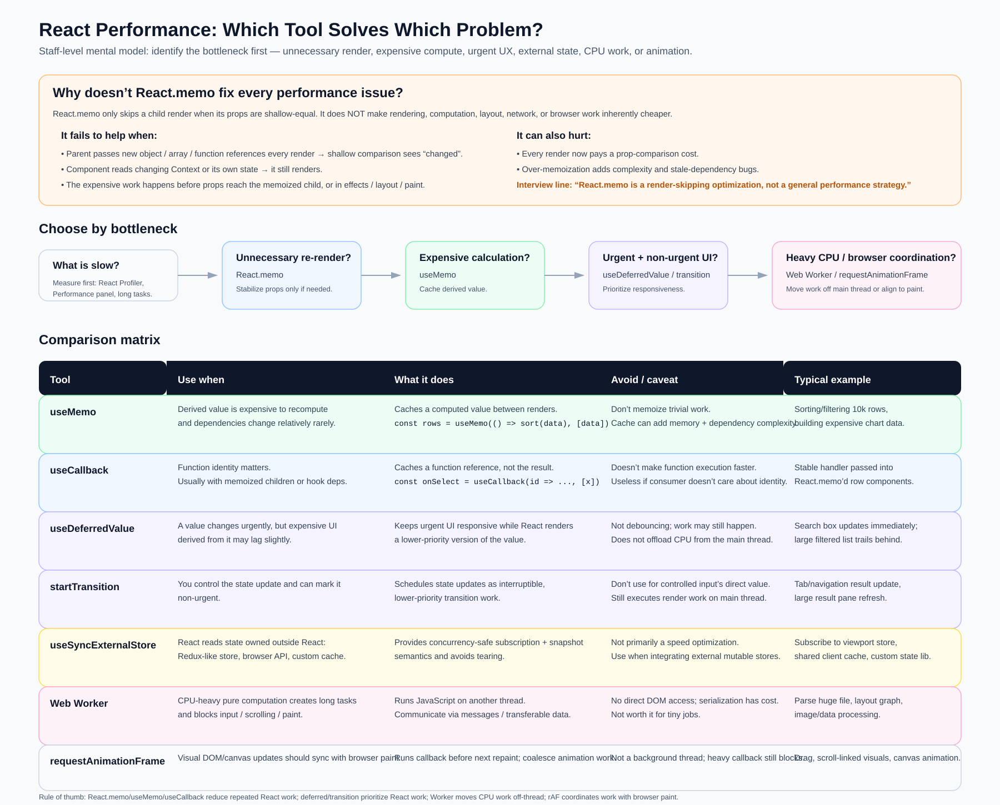

# React Performance — Which Tool Solves Which Problem



---

## Interview Summary

**The framing that earns staff-level signal:** don't reach for a tool, **identify the bottleneck first**. Every React performance API solves exactly one category of problem, and using the wrong one adds complexity without moving the metric.

| Bottleneck                                   | Tool                          |
| -------------------------------------------- | ----------------------------- |
| Unnecessary child re-render                  | `React.memo` (+ stable props) |
| Expensive derived computation                | `useMemo`                     |
| Function identity churn breaking memoization | `useCallback`                 |
| Urgent input vs. expensive downstream UI     | `useDeferredValue`            |
| A state update you own is non-urgent         | `startTransition`             |
| State owned outside React (tearing risk)     | `useSyncExternalStore`        |
| Long CPU tasks blocking the main thread      | Web Worker                    |
| Visual updates that must align with paint    | `requestAnimationFrame`       |

**Rule of thumb:** `React.memo` / `useMemo` / `useCallback` **reduce repeated React work**. `useDeferredValue` / `startTransition` **prioritize** React work. Web Workers **move CPU work off-thread**. `requestAnimationFrame` **coordinates** work with browser paint.

---

## Why doesn't `React.memo` fix every performance issue?

This is the single most common React performance interview question, and the answer separates senior from staff.

`React.memo` only skips a child render when its **props are shallow-equal**. It does **not** make rendering, computation, layout, network, or browser work inherently cheaper.

### It fails to help when

- **Parent passes new object / array / function references every render** — shallow comparison sees "changed," so the memo bails out every time. `<Row config=\{\{a: 1\}\} />` creates a new object on every parent render.
- **The component reads changing Context or its own state** — memoization only guards the props path. A context update or internal `setState` still triggers a render regardless.
- **The expensive work happens before props reach the memoized child** — if the parent is doing the heavy sort/filter, memoizing the child saves nothing. The cost was already paid upstream.
- **The cost is in effects, layout, or paint** — `React.memo` operates on the render phase only. It can't help with a slow `useLayoutEffect`, a forced synchronous reflow, or an expensive paint.

### It can also actively hurt

- Every render now pays a **prop-comparison cost** — for cheap components this is pure overhead.
- **Over-memoization adds complexity** and creates stale-dependency bugs when someone forgets to add a dep.

> **The interview line:** "`React.memo` is a render-skipping optimization, not a general performance strategy."

---

## Decision flow: choose by bottleneck

```
What is slow?
  (Measure first: React Profiler, Performance panel, long tasks)
        │
        ├─ Unnecessary re-render?          → React.memo (stabilize props only if needed)
        ├─ Expensive calculation?          → useMemo (cache derived value)
        ├─ Urgent + non-urgent UI?         → useDeferredValue / startTransition
        └─ Heavy CPU / browser coordination? → Web Worker / requestAnimationFrame
```

**Always measure before optimizing.** Use the React Profiler to find which components render and how long commits take, the Performance panel to find long tasks, and `PerformanceObserver` with `longtask` entries in production to catch main-thread blocking in the wild.

---

## Comparison Matrix

### `useMemo`

|                     |                                                                                   |
| ------------------- | --------------------------------------------------------------------------------- |
| **Use when**        | Derived value is expensive to recompute and dependencies change relatively rarely |
| **What it does**    | Caches a computed value between renders                                           |
| **Avoid / caveat**  | Don't memoize trivial work. Cache adds memory and dependency complexity           |
| **Typical example** | Sorting/filtering 10k rows, building expensive chart data                         |

```jsx
const rows = useMemo(() => sort(data), [data]);
```

### `useCallback`

|                     |                                                                                             |
| ------------------- | ------------------------------------------------------------------------------------------- |
| **Use when**        | Function identity matters — usually with memoized children or hook dependency arrays        |
| **What it does**    | Caches a **function reference**, not the result                                             |
| **Avoid / caveat**  | Doesn't make function execution faster. Useless if the consumer doesn't care about identity |
| **Typical example** | Stable handler passed into `React.memo`'d row components                                    |

```jsx
const onSelect = useCallback((id) => selectItem(id), [selectItem]);
```

**Key distinction:** `useMemo` caches a _value_; `useCallback` caches a _reference_. `useCallback(fn, deps)` is exactly `useMemo(() => fn, deps)`.

### `useDeferredValue`

|                     |                                                                                           |
| ------------------- | ----------------------------------------------------------------------------------------- |
| **Use when**        | A value changes urgently, but expensive UI derived from it may lag slightly               |
| **What it does**    | Keeps urgent UI responsive while React renders a lower-priority version of the value      |
| **Avoid / caveat**  | **Not debouncing** — the work may still happen. Does not offload CPU from the main thread |
| **Typical example** | Search box updates immediately; large filtered list trails behind                         |

```jsx
const [query, setQuery] = useState('');
const deferredQuery = useDeferredValue(query);
const results = useMemo(() => filter(items, deferredQuery), [items, deferredQuery]);
// input stays responsive; results render at lower priority
```

### `startTransition`

|                     |                                                                                                |
| ------------------- | ---------------------------------------------------------------------------------------------- |
| **Use when**        | You control the state update and can mark it non-urgent                                        |
| **What it does**    | Schedules state updates as interruptible, lower-priority transition work                       |
| **Avoid / caveat**  | Don't use for a controlled input's direct value. Still executes render work on the main thread |
| **Typical example** | Tab/navigation result update, large result pane refresh                                        |

```jsx
const [isPending, startTransition] = useTransition();

function onTabChange(tab) {
  setActiveTab(tab); // urgent — tab highlight updates instantly
  startTransition(() => {
    setTabContent(loadTab(tab)); // non-urgent — interruptible
  });
}
```

**`useDeferredValue` vs. `startTransition`:** use `startTransition` when you **own the setState call**; use `useDeferredValue` when the value arrives as a **prop or from state you don't control**.

### `useSyncExternalStore`

|                     |                                                                                       |
| ------------------- | ------------------------------------------------------------------------------------- |
| **Use when**        | React reads state owned outside React — Redux-like store, browser API, custom cache   |
| **What it does**    | Provides concurrency-safe subscription + snapshot semantics and **avoids tearing**    |
| **Avoid / caveat**  | **Not primarily a speed optimization** — use when integrating external mutable stores |
| **Typical example** | Subscribe to viewport store, shared client cache, custom state library                |

```jsx
const width = useSyncExternalStore(
  subscribeToResize,
  () => window.innerWidth, // client snapshot
  () => 1024 // server snapshot (SSR)
);
```

**Tearing** is the failure mode this prevents: under concurrent rendering, React can pause mid-render. If an external store mutates during that pause, different components in the same commit could read different values of the same store — an inconsistent UI. `useSyncExternalStore` forces a consistent snapshot.

### Web Worker

|                     |                                                                                      |
| ------------------- | ------------------------------------------------------------------------------------ |
| **Use when**        | CPU-heavy pure computation creates long tasks and blocks input / scrolling / paint   |
| **What it does**    | Runs JavaScript on **another thread**; communicates via messages / transferable data |
| **Avoid / caveat**  | No direct DOM access; serialization has cost. Not worth it for tiny jobs             |
| **Typical example** | Parse huge file, layout graph, image/data processing                                 |

```jsx
const worker = useMemo(() => new Worker(new URL('./parse.worker.js', import.meta.url)), []);

useEffect(() => {
  worker.onmessage = (e) => setParsed(e.data);
  worker.postMessage(rawBuffer, [rawBuffer]); // transferable — zero-copy
}, [worker, rawBuffer]);
```

**This is the only tool on this list that actually removes work from the main thread.** Everything else reschedules or skips React work — the CPU cost still lands on the main thread eventually.

### `requestAnimationFrame`

|                     |                                                                 |
| ------------------- | --------------------------------------------------------------- |
| **Use when**        | Visual DOM/canvas updates should sync with browser paint        |
| **What it does**    | Runs callback before the next repaint; coalesces animation work |
| **Avoid / caveat**  | **Not a background thread** — a heavy callback still blocks     |
| **Typical example** | Drag, scroll-linked visuals, canvas animation                   |

```jsx
useEffect(() => {
  let raf;
  const onScroll = () => {
    cancelAnimationFrame(raf);
    raf = requestAnimationFrame(() => updateParallax(window.scrollY));
  };
  window.addEventListener('scroll', onScroll, { passive: true });
  return () => {
    window.removeEventListener('scroll', onScroll);
    cancelAnimationFrame(raf);
  };
}, []);
```

**Why it matters:** it coalesces bursts of events (scroll fires far more often than the display refreshes) into one update per frame, and it runs at the right moment in the frame lifecycle to avoid layout thrashing.

---

## Common Anti-Patterns

| Anti-pattern                                           | Why it's wrong                                             | Do instead                                                          |
| ------------------------------------------------------ | ---------------------------------------------------------- | ------------------------------------------------------------------- |
| Wrapping every component in `React.memo`               | Adds comparison cost everywhere; masks the real bottleneck | Profile first, memoize the specific hot component                   |
| `useMemo` on trivial computations                      | Hook bookkeeping costs more than the work                  | Only memoize measurably expensive work                              |
| `useCallback` on handlers passed to plain DOM elements | DOM elements don't care about function identity            | Only stabilize callbacks consumed by memoized children or hook deps |
| Using `useDeferredValue` as a debounce                 | The work still runs — it's just lower priority             | Actually debounce if you want to _skip_ work                        |
| Moving trivial work to a Web Worker                    | Serialization overhead exceeds the compute saved           | Only offload genuinely long tasks (>50ms)                           |
| Optimizing before measuring                            | You'll optimize the wrong thing                            | React Profiler → Performance panel → then act                       |

---

## Interview Follow-ups

1. **"Why didn't `React.memo` help here?"** — Check whether the parent passes new object/array/function references each render, whether the component reads context, or whether the expensive work is upstream of the memo boundary entirely.

2. **"What's the difference between `useDeferredValue` and debouncing?"** — Debouncing _skips_ work by delaying and cancelling. `useDeferredValue` _still does_ the work, just at interruptible lower priority — the UI stays responsive but the CPU cost is unchanged.

3. **"When would `useCallback` be pointless?"** — When the consumer doesn't compare identity: passing a handler to a plain `<button onClick>`, or to a non-memoized child that re-renders anyway.

4. **"How do you decide between `startTransition` and a Web Worker?"** — `startTransition` reprioritizes _React render_ work on the main thread; it doesn't reduce total CPU. If a single task exceeds ~50ms and blocks input, no amount of React scheduling helps — you need a Worker.

5. **"What is tearing and which API prevents it?"** — Under concurrent rendering, an external store mutating mid-render can cause different components in one commit to read different values. `useSyncExternalStore` guarantees a consistent snapshot.

6. **"How would you measure this in production, not just locally?"** — `PerformanceObserver` on `longtask` entries, INP (Interaction to Next Paint) as the headline responsiveness metric, and React Profiler's `onRender` callback sampled to your telemetry pipeline.
