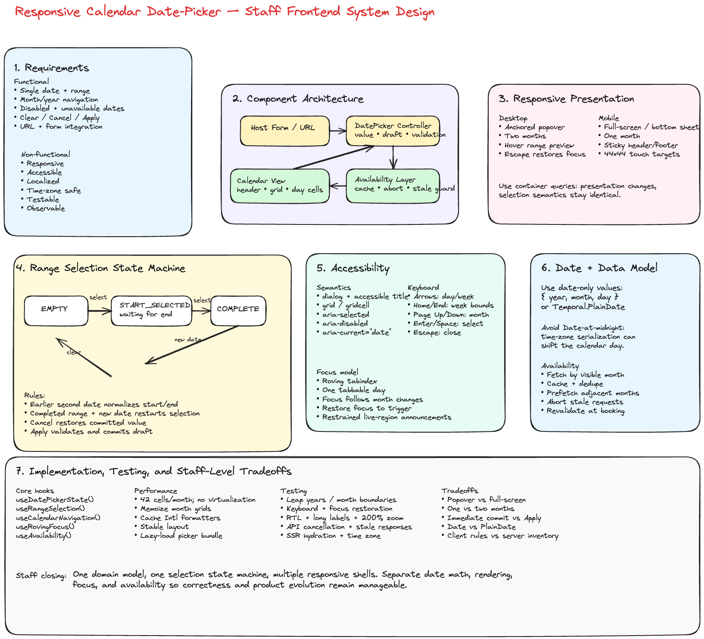

# Frontend System Design: Responsive Calendar Date Picker

## Implementation Snapshot

The snippet below is a staff-level starting point for a reusable, accessible date-picker. It keeps the core logic in a hook, separates calendar math from rendering, supports single-date and range selection, and leaves room for customization at the component boundary.

```tsx
import React, { useCallback, useEffect, useMemo, useRef, useState } from 'react';

type PlainDate = {
  year: number;
  month: number; // 1-12
  day: number;
};

type DateRange = {
  start: PlainDate | null;
  end: PlainDate | null;
};

type DatePickerMode = 'single' | 'range';

type DatePickerProps = {
  mode?: DatePickerMode;
  value?: PlainDate | DateRange | null;
  defaultValue?: PlainDate | DateRange | null;
  minDate?: PlainDate;
  maxDate?: PlainDate;
  disabledDates?: PlainDate[];
  weekStartsOn?: 0 | 1 | 2 | 3 | 4 | 5 | 6;
  onChange?: (value: PlainDate | DateRange | null) => void;
  onConfirm?: (value: PlainDate | DateRange | null) => void;
};

type CalendarCell = {
  date: PlainDate;
  inCurrentMonth: boolean;
  disabled: boolean;
  selected: boolean;
  inRange: boolean;
  rangeEdge: 'none' | 'start' | 'end' | 'both';
};

function pad(value: number) {
  return String(value).padStart(2, '0');
}

function toKey(date: PlainDate) {
  return `${date.year}-${pad(date.month)}-${pad(date.day)}`;
}

function toIsoString(date: PlainDate) {
  return toKey(date);
}

function compareDates(left: PlainDate, right: PlainDate) {
  if (left.year !== right.year) return left.year - right.year;
  if (left.month !== right.month) return left.month - right.month;
  return left.day - right.day;
}

function isSameDate(left: PlainDate | null, right: PlainDate | null) {
  if (!left || !right) return false;
  return compareDates(left, right) === 0;
}

function isDateInRange(date: PlainDate, start: PlainDate | null, end: PlainDate | null) {
  if (!start || !end) return false;
  return compareDates(date, start) >= 0 && compareDates(date, end) <= 0;
}

function startOfMonth(date: PlainDate) {
  return { year: date.year, month: date.month, day: 1 };
}

function addDays(date: PlainDate, delta: number) {
  const jsDate = new Date(Date.UTC(date.year, date.month - 1, date.day));
  jsDate.setUTCDate(jsDate.getUTCDate() + delta);

  return {
    year: jsDate.getUTCFullYear(),
    month: jsDate.getUTCMonth() + 1,
    day: jsDate.getUTCDate(),
  };
}

function addMonths(date: PlainDate, delta: number) {
  const jsDate = new Date(Date.UTC(date.year, date.month - 1, 1));
  jsDate.setUTCMonth(jsDate.getUTCMonth() + delta);

  return {
    year: jsDate.getUTCFullYear(),
    month: jsDate.getUTCMonth() + 1,
    day: 1,
  };
}

function isDisabledDate(
  date: PlainDate,
  options: {
    minDate?: PlainDate;
    maxDate?: PlainDate;
    disabledDates?: PlainDate[];
  }
) {
  const { minDate, maxDate, disabledDates } = options;
  if (minDate && compareDates(date, minDate) < 0) return true;
  if (maxDate && compareDates(date, maxDate) > 0) return true;
  if (disabledDates?.some((item) => isSameDate(item, date))) return true;
  return false;
}

function getMonthGrid(
  month: PlainDate,
  options: {
    weekStartsOn: 0 | 1 | 2 | 3 | 4 | 5 | 6;
    minDate?: PlainDate;
    maxDate?: PlainDate;
    disabledDates?: PlainDate[];
    selectedDate: PlainDate | null;
    range: DateRange | null;
  }
) {
  const { weekStartsOn, minDate, maxDate, disabledDates, selectedDate, range } = options;
  const firstDay = new Date(Date.UTC(month.year, month.month - 1, 1));
  const firstWeekday = firstDay.getUTCDay();
  const offset = (firstWeekday - weekStartsOn + 7) % 7;
  const gridStart = addDays(startOfMonth(month), -offset);
  const cells: CalendarCell[] = [];

  for (let index = 0; index < 42; index += 1) {
    const date = addDays(gridStart, index);
    const inCurrentMonth = date.month === month.month && date.year === month.year;
    const disabled = isDisabledDate(date, { minDate, maxDate, disabledDates });
    const selected =
      isSameDate(selectedDate, date) ||
      isSameDate(range?.start ?? null, date) ||
      isSameDate(range?.end ?? null, date);
    const inRange = isDateInRange(date, range?.start ?? null, range?.end ?? null);
    const rangeEdge =
      isSameDate(date, range?.start ?? null) && isSameDate(date, range?.end ?? null)
        ? 'both'
        : isSameDate(date, range?.start ?? null)
          ? 'start'
          : isSameDate(date, range?.end ?? null)
            ? 'end'
            : 'none';

    cells.push({ date, inCurrentMonth, disabled, selected, inRange, rangeEdge });
  }

  return cells;
}

function useDatePicker(props: DatePickerProps) {
  const {
    mode = 'single',
    value,
    defaultValue = null,
    minDate,
    maxDate,
    disabledDates = [],
    weekStartsOn = 0,
    onChange,
    onConfirm,
  } = props;

  const isControlled = value !== undefined;
  const [internalValue, setInternalValue] = useState<PlainDate | DateRange | null>(defaultValue);
  const selectedValue = isControlled ? (value ?? null) : internalValue;
  const selectedDate = mode === 'single' ? (selectedValue as PlainDate | null) : null;
  const selectedRange = mode === 'range' ? (selectedValue as DateRange | null) : null;

  const [open, setOpen] = useState(false);
  const [focusedMonth, setFocusedMonth] = useState<PlainDate>(() => {
    if (selectedDate) return startOfMonth(selectedDate);
    if (selectedRange?.start) return startOfMonth(selectedRange.start);
    return startOfMonth({
      year: new Date().getUTCFullYear(),
      month: new Date().getUTCMonth() + 1,
      day: 1,
    });
  });
  const [draftRange, setDraftRange] = useState<DateRange>({
    start: selectedRange?.start ?? null,
    end: selectedRange?.end ?? null,
  });
  const [draftDate, setDraftDate] = useState<PlainDate | null>(selectedDate ?? null);

  useEffect(() => {
    if (mode === 'range') {
      setDraftRange({ start: selectedRange?.start ?? null, end: selectedRange?.end ?? null });
      if (selectedRange?.start) setFocusedMonth(startOfMonth(selectedRange.start));
    } else {
      setDraftDate(selectedDate);
      if (selectedDate) setFocusedMonth(startOfMonth(selectedDate));
    }
  }, [mode, selectedDate, selectedRange?.start, selectedRange?.end]);

  const commitValue = useCallback(
    (nextValue: PlainDate | DateRange | null) => {
      if (!isControlled) {
        setInternalValue(nextValue);
      }
      onChange?.(nextValue);
    },
    [isControlled, onChange]
  );

  const selectDate = useCallback(
    (date: PlainDate) => {
      if (isDisabledDate(date, { minDate, maxDate, disabledDates })) return;

      if (mode === 'single') {
        commitValue(date);
        onConfirm?.(date);
        setOpen(false);
        return;
      }

      const current = draftRange;

      if (!current.start || (current.start && current.end)) {
        const nextRange = { start: date, end: null };
        setDraftRange(nextRange);
        commitValue(nextRange);
        return;
      }

      if (compareDates(date, current.start) < 0) {
        const nextRange = { start: date, end: current.start };
        setDraftRange(nextRange);
        commitValue(nextRange);
        return;
      }

      const nextRange = { start: current.start, end: date };
      setDraftRange(nextRange);
      commitValue(nextRange);
    },
    [commitValue, disabledDates, draftRange, maxDate, minDate, mode, onConfirm]
  );

  const clear = useCallback(() => {
    const nextValue = mode === 'single' ? null : { start: null, end: null };
    if (mode === 'single') {
      setDraftDate(null);
    } else {
      setDraftRange({ start: null, end: null });
    }
    commitValue(nextValue);
  }, [commitValue, mode]);

  const monthCells = useMemo(
    () =>
      getMonthGrid(focusedMonth, {
        weekStartsOn,
        minDate,
        maxDate,
        disabledDates,
        selectedDate: mode === 'single' ? draftDate : null,
        range: mode === 'range' ? draftRange : null,
      }),
    [focusedMonth, weekStartsOn, minDate, maxDate, disabledDates, mode, draftDate, draftRange]
  );

  return {
    open,
    setOpen,
    focusedMonth,
    setFocusedMonth,
    monthCells,
    selectDate,
    clear,
    selectedValue,
    draftDate,
    draftRange,
  };
}

export function DatePicker(props: DatePickerProps) {
  const {
    open,
    setOpen,
    focusedMonth,
    setFocusedMonth,
    monthCells,
    selectDate,
    clear,
    selectedValue,
  } = useDatePicker(props);
  const triggerRef = useRef<HTMLButtonElement | null>(null);

  return (
    <div className="date-picker">
      <button
        ref={triggerRef}
        type="button"
        aria-haspopup="dialog"
        aria-expanded={open}
        onClick={() => setOpen((current) => !current)}
      >
        {selectedValue
          ? toIsoString(
              Array.isArray(selectedValue) ? (selectedValue[0] ?? selectedValue) : selectedValue
            )
          : 'Select date'}
      </button>

      {open && (
        <div role="dialog" aria-label="Date picker" className="date-picker__popup">
          <div className="date-picker__header">
            <button type="button" onClick={() => setFocusedMonth(addMonths(focusedMonth, -1))}>
              Prev
            </button>
            <strong>{`${focusedMonth.year}-${pad(focusedMonth.month)}`}</strong>
            <button type="button" onClick={() => setFocusedMonth(addMonths(focusedMonth, 1))}>
              Next
            </button>
          </div>

          <div className="date-picker__grid" role="grid" aria-label="Calendar month">
            {monthCells.map((cell) => (
              <button
                key={toKey(cell.date)}
                type="button"
                role="gridcell"
                aria-selected={cell.selected}
                disabled={cell.disabled}
                className={[
                  'date-picker__day',
                  cell.inCurrentMonth ? 'date-picker__day--current' : 'date-picker__day--adjacent',
                  cell.inRange ? 'date-picker__day--range' : '',
                  cell.rangeEdge !== 'none' ? `date-picker__day--${cell.rangeEdge}` : '',
                ]
                  .filter(Boolean)
                  .join(' ')}
                onClick={() => selectDate(cell.date)}
              >
                {cell.date.day}
              </button>
            ))}
          </div>

          <div className="date-picker__actions">
            <button type="button" onClick={clear}>
              Clear
            </button>
            <button type="button" onClick={() => setOpen(false)}>
              Close
            </button>
          </div>
        </div>
      )}
    </div>
  );
}
```

## Interview Prompt

Design a responsive calendar date-picker that supports:

- Single-date and date-range selection
- Desktop, tablet, and mobile layouts
- Keyboard and screen-reader accessibility
- Disabled and unavailable dates
- Localization, time zones, and different week starts
- Fast rendering and smooth month navigation
- Integration with forms, search URLs, and backend availability APIs

The goal is not just to build a calendar grid. The Staff-level discussion should establish a durable component contract, clear state ownership, accessibility semantics, responsive behavior, and a strategy for correctness around dates and time zones.

---

## 1. Start With Requirements

### Functional requirements

1. Open the picker from an input or button.
2. Display the current month and allow previous/next navigation.
3. Select a single date or a start/end range.
4. Show leading and trailing days from adjacent months.
5. Disable dates based on:
   - Minimum and maximum dates
   - Past dates
   - Product rules
   - Backend availability
6. Support clearing and applying the selection.
7. Preserve a draft range while the picker is open.
8. Render one month on mobile and one or two months on larger screens.
9. Allow direct month/year navigation when the supported date range is large.
10. Return a stable, typed value to the host application.

### Non-functional requirements

- Accessible by keyboard and screen reader
- No layout shift when navigating months
- Responsive from small mobile screens to wide desktop surfaces
- Deterministic date calculations across time zones and daylight-saving changes
- Extensible to booking, travel, analytics, and scheduling products
- Testable without depending on the machine's local clock
- Fast enough to render and navigate without visible delay
- Observable: open rate, selection completion, validation failures, and API latency

---

## 2. Clarify the Product Semantics

Before choosing components, clarify these questions:

- Is the selected value a **calendar date** or an exact timestamp?
- Is the range end inclusive?
- Can the user select the same start and end date?
- Are unavailable dates fetched per month?
- Can a valid range cross unavailable dates?
- Should selecting a new date after a completed range restart the range?
- Does the host commit immediately or only after pressing Apply?
- Should mobile use a modal, bottom sheet, or full-screen route?
- Which locale and time zone control visible labels and availability rules?

A date-picker usually selects a **date without a time**. Avoid representing that domain value as a JavaScript `Date` at midnight because serialization and time-zone conversion can shift the calendar day.

```ts
type PlainDate = {
  year: number;
  month: number; // 1-12
  day: number;
};

type DateRange = {
  start: PlainDate | null;
  end: PlainDate | null;
};
```

At system boundaries, use an ISO calendar-date string:

```ts
type ISODate = `${number}-${number}-${number}`;
// Example: "2026-07-16"
```

---

## 3. High-Level Architecture

```text
Host Form / Search Page
        |
        v
DatePicker Controller
  - controlled value
  - draft selection
  - open/close state
  - validation
        |
        +-----------------------+
        |                       |
        v                       v
Calendar View              Availability Layer
  - header                 - month cache
  - weekday labels         - deduped requests
  - month grid             - loading/error state
  - day cells              - stale response protection
        |
        v
Date Domain Utilities
  - addMonths
  - startOfMonth
  - compareDate
  - generateMonthGrid
  - locale/week-start rules
```

### Separation of responsibilities

**DatePicker controller**

- Owns the selection state machine
- Decides when to commit or cancel
- Coordinates focus when the picker opens and closes
- Exposes a controlled component API

**Calendar view**

- Purely renders derived month data
- Emits semantic user intents such as `selectDate`, `nextMonth`, and `focusDate`
- Does not own business-specific availability logic

**Date domain utilities**

- Perform date-only calculations
- Avoid hidden dependence on local time
- Are independently unit tested

**Availability layer**

- Fetches and caches month-level availability
- Exposes `available`, `unavailable`, `loading`, or `unknown`
- Prevents stale responses from replacing newer month data

---

## 4. Public Component API

```ts
type SelectionMode = 'single' | 'range';

type DatePickerProps = {
  mode: SelectionMode;
  value: PlainDate | DateRange | null;
  onChange: (value: PlainDate | DateRange | null) => void;

  minDate?: PlainDate;
  maxDate?: PlainDate;
  isDateDisabled?: (date: PlainDate) => boolean;

  locale?: string;
  timeZone?: string;
  firstDayOfWeek?: 0 | 1 | 2 | 3 | 4 | 5 | 6;

  numberOfMonths?: 1 | 2;
  requireApply?: boolean;

  onMonthChange?: (visibleMonth: PlainDate) => void;
  loadAvailability?: (
    month: PlainDate,
    signal: AbortSignal
  ) => Promise<Record<string, 'available' | 'unavailable'>>;
};
```

### Controlled versus uncontrolled

Prefer a controlled `value` and `onChange` contract for production systems. It integrates cleanly with:

- Form libraries
- URL state
- Server-rendered search pages
- Validation
- Analytics
- Cross-field constraints such as check-in/check-out

Internal state should still be used for ephemeral UI state:

```ts
type DatePickerUIState = {
  isOpen: boolean;
  visibleMonth: PlainDate;
  focusedDate: PlainDate;
  draftSelection: PlainDate | DateRange | null;
};
```

---

## 5. Selection State Machine

Range selection is easiest to reason about as a state machine.

```text
EMPTY
  select date
    -> START_SELECTED

START_SELECTED
  select earlier date
    -> COMPLETE_RANGE with dates normalized
  select same/later date
    -> COMPLETE_RANGE

COMPLETE_RANGE
  select any date
    -> START_SELECTED with new start

CANCEL
  restore committed value

APPLY
  validate and commit draft value
```

Example reducer:

```ts
type RangeState =
  | { status: 'empty'; start: null; end: null }
  | { status: 'selectingEnd'; start: PlainDate; end: null }
  | { status: 'complete'; start: PlainDate; end: PlainDate };

type RangeAction = { type: 'SELECT_DATE'; date: PlainDate } | { type: 'CLEAR' };

function rangeReducer(state: RangeState, action: RangeAction): RangeState {
  if (action.type === 'CLEAR') {
    return { status: 'empty', start: null, end: null };
  }

  const date = action.date;

  if (state.status === 'empty' || state.status === 'complete') {
    return { status: 'selectingEnd', start: date, end: null };
  }

  if (compareDate(date, state.start) < 0) {
    return {
      status: 'complete',
      start: date,
      end: state.start,
    };
  }

  return {
    status: 'complete',
    start: state.start,
    end: date,
  };
}
```

A reducer makes transitions explicit and avoids scattered conditionals across click, keyboard, hover, and mobile interactions.

---

## 6. Month Grid Generation

A month view usually has six rows so its height stays stable while users navigate.

```ts
type CalendarCell = {
  date: PlainDate;
  isInVisibleMonth: boolean;
  isToday: boolean;
  isDisabled: boolean;
};

function generateMonthGrid(visibleMonth: PlainDate, firstDayOfWeek: number): CalendarCell[] {
  const monthStart = startOfMonth(visibleMonth);
  const leadingDays = (dayOfWeek(monthStart) - firstDayOfWeek + 7) % 7;

  const gridStart = addDays(monthStart, -leadingDays);

  return Array.from({ length: 42 }, (_, index) => {
    const date = addDays(gridStart, index);

    return {
      date,
      isInVisibleMonth: date.year === visibleMonth.year && date.month === visibleMonth.month,
      isToday: isSameDate(date, today()),
      isDisabled: false,
    };
  });
}
```

Use a fixed 42-cell grid when avoiding layout movement is more important than minimizing DOM nodes. Rendering 42 or 84 cells is inexpensive, so virtualization is unnecessary.

---

## 7. Responsive Design

### Desktop

- Popover anchored to the input
- Two months when space allows
- Persistent Apply/Clear controls when required
- Hover preview for date ranges
- Escape closes and restores focus to the trigger

### Tablet

- One or two months depending on available width
- Avoid relying on hover
- Larger touch targets
- Popover may become a centered dialog

### Mobile

- Full-screen dialog or bottom sheet
- One vertically scrollable month at a time, or several stacked months
- Sticky header and footer
- Explicit Cancel and Apply actions
- Minimum 44×44 CSS-pixel touch targets
- Body scroll locked while the modal is open

Prefer CSS container queries when the picker may be embedded in sidebars, dialogs, and cards. Viewport media queries alone cannot tell how much space the component actually has.

```css
.datePicker {
  container-type: inline-size;
}

.months {
  display: grid;
  grid-template-columns: 1fr;
}

@container (min-width: 42rem) {
  .months {
    grid-template-columns: repeat(2, minmax(18rem, 1fr));
  }
}
```

Use responsive layout for presentation, but preserve the same selection state machine and date semantics across form factors.

---

## 8. Accessibility

The calendar grid should use the WAI-ARIA grid interaction model.

### Semantics

- Trigger: button or combobox-like input with `aria-expanded`
- Container: dialog with an accessible title
- Month: `role="grid"`
- Weekdays: column headers
- Dates: `role="gridcell"`
- Selected date: `aria-selected="true"`
- Disabled date: `aria-disabled="true"`
- Current date: `aria-current="date"`

### Keyboard behavior

- Arrow keys: move by one day or one week
- Home/End: move to start/end of week
- Page Up/Page Down: previous/next month
- Shift + Page Up/Page Down: previous/next year
- Enter or Space: select focused date
- Escape: close picker
- Tab: move to surrounding controls rather than every date

Use **roving tabindex**: only the focused date has `tabIndex=\{0\}`; all other day cells have `tabIndex=\{-1\}`.

```tsx
<button
  role="gridcell"
  tabIndex={isFocused ? 0 : -1}
  aria-selected={isSelected}
  aria-disabled={isDisabled}
  aria-current={isToday ? 'date' : undefined}
  onKeyDown={handleDayKeyDown}
  onClick={() => !isDisabled && onSelect(date)}
>
  {date.day}
</button>
```

When keyboard navigation crosses a month boundary:

1. Update `visibleMonth`.
2. Render the new month.
3. Move focus to the corresponding day.
4. Announce the new month through a restrained live region.

Do not announce every pointer hover or every day during rapid arrow-key movement.

---

## 9. Internationalization and Time Zones

Use locale-aware formatting:

```ts
const monthFormatter = new Intl.DateTimeFormat(locale, {
  month: 'long',
  year: 'numeric',
  timeZone,
});

const weekdayFormatter = new Intl.DateTimeFormat(locale, {
  weekday: 'short',
  timeZone,
});
```

Key concerns:

- Week start differs by locale
- Gregorian calendar may not be sufficient for all products
- Month and weekday labels vary in length
- Right-to-left layouts reverse visual navigation expectations
- A date chosen in one time zone must not shift after serialization
- Backend availability should declare which business time zone owns the date

Prefer `Temporal.PlainDate` when available in the target environment or through an approved polyfill. Otherwise, use a small date-only domain type and isolate conversions to `Date`.

---

## 10. Availability and Data Fetching

For booking products, availability may be asynchronous.

### API shape

```http
GET /availability?start=2026-07-01&end=2026-08-31
```

```json
{
  "dates": {
    "2026-07-16": "available",
    "2026-07-17": "unavailable"
  },
  "version": "inventory-1842"
}
```

### Frontend strategy

- Fetch by visible month or a two-month window
- Prefetch the next and previous month after the current month loads
- Cache by `resourceId + month + timeZone`
- Deduplicate concurrent requests
- Abort requests when the picker closes or dependencies change
- Ignore stale responses
- Render unknown dates conservatively based on product policy

```ts
useEffect(() => {
  const controller = new AbortController();

  loadAvailability(visibleMonth, controller.signal)
    .then((result) => {
      setAvailability((current) => ({
        ...current,
        [monthKey(visibleMonth)]: result,
      }));
    })
    .catch((error) => {
      if (error.name !== 'AbortError') {
        setAvailabilityError(error);
      }
    });

  return () => controller.abort();
}, [visibleMonth, loadAvailability]);
```

For high-demand inventory, availability shown in the picker is advisory. Revalidate during the final booking transaction because another user may consume the inventory.

---

## 11. Rendering and Performance

A typical two-month picker renders fewer than 100 date cells. Focus on correctness and interaction latency rather than virtualization.

Useful optimizations:

- Memoize generated month grids
- Keep stable callback identities where useful
- Cache `Intl.DateTimeFormat` instances
- Avoid recalculating disabled rules multiple times per cell
- Prefetch adjacent months
- Use skeleton or subtle loading state without changing layout
- Avoid global state updates for pointer hover
- Lazy-load the date-picker bundle if it is not needed during initial render

Performance goals:

- Open interaction under 100 ms after bundle is available
- Month navigation feels immediate
- No cumulative layout shift
- Availability API latency and error rate are instrumented
- Keyboard navigation does not trigger unnecessary network requests per day

---

## 12. React Component Structure

```text
<DatePicker>
  <DatePickerTrigger />
  <ResponsiveOverlay>
    <DatePickerDialog>
      <CalendarHeader />
      <WeekdayHeader />
      <CalendarMonths>
        <CalendarMonth>
          <CalendarGrid>
            <DayCell />
          </CalendarGrid>
        </CalendarMonth>
      </CalendarMonths>
      <DatePickerFooter />
    </DatePickerDialog>
  </ResponsiveOverlay>
</DatePicker>
```

Suggested hooks:

```ts
useDatePickerState();
useRangeSelection();
useCalendarNavigation();
useRovingFocus();
useAvailability();
useResponsiveOverlay();
```

Keep `DayCell` mostly presentational. Put navigation, selection, and availability orchestration in hooks or the controller.

---

## 13. URL and Form Integration

For a travel search page, selected dates should be reflected in the URL:

```text
/search?checkIn=2026-07-16&checkOut=2026-07-20
```

Benefits:

- Bookmarkable searches
- Shareable results
- Correct browser back/forward behavior
- Server rendering and SEO-compatible landing pages
- State restoration after refresh

The page owns URL synchronization; the date-picker should expose plain values rather than directly modifying browser history.

---

## 14. Error and Edge Cases

Discuss these explicitly:

- Empty text or missing selection
- Leap years and February 29
- Month and year boundaries
- Minimum date after maximum date
- Start date becomes unavailable after selection
- End date before start date
- Range includes blocked dates
- Availability request fails
- Locale changes while picker is open
- Time zone changes after hydration
- Server and client disagree on today's date
- Trigger unmounts while dialog is open
- Rapid previous/next navigation produces stale API responses
- Mobile browser viewport changes when the virtual keyboard opens

---

## 15. Testing Strategy

### Unit tests

- Date comparison and arithmetic
- Month grid generation
- Leap years
- Week-start calculation
- Selection reducer
- Disabled-date rules
- Range normalization

### Component tests

- Mouse, touch, and keyboard selection
- Roving tabindex
- Focus restoration
- Screen-reader attributes
- Responsive one-month/two-month rendering
- Cancel versus Apply behavior
- Loading and failed availability states

### Integration tests

- Form validation
- URL synchronization
- API cancellation and stale-response protection
- Server-rendered hydration
- Locale and time-zone combinations

### Visual and accessibility tests

- Mobile, tablet, and desktop snapshots
- Long month names
- RTL layout
- High contrast and forced-colors mode
- 200% zoom
- Automated accessibility checks plus manual keyboard and screen-reader testing

---

## 16. Observability and Product Metrics

Instrument user intents rather than raw DOM events:

```ts
type DatePickerEvent =
  | { type: 'picker_opened'; mode: SelectionMode }
  | { type: 'month_navigated'; direction: 'previous' | 'next' }
  | { type: 'date_selected'; selectionStage: 'start' | 'end' }
  | { type: 'selection_applied'; rangeLength?: number }
  | { type: 'availability_failed'; month: string };
```

Track:

- Picker open-to-completion conversion
- Time to complete selection
- Validation error rate
- Availability API P50/P95/P99 latency
- API failure and cancellation rates
- Abandonment by device class
- Keyboard interaction success in usability testing

Avoid logging exact travel dates when privacy requirements classify them as sensitive product behavior.

---

## 17. Tradeoffs

### Popover versus full-screen picker

- Popover preserves context and is efficient on desktop.
- Full-screen or bottom-sheet UI improves touch usability on mobile.
- Use one state model with multiple presentation shells.

### One month versus two months

- One month is compact and works on mobile.
- Two months make range selection easier on desktop.
- Choose through container-aware responsive behavior.

### `Date` versus date-only representation

- `Date` is built in but represents an instant and can shift across time zones.
- A plain date domain model is safer for calendar selection.
- Convert to timestamps only when the product requires a specific instant.

### Client-only versus server-provided availability

- Client rules handle static restrictions quickly.
- Server availability is authoritative but introduces latency and races.
- Combine cached advisory availability with final server validation.

### Immediate commit versus Apply button

- Immediate commit is faster for simple single-date selection.
- Draft plus Apply is safer for range selection and mobile workflows.
- Make this a product-level option, not a forked implementation.

---

## 18. Staff-Level Closing Answer

> I would model the picker as a controlled date-domain component with a separate UI state machine for open state, visible month, focus, and draft range selection. The date value should be a date-only representation rather than a timestamp. A shared controller would power a desktop popover and a mobile full-screen or bottom-sheet presentation. The calendar uses a fixed month grid, roving tabindex, WAI-ARIA grid semantics, and locale-aware labels. Availability is fetched and cached by month with cancellation and stale-response protection, but final availability is revalidated during booking. I would keep date arithmetic, rendering, selection, and data fetching separated so each can be tested and evolved independently.
