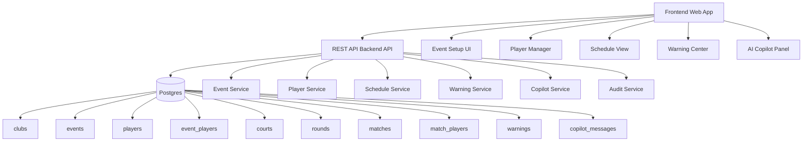

# Tourney Copilot: Staff-Level End-to-End System Design

## Goal

Build Tourney Copilot, an AI-assisted tournament operations platform that helps club operators create, manage, schedule, and optimize pickleball round-robin tournaments.

The system should allow operators to:

- Create tournaments
- Manage player rosters
- Generate round-robin schedules
- Detect operational issues automatically
- Receive AI-powered recommendations
- Handle player dropouts and schedule changes safely

---

# 1. High-Level Architecture

---

# 2. Architecture Philosophy

This is primarily an operational workflow system, not an AI product.

AI should help operators make decisions, but AI should never become the source of truth.

Core principles:

~~~text
Database = Source of Truth Backend Services = Business Logic AI = Advisor Frontend = Workflow Layer
~~~

The system must guarantee:

- No duplicate players
- No duplicate matches
- No court conflicts
- No player double-booking
- Safe handling of player dropouts
- Auditable schedule changes

---

# 3. Service Architecture

## Event Service

Responsible for tournament lifecycle management.

### Responsibilities

- Create event
- Update settings
- Validate event readiness
- Manage event status transitions

### Lifecycle

~~~text
Draft ↓ Scheduled ↓ Active ↓ Completed ↓ Archived
~~~

---

## Player Service

Manages player registration and roster operations.

### Responsibilities

- Add player
- Remove player
- Manage waitlist
- Handle player dropout
- Prevent duplicate registration

---

## Schedule Service

Responsible for generating tournament schedules.

### Responsibilities

- Generate round-robin schedule
- Regenerate schedules
- Simulate schedule modifications
- Court assignment
- Bye allocation

### Important Principle

The schedule engine should be deterministic.

~~~text
AI may recommend schedule changes. AI should never generate final schedules directly.
~~~

---

## Warning Service

Responsible for identifying operational issues.

### Example Warnings

~~~text
Odd number of players Too few courts Duplicate matchup Court conflict Player scheduled twice in same round Uneven bye distribution Dropped player still assigned Missing scores
~~~

Warnings should be deterministic and testable.

---

## Copilot Service

Provides AI-powered recommendations.

### Example Questions

~~~text
How can I make this schedule fairer? What should I do if one player drops out? Which players have the most byes? Do I have enough courts?
~~~

### Tool-Based Architecture

The LLM receives tournament state through tools.

~~~text
getEventSummary() getSchedule() getWarnings() analyzeFairness() simulateDropout()
~~~

The AI never queries the database directly.

---

# 4. Database Design

## clubs

~~~sql
CREATE TABLE clubs ( id UUID PRIMARY KEY, name TEXT NOT NULL, created_at TIMESTAMPTZ NOT NULL );
~~~

---

## events

~~~sql
CREATE TABLE events ( id UUID PRIMARY KEY, club_id UUID REFERENCES clubs(id), name TEXT NOT NULL, format TEXT NOT NULL, status TEXT NOT NULL, start_time TIMESTAMPTZ, created_at TIMESTAMPTZ NOT NULL );
~~~

---

## event_settings

~~~sql
CREATE TABLE event_settings ( event_id UUID PRIMARY KEY REFERENCES events(id), court_count INT NOT NULL, games_per_match INT NOT NULL, max_players INT, scoring_format TEXT );
~~~

---

## players

~~~sql
CREATE TABLE players ( id UUID PRIMARY KEY, club_id UUID REFERENCES clubs(id), name TEXT NOT NULL, email TEXT, skill_level TEXT, created_at TIMESTAMPTZ NOT NULL );
~~~

---

## event_players

~~~sql
CREATE TABLE event_players ( id UUID PRIMARY KEY, event_id UUID REFERENCES events(id), player_id UUID REFERENCES players(id), status TEXT NOT NULL, seed INT, created_at TIMESTAMPTZ NOT NULL, UNIQUE(event_id, player_id) );
~~~

---

## courts

~~~sql
CREATE TABLE courts ( id UUID PRIMARY KEY, event_id UUID REFERENCES events(id), name TEXT NOT NULL );
~~~

---

## rounds

~~~sql
CREATE TABLE rounds ( id UUID PRIMARY KEY, event_id UUID REFERENCES events(id), round_number INT NOT NULL, UNIQUE(event_id, round_number) );
~~~

---

## matches

~~~sql
CREATE TABLE matches ( id UUID PRIMARY KEY, event_id UUID REFERENCES events(id), round_id UUID REFERENCES rounds(id), court_id UUID REFERENCES courts(id), scheduled_order INT NOT NULL, status TEXT NOT NULL );
~~~

---

## match_players

~~~sql
CREATE TABLE match_players ( id UUID PRIMARY KEY, match_id UUID REFERENCES matches(id), player_id UUID REFERENCES players(id), side TEXT NOT NULL, UNIQUE(match_id, player_id) );
~~~

---

## warnings

~~~sql
CREATE TABLE warnings ( id UUID PRIMARY KEY, event_id UUID REFERENCES events(id), type TEXT NOT NULL, severity TEXT NOT NULL, message TEXT NOT NULL, context JSONB, resolved_at TIMESTAMPTZ, created_at TIMESTAMPTZ NOT NULL );
~~~

---

## copilot_messages

~~~sql
CREATE TABLE copilot_messages ( id UUID PRIMARY KEY, event_id UUID REFERENCES events(id), role TEXT NOT NULL, content TEXT NOT NULL, tool_name TEXT, tool_result JSONB, created_at TIMESTAMPTZ NOT NULL );
~~~

---

# 5. Why SQL Instead of Document Database

## SQL Strengths

Tournament systems are highly relational.

~~~text
Event ├── Players ├── Courts ├── Rounds └── Matches ├── Players └── Scores
~~~

Common queries:

- Find all matches for a player
- Detect duplicate matchups
- Count player byes
- Identify court utilization
- Analyze fairness metrics

SQL excels at these operations.

---

## Transaction Safety

Schedule generation requires atomicity.

~~~text
Create Rounds Create Matches Assign Courts Assign Players Generate Warnings
~~~

Either all succeed or all fail.

~~~sql
BEGIN; ... COMMIT;
~~~

Document databases generally require additional complexity for this level of consistency.

---

## Future Analytics

The product will eventually need:

~~~text
Player participation trends Court utilization Win rates Fairness metrics Tournament statistics
~~~

SQL is significantly better suited for analytical workloads.

---

## Recommended Hybrid Approach

Use relational tables for operational data.

Use JSONB for flexible AI metadata.

~~~sql
warnings.context JSONB copilot_messages.tool_result JSONB events.metadata JSONB
~~~

This provides both structure and flexibility.

---

# 6. API Design

## Event APIs

### Create Event

~~~http
POST /api/events
~~~

### Get Event

~~~http
GET /api/events/:eventId
~~~

### Update Event

~~~http
PATCH /api/events/:eventId
~~~

---

## Player APIs

### Add Player

~~~http
POST /api/events/:eventId/players
~~~

### Remove Player

~~~http
DELETE /api/events/:eventId/players/:playerId
~~~

### Update Player Status

~~~http
PATCH /api/events/:eventId/players/:playerId/status
~~~

---

## Schedule APIs

### Generate Schedule

~~~http
POST /api/events/:eventId/schedule/generate
~~~

### Get Schedule

~~~http
GET /api/events/:eventId/schedule
~~~

### Regenerate Schedule

~~~http
POST /api/events/:eventId/schedule/regenerate
~~~

### Simulate Dropout

~~~http
POST /api/events/:eventId/schedule/simulate-dropout
~~~

---

## Warning APIs

~~~http
GET /api/events/:eventId/warnings
~~~

~~~http
POST /api/events/:eventId/warnings/recalculate
~~~

---

## Copilot APIs

~~~http
POST /api/events/:eventId/copilot/messages
~~~

~~~http
GET /api/events/:eventId/copilot/messages
~~~

---

# 7. Schedule Generation Flow

~~~text
User clicks Generate Schedule ↓ Load event settings ↓ Load active players ↓ Validate inputs ↓ Generate round-robin schedule ↓ Save rounds ↓ Save matches ↓ Generate warnings ↓ Return schedule
~~~

All steps occur inside a transaction.

---

# 8. Round-Robin Scheduling Algorithm

## Circle Method

When player count is odd:

~~~text
Add BYE placeholder
~~~

Example:

~~~text
P1 P2 P3 P4 P5 BYE
~~~

For each round:

~~~text
Pair first half with second half Rotate players Assign courts Repeat
~~~

Complexity:

~~~text
O(n²)
~~~

which is acceptable for club-sized tournaments.

---

# 9. Warning Engine

Warnings should be rule-based.

~~~ts
type WarningRule = { type: string; severity: "info" | "warning" | "critical"; evaluate(state: TournamentState): Warning[]; };
~~~

Example rules:

~~~text
OddPlayerCountRule TooFewCourtsRule DuplicateMatchupRule CourtConflictRule PlayerDoubleBookedRule ByeBalanceRule DropoutImpactRule
~~~

Benefits:

- Deterministic
- Explainable
- Testable
- Reliable

---

# 10. AI Copilot Architecture

~~~text
Copilot UI ↓ Copilot API ↓ LLM Orchestrator ↓ Tool Layer ↓ Event Service Schedule Service Warning Service
~~~

---

## Example Interaction

User:

~~~text
How can I make this schedule fairer?
~~~

Tool calls:

~~~text
getEventSummary() getSchedule() analyzeFairness()
~~~

Response:

~~~text
Player A has two byes while others have one. Recommendation: - Add one additional player - Regenerate schedule
~~~

---

# 11. Frontend Architecture

## Pages

~~~text
/events/:eventId
~~~

---

## Components

~~~text
EventSettingsForm PlayerManager ScheduleTable WarningPanel CopilotPanel SuggestedActions
~~~

---

## State Management

### Server State

~~~text
TanStack Query
~~~

Used for:

- Event data
- Schedule
- Players
- Warnings

---

### Local State

Used for:

- Form inputs
- Draft edits
- Copilot prompt input

---

## Layout

~~~text
-------------------------------------------------- Event Header -------------------------------------------------- Left Column ├── Event Settings ├── Players └── Warnings Right Column ├── Schedule └── AI Copilot --------------------------------------------------
~~~

---

# 12. Reliability & Safety

## Transactions

Use transactions for:

~~~text
Schedule generation Schedule regeneration Player dropout workflows
~~~

---

## Audit Logs

~~~sql
CREATE TABLE audit_logs ( id UUID PRIMARY KEY, event_id UUID, actor_id UUID, action TEXT, before_state JSONB, after_state JSONB, created_at TIMESTAMPTZ );
~~~

Track:

~~~text
Schedule regeneration Player removal Court changes AI-approved actions
~~~

---

## AI Safety

Never allow:

~~~text
LLM → Database
~~~

Always require:

~~~text
LLM Suggestion ↓ User Approval ↓ Backend API ↓ Database Update
~~~

---

# 13. Observability

Track business metrics.

### Events

~~~text
event_created player_added schedule_generated schedule_regenerated warning_created copilot_message_sent copilot_action_accepted
~~~

---

### System Metrics

~~~text
Schedule generation latency Copilot response latency Warning count Regeneration rate Player dropout frequency
~~~

---

# 14. MVP Roadmap

## Phase 1

~~~text
Create event Manage players Generate schedule Show warnings
~~~

---

## Phase 2

~~~text
AI copilot Dropout simulation Suggested actions Audit logs
~~~

---

## Phase 3

~~~text
Doubles support Manual schedule editing Skill balancing Notifications Live scoring
~~~

---

# Final Recommendation

Build as a modular monolith initially:

~~~text
Frontend: Next.js + React Backend: Node.js / NestJS Database: PostgreSQL AI: LLM + Tool Calling Infrastructure: Docker + Kubernetes (optional initially)
~~~

### Core Principles

~~~text
Postgres is the source of truth. Scheduling is deterministic. Warnings are rule-based. AI provides recommendations only. All mutations go through audited APIs.
~~~

This architecture optimizes for:

- Fast MVP delivery
- Operational correctness
- Future AI expansion
- Maintainability
- Scalability
- Auditability
