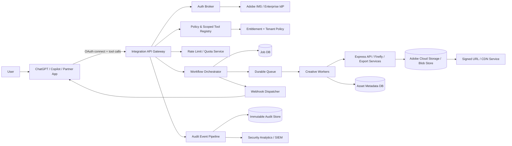
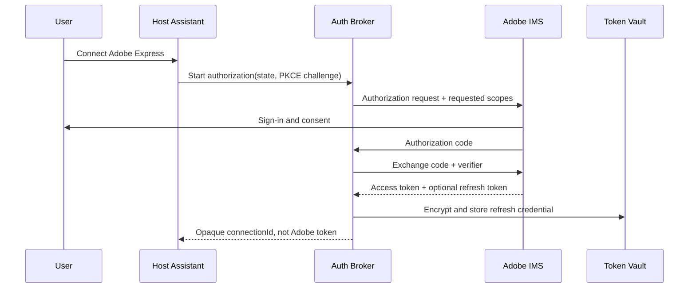
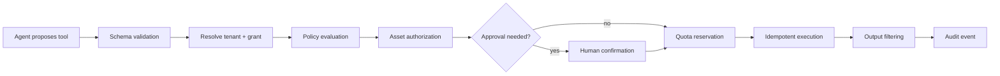
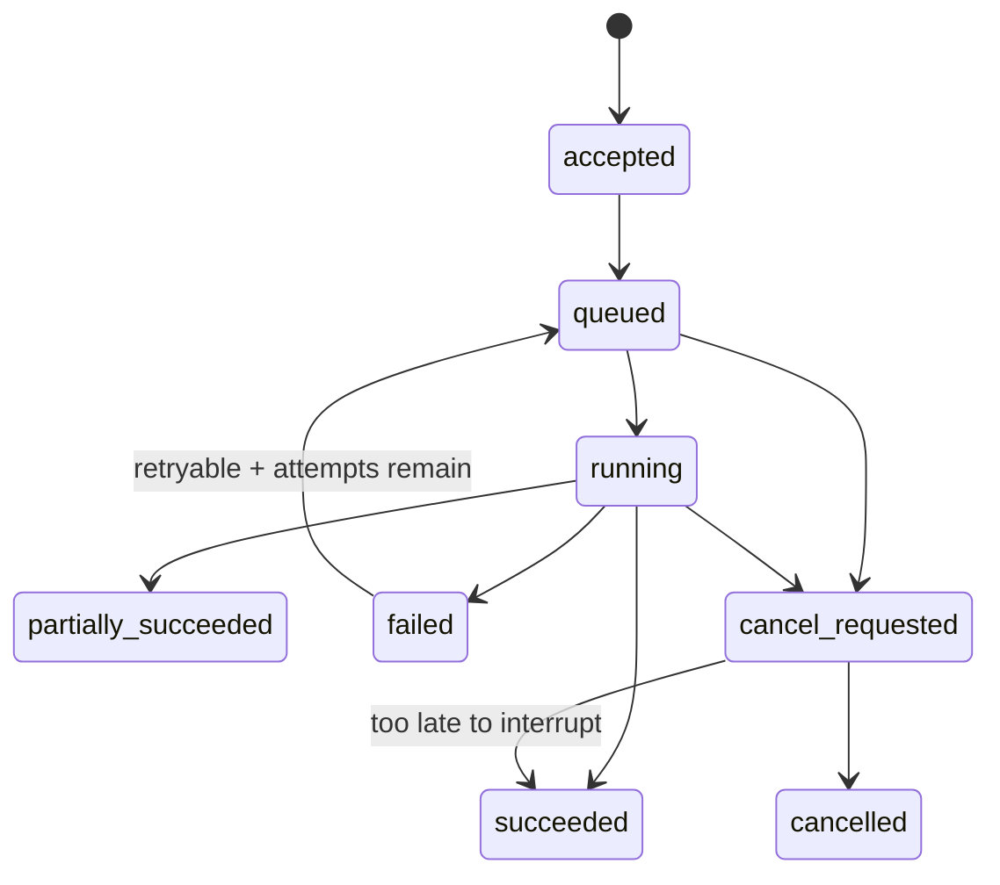
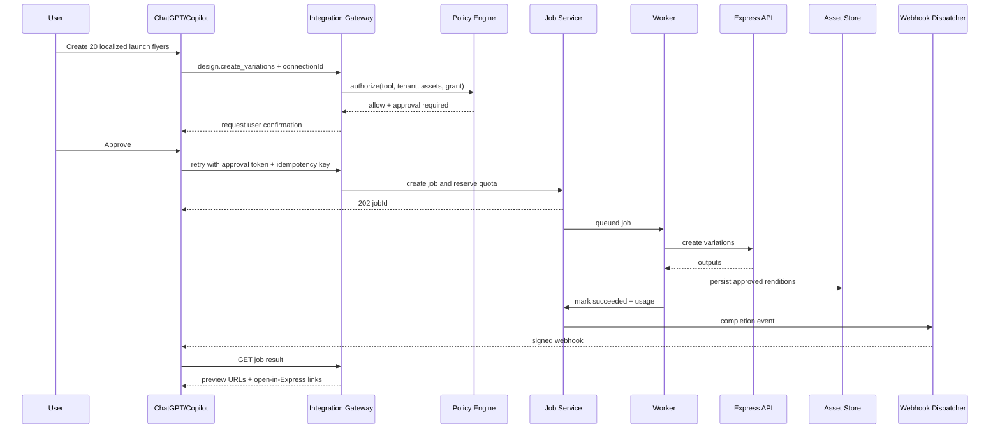

## 1. Interview framing

> Design a secure, multi-tenant platform that lets third-party assistants and enterprise applications invoke Adobe Express creative workflows—search templates, create or modify designs, generate variations, export assets, and observe long-running jobs—without giving an LLM unrestricted access to a user’s Adobe account.

Adobe publicly describes Express experiences in ChatGPT and Microsoft Copilot, while the Express API provides OAuth-based access and asynchronous creative workflows. The core design problem is therefore not simply “call an image API.” It is an **authorization, orchestration, asset-governance, and audit platform** around creative tools.

## 2. Goals and non-goals

### Functional requirements

1. Connect a user or enterprise tenant through OAuth.
2. Search templates and assets the caller is authorized to access.
3. Create a new design or derive a variation from an existing template.
4. Apply scoped edits: replace text/image, change color, animate, resize, export.
5. Submit long-running bulk or rendering jobs.
6. Read job status, cancel eligible jobs, and receive webhook completion events.
7. Return preview URLs or final assets to the calling assistant.
8. Preserve request history, tool calls, approvals, asset lineage, and audit events.
9. Support ChatGPT, Microsoft Copilot, first-party Adobe clients, and partner apps through the same policy-enforced gateway.

### Non-functional requirements

- Strong tenant isolation and no cross-organization asset leakage.
- Least privilege and explicit delegated authorization.
- p99 synchronous API latency under 300 ms excluding creative execution.
- Durable job execution with at-least-once queue delivery and effectively-once business effects.
- Webhook delivery that tolerates duplication, reordering, retries, and receiver outages.
- Backward-compatible APIs and explicit deprecation windows.
- Regional data handling, encryption, retention controls, and complete auditability.
- Graceful degradation when model providers, Adobe services, or partner webhooks are unavailable.
- Cost controls for compute-heavy generation and export workloads.

### Non-goals

- Letting an LLM directly hold Adobe refresh tokens.
- Allowing arbitrary code execution or arbitrary asset URLs.
- Guaranteeing exactly-once network delivery.
- Making every creative operation synchronous.
- Exposing internal Express document models directly as the public contract.

---

## 3. High-level architecture



### Staff-level boundary

The host assistant can request a capability, but it never directly invokes an unrestricted Adobe endpoint. Every call passes through:

1. authentication,
2. tenant resolution,
3. tool allow-listing,
4. authorization,
5. argument validation,
6. quota reservation,
7. optional user approval,
8. execution,
9. output filtering,
10. audit recording.

---

## 4. Core entities

| Entity                | Important fields                                                                   |
| --------------------- | ---------------------------------------------------------------------------------- |
| `Tenant`              | `tenantId`, `imsOrgId`, region, plan, policySetId, encryptionKeyId                 |
| `Principal`           | user, technical account, assistant app, service identity                           |
| `OAuthGrant`          | tenant, user, client, scopes, encrypted token reference, expiry, revokedAt         |
| `ToolDefinition`      | name, version, input schema, risk tier, required scopes, approval policy           |
| `ToolInvocation`      | invocationId, tenantId, principalId, conversationId, tool, argumentsHash, decision |
| `CreativeJob`         | jobId, tenantId, operation, state, progress, idempotencyKey, inputAssetRefs        |
| `AssetReference`      | assetId, tenantId, owner, source, classification, permission snapshot, version     |
| `WebhookSubscription` | tenant, endpoint, secretRef, event filters, status, failure count                  |
| `AuditEvent`          | eventId, actor, action, resource, policy decision, before/after hashes, timestamp  |
| `QuotaReservation`    | tenant, dimension, units, reservationId, expiresAt, finalizedUnits                 |

### Tenant partition key

Every persisted business record includes `tenant_id`. Repositories require a `TenantContext`; methods without it do not exist.

```ts
type TenantContext = {
  tenantId: string;
  imsOrgId: string;
  principalId: string;
  region: string;
};

interface JobRepository {
  get(ctx: TenantContext, jobId: string): Promise<CreativeJob | null>;
  create(ctx: TenantContext, job: NewCreativeJob): Promise<CreativeJob>;
}
```

Use database row-level security or enforced partition predicates as defense in depth, not as the only isolation mechanism.

---

## 5. OAuth and delegated authorization

### Supported identities

| Flow                      | Use case                                                         | Security posture                                       |
| ------------------------- | ---------------------------------------------------------------- | ------------------------------------------------------ |
| Authorization Code + PKCE | Browser/SPA and connected assistant acting for a user            | No client secret in browser; user consent              |
| Authorization Code        | Web app with trusted backend                                     | Secret stays server-side; refresh token can be vaulted |
| Client Credentials        | Enterprise automation / technical account                        | Organization-scoped, no human user                     |
| Token Exchange            | Convert host identity into a short-lived Adobe integration token | Preferred internal pattern; limits token propagation   |

### Authorization flow



### Design decisions

- The host receives an opaque `connectionId`, never a reusable Adobe refresh token.
- Access tokens are short-lived and fetched by the broker just in time.
- Bind grants to `\{tenant, user, client, scopes\}`.
- Reject redirect URI wildcards; require exact registered URIs.
- Protect OAuth with PKCE, `state`, nonce, issuer/audience validation, and replay detection.
- Revocation propagates through a grant-revocation event and cache invalidation.
- For enterprise service accounts, product profiles and shared asset permissions still constrain access.

### Delegation model

A valid token is necessary but not sufficient. Authorization evaluates:

```text
allow =
  token.scope includes tool.requiredScope
  AND principal belongs to tenant
  AND tenant policy permits tool
  AND principal can access every referenced asset
  AND requested operation is within delegated purpose
  AND approval requirement is satisfied
```

Use purpose-bound grants such as:

```json
{
  "aud": "express-integration-gateway",
  "tenant_id": "t_123",
  "sub": "user_456",
  "client_id": "chatgpt-express",
  "tools": ["template.search", "design.create", "design.replace_text"],
  "asset_constraints": {
    "libraries": ["brand-approved"],
    "classification_max": "internal"
  },
  "exp": 1785969000
}
```

---

## 6. Scoped tools

Do not expose a generic `executeExpressAction(name, payload)` tool.

Use narrow, typed tools:

```ts
const tools = {
  'template.search': {
    risk: 'read',
    scopes: ['express.templates.read'],
    input: SearchTemplateSchema,
  },
  'design.create_from_template': {
    risk: 'write',
    scopes: ['express.designs.write'],
    approval: 'required_when_external_publish',
  },
  'design.replace_text': {
    risk: 'write',
    scopes: ['express.designs.write'],
    constraints: ['editable-tagged-elements-only'],
  },
  'asset.export': {
    risk: 'data_egress',
    scopes: ['express.assets.export'],
    approval: 'tenant-policy',
  },
  'asset.publish': {
    risk: 'external_side_effect',
    scopes: ['express.publish'],
    approval: 'always',
  },
};
```

### Tool execution pipeline



### Prompt-injection boundary

Treat template text, filenames, imported documents, and remote metadata as untrusted data. They cannot change tool policy. The agent planner may suggest an operation; the deterministic gateway owns authorization.

---

## 7. Public API design and versioning

### Resource-oriented API

```http
POST /v1/jobs
Authorization: Bearer <integration-token>
Idempotency-Key: 7c41...
X-Adobe-Tenant: t_123
Content-Type: application/json

{
  "operation": "design.create_variations",
  "input": {
    "templateId": "tpl_789",
    "records": [
      {"headline": "Summer launch", "imageAssetId": "asset_1"}
    ]
  },
  "callbackSubscriptionId": "whsub_22"
}
```

```json
{
  "jobId": "job_abc",
  "state": "queued",
  "statusUrl": "/v1/jobs/job_abc",
  "cancelUrl": "/v1/jobs/job_abc:cancel"
}
```

```http
GET /v1/jobs/{jobId}
POST /v1/jobs/{jobId}:cancel
GET /v1/assets/{assetId}
POST /v1/webhook-subscriptions
GET /v1/audit-events?resourceId=job_abc
```

### Versioning policy

- Major version in URL for breaking contract changes: `/v1`, `/v2`.
- Additive fields are allowed within a major version.
- Clients must ignore unknown response fields.
- Use explicit media/schema versions for complex documents.
- Pin tool definitions independently: `design.replace_text@1`.
- Never reuse enum values with different semantics.
- Publish sunset headers and migration guides:
  - `Deprecation: true`
  - `Sunset: Wed, 05 Aug 2027 00:00:00 GMT`
  - `Link: <migration-guide>; rel="deprecation"`
- Run consumer-driven contract tests against top integrations.
- Maintain translation adapters between public DTOs and internal Express models.

---

## 8. Long-running jobs

### Why asynchronous

Rendering, bulk variation, video animation, large export, moderation, and brand checks can outlast normal HTTP timeouts. The submission endpoint should only validate, authorize, reserve quota, persist the job, and enqueue work.

### State machine



Persist `stateVersion` and update with compare-and-swap:

```sql
UPDATE creative_jobs
SET state = :next_state,
    state_version = state_version + 1
WHERE tenant_id = :tenant_id
  AND job_id = :job_id
  AND state_version = :expected_version;
```

### Execution model

1. API transaction writes job + outbox event.
2. Outbox relay publishes to a partitioned durable queue.
3. Worker leases a job with visibility timeout.
4. Worker writes progress checkpoints and heartbeats.
5. Outputs are written to object storage before job success is committed.
6. A completion outbox event triggers webhook delivery.
7. A reconciliation worker repairs stuck leases and storage/DB mismatches.

### Cancellation semantics

- `queued`: remove logically by marking `cancel_requested`; worker checks state before starting.
- `running, interruptible`: send cancellation signal and checkpoint cleanup.
- `running, non-interruptible`: acknowledge request as `cancel_requested`; suppress publication or delete outputs when execution returns.
- Terminal state: return current terminal result; cancellation is idempotent.
- Never promise immediate cancellation of external model execution.

---

## 9. Idempotency

### Submission

The uniqueness boundary is:

```text
(tenant_id, principal_id, endpoint, idempotency_key)
```

Store:

```text
request_hash
response_status
response_body
job_id
created_at
expires_at
```

Behavior:

- Same key + same canonical request hash → return original response.
- Same key + different hash → `409 IDEMPOTENCY_KEY_REUSED`.
- Concurrent first requests → one row wins a unique constraint; loser reads winner.
- Retain keys longer than the maximum client retry window.
- The worker also uses a deterministic operation key to prevent duplicate downstream effects.

### Effectively-once workflow

Exactly-once messaging is not required. Combine:

- at-least-once queue,
- idempotent consumers,
- unique operation/effect keys,
- transactional outbox,
- conditional writes,
- immutable asset versions.

---

## 10. Webhooks

### Event envelope

```json
{
  "specversion": "1.0",
  "id": "evt_44",
  "source": "adobe.express.integration",
  "type": "com.adobe.express.job.succeeded.v1",
  "time": "2026-08-05T17:00:00Z",
  "subject": "jobs/job_abc",
  "tenantId": "t_123",
  "data": {
    "jobId": "job_abc",
    "status": "succeeded",
    "resultUrl": "/v1/jobs/job_abc"
  }
}
```

Send minimal data. The receiver calls the authenticated status endpoint for full details.

### Delivery guarantees

- At-least-once delivery.
- Exponential backoff with jitter.
- Stable event ID for deduplication.
- Per-subscription ordered delivery only where necessary; avoid global ordering.
- Dead-letter queue after maximum attempts.
- Replay/journaling endpoint for recovery.
- Disable or quarantine endpoints with sustained failures.

### Security

- HTTPS only.
- Validate endpoint ownership with a challenge.
- Sign `\{timestamp\}.\{rawBody\}` using HMAC or asymmetric signatures.
- Include key ID and rotation support.
- Reject timestamps outside a tolerance window.
- Optional mTLS for enterprise tenants.
- Prevent SSRF: block private IP ranges, metadata addresses, redirects, and DNS rebinding.
- Filter events by tenant/client/project.
- Do not trust webhook delivery as authorization; receivers must still authenticate when fetching results.

---

## 11. Rate limits, quotas, and cost controls

### Multi-dimensional limits

Apply limits by:

- client/app,
- tenant,
- user/principal,
- tool/operation,
- model or worker pool,
- asset bandwidth,
- concurrent jobs.

Use local token buckets backed by a globally coordinated quota service. Return:

```http
429 Too Many Requests
Retry-After: 12
RateLimit-Limit: 120
RateLimit-Remaining: 0
RateLimit-Reset: 1785968612
```

### Reservation model

Expensive jobs reserve estimated units before enqueueing:

```text
estimated_cost =
  records
  × output_count
  × resolution_factor
  × operation_weight
```

Finalize actual usage on completion; release unused reservation on failure/cancellation.

### Fairness

Use weighted fair queues by tenant plan, then per-tenant concurrency caps. Do not allow one large enterprise bulk job to starve interactive user requests.

---

## 12. Asset access

### Never trust raw asset IDs from the model

Resolve every reference through an asset authorization service:

```text
authorizeAsset(
  tenant,
  principal,
  assetId,
  requestedAction,
  currentGrant,
  currentPolicy
)
```

Checks include:

- tenant ownership or explicit share,
- current ACL/product profile,
- asset classification,
- brand library restrictions,
- geographic policy,
- malware/moderation state,
- legal hold and retention,
- allowed derivative/export action.

### Storage pattern

- Metadata and ACL snapshots in a transactional database.
- Binary content in Adobe cloud/object storage.
- Short-lived signed URLs, audience-bound and operation-bound.
- CDN only for approved renditions.
- No permanent public URLs by default.
- Separate upload, quarantine, approved, and published states.
- Asset lineage records input template, source assets, generated derivatives, model/version, and edit operations.

### TOCTOU protection

Authorization can change between submission and execution. Capture a permission snapshot for audit, but re-check access before each sensitive read/export/publish operation.

---

## 13. Tenant isolation

### Layers

1. Identity: map Adobe IMS organization and external host tenant to an internal tenant.
2. API: derive tenant from signed claims; do not trust a caller-provided tenant header alone.
3. Data: tenant partition key on every record; row-level policies and repository guards.
4. Cache: tenant-prefixed keys and per-tenant encryption context.
5. Queue: tenant included in message and validated against job record.
6. Storage: tenant-scoped paths/buckets or policy-enforced prefixes.
7. Encryption: tenant-specific envelope encryption keys for high-sensitivity data.
8. Observability: never place prompt, token, or asset contents in shared logs.
9. Webhooks: subscription and event filters are tenant-bound.
10. Tests: automated cross-tenant negative tests and canary records.

### Enterprise noisy-neighbor controls

- Per-tenant concurrency.
- Weighted scheduling.
- Storage/bandwidth quotas.
- Circuit breakers by tenant and downstream dependency.
- Bulkheads for interactive versus batch traffic.

---

## 14. Auditing

### Audit event contents

Record:

- who: user, service account, app, agent identity,
- on behalf of whom,
- tenant and organization,
- requested tool and version,
- normalized argument hash,
- referenced assets,
- authorization decision and policy version,
- approval actor and timestamp,
- downstream job/effect IDs,
- result classification,
- webhook deliveries,
- token grant/revocation events,
- before/after document version hashes.

Avoid storing secrets or full sensitive prompts by default. Use selective encrypted payload retention when compliance requires it.

### Storage

- Append-only event stream.
- Immutable/WORM archival for regulated tenants.
- Hash chaining or signed batches for tamper evidence.
- Indexed projection for support and investigations.
- Separate security retention from product history retention.

### Correlation IDs

```text
trace_id
conversation_id
tool_invocation_id
idempotency_key
job_id
asset_version_id
webhook_event_id
```

These IDs let an operator answer: “Which user-approved agent action produced this exported asset?”

---

## 15. End-to-end sequence



---

## 16. Failure scenarios and answers

### A generation succeeds, but the caller times out

The caller retries with the same idempotency key. The API returns the original `jobId`. Downstream effects use an operation key, so a duplicated queue message does not generate a second asset set.

### Webhook delivered twice

Receiver deduplicates by `event.id`; status retrieval is safe and idempotent.

### Webhook receiver is down for hours

Dispatcher retries, then journals the event. The integration can query/replay from its last cursor.

### OAuth grant is revoked while a job is queued

The worker revalidates grant and asset permissions before execution. The job fails with `authorization_revoked`; no asset is read.

### User loses access to the template after job submission

Re-check authorization before reading the template. A historical permission snapshot is only evidence of the earlier decision, not permission to continue.

### Cross-tenant asset ID is guessed

The asset service queries by `(tenant_id, asset_id)` and independently evaluates ACL. Return `404` rather than revealing existence.

### Assistant is prompt-injected by text inside a template

The content is treated as data. It cannot add tools, modify scopes, or bypass deterministic policy.

### One tenant submits a million-record job

Admission control enforces maximum records and estimated cost. Large jobs are chunked, placed in a batch queue, and constrained by tenant concurrency.

### A worker crashes after writing assets but before marking success

Reconciliation uses deterministic output keys and storage manifests. A retry adopts existing outputs rather than creating duplicates.

### API v2 changes the internal document format

The public contract remains stable through an adapter. Only a genuine public semantic break requires `/v2`.

---

## 17. Technology choices and trade-offs

| Concern                | Preferred choice                                                         | Why                                                       | Trade-off                          |
| ---------------------- | ------------------------------------------------------------------------ | --------------------------------------------------------- | ---------------------------------- |
| Workflow orchestration | Durable workflow engine or DB state machine + queue                      | retries, timers, cancellation, recovery                   | operational complexity             |
| Queue                  | Kafka for high-volume ordered streams; SQS/PubSub for simpler job queues | durable at-least-once delivery                            | Kafka requires more operation      |
| Job DB                 | PostgreSQL or distributed SQL                                            | transactions, unique idempotency constraints, audit joins | shard/partition at high scale      |
| Asset store            | Adobe cloud/object storage + CDN                                         | large binary scale and signed access                      | metadata/content consistency       |
| Policy                 | Central policy engine with cached decisions                              | consistent least privilege                                | added latency and policy lifecycle |
| Webhooks               | Adobe I/O Events-style fan-out + journaling                              | retries and replay                                        | duplicate delivery                 |
| Audit                  | Append-only event log + searchable projection                            | immutable history plus queryability                       | dual storage                       |
| Rate limiting          | Hierarchical token buckets + quota reservations                          | burst control and cost governance                         | distributed coordination           |

---

## 18. API error model

```json
{
  "error": {
    "code": "ASSET_ACCESS_DENIED",
    "message": "The requested operation is not permitted.",
    "requestId": "req_123",
    "retryable": false,
    "details": []
  }
}
```

Recommended errors:

- `INVALID_ARGUMENT`
- `OAUTH_GRANT_EXPIRED`
- `INSUFFICIENT_SCOPE`
- `TENANT_POLICY_DENIED`
- `ASSET_NOT_FOUND`
- `ASSET_ACCESS_DENIED`
- `APPROVAL_REQUIRED`
- `IDEMPOTENCY_KEY_REUSED`
- `RATE_LIMITED`
- `QUOTA_EXCEEDED`
- `JOB_NOT_CANCELLABLE`
- `DOWNSTREAM_UNAVAILABLE`

Do not reveal cross-tenant existence or internal policy details.

---

## 19. Staff-level deep-dive prompts

### Why not let ChatGPT call Express directly?

Because model reasoning is non-deterministic and may be influenced by untrusted context. Credentials, authorization, asset checks, approval, quotas, and auditing belong in a deterministic control plane.

### OAuth scope versus tool scope?

OAuth scopes define the maximum delegated authority. Tool policy narrows that authority for this tenant, app, conversation, asset set, and operation. Effective permission is the intersection.

### How do you prevent confused deputy attacks?

Bind tokens to audience, tenant, client, subject, scopes, and purpose. Reauthorize assets at execution. Never let one app reuse another app’s grant or choose an arbitrary tenant.

### Why at-least-once instead of exactly-once?

Networks and queues duplicate messages. Business-level idempotency is simpler and more reliable than claiming exactly-once delivery across databases, workers, storage, and partner endpoints.

### How do you handle webhook ordering?

Do not require global ordering. Include resource version and event time. Consumers fetch current job state. Serialize only events that truly need per-resource ordering.

### How do you evolve tool definitions?

Version tools independently, keep old schemas active through a migration window, and translate them to internal commands. Agent clients declare supported tool versions.

### How do you audit agent intent?

Store the user-visible action summary, tool invocation, normalized parameters or hashes, policy decision, approval, execution IDs, and resulting asset lineage—not hidden model reasoning.

---

## 20. Metrics and SLOs

### Reliability

- Job acceptance availability: 99.95%.
- OAuth callback success rate.
- Queue delay p50/p95/p99.
- Job success, partial success, cancellation, and retry rates.
- Stuck-job count and oldest lease age.
- Webhook first-attempt and eventual delivery success.
- Asset authorization denial and cross-tenant canary alerts.

### Security and governance

- Token refresh/revocation failures.
- Policy denial by reason.
- Approval bypass attempts.
- Webhook signature failures.
- Unusual asset export volume.
- Tenant boundary test failures.
- Audit pipeline lag and dropped-event count.

### Cost

- Cost per completed variation/export.
- Reserved versus actual units.
- GPU/worker utilization.
- Duplicate work avoided through idempotency.
- CDN egress by tenant.

---

## 21. Interview closing summary

> I would build this as a multi-tenant integration control plane, not a thin proxy. OAuth establishes identity and delegated authority; scoped tools and policy narrow what an assistant can do; asset authorization prevents data leakage; durable jobs handle creative execution; idempotency makes retries safe; signed webhooks provide completion signals; hierarchical quotas protect capacity and spend; and append-only audit plus asset lineage makes every agent action explainable. The design assumes at-least-once delivery and achieves effectively-once business effects through unique keys, conditional state transitions, and deterministic output identities.

---

## 22. Public references

- Adobe Express API authentication: https://developer.adobe.com/firefly-services/docs/express-api/getting-started/
- Adobe Express API credential types: https://developer.adobe.com/firefly-services/docs/express-api/getting-started/create-credentials/
- Adobe Express API webhook events: https://developer.adobe.com/firefly-services/docs/express-api/guides/how-to/handle-webhook-events
- Adobe Express app for ChatGPT: https://helpx.adobe.com/express/mobile/bring-in-assets-from-other-apps/chatgpt-integration.html
- Adobe Express agent for Microsoft Copilot: https://helpx.adobe.com/express/web/add-ons-and-integrations/adobe-express-agent-for-copilot.html
