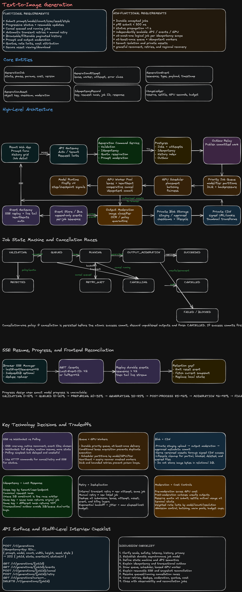
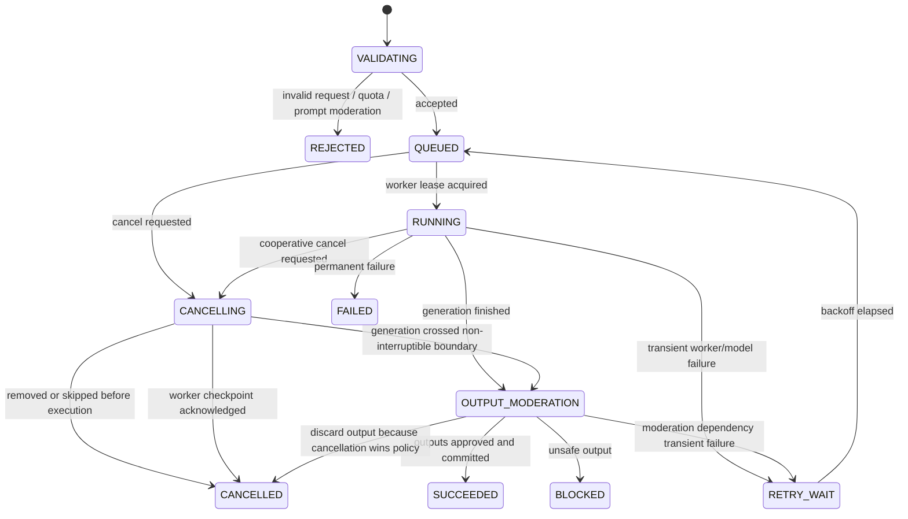
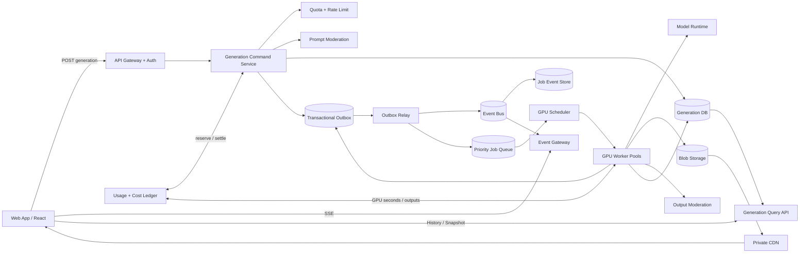

## 1. Problem Statement

Design a production text-to-image system where a user can submit a prompt, see progressive status, cancel work, retry failures, and browse prior generations. The platform must support expensive asynchronous GPU execution while preventing duplicate work, enforcing safety and quotas, and keeping the UI responsive despite reconnects and partial failures.

### Core design principle

Treat image generation as a **durable asynchronous job**, not a long-running HTTP request.

- The submission request creates or returns a durable job.
- GPU execution happens through a queue.
- State transitions are persisted before being emitted to clients.
- Clients observe progress through resumable SSE.
- Generated binaries live in object storage and are served through a CDN.

---

## 2. Functional Requirements

1. Submit a text-to-image generation request.
2. Support model, image count, dimensions, seed, style, and safety options.
3. Show progressive status from submission to completion.
4. Stream status updates to the browser.
5. Resume status after browser refresh or network loss.
6. Cancel queued or running jobs.
7. Retry transient failures without creating duplicate outputs or charges.
8. Retry a failed generation manually with controlled parameter reuse.
9. Browse paginated generation history.
10. View generation details, prompt metadata, outputs, status, and timestamps.
11. Delete or hide history items according to product and compliance rules.
12. Enforce prompt and output moderation.
13. Enforce per-user and per-tenant quotas and rate limits.
14. Provide signed or authorized access to generated assets.
15. Track cost, GPU time, model usage, and policy outcomes.

### Optional product extensions

- Variations, inpainting, outpainting, and image-to-image.
- Batch generation.
- Shared team history.
- Download and share links.
- Prompt templates and favorites.

---

## 3. Non-Functional Requirements

| Area               | Target                                                                         |
| ------------------ | ------------------------------------------------------------------------------ |
| Submission latency | p95 under 300 ms excluding external auth                                       |
| Status propagation | Most state changes visible within 1 second                                     |
| Durability         | Accepted jobs survive service restarts and region failover                     |
| Availability       | Submission and history APIs 99.9%+; execution may degrade independently        |
| Correctness        | At-most-once logical job creation per idempotency scope                        |
| Queue semantics    | At-least-once delivery with idempotent workers                                 |
| Scalability        | Independently scale API, event delivery, queue, moderation, and GPU pools      |
| Security           | Tenant isolation, encrypted storage, signed URLs, audit logging                |
| Safety             | Prompt moderation before GPU use; output moderation before release             |
| Cost               | Admission control, model routing, output limits, cancellation, and budget caps |
| Observability      | Traces across submission, queue, worker, moderation, storage, and events       |
| UX resilience      | Refresh and reconnect must recover the current state without duplicate work    |

---

## 4. Core Entities

### GenerationJob

```ts
interface GenerationJob {
  id: string;
  tenantId: string;
  userId: string;
  idempotencyKey: string;
  requestHash: string;
  promptEncrypted: string;
  model: string;
  parameters: GenerationParameters;
  state: GenerationState;
  progressPhase: ProgressPhase;
  progressPercent?: number;
  attempt: number;
  maxAttempts: number;
  cancellationRequestedAt?: string;
  terminalReason?: string;
  costEstimateMicros: number;
  actualCostMicros?: number;
  createdAt: string;
  startedAt?: string;
  completedAt?: string;
  version: number;
}
```

### GenerationAttempt

A job can have multiple execution attempts. Attempts prevent retry ambiguity and preserve operational history.

```ts
interface GenerationAttempt {
  id: string;
  jobId: string;
  attemptNumber: number;
  workerId?: string;
  leaseToken?: string;
  state: 'leased' | 'running' | 'succeeded' | 'failed' | 'cancelled';
  errorClass?: 'transient' | 'permanent' | 'policy' | 'capacity';
  startedAt?: string;
  endedAt?: string;
  gpuSeconds?: number;
}
```

### GenerationAsset

```ts
interface GenerationAsset {
  id: string;
  jobId: string;
  attemptId: string;
  objectKey: string;
  mimeType: string;
  width: number;
  height: number;
  sha256: string;
  moderationState: 'pending' | 'approved' | 'blocked';
  cdnPath?: string;
  createdAt: string;
}
```

### GenerationEvent

```ts
interface GenerationEvent {
  jobId: string;
  sequence: number;
  type:
    | 'job.accepted'
    | 'moderation.started'
    | 'moderation.passed'
    | 'queued'
    | 'worker.assigned'
    | 'generation.started'
    | 'generation.progress'
    | 'generation.completed'
    | 'output.moderation.started'
    | 'output.moderation.passed'
    | 'job.succeeded'
    | 'job.failed'
    | 'cancellation.requested'
    | 'job.cancelled';
  payload: Record<string, unknown>;
  createdAt: string;
}
```

### IdempotencyRecord

Stores the `(tenantId, userId, idempotencyKey)` scope, request hash, response status, and job ID. It is written transactionally with job creation.

### UsageLedger

Tracks reserved and actual usage by tenant, user, model, and billing period.

---

## 5. Job State Machine



### State design rules

- Terminal states: `SUCCEEDED`, `FAILED`, `CANCELLED`, `REJECTED`, `BLOCKED`.
- Every transition uses optimistic concurrency on `version` or a conditional update.
- Workers never infer ownership from queue delivery alone; they acquire a lease.
- Event publication occurs through an outbox after the state transaction commits.
- Cancellation is a request first, then a terminal state after the executor acknowledges or a policy resolves the race.

---

## 6. API Design

### Submit generation

```http
POST /v1/generations
Authorization: Bearer <token>
Idempotency-Key: 82c...
Content-Type: application/json

{
  "prompt": "A futuristic city at sunrise",
  "model": "firefly-v4",
  "count": 4,
  "width": 1024,
  "height": 1024,
  "seed": 12345,
  "style": "cinematic"
}
```

```json
{
  "jobId": "gen_01K...",
  "state": "VALIDATING",
  "createdAt": "2026-08-05T14:50:00Z",
  "eventsUrl": "/v1/generations/gen_01K.../events",
  "statusUrl": "/v1/generations/gen_01K..."
}
```

Recommended response: `202 Accepted` for a newly created job; return the same semantic response for an idempotent replay.

### Get job snapshot

```http
GET /v1/generations/{jobId}
```

Returns the latest durable state, progress phase, terminal reason, and approved assets.

### Stream events

```http
GET /v1/generations/{jobId}/events
Accept: text/event-stream
Last-Event-ID: 41
```

```text
id: 42
event: generation.progress
data: {"phase":"denoising","displayPercent":65,"message":"Refining image details"}

```

### Cancel

```http
POST /v1/generations/{jobId}/cancel
Idempotency-Key: cancel-77a...
```

```json
{
  "jobId": "gen_01K...",
  "state": "CANCELLING",
  "cancellationRequestedAt": "2026-08-05T14:52:00Z"
}
```

Cancellation is idempotent. Repeated calls return the current state.

### Retry

```http
POST /v1/generations/{jobId}/retry
Idempotency-Key: retry-9bf...

{
  "reuseSeed": true,
  "override": {
    "model": "firefly-v4"
  }
}
```

Prefer creating a **new logical job** with `parentJobId` for user-initiated retries. Internal transient retries remain attempts on the same logical job.

### History

```http
GET /v1/generations?cursor=...&limit=30&state=SUCCEEDED&model=firefly-v4
```

Use cursor pagination on `(createdAt, id)`, not offset pagination.

### Delete history item

```http
DELETE /v1/generations/{jobId}
```

Usually performs a soft delete plus asynchronous asset lifecycle handling. Retention policy may override immediate physical deletion.

---

## 7. High-Level System Design



### Technology choices

- **Relational database** for durable job state, idempotency records, history indexing, and transactional outbox.
- **Durable queue** for asynchronous execution and backpressure.
- **Event bus or log** for fan-out, event persistence, audit, and SSE delivery.
- **Object storage + CDN** for large immutable images.
- **Redis or equivalent** for token-bucket rate limiting, ephemeral presence, and short-lived caches—not as the source of truth for job state.

---

## 8. Frontend Architecture

```mermaid
flowchart TD
    PAGE[Generation Page] --> FORM[Prompt Form]
    PAGE --> GRID[History Grid]
    PAGE --> DETAIL[Job Detail Drawer]

    FORM --> CMD[Generation Command Client]
    CMD --> CACHE[Normalized Job Cache]
    STREAM[SSE Manager] --> REDUCER[Event Reducer]
    REDUCER --> CACHE
    SNAPSHOT[Snapshot Reconciler] --> CACHE
    CACHE --> CARDS[Generation Cards]
    CACHE --> TOAST[Status + Error UI]

    IDB[(IndexedDB)] <--> CACHE
    OBS[Client Telemetry] <-- PAGE
```

### Frontend responsibilities

1. Generate and persist an idempotency key before submission.
2. Disable accidental duplicate submission but never rely on UI disabling for correctness.
3. Optimistically add a pending job card after receiving `202`.
4. Connect to SSE with the last applied event sequence.
5. Persist the latest sequence per job in memory and optionally IndexedDB.
6. Reconcile SSE events with periodic or reconnect-time snapshots.
7. Use a normalized entity store keyed by `jobId`.
8. Render progress by phases, not fake precision.
9. Make cancellation state explicit: `Cancelling…`, not immediately `Cancelled`.
10. Virtualize large history grids and lazy-load thumbnails.
11. Use responsive image sizing, placeholders, and content-visibility for history performance.
12. Maintain accessible live regions without announcing every tiny progress event.

### Suggested client state

```ts
type ClientJobState = {
  snapshot: GenerationJobView;
  lastEventSequence: number;
  connection: 'connecting' | 'live' | 'reconnecting' | 'offline';
  optimisticAction?: 'cancel' | 'retry';
};
```

### Event reducer correctness

- Ignore events with `sequence <= lastEventSequence`.
- Apply only valid forward transitions.
- If an event reveals a sequence gap, pause optimistic progression and fetch a snapshot or missing events.
- The server snapshot always wins over local optimistic state.

---

## 9. Deep Dive: Job Submission API

### Chosen approach

A fast command endpoint validates syntax, authenticates, enforces admission controls, executes prompt moderation, creates a durable job, reserves quota, and writes an outbox record in one transaction boundary where possible.

### Why `202 Accepted`

Generation cannot finish within a reliable HTTP request budget. `202` communicates that the server accepted responsibility for asynchronous processing.

### Important boundaries

- Validate cheap constraints before expensive moderation.
- Compute a canonical request hash.
- Resolve idempotency before creating new work.
- Reserve quota before enqueueing.
- Persist job state before publishing queue work.
- Avoid directly enqueueing and then writing the database; that creates ghost jobs or lost jobs.

### Alternatives

| Option                             | Pros                   | Cons                                             | Decision                                   |
| ---------------------------------- | ---------------------- | ------------------------------------------------ | ------------------------------------------ |
| Long-running HTTP request          | Simple client          | Timeouts, no durable progress, poor cancellation | Reject                                     |
| API writes DB then directly queues | Simple                 | Dual-write inconsistency                         | Reject                                     |
| DB + transactional outbox          | Durable, recoverable   | Relay complexity and small delay                 | Choose                                     |
| Workflow engine for every request  | Built-in retries/state | Higher complexity and cost                       | Consider for complex multi-stage workflows |

---

## 10. Deep Dive: Idempotency Key

### Scope

Uniqueness is usually `(tenantId, userId, endpoint, idempotencyKey)`.

### Algorithm

1. Client creates a random UUID and stores it before sending.
2. Server canonicalizes the request and computes `requestHash`.
3. In a transaction, insert the idempotency record and job.
4. A duplicate key with the same hash returns the original job.
5. A duplicate key with a different hash returns `409 Conflict`.
6. Keep the record at least as long as client retries are plausible; expensive generation may justify days of retention.

### Why request hashing matters

Without the hash, a buggy client can reuse a key for a different prompt and silently receive an unrelated result.

### Client timeout scenario

The request may commit and the response may be lost. The client retries with the same key. The server returns the original `jobId`; no new queue item or cost reservation is created.

### Database constraint

```sql
UNIQUE (tenant_id, user_id, endpoint, idempotency_key)
```

The unique constraint is the final race arbiter; an application-level cache is insufficient.

---

## 11. Deep Dive: Queue and GPU Workers

### Chosen model

Use a durable priority queue with at-least-once delivery and idempotent leased workers.

### Queue concerns

- Priority by paid tier, interactive versus batch, deadline, and job age.
- Separate queues or partitions by model family and GPU requirement.
- Backpressure and admission control when estimated queue delay is too high.
- Dead-letter routing for poison messages.
- Visibility timeout must exceed heartbeat intervals but not hide abandoned jobs too long.

### Worker lease flow

1. Worker receives a queue message.
2. Worker performs a conditional transition `QUEUED -> RUNNING` and writes an attempt with a lease token.
3. Worker heartbeats the lease.
4. Duplicate deliveries fail the conditional transition or observe an existing active attempt.
5. Output commit uses `(jobId, attemptNumber)` and asset checksums for deduplication.

### Scheduler responsibilities

- Match model and memory needs to GPU type.
- Batch compatible requests where latency budgets allow.
- Keep hot models loaded to avoid cold starts.
- Use weighted fair queuing across tenants.
- Drain unhealthy workers and rebalance capacity.

### Queue technology tradeoffs

| Technology      | Pros                                            | Cons                                                 | Best fit              |
| --------------- | ----------------------------------------------- | ---------------------------------------------------- | --------------------- |
| Managed queue   | Operational simplicity, DLQ, visibility timeout | Limited custom scheduling                            | Moderate scale        |
| Kafka-style log | High throughput, replay, partition ordering     | Consumer scheduling and per-message delay are harder | Large event backbone  |
| Redis queue     | Low latency, simple                             | Durability and large-scale operations require care   | Smaller deployments   |
| Workflow engine | Durable orchestration, timers, retries          | More operational and conceptual overhead             | Multi-stage pipelines |

A common design uses a managed queue or scheduler for GPU dispatch and Kafka/PubSub for events.

---

## 12. Deep Dive: Job States

### Why explicit states matter

A single `status = processing` hides important user and operational semantics. The UI needs to distinguish moderation, queueing, allocation, generation, output review, cancellation, and retry delay.

### State versus phase

- **State** controls legal transitions and API semantics.
- **Phase** provides more granular user-facing progress.

Example:

```json
{
  "state": "RUNNING",
  "phase": "DENOISING",
  "displayPercent": 65
}
```

### Transition safety

Use conditional SQL:

```sql
UPDATE generation_jobs
SET state = 'RUNNING', version = version + 1
WHERE id = :id AND state = 'QUEUED' AND version = :expectedVersion;
```

The affected-row count determines whether the transition won the race.

---

## 13. Deep Dive: SSE vs WebSocket vs Polling

| Option    | Pros                                                                                | Cons                                                                              |
| --------- | ----------------------------------------------------------------------------------- | --------------------------------------------------------------------------------- |
| SSE       | Native reconnect, event IDs, HTTP-friendly, excellent for server-to-client progress | One-way, browser connection limits, proxy buffering must be configured            |
| WebSocket | Full duplex, low latency, flexible                                                  | More connection state, custom resume protocol, harder through some infrastructure |
| Polling   | Simplest infrastructure, stateless requests                                         | Wasteful, delayed updates, thundering herd at scale                               |

### Decision

Choose **SSE** because status is predominantly server-to-client. Cancellation and retry remain ordinary HTTP commands. SSE gives natural event IDs and reconnect behavior with less operational complexity than WebSockets.

### When WebSocket is better

Use WebSocket if the product adds highly interactive collaborative editing, bidirectional streaming controls, or shared live sessions where many client messages must flow over the same channel.

### Polling fallback

Use snapshot polling every several seconds only when SSE is unavailable or repeatedly failing. Back off when the tab is hidden.

---

## 14. Deep Dive: Progress Events

### Persist before publish

The system first commits the job transition and event row or outbox record, then publishes. This lets reconnects replay durable events.

### Event ordering

Each job has a monotonically increasing `sequence`. Do not rely only on timestamps.

### Coalescing

GPU runtimes may emit many internal steps. Emit only meaningful changes, for example at most once per second or at phase boundaries, to control event volume and avoid UI churn.

### Event example

```json
{
  "jobId": "gen_01K...",
  "sequence": 42,
  "type": "generation.progress",
  "payload": {
    "phase": "denoising",
    "displayPercent": 65,
    "message": "Refining image details",
    "estimatedSecondsRemaining": 8
  }
}
```

### Outbox pattern

The same database transaction writes:

- Updated job row.
- Append-only event row.
- Outbox notification.

A relay publishes to the event bus. Consumers are idempotent by event ID.

---

## 15. Deep Dive: SSE Reconnect and Event Resume

### Protocol

1. Every SSE event includes `id: <sequence>`.
2. The browser automatically reconnects and sends `Last-Event-ID` where supported; the client may also add `?after=42`.
3. The event API authorizes access and reads events with `sequence > 42`.
4. The API replays retained events in order, then tails live events.
5. If the requested sequence is older than retention, return a special `reset` event containing or pointing to the latest snapshot.
6. The client fetches `GET /v1/generations/\{id\}`, replaces local state, stores the new baseline sequence, and reconnects.

### Avoiding replay/live race

Use one of these patterns:

- Read from a durable log partition starting at the requested offset.
- Capture a high-water mark, replay database events up to it, subscribe to live events after it, then merge by sequence.
- Always deduplicate by sequence on the client.

### Heartbeats

Send comment heartbeats such as `: ping` every 15–30 seconds to keep proxies from closing idle connections.

---

## 16. Deep Dive: Cancellation Semantics

Cancellation is **best effort with explicit race semantics**, not an instantaneous guarantee.

### Queued job

1. API conditionally changes `QUEUED -> CANCELLING` and records the request.
2. The queue message may be removed when supported, but correctness cannot depend on removal.
3. A worker receiving the stale message checks durable state and exits.
4. Reconciler transitions `CANCELLING -> CANCELLED` when no active attempt exists.
5. Release reserved quota.

### Running GPU job

1. API changes `RUNNING -> CANCELLING` and sends a cancellation signal through a control channel or worker heartbeat response.
2. Worker checks at safe checkpoints: between diffusion steps, images, or stages.
3. If the runtime supports interruption, stop and clean partial assets.
4. If a kernel or external model call is non-interruptible, finish the current unit but do not expose output unless policy says completion wins.
5. Persist actual GPU usage even for cancelled work.

### Race policy

Define one policy and document it:

- **Cancellation-wins before output commit:** If cancellation was persisted before the atomic success commit, discard outputs and mark `CANCELLED`.
- If success committed first, cancellation returns the already terminal `SUCCEEDED` state.

### Why not immediately mark `CANCELLED`

The platform might still be spending GPU resources. `CANCELLING` accurately communicates that the request is acknowledged but execution cleanup is pending.

---

## 17. Deep Dive: Useful Progress Without Exact Model Progress

Many models do not provide a reliable percentage. Never claim precise completion based on elapsed time alone.

### Chosen approach: phase-based progress

| Phase                       | Display range | User copy             |
| --------------------------- | ------------: | --------------------- |
| Validating and moderation   |         0–10% | Checking request      |
| Waiting for capacity        |        10–20% | Waiting for a GPU     |
| Loading model / preparation |        20–35% | Preparing model       |
| Generation                  |        35–85% | Creating image        |
| Post-processing             |        85–92% | Refining output       |
| Output moderation           |        92–98% | Running safety checks |
| Asset publish               |       98–100% | Finalizing            |

Within a phase:

- Show an indeterminate animation when no signal exists.
- Use step counts when the model provides them.
- Use historical duration percentiles to show a separate ETA range, clearly labeled as an estimate.
- Keep displayed progress monotonic; never move backward because a new ETA arrived.
- Cap synthetic progress below the phase boundary until a real transition occurs.

This provides reassurance without false precision.

---

## 18. Deep Dive: Blob Storage and CDN

### Flow

1. Worker writes outputs to a private staging prefix.
2. Compute checksum and metadata.
3. Run output moderation against staging objects.
4. On approval, atomically mark assets visible in metadata and move/copy to a published prefix if needed.
5. Serve through a private CDN using short-lived signed cookies or URLs.

### Why object storage

- Cheap, durable, scalable binary storage.
- Direct multipart upload from workers.
- Lifecycle policies for abandoned or deleted assets.
- Event notifications and checksum support.

### Why CDN

- Low-latency global delivery.
- Protects object storage from repeated downloads.
- Supports transformed thumbnails and responsive formats.

### Security choices

- Never make the bucket public.
- Tenant ownership is checked before issuing access.
- Use unpredictable object keys.
- Separate staging, approved, blocked, and quarantine prefixes or buckets.
- Set retention and deletion workflows based on policy.

---

## 19. Deep Dive: Moderation Before and After Generation

### Prompt moderation before generation

Purpose: prevent policy-violating work and avoid wasting GPU budget.

Pipeline:

1. Syntactic validation.
2. Policy classifier and rule engine.
3. Tenant policy overlay.
4. Decision: allow, block, or require human/restricted workflow.

### Output moderation after generation

Purpose: models can produce unsafe content from apparently benign prompts.

Pipeline:

1. Image safety classifier.
2. Optional OCR plus text moderation.
3. Perceptual hash matching for known prohibited content.
4. Model-specific policy checks.
5. Approve, block, quarantine, or escalate.

### Tradeoff

| Strategy  | Pros                         | Cons                                    |
| --------- | ---------------------------- | --------------------------------------- |
| Pre only  | Saves GPU cost               | Misses unsafe model output              |
| Post only | Evaluates actual image       | Wastes GPU on obviously blocked prompts |
| Both      | Best safety and cost balance | Added latency and complexity            |

Choose both. Show the user a policy-safe terminal reason without exposing sensitive classifier details.

---

## 20. Deep Dive: Quotas and Rate Limits

### Rate limits

Protect instantaneous service capacity.

- Token bucket per user and tenant.
- Different weights by model, resolution, and image count.
- Separate limits for submission, cancellation, history, and event connections.
- Return `429` with retry metadata.

### Quotas

Control longer-term consumption and cost.

- Images per day/month.
- GPU seconds or compute credits.
- Concurrent active jobs.
- Storage retained.
- Budget caps per tenant.

### Reservation model

1. Estimate maximum cost at submission.
2. Atomically reserve credits.
3. Settle actual cost at terminal state.
4. Release unused reservation on rejection, failure, or cancellation.
5. A reconciliation job repairs leaked reservations.

### Why both

A monthly quota does not prevent a burst from overloading the queue. A rate limit does not prevent sustained budget exhaustion.

---

## 21. Deep Dive: Retry and Deduplication

### Retry classes

| Failure                     | Retry?                            | Example                       |
| --------------------------- | --------------------------------- | ----------------------------- |
| Transient infrastructure    | Yes                               | worker crash, network timeout |
| Capacity                    | Yes with backoff                  | no GPU available              |
| External moderation outage  | Yes                               | dependency timeout            |
| Invalid parameters          | No                                | unsupported size              |
| Policy rejection            | No                                | blocked prompt                |
| Deterministic model failure | Usually no after limited attempts | invalid model artifact        |

### Internal retries

- Same logical job.
- New `GenerationAttempt`.
- Exponential backoff with jitter.
- Maximum attempts and total elapsed deadline.
- Preserve original idempotency and quota reservation.

### Manual retry

- New logical job linked by `parentJobId`.
- New idempotency key.
- New quota decision.
- User can alter parameters.

### Deduplication layers

1. Submission dedupe using idempotency key.
2. Queue delivery dedupe using conditional state/lease acquisition.
3. Attempt dedupe using `(jobId, attemptNumber)` uniqueness.
4. Asset dedupe using object key and checksum.
5. Event dedupe using event ID and sequence.
6. Billing dedupe using ledger transaction IDs.

### Content-based dedupe?

Generally do not automatically reuse another user’s output for the same prompt because seeds, model versions, privacy expectations, and moderation context differ. It may be acceptable within a tenant for explicitly cacheable deterministic workflows.

---

## 22. Deep Dive: Generation History

### Storage model

Use the relational job table for authoritative metadata and a read-optimized history index if search scale grows.

### Query pattern

- Partition or index by `(tenantId, userId, createdAt DESC, id DESC)`.
- Cursor pagination for stable browsing while new jobs arrive.
- Filter by state, model, date, and parent job.
- Store only metadata in the database; assets remain in object storage.

### Frontend performance

- Infinite scrolling with windowed virtualization.
- Thumbnail first, full-resolution on demand.
- Skeletons and aspect-ratio placeholders to prevent layout shift.
- Prefetch the next cursor near the viewport boundary.
- Keep failed and cancelled jobs visible with clear retry actions.

### Deletion and retention

- Soft delete immediately from the user’s view.
- Asynchronous physical asset deletion.
- Legal hold and abuse retention can override deletion.
- Tombstones prevent stale search indexes or CDN cache from resurrecting content.

---

## 23. Deep Dive: Cost Controls

### Admission controls

- Limit count, resolution, and expensive models by plan.
- Reject or defer requests when queue delay or budget thresholds are exceeded.
- Estimate cost before enqueue.

### Execution controls

- Cooperative cancellation.
- Dynamic batching.
- Route workloads to the lowest-cost compatible GPU.
- Keep popular models warm; evict low-use models.
- Use lower-cost preview generation before final high-resolution output where product permits.
- Stop retrying after a cost or elapsed-time budget.

### Storage controls

- Generate thumbnails once.
- Apply lifecycle tiers or expiration for free plans.
- Deduplicate identical derivatives.
- CDN cache with immutable versioned paths.

### Organizational controls

- Per-tenant spend dashboards and alerts.
- Hard caps and soft warning thresholds.
- Cost attribution by model, feature, tenant, and experiment.
- Canary rollouts for model versions to catch latency or cost regressions.

### Key metrics

- Cost per successful image.
- GPU utilization and idle time.
- Queue wait p50/p95/p99.
- Cancellation savings versus wasted GPU seconds.
- Retry amplification.
- Moderation rejection rate before versus after GPU execution.
- Storage and egress per active user.

---

## 24. Critical Failure Scenarios

### Browser loses SSE

- Reconnect with the last sequence.
- Replay missing durable events.
- If replay history expired, fetch a snapshot and reset the baseline.
- Deduplicate and validate transitions on the client.

### Generation succeeds but client times out on submission

- Client retries `POST` with the same idempotency key.
- Unique database record returns the original job.
- Transactional outbox ensures at most one logical enqueue from the committed job.
- Duplicate queue deliveries still cannot acquire a second active lease.

### Cancel queued versus running

- Queued: persist cancellation; workers skip stale messages; release quota.
- Running: signal cooperative checkpoints; keep `CANCELLING`; settle actual cost.
- Resolve success/cancel race with an atomic terminal transition policy.

### Model has no exact progress

- Use phase-based progress and indeterminate animation.
- Show ETA separately as a historical estimate.
- Never present synthetic percentages as model-reported certainty.

---

## 25. Consistency and Reliability Patterns

### Transactional outbox

Prevents the database and queue from disagreeing.

### Reconciliation jobs

Periodically detect:

- Jobs stuck in `RUNNING` with expired leases.
- Jobs committed but not enqueued.
- Assets uploaded but not referenced.
- Reserved quota not settled.
- Terminal jobs missing terminal events.

### Regional design

For multi-region:

- Route a job to a home region.
- Keep job writes single-primary per job to simplify ordering.
- Serve history from replicas or a global index.
- Use globally unique IDs.
- Fail over queued jobs carefully to avoid two active GPU attempts.

---

## 26. Observability

### Metrics

- Submission latency and failure rate.
- Idempotency replay and conflict rate.
- Queue depth and age by model/tier.
- Worker lease expiration.
- GPU utilization and OOM rate.
- Progress event lag.
- SSE active connections, reconnects, and replay counts.
- Cancellation latency and cancellation effectiveness.
- Retry attempts and terminal success after retry.
- Moderation latency and block rate.
- Asset publish and CDN error rates.
- Cost per successful generation.

### Tracing

Propagate `traceId`, `jobId`, `attemptId`, and `tenantId` through API, outbox, queue, worker, moderation, and storage operations.

### Audit

Record policy decisions, model/version, actor, cancellation, retry, and deletion actions without logging raw sensitive prompts by default.

---

## 27. Staff-Level Tradeoff Summary

1. Use asynchronous jobs because GPU latency and failures cannot fit normal request-response semantics.
2. Use a relational source of truth and transactional outbox because correctness is more important than shaving milliseconds off submission.
3. Use SSE because updates are one-way and resumable event IDs materially simplify the browser experience.
4. Use at-least-once queues plus idempotent leases because exactly-once distributed execution is not realistic.
5. Use cooperative cancellation and an explicit `CANCELLING` state because GPU work may not stop immediately.
6. Use phase-based progress because false precision damages trust.
7. Moderate both prompt and output to balance safety and GPU cost.
8. Separate internal retries from user retries to preserve semantics, billing, and history.
9. Store images in private object storage and deliver through an authorized CDN.
10. Treat cost as an architectural constraint with reservations, admission control, model routing, and continuous attribution.

---

## 28. Interview Walkthrough

A strong 35–45 minute answer can follow this sequence:

1. Clarify scale, latency, safety, history, and cancellation expectations.
2. Establish asynchronous job semantics and state machine.
3. Define APIs and idempotency.
4. Draw the submission path, queue, GPU worker, moderation, storage, and event path.
5. Explain SSE resume and frontend reconciliation.
6. Deep dive on cancellation races and worker leases.
7. Explain retries, dedupe, quotas, and cost controls.
8. Close with failure recovery, observability, and tradeoffs.
