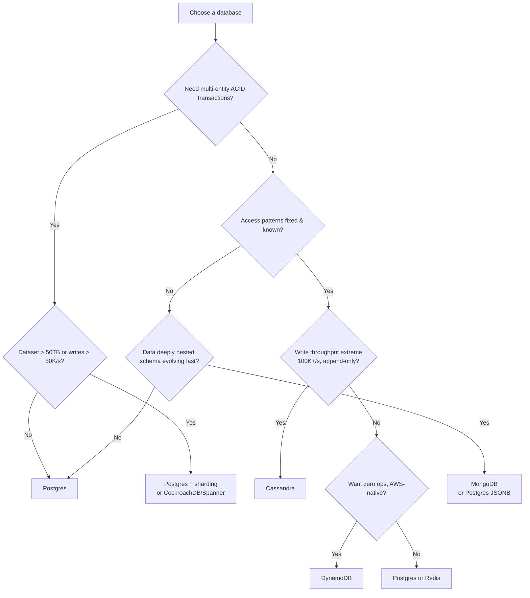

# Database Selection — Postgres vs DynamoDB vs MongoDB vs Cassandra

---

## The Staff-Level Framing

Junior engineers pick a database because they know it. Staff engineers pick a database because the **access pattern demands it**.

In an interview, saying "I'd use Postgres" without justification is a miss. Saying "I'd use Postgres because this workload is read-heavy with complex multi-table joins, needs ACID transactions for financial correctness, and the dataset fits comfortably in a single vertically-scaled instance for the next 3 years" — that's a staff answer.

**The decision framework:**

```
1. What is the access pattern?      (point lookups? range scans? joins? aggregations?)
2. What is the consistency need?    (strong? eventual? read-your-writes?)
3. What is the write throughput?    (100/s? 100K/s?)
4. What is the data shape?          (relational? document? wide-column? key-value?)
5. What is the scale trajectory?    (GB? TB? PB? growth rate?)
6. What is the operational cost?    (team expertise? managed vs self-hosted?)
```

---

## Quick Decision Matrix

| Dimension             | **Postgres**                     | **DynamoDB**                          | **MongoDB**                               | **Cassandra**                   |
| --------------------- | -------------------------------- | ------------------------------------- | ----------------------------------------- | ------------------------------- |
| **Data Model**        | Relational                       | Key-value + document                  | Document (BSON)                           | Wide-column                     |
| **Query Flexibility** | Excellent (SQL, joins, CTEs)     | Limited (PK/SK only)                  | Good (rich queries, aggregation)          | Poor (partition key required)   |
| **Transactions**      | Full ACID, multi-row             | Limited (25 items, single region)     | Multi-document ACID (4.0+)                | Lightweight only (Paxos)        |
| **Write Throughput**  | Moderate (~10K/s single node)    | Very high (unlimited w/ partitioning) | High (~50K/s sharded)                     | Extreme (~1M/s+)                |
| **Read Latency**      | 1–10ms                           | Single-digit ms (consistent)          | 1–10ms                                    | 1–10ms                          |
| **Horizontal Scale**  | Hard (Citus, manual sharding)    | Automatic, transparent                | Sharding (built-in, operational overhead) | Native, linear                  |
| **Consistency**       | Strong (default)                 | Configurable (eventual/strong)        | Tunable                                   | Tunable (ONE/QUORUM/ALL)        |
| **Secondary Indexes** | Yes (unlimited, powerful)        | GSI/LSI (limited, costly)             | Yes (rich)                                | Limited (anti-pattern at scale) |
| **Best For**          | Relational, transactional        | Predictable KV at scale               | Flexible schema, iteration speed          | Write-heavy, time-series        |
| **Ops Burden**        | Medium (self-hosted) / Low (RDS) | Very low (fully managed)              | Medium-High                               | High                            |

---

## Postgres

### When to Pick It

**Default choice.** Start here unless you have a specific reason not to. Postgres is the most versatile database and handles far more scale than most engineers assume — a well-tuned `db.r6g.8xlarge` handles ~50K QPS and 10TB comfortably.

**Pick Postgres when:**

- You need **ACID transactions across multiple entities** (financial systems, inventory, bookings)
- Your queries involve **joins** across normalized tables
- You need **complex aggregations** (`GROUP BY`, window functions, CTEs)
- Data has **strong relational integrity** requirements (foreign keys matter)
- You need **flexible querying** where access patterns will evolve
- Dataset fits in a **single instance** (up to ~10TB) for the foreseeable future
- You want **rich extensions**: PostGIS (geo), pgvector (embeddings), TimescaleDB (time-series), full-text search

**Don't pick Postgres when:**

- Write throughput exceeds ~20K/s sustained and can't be batched
- You need seamless multi-region active-active writes
- Dataset will exceed 50TB with no natural partitioning key

### Design Pattern Examples

**1. Payment / Order System**

```sql
BEGIN;
  UPDATE accounts SET balance = balance - 100 WHERE id = 'sender' AND balance >= 100;
  UPDATE accounts SET balance = balance + 100 WHERE id = 'receiver';
  INSERT INTO transactions (from_id, to_id, amount, status) VALUES (...);
COMMIT;
```

**Why Postgres:** Multi-row ACID transaction is non-negotiable. A partial write (debit without credit) is a business catastrophe. No other database on this list handles this as cleanly.

**2. Yelp Business Metadata + Geo Search**

```sql
CREATE INDEX idx_businesses_geo ON businesses USING GIST (ll_to_earth(lat, lng));

SELECT b.*, AVG(r.rating) as avg_rating
FROM businesses b
JOIN reviews r ON r.business_id = b.id
WHERE earth_distance(ll_to_earth(b.lat, b.lng), ll_to_earth(37.77, -122.41)) < 5000
  AND b.category = 'restaurant'
GROUP BY b.id
HAVING AVG(r.rating) >= 4.0;
```

**Why Postgres:** PostGIS geo indexing + joins + aggregation in one query. Business metadata is relational (business → categories → hours → owner).

**3. Multi-Tenant SaaS**

```sql
-- Row-level security enforces tenant isolation
CREATE POLICY tenant_isolation ON documents
  USING (tenant_id = current_setting('app.current_tenant')::uuid);
```

**Why Postgres:** RLS gives database-enforced tenant isolation. Combined with schema-per-tenant or shared-table-with-tenant-id patterns.

**4. Ticketmaster Seat Reservation**

```sql
BEGIN;
  SELECT * FROM seats WHERE event_id = ? AND seat_no = ? FOR UPDATE;  -- pessimistic lock
  UPDATE seats SET status = 'reserved', held_until = now() + interval '10 min' WHERE id = ?;
COMMIT;
```

**Why Postgres:** `SELECT ... FOR UPDATE` prevents double-booking. Row-level locking with proper isolation levels is exactly what this problem needs.

---

## DynamoDB

### When to Pick It

DynamoDB is a **fully managed key-value store with predictable single-digit millisecond latency at any scale**. The trade: you must know your access patterns upfront and design your keys around them.

**Pick DynamoDB when:**

- Access patterns are **known and stable** (point lookups by ID, range queries on a sort key)
- You need **predictable latency at massive scale** with zero ops burden
- Traffic is **spiky or unpredictable** (on-demand mode auto-scales)
- You're on AWS and want **serverless integration** (Lambda, API Gateway)
- Write throughput is very high and **naturally partitionable**
- You need **TTL-based expiry** (built-in, free)

**Don't pick DynamoDB when:**

- Access patterns will change frequently (schema migration is painful)
- You need ad-hoc queries or analytics (requires export to S3/Athena)
- You need joins or complex aggregations
- Your data has low cardinality partition keys (hot partition problem)

### Key Design Is Everything

```
Single-table design (the DynamoDB way):

PK                  | SK                    | Attributes
--------------------|-----------------------|------------------
USER#123            | PROFILE               | name, email, created
USER#123            | ORDER#2026-08-01#a1   | total, status, items
USER#123            | ORDER#2026-08-02#b2   | total, status, items
ORDER#a1            | METADATA              | user_id, restaurant_id
RESTAURANT#456      | MENU#item1            | name, price

Query patterns satisfied:
  - Get user profile:      PK=USER#123, SK=PROFILE
  - Get user's orders:     PK=USER#123, SK begins_with ORDER#
  - Get orders in range:   PK=USER#123, SK between ORDER#2026-08-01 and ORDER#2026-08-31
```

### Design Pattern Examples

**1. URL Shortener (TinyURL / Bitly)**

```
Table: short_urls
PK: short_code (e.g., "abc123")
Attributes: long_url, user_id, created_at, click_count, ttl

Access pattern: GetItem(short_code) → redirect
```

**Why DynamoDB:** Pure key-value lookup. Billions of URLs, single-digit ms latency, no joins ever needed. Auto-scales to any read volume. TTL handles expiring links for free.

**2. Session Store / Feature Flags**

```
PK: session_id
Attributes: user_id, permissions, expires_at (TTL attribute)
```

**Why DynamoDB:** Point lookups, high read volume, automatic expiry via TTL, no relational needs.

**3. Shopping Cart**

```
PK: USER#123
SK: CART#ITEM#sku456
Attributes: quantity, price_snapshot, added_at
```

**Why DynamoDB:** Query all cart items with `PK=USER#123, SK begins_with CART#`. High write volume (add/remove), no joins, needs low latency.

**4. IoT / Device State**

```
PK: device_id
SK: timestamp (for time-range queries)
Attributes: telemetry payload
```

**Why DynamoDB:** Massive write throughput, partitioned naturally by device, range queries on time.

**Hot partition warning:** If one partition key gets disproportionate traffic (e.g., a viral URL), you'll throttle. Mitigate with **write sharding**: `PK = short_code#\{random(0-9)\}` and scatter-gather on read, or cache hot keys in DAX/Redis.

---

## MongoDB

### When to Pick It

MongoDB is a **document database** — data stored as nested BSON documents. Its advantage is schema flexibility and the ability to store an entire aggregate in one document (no joins needed).

**Pick MongoDB when:**

- Data is **naturally hierarchical/nested** (product catalogs with varying attributes, CMS content)
- Schema **evolves rapidly** (startups iterating on data model)
- You need **rich queries** without a rigid schema (unlike DynamoDB)
- Read pattern is "fetch the whole document" (denormalized aggregate)
- You need **aggregation pipelines** for analytics-lite workloads
- Team velocity matters more than storage efficiency

**Don't pick MongoDB when:**

- You need strict multi-entity ACID guarantees at high volume (possible since 4.0, but Postgres is better)
- Data is highly relational with many-to-many relationships
- You need mature SQL tooling / BI integration
- Cross-document joins (`$lookup`) become a hot path — this is a design smell

### Design Pattern Examples

**1. E-Commerce Product Catalog**

```javascript
{
  _id: ObjectId("..."),
  sku: "LAPTOP-X1",
  name: "ThinkPad X1 Carbon",
  category: ["Electronics", "Laptops"],
  price: { amount: 1499, currency: "USD" },
  attributes: {                        // varies wildly by product type
    cpu: "Intel i7-1355U",
    ram_gb: 16,
    screen: { size_inch: 14, resolution: "1920x1200" }
  },
  variants: [
    { sku: "LAPTOP-X1-16-512", ram: 16, storage: 512, stock: 42 },
    { sku: "LAPTOP-X1-32-1TB", ram: 32, storage: 1024, stock: 8 }
  ],
  reviews_summary: { count: 1203, avg: 4.6 }
}
```

**Why MongoDB:** Product attributes differ radically between categories (laptop vs t-shirt vs book). A relational schema would need EAV tables or dozens of nullable columns. One document = one product page render.

**2. CMS / Content Platform**

```javascript
{
  _id: "article-123",
  title: "System Design Guide",
  blocks: [                          // arbitrary nested content blocks
    { type: "heading", level: 2, text: "..." },
    { type: "code", lang: "python", content: "..." },
    { type: "image", url: "...", caption: "..." }
  ],
  metadata: { author, tags, published_at, seo: {...} }
}
```

**Why MongoDB:** Content structure is arbitrary and evolves. Fetching an article = one document read.

**3. User Profile with Varying Fields**

```javascript
{
  _id: "user-456",
  email: "...",
  preferences: { theme: "dark", notifications: { email: true, push: false } },
  integrations: {                     // some users have none, some have many
    slack: { workspace_id, token_ref },
    github: { username, scopes: [...] }
  }
}
```

**Why MongoDB:** Sparse, nested, optional fields. In Postgres this would be a `JSONB` column — at which point ask: why not just use Mongo?

**Counter-argument:** Postgres `JSONB` gives you 80% of MongoDB's flexibility _plus_ full relational capability. Many teams that chose MongoDB for flexibility later regret losing joins and transactions. **In an interview, mention this trade-off — it signals maturity.**

---

## Cassandra

### When to Pick It

Cassandra is a **wide-column store optimized for extreme write throughput and linear horizontal scaling**. It uses an LSM-tree storage engine (writes go to an in-memory memtable, flushed sequentially to disk).

**Pick Cassandra when:**

- Write throughput is **extreme** (100K–1M+ writes/sec)
- Data is **append-only or time-series** (events, logs, metrics, messages)
- You need **linear scalability** — add nodes, get proportional capacity
- You need **multi-region active-active** writes with tunable consistency
- Query pattern is always **"give me rows for partition X, ordered by clustering key"**
- **No single point of failure** is a hard requirement (masterless architecture)

**Don't pick Cassandra when:**

- You need ad-hoc queries or joins
- Read patterns are unknown or will change (schema is query-driven, hard to change)
- Data volume is small (&lt;1TB) — operational complexity isn't justified
- You need strong consistency by default
- Your team lacks Cassandra operational expertise

### The Cardinal Rule: Model Tables Around Queries

In Cassandra you **denormalize aggressively** and create one table per query pattern.

```cql
-- Query: "get recent messages in a chat room"
CREATE TABLE messages_by_room (
  room_id     UUID,
  created_at  TIMESTAMP,
  message_id  TIMEUUID,
  sender_id   UUID,
  content     TEXT,
  PRIMARY KEY ((room_id), created_at, message_id)
) WITH CLUSTERING ORDER BY (created_at DESC);

-- Query: "get all messages sent by a user" — SEPARATE TABLE, duplicated data
CREATE TABLE messages_by_sender (
  sender_id   UUID,
  created_at  TIMESTAMP,
  message_id  TIMEUUID,
  room_id     UUID,
  content     TEXT,
  PRIMARY KEY ((sender_id), created_at, message_id)
) WITH CLUSTERING ORDER BY (created_at DESC);
```

Writing a message writes to **both tables**. Storage is cheap; query latency is not.

### Design Pattern Examples

**1. WhatsApp / Chat Messages**

```cql
PRIMARY KEY ((conversation_id), sent_at DESC, message_id)
```

**Why Cassandra:** Billions of messages, append-only, always queried as "latest N messages in conversation X". Write throughput is enormous. Perfect partition key (conversation_id) with natural time ordering.

**2. Yelp Reviews**

```cql
CREATE TABLE reviews_by_business (
  business_id UUID,
  created_at  TIMESTAMP,
  review_id   UUID,
  user_id     UUID,
  rating      INT,
  text        TEXT,
  PRIMARY KEY ((business_id), created_at, review_id)
) WITH CLUSTERING ORDER BY (created_at DESC);
```

**Why Cassandra:** Append-only, 500K writes/day, always read as "latest reviews for business X". Business metadata stays in Postgres; reviews live in Cassandra.

**3. Time-Series Metrics / Monitoring**

```cql
CREATE TABLE metrics (
  metric_name  TEXT,
  bucket_day   DATE,          -- bucket to prevent unbounded partitions
  ts           TIMESTAMP,
  value        DOUBLE,
  tags         MAP<TEXT,TEXT>,
  PRIMARY KEY ((metric_name, bucket_day), ts)
) WITH CLUSTERING ORDER BY (ts DESC)
  AND default_time_to_live = 2592000;   -- 30-day TTL
```

**Why Cassandra:** Millions of writes/sec, time-ordered reads, automatic TTL expiry, linear scale. (TimescaleDB or ClickHouse are also strong candidates here.)

**4. Activity Feed / Event Log**

```cql
PRIMARY KEY ((user_id), event_time DESC, event_id)
```

**Why Cassandra:** Write-heavy fanout, read as "recent activity for user X", no joins needed.

**Partition size warning:** Keep partitions under ~100MB / 100K rows. An unbounded partition (e.g., all messages for a 10-year-old chat room) causes hotspots and slow reads. **Bucket by time** (`(room_id, year_month)`) to bound partition growth.

---

## Polyglot Persistence — The Realistic Answer

Real systems use **multiple databases**, each for what it's best at. In an interview, showing this is a strong signal.

### Example: Yelp

```
Postgres         → business metadata, users, categories (relational, ACID)
Cassandra        → reviews (append-only, high write, time-ordered reads)
Elasticsearch    → search index (geo + full-text + faceted filters)
Redis            → hot business profile cache, trending sorted sets
S3 + CloudFront  → photos
```

### Example: DoorDash / Local Delivery

```
Postgres         → orders (ACID, state machine, payment correctness)
Redis            → driver live locations (geospatial index, sub-second updates)
Cassandra        → delivery event log / driver location history
Kafka            → event backbone (order created → matching → notification)
DynamoDB         → session store, feature flags
```

### Example: Netflix / Video Streaming

```
Cassandra        → viewing history, playback bookmarks (write-heavy, per-user partition)
DynamoDB         → user session state, A/B test assignments
Postgres/MySQL   → billing, subscriptions (ACID)
Elasticsearch    → title search
S3 + CDN         → video segments
```

---

## Decision Flowchart



---

## Interview Talking Points

### "Why not just use Postgres for everything?"

Often you should. Postgres handles far more than people assume. The honest limits:

- **Write ceiling:** ~20–50K writes/s on a large instance before you need sharding
- **Storage ceiling:** ~10–50TB before operations get painful
- **Multi-region writes:** Postgres has no native active-active; you need Citus/CockroachDB/Spanner
- **Elastic scale:** Adding capacity requires planning; DynamoDB/Cassandra do it transparently

**Answer framing:** "I'd start with Postgres because it maximizes optionality — access patterns will change and Postgres handles that. I'd move a specific workload off Postgres when I have evidence it's hitting a limit: sustained write throughput above ~20K/s, or a table growing past ~5TB with a clear partition key."

### "How would you migrate from Postgres to Cassandra?"

1. Identify the specific table hitting write limits (usually append-only: events, messages, reviews)
2. Design Cassandra schema **query-first** — one table per access pattern
3. **Dual-write** phase: write to both Postgres and Cassandra, read from Postgres
4. **Backfill** historical data via batch job with rate limiting
5. **Verify** parity — run shadow reads against both, diff results
6. **Cut over reads** to Cassandra behind a feature flag, gradual percentage rollout
7. Stop writes to Postgres, archive old table

### "What about NewSQL — CockroachDB, Spanner, Vitess?"

Worth mentioning as a middle ground: SQL interface + ACID + horizontal scale. Trade-offs: higher write latency (distributed consensus), higher cost, smaller ecosystem. Good answer when the interviewer pushes on "what if you need Postgres semantics at DynamoDB scale?"

### Red Flags to Avoid

| Don't Say                              | Say Instead                                                                                                      |
| -------------------------------------- | ---------------------------------------------------------------------------------------------------------------- |
| "MongoDB because it's web scale"       | "MongoDB because the product catalog has heterogeneous attributes per category"                                  |
| "NoSQL is faster than SQL"             | "DynamoDB gives predictable single-digit ms latency for point lookups because it avoids query planning"          |
| "I'd shard from day one"               | "I'd start single-instance and design a clear shard key so sharding is possible when we hit ~20K writes/s"       |
| "Cassandra for everything write-heavy" | "Cassandra if writes are append-only with a natural partition key; otherwise batching into Postgres may suffice" |

---

## Cheat Sheet

| Use Case                        | Database                                         | Why                                             |
| ------------------------------- | ------------------------------------------------ | ----------------------------------------------- |
| Payments, orders, inventory     | **Postgres**                                     | Multi-row ACID is mandatory                     |
| URL shortener, session store    | **DynamoDB**                                     | Pure KV, predictable latency, zero ops          |
| Chat messages, activity feed    | **Cassandra**                                    | Append-only, time-ordered, extreme write volume |
| Product catalog, CMS            | **MongoDB**                                      | Heterogeneous nested documents                  |
| Geo search (Yelp, Uber)         | **Postgres + PostGIS** or **Elasticsearch**      | Geo indexing + filters                          |
| Time-series metrics             | **Cassandra** / **TimescaleDB** / **ClickHouse** | Write-optimized, TTL, time-partitioned          |
| Leaderboard, rate limiting      | **Redis**                                        | In-memory sorted sets, atomic ops               |
| Full-text + faceted search      | **Elasticsearch**                                | Inverted index, relevance scoring               |
| Analytics / OLAP                | **ClickHouse** / **Snowflake** / **BigQuery**    | Columnar, aggregation-optimized                 |
| Graph traversal (social, fraud) | **Neo4j** / **Postgres recursive CTE**           | Multi-hop relationships                         |
