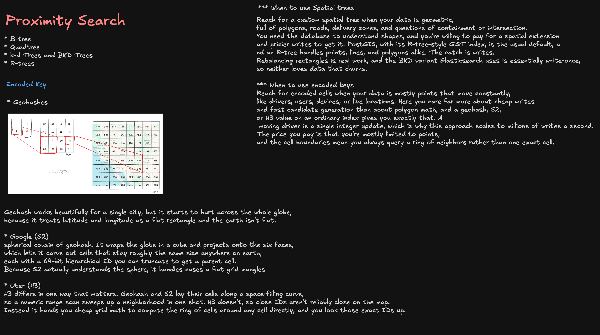

# Proximity Search — Geohashing vs Spatial Trees



---

## The Staff-Level Framing

"Find nearby X" (drivers, restaurants, listings, stores) is one of the most common system design primitives — Uber, Yelp, DoorDash, Tinder, Pokémon Go all reduce to the same core question: **given a lat/lng, find the K nearest points efficiently, at scale, with acceptable write cost.**

There are two fundamentally different families of solutions:

1. **Spatial trees** — data structures that understand geometry (points, lines, polygons) and organize space hierarchically: **Quadtree, k-d tree, BKD tree, R-tree**
2. **Encoded keys** — flatten 2D coordinates into a single sortable string/integer so an ordinary index (B-tree, hash) can do the work: **Geohash, S2, H3**

The staff-level answer isn't "which is better" — it's **"which access pattern and data shape do I have, and what am I trading off?"**

---

## Quick Decision Matrix

| Dimension              | **Spatial Trees** (Quadtree, k-d, BKD, R-tree)       | **Encoded Keys** (Geohash, S2, H3)                    |
| ---------------------- | ---------------------------------------------------- | ----------------------------------------------------- |
| **Data shape**         | Points, lines, polygons, containment/intersection    | Mostly points                                         |
| **Write cost**         | Expensive — rebalancing rectangles, tree restructure | Cheap — single integer/string update                  |
| **Best for**           | Static/slow-changing geometric data (zones, roads)   | High-churn moving points (drivers, users, devices)    |
| **Underlying storage** | Custom index structure (GiST in Postgres)            | Ordinary B-tree/hash index on an encoded column       |
| **Query result**       | Exact k-NN or exact containment                      | Approximate — always returns a ring of neighbor cells |
| **Scales to writes/s** | Thousands/s realistic ceiling                        | Millions/s (just an indexed column write)             |
| **Real-world example** | PostGIS (`GiST`/R-tree) for delivery zone polygons   | Uber H3 for driver location, Google S2 for global geo |

---

## Part 1: Spatial Trees

### Quadtree

Recursively subdivide 2D space into 4 quadrants whenever a cell holds more than N points. Simple, intuitive, good for roughly uniform point distributions — but degrades badly with **clustered data** (e.g., all points in one dense city block), since one branch of the tree becomes very deep while the rest stays shallow.

### k-d Trees and BKD Trees

A k-d tree splits space along alternating dimensions (x, then y, then x, ...) building a balanced binary tree for exact nearest-neighbor queries. It's efficient to query but **expensive to rebalance** on inserts/deletes — not friendly to write-heavy workloads.

**BKD trees** (used internally by Lucene/Elasticsearch for geo fields) solve the rebalancing problem by making the structure **essentially write-once**: points are bulk-loaded into blocks and sorted, and updates are handled by writing new blocks + periodic merge (segment merging), rather than in-place mutation. This trades immediate consistency for write throughput — the same trade-off log-structured merge trees make for time-series data.

### R-trees

Group nearby objects and represent them with **minimum bounding rectangles (MBRs)** in a hierarchical tree — a rectangle at a parent node bounds all of its children's rectangles. This is the standard choice when your data includes **lines and polygons**, not just points, because a bounding rectangle naturally represents "does this delivery zone polygon intersect this bounding box?"

**PostGIS** implements this via a **GiST (Generalized Search Tree) index**, which is R-tree-style. This is why PostGIS is the default reach for geometric workloads — polygons, roads, delivery zones, containment/intersection questions.

```sql
CREATE INDEX idx_zones_geom ON delivery_zones USING GIST (geom);

SELECT zone_id FROM delivery_zones
WHERE ST_Contains(geom, ST_SetSRID(ST_MakePoint(:lng, :lat), 4326));
```

**The catch: writes.** Rebalancing rectangles on insert/update is real, non-trivial work — every insert may require adjusting bounding boxes up the tree. Combined with the BKD tree's write-once nature in Elasticsearch, **neither structure loves data that churns constantly.**

### When to Use Spatial Trees

Reach for a custom spatial tree (or PostGIS's GiST/R-tree index) when your data is **geometric** — full of polygons, roads, delivery zones, and questions of **containment or intersection**. You need the database to understand shapes, and you're willing to pay for a spatial extension and pricier writes to get it.

---

## Part 2: Encoded Keys (Geohash, S2, H3)

Instead of teaching the database geometry, **encode the 2D coordinate into a 1D sortable key** so a plain B-tree or hash index does all the work. This is dramatically cheaper to write, at the cost of only supporting point data and returning approximate ("ring of cells") results instead of exact k-NN.

### Geohash

Interleave the bits of latitude and longitude into a single base-32 string. Each additional character added to the string **subdivides the cell further** — this is the classic quadtree-like recursive subdivision, just encoded as a string prefix instead of a tree pointer structure.

```
Precision 5 (~5km cell):  9q8yy
Precision 6 (~1km cell):  9q8yyk
Precision 7 (~150m cell): 9q8yykx
```

**Why it's cheap to write:** updating a moving driver's position is just `SET driver:\{id\}:geohash = "9q8yyk"` — a single string/integer write on an ordinary index. This is why geohash-based approaches scale to **millions of writes per second** — a moving driver is a single integer/string update, not a tree rebalance.

**The neighbor-search gotcha:** because geohash cells are rectangular grid buckets, a point near a cell boundary might be geographically closer to a point in the _adjacent_ cell than to another point in its own cell. You must always query the **center cell + 8 surrounding cells (a 3×3 ring)**, never just the exact cell match — otherwise you'll miss legitimately nearby results sitting just across a boundary.

```python
def get_search_cells(lat, lng, precision):
    center = geohash.encode(lat, lng, precision)
    return [center] + geohash.neighbors(center)  # 9 cells total
```

### Why Geohash Breaks Down Globally

Geohash works beautifully for a single city, but it starts to hurt across the whole globe, because it **treats latitude and longitude as a flat rectangle — and the earth isn't flat.** Cell sizes distort near the poles, and the flat projection mangles distance calculations at global scale.

### Google S2

S2 is geohash's spherical cousin. It **wraps the globe in a cube and projects onto the six faces**, which lets it carve out cells that stay roughly the same size anywhere on Earth, each with a **64-bit hierarchical ID** you can truncate to get a parent cell (coarser precision). Because S2 actually understands the sphere, it handles cases (poles, date line, cell-size uniformity) that a flat grid mangles.

### Uber H3

H3 uses a **hexagonal grid** instead of squares, which gives more uniform neighbor distance (a hexagon's 6 neighbors are all equidistant from center, unlike a square's edge vs. corner neighbors).

The key difference that matters operationally: **geohash and S2 lay their cells along a space-filling curve, so a numeric range scan sweeps up a whole neighborhood in one shot.** H3 doesn't — close cell IDs aren't reliably close on the map. Instead, H3 hands you cheap grid math to compute **the exact ring of neighboring cell IDs around any cell directly**, and you look those exact IDs up (rather than doing a range scan).

```python
import h3

cell = h3.latlng_to_cell(lat, lng, resolution=9)  # ~150m hexagon
ring = h3.grid_disk(cell, k=1)  # center + 6 neighbors
candidates = redis.sunion(*[f"drivers:cell:{c}" for c in ring])
```

### When to Use Encoded Keys

Reach for encoded cells (geohash/S2/H3) when your data is **mostly points that move constantly** — drivers, users, devices, live locations. You care far more about **cheap writes and fast candidate generation** than about polygon math, and a geohash/S2/H3 value stored on an ordinary index gives you exactly that.

The price you pay: you're mostly limited to points (not polygons/lines), and cell boundaries mean you always query a **ring of neighbors** rather than one exact cell — the result is an approximate candidate set that you typically re-rank with actual distance (or routing ETA) afterward.

---

## Putting It Together: A Typical Design

Most real systems (Uber, DoorDash, Yelp) combine both:

1. **Encoded keys (geohash/H3) for the hot path** — real-time driver/user location writes and fast candidate retrieval (`SADD drivers:cell:\{cellId\} \{driverId\}`), because this needs to absorb massive write volume
2. **Spatial trees (PostGIS/R-tree) for the geometric layer** — delivery zone boundaries, service area polygons, "is this address within our coverage area" containment checks, which change rarely and need exact geometric correctness
3. **Candidates from step 1 are re-ranked by actual road distance/ETA** from a routing engine — the encoded-key lookup is just a cheap first-pass filter, not the final answer

---

## Interview Follow-ups

1. **Why not just use `ST_Distance` on every row?** — O(n) scan against every point in the table; doesn't scale past a small dataset. Any of these structures exist specifically to avoid a full scan.
2. **What happens at a geohash cell boundary?** — Always search the 3×3 (or H3 k-ring) neighborhood, never a single cell, then post-filter by actual distance.
3. **Why does Uber use H3 instead of geohash?** — Hexagons have uniform neighbor distance (no corner vs. edge distortion), which produces more consistent ring-search results for a ride-matching workload.
4. **When would you pick PostGIS/R-tree over H3?** — When you need polygons/lines and containment/intersection queries (delivery zones, geofencing), not just nearest-point search.
5. **How do you handle a globally distributed dataset with geohash?** — You typically don't for global scale — geohash's flat-earth assumption breaks down; reach for S2 or H3, which model the sphere.
