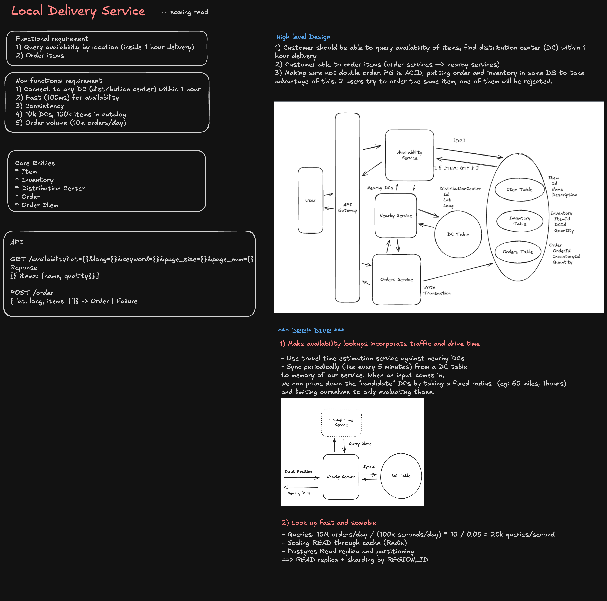

> **Editable diagram:** [Open in Excalidraw](https://excalidraw.com/#room=8a26208f5e3fd48b2dd6,9F5wvtXFvQvUPkj94eYDzQ)



---

## Scale & Requirements

### Functional

- Restaurants/merchants can manage menu, inventory, and orders
- Consumers can search nearby restaurants, place orders, track delivery
- Drivers can accept orders and update delivery status in real-time
- Payments are processed securely (card, wallet, promotions)
- Consumers receive ETA updates and driver location (within consent)

### Non-Functional

- **Search:** Merchants search within 10 minutes' max delivery distance &lt;200ms p99
- **Matching:** Match an order with a driver within 30s
- **Tracking:** Driver location updates within 1–5s (not every second — bandwidth/battery)
- **Scale:** 500M orders/year in a city, 50K concurrent active drivers, 100K concurrent deliveries
- **Availability:** 99.95% for orders, matching, payment
- **Reliability:** Payment processed atomically; never lose an order; drivers always sync state
- **Latency:** Order submission &lt;2s, ETA computation &lt;1s, dispatch decision &lt;5s

### Scale Estimates (Metropolis, e.g., SF Bay Area)

- 100 restaurants active, 1000 menu items each
- 50K drivers, 100K concurrent active users
- Peak: 1000 orders/min → 16K QPS during lunch/dinner
- Driver location updates: 50K drivers × 1 update/10s = **5K QPS** location writes
- Order state changes: 100K active orders × state changes = **10K QPS** database writes
- Payment processing: 16K orders/min × cost per order = **$1–3 revenue/order**

---

## High-Level Architecture

```
┌────────────────────────────────────────────────────────────────────┐
│                        ORDER SUBMISSION PATH                       │
│  Consumer App → API Gateway → Order Service                        │
│               → Payment Service → Stripe / PayPal                  │
│               → Inventory Service → Restaurant inventory sync      │
│               → Order Queue (Kafka)                                │
│                       ↓                                             │
│              Matching Engine (consume from queue)                   │
│               ↓ find eligible drivers                               │
│              Dispatch Service → assign driver + send notification   │
└────────────────────────────────────────────────────────────────────┘

┌────────────────────────────────────────────────────────────────────┐
│                      REAL-TIME TRACKING PATH                       │
│  Driver App → Location Service (WebSocket)                         │
│               → Geospatial index (update active driver locations)   │
│  Matching Engine                                                   │
│   ↓ consume location updates                                        │
│   → recalculate ETA, check for repositioning opportunities         │
│   → push updates to consumer (WebSocket)                           │
└────────────────────────────────────────────────────────────────────┘
```

---

## Data Model

### Orders (Postgres — transactional source of truth)

```sql
CREATE TABLE orders (
  id              UUID PRIMARY KEY DEFAULT gen_random_uuid(),
  consumer_id     BIGINT REFERENCES users(id),
  restaurant_id   BIGINT REFERENCES restaurants(id),
  driver_id       BIGINT REFERENCES drivers(id),
  status          TEXT NOT NULL,  -- pending | confirmed | prep | picked | transit | delivered | cancelled
  items           JSONB NOT NULL, -- [{item_id, qty, special_instructions}...]
  subtotal        NUMERIC(8,2),
  tax             NUMERIC(8,2),
  delivery_fee    NUMERIC(8,2),
  promo_code      TEXT,
  total           NUMERIC(8,2),
  payment_method  TEXT,           -- card | wallet | cash
  payment_status  TEXT,           -- pending | charged | refunded
  pickup_address  TEXT,           -- restaurant location (normalized)
  delivery_address TEXT,
  delivery_lat    DOUBLE PRECISION,
  delivery_lng    DOUBLE PRECISION,
  estimated_pickup_time  TIMESTAMP,
  estimated_delivery_time TIMESTAMP,
  actual_pickup_time     TIMESTAMP,
  actual_delivery_time   TIMESTAMP,
  driver_rating  SMALLINT CHECK (driver_rating BETWEEN 1 AND 5),
  notes          TEXT,
  created_at     TIMESTAMPTZ DEFAULT now(),
  updated_at     TIMESTAMPTZ DEFAULT now()
);

CREATE INDEX idx_orders_consumer ON orders(consumer_id, created_at DESC);
CREATE INDEX idx_orders_driver ON orders(driver_id, status);
CREATE INDEX idx_orders_restaurant ON orders(restaurant_id, status);
CREATE INDEX idx_orders_status ON orders(status, created_at DESC);
```

### Order Items (Postgres)

```sql
CREATE TABLE order_items (
  id          UUID PRIMARY KEY,
  order_id    UUID REFERENCES orders(id),
  menu_item_id BIGINT REFERENCES menu_items(id),
  quantity    INT,
  unit_price  NUMERIC(8,2),
  special_req TEXT           -- "no onions", "extra spicy"
);
```

### Drivers (Postgres + Redis)

```sql
CREATE TABLE drivers (
  id              BIGINT PRIMARY KEY,
  name            TEXT,
  phone           TEXT,
  vehicle_type    TEXT,         -- car | bike | scooter
  status          TEXT,         -- online | offline | on_delivery
  acceptance_rate NUMERIC(4,2), -- cancelled delivery rate
  avg_rating      NUMERIC(3,2),
  total_deliveries INT,
  documents       JSONB,        -- license, insurance expiry
  created_at      TIMESTAMPTZ
);

-- Hot state in Redis (updated every location ping)
KEY: driver:{id}:state
VALUE: { lat, lng, status, heading, speed, last_update_at }
TTL: 1 hour
```

### Restaurants (Postgres + Redis)

```sql
CREATE TABLE restaurants (
  id              BIGINT PRIMARY KEY,
  name            TEXT,
  lat             DOUBLE PRECISION,
  lng             DOUBLE PRECISION,
  address         TEXT,
  phone           TEXT,
  status          TEXT,         -- open | closed | pause_orders
  avg_delivery_time INT,        -- minutes
  min_order       NUMERIC(8,2),
  delivery_zones  POLYGON[],    -- delivery boundaries (PostGIS)
  created_at      TIMESTAMPTZ
);

-- Hot state in Redis
KEY: restaurant:{id}:live_order_count
VALUE: { pending, prep, ready_for_pickup }
```

---

## Order Submission & Payment

### Flow

```
1. Consumer submits order
   POST /api/orders/create
   {
     restaurant_id, delivery_address, items[], promo_code
   }

2. Server validates:
   - Restaurant is open & accepting orders
   - Address is within delivery zone
   - Menu items exist + quantities available
   - Promo code valid (cached in Redis)
   - Minimum order value met

3. Price calculation:
   subtotal = SUM(item prices)
   tax = subtotal * tax_rate[state]
   delivery_fee = base + surge_multiplier * base
   total = subtotal + tax + delivery_fee - discount

4. Payment authorization:
   - For card: Stripe charge (idempotency_key = orderId)
   - For wallet: check balance, reserve funds (2-phase commit)
   - For cash: mark as pending payment
   - On failure: return error, order not created

5. Write to DB (Postgres):
   INSERT INTO orders { consumer_id, restaurant_id, status: 'pending', ... }
   INSERT INTO order_items (bulk)

6. Publish OrderCreated event (Kafka):
   Topic: orders.created
   Payload: { orderId, restaurantId, deliveryLat, deliveryLng, estimatedValue }

7. Increment Redis counter:
   INCR restaurant:{restaurantId}:live_order_count
   INCRBY restaurant:{restaurantId}:order_value_pending total

8. Return to client:
   { orderId, status: 'pending', eta_to_restaurant: 5min }
```

### Idempotency & Retries

Every order submission includes an **idempotency key** (e.g., hash of timestamp + device). Idempotent key stored in Redis:

```
KEY: idempotency:{key}
VALUE: { orderId, status, response }
TTL: 24 hours

If retry arrives within TTL → return cached { orderId, response }
If TTL expired → allow new order (user submitted duplicate intentionally)
```

Payment idempotency key passed to Stripe — prevents double-charging if the Stripe call succeeds but the response is lost.

---

## Matching Engine (The Hard Part)

Matching must happen within 30s and satisfy multiple constraints:

```
Input: OrderCreated event with delivery location + restaurant location
Task: find best driver to assign

Constraints:
  1. Driver is currently online
  2. Driver's current location is within 15 min of restaurant
  3. Driver's vehicle type matches order size (bike < 5kg, car otherwise)
  4. Driver's rating ≥ merchant's requirement (e.g., restaurants want 4.5+)
  5. Driver doesn't have &gt;X deliveries in flight (capacity)
  6. Delivery location is within driver's acceptance zone
  7. Driver hasn't rejected this restaurant recently
```

### Algorithm: Hybrid Geo + ML

**Phase 1: Candidate Pool (fast, 1s)**

```
1. Geo query: find drivers within radius R of restaurant
   Using Redis geospatial index (GEORADIUS)

   GEORADIUS drivers:geo:locations 37.7749 -122.4194 15 km
   → returns [{driver_id, lat, lng, distance}...]

2. Filter candidates:
   - Driver status = online & not at capacity
   - Vehicle type appropriate
   - Driver rating ≥ merchant threshold
   - No recent rejections (Redis SCARD driver:{id}:rejections:{restaurantId})

3. Rank by distance + accept rate + avg rating
   score = -distance + 0.1 * accept_rate + 0.05 * avg_rating
```

**Phase 2: Detailed Scoring (ML, &lt;2s)**

```
For top 10 candidates, compute:
  - ETA to restaurant pickup (using current location + traffic model)
  - ETA from restaurant to consumer (using A/B tested routing)
  - Total delivery time (pickup + delivery)
  - Driver's SLA compliance rate for this distance
  - Estimated tip (via ML model trained on historical tips)

ML score = w1 * eta_freshness + w2 * driver_reliability + w3 * expected_tip + w4 * distance_cost
          - w5 * surge_multiplier (higher surge = lower score to avoid over-offering expensive deliveries)

Output: sorted list of {driver_id, score}
```

### Assignment Strategy

```
if best_candidate.score > threshold:
  ASSIGN order to best_candidate
  SET driver:assignment_pending = orderId (mutex, atomic)
  SEND push notification to driver: "New order at Restaurant X"
else:
  ENQUEUE to matching pool (retry in 5s with expansion radius)
```

### Acceptance Timeout

```
After SEND notification, wait 15 seconds for driver response

Outcome A: Driver accepts
  UPDATE orders SET driver_id = ?, status = 'confirmed'
  PUBLISH OrderAssigned event (Kafka)

Outcome B: Driver rejects
  INCR driver:{driverId}:rejections:{restaurantId}  # track to avoid re-assigning
  Retry with next-best candidate

Outcome C: Timeout (15s, no response)
  Treat as implicit reject (driver offline or not checking)
  Retry with next candidate
```

---

## Real-Time Tracking & ETA

### Driver Location Sync

```
Driver app (mobile, Gig OS level):
  - Polls location every 10s (battery/bandwidth optimized)
  - POST /api/drivers/{id}/location { lat, lng, heading, speed }

Server:
  - Writes to Redis geospatial index:
    GEOADD drivers:geo:locations {lng} {lat} {driverId}
  - Stores state in Redis (atomic with geospatial):
    SET driver:{id}:state { lat, lng, status, heading, speed, ts }
  - Publishes to Kafka topic: driver.location_updated
      ↓ consumed by ETA service, matching engine, analytics
```

### ETA Computation

```
Consumer/restaurant wants to know: "When will order arrive?"

ETA components:
  1. Restaurant prep time
     Lookup: SELECT avg_prep_time FROM restaurants WHERE id = ?
     Adjust: if restaurant has N pending orders, add 2 min per order
     Result: 10–15 minutes

  2. Driver pickup time
     Current: distance(driver_location, restaurant_location)
     Traffic model: historical + real-time traffic API (Google Maps)
     Result: 2–8 minutes

  3. Driver delivery time
     Lookup: distance(restaurant, consumer_delivery_address)
     Traffic model: same as above
     Result: 5–15 minutes

  Total ETA = prep_time + pickup_time + delivery_time
  Send update to consumer every 30s or if ETA changes >1 min
```

### Live Tracking (WebSocket or SSE)

```
Consumer opens app → /ws/orders/{orderId}

Server maintains connection + streams:
  - Driver location (obfuscated to ~100m precision for privacy)
  - Current ETA
  - Order status changes
  - Driver message ("Arrived at restaurant", "On the way")

Updates pushed as:
  {
    "type": "location_update",
    "driver_lat": 37.7800,   # slightly randomized
    "driver_lng": -122.4100,
    "eta_seconds": 480,
    "updated_at": "2026-08-03T12:30:45Z"
  }
```

### Accuracy & Incentives

The matching and ETA systems must be well-calibrated:

```
Metric: SLA Compliance (% on-time deliveries)
  Target: 95%+ delivered within promised ETA ± 5 minutes

Drivers are incentivized:
  - Base pay + tips (paid by consumer at end of delivery)
  - Bonus for high acceptance rate (reject rate &lt;20%)
  - Bonus for on-time delivery (track vs promised ETA)

Restaurants benefit from:
  - Lower delivery time → higher customer satisfaction → more orders
  - Data: which prep times are realistic
```

---

## Payment & Refunds

### Charge Timing

```
Order created → charge card immediately (or reserve from wallet)
  Risk: customer cancels after charge; must refund

Customer cancels BEFORE driver accepts:
  Status: pending → cancelled
  Refund: 100% (minus any active promotion credit)

Customer cancels AFTER driver accepts:
  Status: confirmed → cancelled
  Refund: 50–100% depending on how far driver traveled

Driver cancels AFTER pickup:
  Status: transit → cancelled
  Refund: 0% (blame driver, not consumer)

Delivery completed → charge settled
  Can dispute within 7 days via customer service
```

### Payment Methods

```
Primary: Stripe (cards)
  → Charge with idempotency_key = orderId
  → Webhook on charge success/failure
  → Auto-retry on transient failures (max 3 times over 1 day)

Wallet (prepaid balance):
  → Reserve funds: optimistic lock on user row
  → Commit on delivery completion
  → Refund on cancellation: optimistic release
  → Ledger table: every transaction logged for audit

Cash on delivery:
  → Order marked as cash
  → Driver collects from consumer
  → Mark as settled after driver confirms in app
  → Reconciliation job matches cash received vs expected
```

---

## Surge Pricing & Dynamic Supply

```
Monitor:
  1. Order volume (sliding window: orders/min)
  2. Driver supply (online drivers in region)
  3. Avg ETA (if growing, means supply constraint)

Adjust delivery_fee:
  base_fee = 2.00
  surge_multiplier = min(max_multiplier, supply_demand_ratio)

  if orders/min > threshold AND available_drivers < min_threshold:
    surge_multiplier = 1.5x (push consumer to use later, or pay more)
    notify drivers: "High demand! $2 bonus per delivery"

  if surge lasts >10 min:
    trigger onboarding: "Drivers needed! Sign up now"

  if surge goes away:
    cap refund: consumer only refunded if delivery time >> promised ETA
    (fairness: don't refund just because surge ended mid-delivery)
```

---

## Failure Scenarios

| Failure                          | Impact                  | Mitigation                                                                                          |
| -------------------------------- | ----------------------- | --------------------------------------------------------------------------------------------------- |
| Driver goes offline mid-delivery | Order stuck in transit  | Timeout after 10min offline → mark as missing → auto-assign new driver; last-known location queried |
| Payment fails at charge time     | Order not created       | User sees error, can retry; funds not reserved                                                      |
| Restaurant goes offline          | Can't confirm order     | Order auto-cancelled within 2min; full refund issued                                                |
| Driver rejects all candidates    | Order stuck             | Expand radius, lower rating threshold, increase surge; escalate to support after 5min               |
| Database outage                  | Orders can't be created | Fail-safe: queue orders in Kafka; replay when DB recovers                                           |
| Matching service outage          | No new assignments      | Circuit breaker: fall back to simple "nearest available"; manual queue                              |
| Real-time tracking lag           | Stale ETA/location      | Acceptable: queue updates, resync every 30s; warn consumer if lag >2min                             |

---

## Infrastructure Scaling

| Component        | Technology                                           | Reasoning                                        |
| ---------------- | ---------------------------------------------------- | ------------------------------------------------ |
| Orders           | Postgres (sharded by restaurant_id or delivery_zone) | ACID, complex queries, idempotency keys          |
| Hot driver state | Redis (geospatial + hash)                            | Sub-second location updates, no disk I/O         |
| Matching         | Custom service (multi-threaded, geo-index in memory) | &lt;5s latency critical; Redis for candidates    |
| ETA              | Service with traffic API + historical model          | Compute-heavy, cache results 5min per route      |
| Payment          | Stripe                                               | Outsource PCI compliance, webhook handling       |
| Events           | Kafka                                                | Decouple order creation, matching, notifications |
| Tracking         | Redis Pub/Sub or WebSocket servers (stateless)       | Real-time push to mobile clients                 |
| Analytics        | Data warehouse (BigQuery / Snowflake)                | Batch import from Kafka daily                    |

---

## Staff Interview Follow-ups

**"How do you handle a driver on a delivery when the restaurant goes offline?"**
Restaurant goes offline (close of business, power outage) → marked as `status = 'closed'`. For any in-transit orders to that restaurant: check last-known status. If still waiting for pickup, immediately assign new restaurant with similar food + re-match driver OR initiate refund + apology credit. If already picked up, continue delivery. If stuck mid-way: driver notified, consumer notified with 50% refund option + credits.

**"How do you prevent drivers from gaming the system (e.g., accepting then rejecting orders to farm bonuses)?"**
Track rejection patterns: driver:rejection_rate = rejections / total_offers. If rejection_rate > 20%, ineligible for surge bonuses that week. If rejection_rate > 40%, deactivate driver account pending review. ML model flags suspicious patterns: sudden rejections of high-value orders, rejections only during surge, rapid accept-then-reject cycles. Human review layer for borderline cases.

**"How do you compute ETA when there's no historical data for a new restaurant or route?"**
Use base routing engine (Google Maps distance/time estimate) as fallback. For new restaurant, bootstrap: use avg prep time of similar restaurants (same cuisine, similar order volume) + gradually adjust as actual data arrives. For new route, use traffic model + distance. Confidence scoring: "ETA: 25–35 min" for uncertain routes. ML model trained on order volume, restaurant prep variability, and traffic to refine estimates over time.

**"What happens if the matching engine assigns the same order to two drivers?"**
Atomic assignment in Redis: `SET driver:\{id\}:assigned_order \{orderId\} NX`. First driver to win the CAS lock gets assigned. Second driver (or reassignment retry) reads the order and sees it's already assigned, skips it. DB update for order.driver_id happens after Redis mutation confirms. Idempotency: if both submissions reach DB before the second reads Redis, unique constraint on (order_id, driver_id) with ON CONFLICT DO NOTHING prevents duplicate rows.

**"How do you handle consumer complaints about delivery time or damaged food?"**
Consumer files complaint immediately or within 24h via app. Triggers support ticket + auto-refund policy: if delivered >15min late, 10% refund; if damaged/missing items reported with photo, replace item or 50% refund. Driver rating impact: customer rates delivery experience 1–5 stars; rating affects future order assignment priority. Multiple complaints on one driver → deactivation review. Data: track which restaurants have highest complaint rates (quality issue) vs which drivers (care issue).
