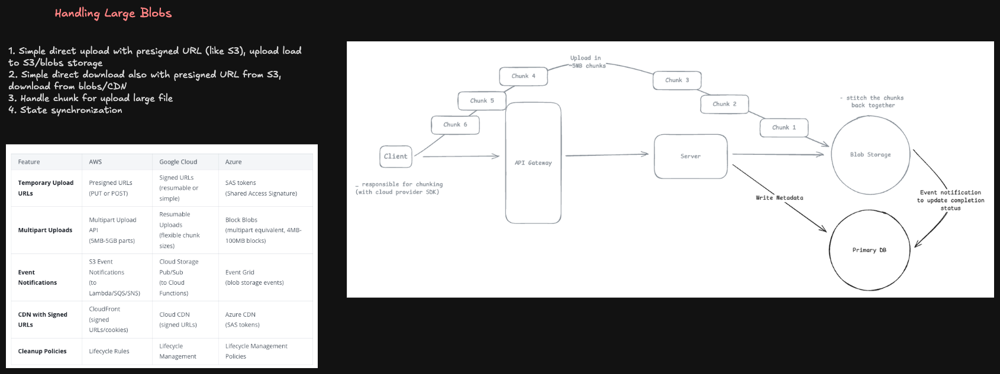
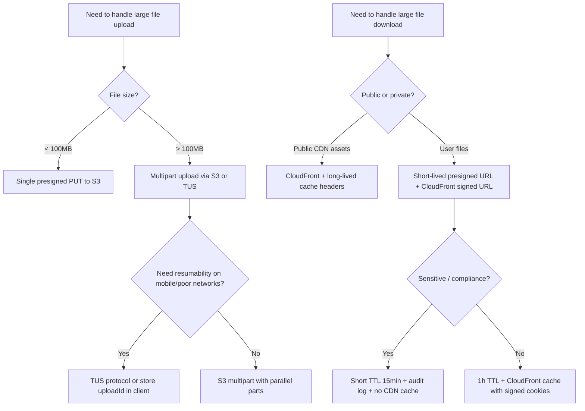

# Handling Large Blobs — Upload & Download



```

                     ┌───────────────────────┐
                     │ Web / Mobile Client   │
                     └───────────┬───────────┘
                                 │
                         Metadata/API calls
                                 │
                     ┌───────────▼───────────┐
                     │ CDN + API Gateway     │
                     │ WAF / Rate Limiting   │
                     └───────┬───────────────┘
                             │
             ┌───────────────┴─────────────────┐
             │                                 │
   ┌─────────▼──────────┐           ┌──────────▼──────────┐
   │ File Metadata API  │           │ Authorization       │
   │ Upload Coordinator │           │ Tenant / ACL Service│
   └─────────┬──────────┘           └─────────────────────┘
             │
     ┌───────┴────────┐
     │                │
┌────▼─────┐   ┌──────▼─────────┐
│Metadata DB│   │Upload Session  │
│SQL/NoSQL  │   │Store / Redis   │
└────┬─────┘   └────────────────┘
     │
     │ returns signed URLs
     ▼
┌─────────────────────────────────────────────┐
│ Distributed Object Storage                 │
│ S3 / GCS / Azure Blob / Internal Storage   │
│ Multi-AZ replication + erasure coding      │
└──────────────────────┬──────────────────────┘
                       │ Object-created event
                       ▼
              ┌─────────────────────┐
              │ Event Bus           │
              │ Kafka / Pub/Sub     │
              └──────────┬──────────┘
                         │
       ┌─────────────────┼─────────────────┐
       │                 │                 │
┌──────▼───────┐ ┌───────▼──────┐ ┌────────▼────────┐
│Virus Scanner │ │Preview Worker │ │Metadata Extractor│
└──────────────┘ └──────────────┘ └─────────────────┘
                         │
                         ▼
                  Preview Storage
                         │
                         ▼
                    Global CDN
```

1. Client requests an upload session.
2. API authenticates user and checks quota.
3. Metadata service creates a PENDING file record.
4. Upload coordinator returns signed multipart-upload URLs.
5. Client uploads parts directly to object storage.
6. Client retries failed parts independently.
7. Client calls complete-upload.
8. Server verifies object size, checksum, and multipart manifest.
9. File status changes to PROCESSING.
10. Storage event is published to the event bus.
11. Workers scan the file and generate previews.
12. File status becomes READY.

I would separate the metadata control plane from the file-byte data plane. The API service manages ownership, versions, permissions, quotas, and upload sessions in a strongly consistent metadata store. Clients upload large files directly to distributed object storage using short-lived multipart signed URLs, avoiding routing file bytes through application servers.

Files are immutable; an edit creates a new version. This simplifies CDN caching, replication, auditability, and rollback. After storage confirms upload completion, the system atomically marks the version as processing and publishes an event through a transactional outbox. Asynchronous workers perform malware scanning, metadata extraction, thumbnailing, and transcoding.

Downloads are served through a global CDN using versioned object URLs and short-lived authorization tokens. The storage layer replicates hot assets across availability zones, uses erasure coding for colder assets, and asynchronously replicates critical content to a disaster-recovery region.

## I would use strong consistency for metadata, permissions, version pointers, and quota accounting, while allowing eventual consistency for previews, search indexes, CDN propagation, and cross-region replicas. Multipart uploads, idempotent completion, checksums, reconciliation jobs, lifecycle tiers, and tenant-aware rate limits provide reliability and cost control at Adobe scale.

## Why This Is a Staff-Level Problem

Handling a 10KB JSON payload is trivial. Handling a 5GB video file under real-world conditions — mobile clients dropping mid-upload, CDN edge caches, byte-range streaming, deduplication at scale, virus scanning — is a system design problem that touches networking, storage, security, and cost optimization simultaneously.

Staff engineers are expected to reason about the full lifecycle: **how bits move from client to durable storage**, **how they move back efficiently**, and **what breaks at 10M files/day**.

---

## The Naive Approach and Why It Fails

```
Client ──► POST /upload (entire file in body) ──► App Server ──► S3
```

Problems at scale:

- **Memory pressure** — app server must buffer the entire file in memory or disk before streaming to object storage
- **Timeout failures** — large files on slow connections exceed gateway/load balancer timeouts (AWS ALB default: 60s)
- **No resume** — any network interruption restarts from byte 0
- **Single bottleneck** — all uploads route through your app fleet, adding unnecessary cost and latency
- **No progress visibility** — client has no feedback until the entire upload completes or fails

---

## The Right Architecture: Client-Direct Upload

Remove the app server from the data path entirely. The server only issues credentials; the client talks directly to object storage.

```
1. Client ──► POST /api/upload/init ──────────────────────► App Server
2. App Server ──────────────────────── presigned URL/STS ──► Client
3. Client ──────────────────────────────────────── PUT ──► S3 / GCS / Azure Blob
4. Client ──► POST /api/upload/complete (key, checksum) ──► App Server
5. App Server ──── verify + record metadata ──────────────► DB
```

**Benefits:** App servers handle only metadata — tiny payloads. Object storage handles throughput. You're not paying EC2 egress for bytes that flow straight from client to S3.

---

## Multipart / Resumable Upload Deep Dive

### S3 Multipart Upload

S3 multipart splits files into parts (minimum 5MB each, up to 10,000 parts, max 5TB total).

```
InitiateMultipartUpload → uploadId
  │
  ├── UploadPart (part 1, bytes 0–5MB)    → ETag1
  ├── UploadPart (part 2, bytes 5–10MB)   → ETag2
  ├── UploadPart (part 3, bytes 10–15MB)  → ETag3
  │   (parallelizable — all parts in flight simultaneously)
  │
  └── CompleteMultipartUpload([ETag1, ETag2, ETag3])
```

**Resumability:** Store `\{uploadId, completedParts[]\}` on the client (localStorage / IndexedDB). On retry, skip already-uploaded parts by comparing ETags. Only re-upload failed parts.

**Server-side initiation flow:**

```
Client: POST /api/upload/multipart/init  { filename, size, contentType }
Server: calls s3.createMultipartUpload() → returns { uploadId, key }
Server: stores pending upload record in DB { uploadId, userId, status: 'pending' }

Client: requests presigned URLs per part
Server: calls s3.getSignedUrl('uploadPart', { uploadId, partNumber }) per part
        returns array of { partNumber, presignedUrl }

Client: PUTs each part directly to S3 using presigned URLs (parallel)
Client: collects ETags from each 200 response

Client: POST /api/upload/multipart/complete { uploadId, parts: [{partNumber, ETag}] }
Server: calls s3.completeMultipartUpload()
Server: updates DB record { status: 'complete', s3Key, size, checksum }
```

### TUS Protocol (Open Standard for Resumable Uploads)

TUS is a HTTP-based open protocol for resumable uploads. Libraries exist for every major client platform.

```
POST   /files            → creates upload, returns Location header
HEAD   /files/{id}       → returns Upload-Offset (how many bytes received)
PATCH  /files/{id}       → appends bytes starting at Upload-Offset
```

Client resumes by: `HEAD` to get offset → `PATCH` from that byte position. Works over any HTTP infrastructure. Use when you want resumability without coupling to S3 specifics or when targeting self-hosted storage.

---

## Chunking Strategy

| File Size   | Recommended Chunk Size            | Parallelism     |
| ----------- | --------------------------------- | --------------- |
| < 100MB     | Single part (no multipart needed) | —               |
| 100MB – 1GB | 10–20MB chunks                    | 3–5 concurrent  |
| 1GB – 10GB  | 50–100MB chunks                   | 5–10 concurrent |
| > 10GB      | 100–500MB chunks                  | 10+ concurrent  |

**Adaptive chunking:** Start with a target upload time per chunk of ~10s. Measure throughput after chunk 1, adjust chunk size dynamically for subsequent parts.

---

## Download: Byte-Range Requests and Streaming

### HTTP Range Requests

Object storage natively supports `Range` headers. Clients should always use them for large files.

```
GET /video.mp4
Range: bytes=0-1048575       → 206 Partial Content (first 1MB)

GET /video.mp4
Range: bytes=52428800-       → 206 Partial Content (from 50MB to end)
```

**Use cases:**

- **Video seeking** — jump to timestamp without downloading preceding bytes
- **Parallel download** — split file into N segments, download concurrently, reassemble
- **Resume download** — track last received byte, resume with `Range: bytes=\{offset\}-`

### Presigned Download URLs

Never expose your S3 bucket publicly. Generate short-lived presigned URLs server-side.

```
Client: GET /api/files/{id}/download
Server: verifies authorization
        generates s3.getSignedUrl('getObject', { Key, Expires: 900 }) → presignedUrl
        returns { url: presignedUrl, filename, size }
Client: issues GET to presignedUrl directly (hits S3/CDN, bypasses app server)
```

**Expiry trade-off:** Short TTL (15min) reduces window for URL leakage. Long TTL (24h) reduces server round-trips. For sensitive content, use 15min + audit log every issuance.

---

## CDN Layer for Downloads

```
Client ──► CDN Edge (e.g., CloudFront)
                │ cache hit → return immediately
                │ cache miss
                ▼
           Origin (S3)
```

**Cache-Control strategy:**

| Content Type                         | Cache-Control                         | Rationale                                 |
| ------------------------------------ | ------------------------------------- | ----------------------------------------- |
| Public, immutable (versioned assets) | `public, max-age=31536000, immutable` | Content-addressed — URL changes on update |
| User files (avatar, docs)            | `private, max-age=3600`               | Not shared across users                   |
| Sensitive / auth-gated               | `private, no-store`                   | Must not be cached at CDN                 |

**Signed URLs at CDN level:** CloudFront signed cookies/URLs gate access without round-tripping your origin on every request. Generate a CloudFront signed URL with a 1h expiry alongside the S3 presigned URL.

---

## Integrity Verification

Never trust "upload succeeded" without verifying the bytes.

### Client-Side Checksum

```
Client computes SHA-256 of file before upload
  → sends as custom header: x-amz-checksum-sha256
  → or includes in CompleteMultipartUpload call

S3 verifies against received bytes → rejects if mismatch
```

### Server-Side Verification (Post-Upload)

```
S3 event notification → Lambda/Worker trigger
Worker: downloads object headers, checks ETag / checksum
        verifies file size matches declared size
        runs content validation (file type sniff, malware scan)
        updates DB: { verified: true } or quarantines
```

**ETag on multipart uploads:** S3's ETag for a multipart upload is _not_ the MD5 of the file — it's the MD5 of the concatenated part ETags plus `-\{partCount\}`. Do not compare it to a client-computed MD5.

---

## Security Considerations

### Presigned URL Scope Locking

Presigned URLs can be leaked. Mitigate:

- **IP binding** — include `aws:SourceIp` condition in the bucket policy (breaks mobile/NAT users — use carefully)
- **Short TTL** — 15min for uploads, 1h for downloads
- **One-time tokens** — issue a server-side token that invalidates after first use; the download endpoint validates the token before generating the presigned URL

### Content Validation (Never Trust MIME Type Headers)

```
Client sends: Content-Type: image/jpeg
Server: DO NOT trust this — it's user-controlled

Post-upload worker:
  - Read magic bytes (file signature) to determine true type
    JPEG: FF D8 FF
    PNG:  89 50 4E 47
    PDF:  25 50 44 46
  - Reject or quarantine if type doesn't match declared content
  - Scan with ClamAV / cloud malware API for user-uploaded content
```

### Preventing Hotlinking and Abuse

- Rate-limit presigned URL generation per user/IP
- Audit log every URL issuance (userId, fileId, IP, timestamp)
- Set `Content-Disposition: attachment` on download URLs to prevent inline execution of HTML/JS files

---

## Deduplication

At scale, storing identical files multiple times wastes storage and increases cost.

### Content-Addressed Storage

```
hash = SHA-256(file_bytes)
s3_key = "blobs/{hash[:2]}/{hash}"   # content-addressed path

Before upload:
  SELECT id FROM files WHERE content_hash = ?
  → if exists: record reference, skip upload
  → if new: proceed with upload to s3_key
```

**Reference counting:** Track how many records point to each blob. Only delete the object when ref count reaches 0.

**Trade-offs:**

- Requires client to compute hash before upload (feasible in browser via Web Crypto API, streaming hash)
- Hash collision risk: SHA-256 is sufficient; SHA-256 + size check for paranoia
- Privacy concern: proves two users uploaded identical content — acceptable for documents, potentially problematic for sensitive files (consider per-tenant deduplication only)

---

## Metadata Architecture

Keep blob metadata separate from blob bytes.

```sql
CREATE TABLE blobs (
  id           UUID PRIMARY KEY DEFAULT gen_random_uuid(),
  owner_id     BIGINT NOT NULL REFERENCES users(id),
  s3_key       TEXT NOT NULL,
  content_hash TEXT NOT NULL,          -- SHA-256
  size_bytes   BIGINT NOT NULL,
  mime_type    TEXT NOT NULL,
  filename     TEXT NOT NULL,
  status       TEXT NOT NULL DEFAULT 'pending',  -- pending | complete | quarantined
  created_at   TIMESTAMPTZ DEFAULT now(),
  expires_at   TIMESTAMPTZ,            -- for temporary uploads
  ref_count    INT NOT NULL DEFAULT 1  -- for dedup reference counting
);

CREATE INDEX idx_blobs_owner ON blobs(owner_id, created_at DESC);
CREATE INDEX idx_blobs_hash  ON blobs(content_hash);
```

**Lifecycle:** Set S3 lifecycle rules to expire `status = 'pending'` objects after 24h. Run a reconciliation job to clean orphaned DB records.

---

## Handling Failures

| Failure Point                                  | Mitigation                                                                                  |
| ---------------------------------------------- | ------------------------------------------------------------------------------------------- |
| Client drops mid-upload                        | Multipart + stored `uploadId` enables resume                                                |
| Part upload fails                              | Retry that part only (exponential backoff, max 3 retries)                                   |
| `CompleteMultipartUpload` fails                | Idempotent — retry with same `uploadId` + ETags                                             |
| Server crashes after S3 write, before DB write | Reconciliation job: scan S3 for orphaned objects missing DB record                          |
| S3 throttling (503)                            | Exponential backoff with jitter; spread parts across time                                   |
| Multipart upload abandoned                     | S3 lifecycle rule: abort incomplete multipart uploads after 7 days to avoid storage charges |

---

## Cost Optimization at Scale

- **Storage class tiering:** Move blobs not accessed in 30d to S3-IA, 90d to Glacier. Use S3 Intelligent-Tiering for unpredictable access patterns.
- **Compress before store:** For text-heavy content (JSON, logs, documents), gzip client-side before upload. Store compressed; decompress on download.
- **Avoid S3 GET charges with CloudFront:** CloudFront charges per request are lower than S3 GET. Route all downloads through CDN.
- **Multipart upload cleanup:** Abandoned multipart uploads accrue storage costs. Mandatory lifecycle rule to abort after 7 days.
- **Deduplication ROI:** At 10M files with 20% duplication and avg 2MB size: 20% × 10M × 2MB = **4TB saved**.

---

## Decision Framework



---

## Staff Interview Follow-ups

**"How do you handle virus scanning without blocking the upload response?"**
Scan async. Upload goes to a quarantine prefix in S3 (`uploads/pending/\{key\}`). An S3 event triggers a Lambda/worker that runs ClamAV or a cloud AV API. On clean result, the worker moves the object to `uploads/clean/\{key\}` and updates DB status. Client polls status endpoint or receives a webhook. Never expose quarantine prefix via presigned URLs.

**"How do you prevent users from uploading files they don't own and accessing others' files?"**
Presigned URL generation is gated by your API auth. The S3 key encodes `\{userId\}/\{uuid\}` — users can only request presigned URLs for their own prefix. IAM bucket policy denies direct access; all access goes through your API which enforces ownership checks before issuing URLs.

**"How would you handle 1M concurrent uploads?"**
Your app server only handles metadata RPCs (tiny). The actual bytes go client → S3. S3 is designed for this scale — it auto-scales internally. Your bottleneck is presigned URL generation throughput on your API tier, which is horizontally scalable and stateless. DB writes for metadata are batched async.

**"What happens if S3 is unavailable?"**
Queue upload requests in a durable queue (SQS). Return a `202 Accepted` to the client with a job ID. Retry from the queue when S3 recovers. For downloads, CDN cache serves previously-cached objects during S3 outages — another reason to set appropriate cache TTLs.
