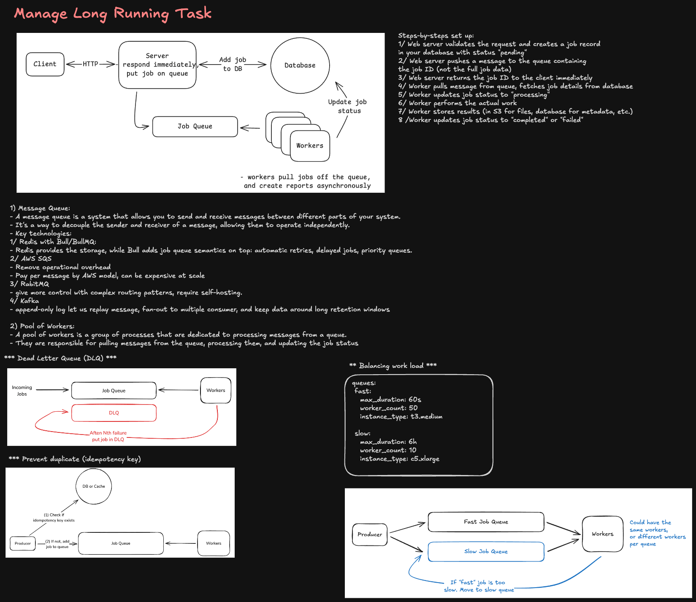
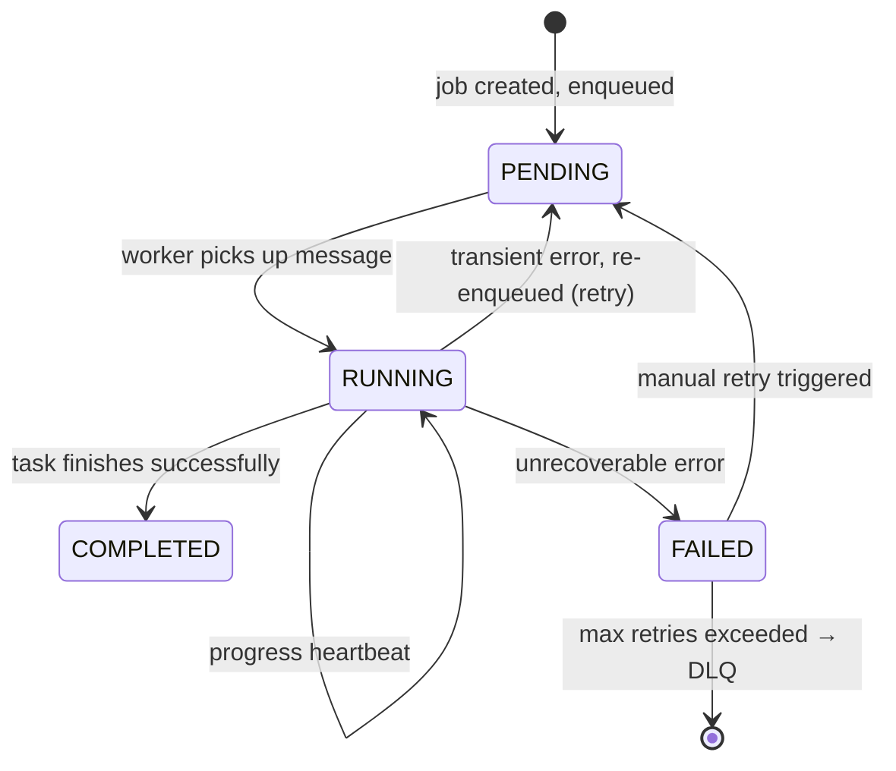
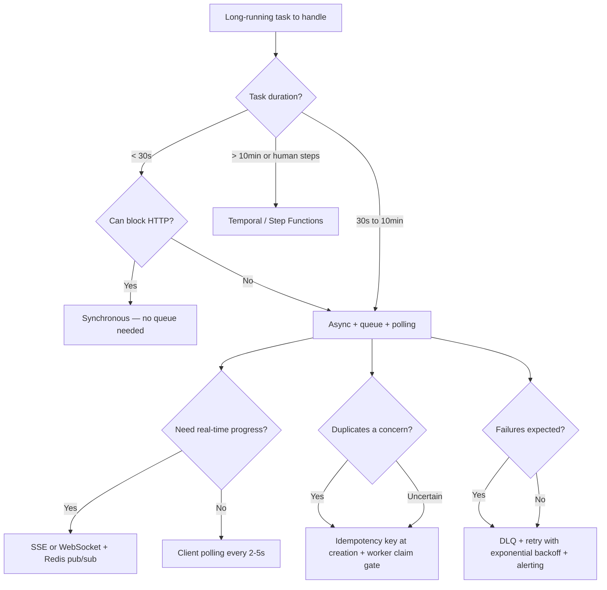

# Managing Long-Running Tasks



---

## Why Long-Running Tasks Are Different

A synchronous HTTP request is bounded — typically 30–60s before the gateway kills it. Long-running tasks violate this assumption: video transcoding takes minutes, ML model training takes hours, report generation takes seconds-to-minutes under load, PDF rendering blocks on external APIs.

Forcing these into synchronous HTTP handlers causes:

- **Gateway timeouts** — ALB/Nginx kills the connection before the task completes
- **Retried work** — the client retries, spawning duplicate tasks
- **Blocked threads** — your web server exhausts its thread pool serving waiting connections
- **No progress visibility** — the user stares at a spinner with no feedback
- **No resilience** — a server restart loses all in-progress work

**Staff-level framing:** Long-running tasks require decoupling the _acceptance_ of work from the _execution_ of work. The client gets an immediate acknowledgment; execution happens asynchronously with durable state.

---

## Core Architecture: Accept → Queue → Execute → Poll/Push

```
Client
  │
  ├─► POST /api/jobs/create            202 Accepted { jobId }
  │         │
  │         └──► Enqueue to SQS/Kafka ──► Worker Pool
  │                                              │
  │                                      execute task
  │                                              │
  │                                      update jobs table (status, progress, result)
  │
  ├─► GET /api/jobs/{jobId}/status      200 { status, progress, result }
  │   (polling)
  │
  └─► WebSocket / SSE                   push progress events (optional)
```

---

## Job Lifecycle & State Machine



### Jobs Table Schema

```sql
CREATE TABLE jobs (
  id              UUID PRIMARY KEY DEFAULT gen_random_uuid(),
  type            TEXT NOT NULL,              -- 'video_transcode', 'report_generate'
  status          TEXT NOT NULL DEFAULT 'pending',
  owner_id        BIGINT REFERENCES users(id),
  input_payload   JSONB NOT NULL,
  result_payload  JSONB,
  progress        INT DEFAULT 0,             -- 0-100
  error_message   TEXT,
  attempts        INT DEFAULT 0,
  max_attempts    INT DEFAULT 3,
  idempotency_key TEXT UNIQUE,               -- prevents duplicate job creation
  enqueued_at     TIMESTAMPTZ DEFAULT now(),
  started_at      TIMESTAMPTZ,
  completed_at    TIMESTAMPTZ,
  next_retry_at   TIMESTAMPTZ,
  expires_at      TIMESTAMPTZ                -- auto-cleanup old jobs
);

CREATE INDEX idx_jobs_owner_status ON jobs(owner_id, status, enqueued_at DESC);
CREATE INDEX idx_jobs_idempotency  ON jobs(idempotency_key) WHERE idempotency_key IS NOT NULL;
```

---

## Queue Design

### Message Structure

Every queue message must carry enough context to execute the job independently — never rely on in-memory state.

```json
{
  "jobId": "550e8400-e29b-41d4-a716-446655440000",
  "jobType": "video_transcode",
  "attemptNumber": 1,
  "enqueuedAt": "2026-08-02T10:00:00Z",
  "idempotencyKey": "user_123_upload_abc_transcode",
  "payload": {
    "inputS3Key": "uploads/raw/abc.mp4",
    "outputFormat": "hls",
    "resolution": "1080p"
  }
}
```

### Queue Configuration (SQS)

```
Standard Queue:
  - VisibilityTimeout: 2× expected task duration (e.g., 10min for 5min tasks)
  - MessageRetentionPeriod: 4 days
  - ReceiveMessageWaitTimeSeconds: 20 (long polling — reduces empty receives)

Dead Letter Queue (DLQ):
  - Redrive policy: maxReceiveCount = 3 (after 3 failed attempts → DLQ)
  - MessageRetentionPeriod: 14 days
  - Alarm: CloudWatch alert if DLQ depth > 0
```

**VisibilityTimeout is critical:** When a worker picks up a message, SQS hides it from other workers for `VisibilityTimeout` seconds. If the worker crashes without deleting the message, it becomes visible again after the timeout and another worker retries it. Set this to comfortably exceed your task duration — if set too short, healthy tasks get retried unnecessarily.

---

## Dead Letter Queue (DLQ) Deep Dive

The DLQ captures messages that failed `maxReceiveCount` times. It is not a bin — it's an operational instrument.

### Why Messages Land in DLQ

| Root Cause                   | Example                                    | Resolution                                                       |
| ---------------------------- | ------------------------------------------ | ---------------------------------------------------------------- |
| Bug in worker code           | NullPointerException on unexpected payload | Fix bug, redrive DLQ                                             |
| Malformed input              | Invalid S3 key format                      | Validate at enqueue time; reject or sanitize                     |
| Dependent service down       | External API 500s                          | Backoff strategy, circuit breaker, redrive when service recovers |
| Payload too large            | Message exceeds SQS 256KB limit            | Store payload in S3, pass S3 key in message                      |
| Non-retryable business error | User account deleted mid-job               | Catch, mark job FAILED, don't re-enqueue                         |
| Poison pill message          | Corrupted JSON                             | Dead-letter immediately, alert on-call                           |

### DLQ Operations

```
Monitor: CloudWatch metric → ApproximateNumberOfMessagesVisible on DLQ
Alert: PagerDuty/Slack when depth > 0 (or > threshold for high-volume queues)

Investigate: read DLQ messages → inspect payload + error context
Fix: patch worker code, restore dependent service
Redrive: SQS console or API → move messages back to main queue for retry

Quarantine: if message is a poison pill, inspect and discard manually
Audit: log every DLQ event { jobId, attemptCount, errorMessage, timestamp }
```

### Non-Retryable vs Retryable Errors

```typescript
async function processJob(message: SQSMessage): Promise<void> {
  try {
    await executeTask(message.payload);
    await deleteMessage(message); // success → remove from queue
  } catch (error) {
    if (isNonRetryable(error)) {
      // Business error — don't retry, mark failed, delete message
      await markJobFailed(message.jobId, error.message);
      await deleteMessage(message); // prevent DLQ for known-bad jobs
      return;
    }
    // Retryable (transient) — do NOT delete message
    // SQS will re-enqueue after VisibilityTimeout
    // After maxReceiveCount retries → auto-routes to DLQ
    throw error;
  }
}

function isNonRetryable(error: Error): boolean {
  return (
    error instanceof InvalidInputError ||
    error instanceof ResourceNotFoundError ||
    error instanceof AuthorizationError
  );
}
```

---

## Duplicate Detection & Idempotency

Long-running tasks are vulnerable to duplicates from multiple angles:

- Client retries the `POST /jobs/create` endpoint (network timeout)
- SQS delivers a message twice (at-least-once delivery guarantee)
- Worker picks up message, crashes after completing the task but before deleting the message

### Layer 1: Idempotent Job Creation

```typescript
// Client sends a stable idempotency key with every request
POST /api/jobs/create
{
  "type": "video_transcode",
  "idempotencyKey": "user_123_upload_abc_transcode_v1",
  "payload": { ... }
}

// Server:
const existing = await db.query(
  'SELECT id, status FROM jobs WHERE idempotency_key = $1', [idempotencyKey]
);
if (existing) {
  return { jobId: existing.id, status: existing.status };  // return existing job
}

// Insert new job atomically
const job = await db.query(
  'INSERT INTO jobs (type, idempotency_key, ...) VALUES ($1, $2, ...) RETURNING id',
  [type, idempotencyKey, ...]
);
await enqueue({ jobId: job.id, ... });
return { jobId: job.id, status: 'pending' };
```

**Idempotency key design:** Should encode the _intent_, not the _request_. `user_\{id\}_upload_\{uploadId\}_transcode` is stable across retries. A random UUID per request is not.

### Layer 2: Worker-Level Idempotency

Before executing, check if the job already completed:

```typescript
async function executeJob(jobId: string, payload: Payload): Promise<void> {
  // Atomic claim: prevents two workers racing on same job
  const claimed = await db.query(
    `
    UPDATE jobs SET status = 'running', started_at = now(), attempts = attempts + 1
    WHERE id = $1 AND status IN ('pending', 'failed')
    RETURNING id
  `,
    [jobId]
  );

  if (!claimed.rowCount) {
    // Job already running or completed — another worker got here first
    // Delete this duplicate message safely
    return;
  }

  try {
    const result = await doWork(payload);

    await db.query(
      `
      UPDATE jobs SET status = 'completed', result_payload = $2, completed_at = now()
      WHERE id = $1
    `,
      [jobId, result]
    );
  } catch (error) {
    await db.query(
      `
      UPDATE jobs SET status = 'failed', error_message = $2
      WHERE id = $1
    `,
      [jobId, error.message]
    );
    throw error; // let SQS retry or DLQ
  }
}
```

The `UPDATE ... WHERE status IN ('pending', 'failed')` is the idempotency gate — only one worker can transition the job to `running`.

### Layer 3: External Operation Idempotency

For operations with external side effects (Stripe charge, S3 write, email send):

```typescript
// Pass jobId as idempotency key to external APIs
await stripe.charges.create(
  {
    amount: 2000,
    currency: 'usd',
    source: token,
  },
  {
    idempotencyKey: `job_${jobId}_charge`, // Stripe deduplicates for 24h
  }
);

// For S3 writes — content-addressed key prevents overwrite
const s3Key = `results/${jobId}/output.mp4`; // jobId in key = deterministic
await s3.putObject({ Key: s3Key, Body: result }); // safe to retry
```

---

## Retry Strategy & Backoff

Naive retries hammer a failing dependency. Use exponential backoff with jitter.

```typescript
function computeBackoff(attempt: number): number {
  const base = 1000; // 1s base
  const cap = 5 * 60 * 1000; // 5min max
  const exponential = Math.min(cap, base * Math.pow(2, attempt));
  // Full jitter — prevents thundering herd
  return Math.random() * exponential;
}

// Attempt 1: 0–2s
// Attempt 2: 0–4s
// Attempt 3: 0–8s
// Attempt 4: 0–16s
// Attempt 5: 0–5min (capped)
```

For SQS, backoff is achieved via **visibility timeout extension**:

```typescript
// Worker knows it needs more time or wants to delay retry
await sqs.changeMessageVisibility({
  QueueUrl,
  ReceiptHandle: message.ReceiptHandle,
  VisibilityTimeout: computeBackoffSeconds(attempt),
});
```

---

## Progress Reporting

### Polling (Simple, Stateless)

```
Client polls every 2s:
GET /api/jobs/{jobId}/status
→ { status: 'running', progress: 45, estimatedSecondsRemaining: 30 }

Worker writes progress to DB:
UPDATE jobs SET progress = 45 WHERE id = ?
```

**Polling interval guidance:** 1–5s for user-facing tasks. Implement exponential backoff in client if job is long (avoid hammering the status endpoint for a 10-minute job).

### Server-Sent Events (Real-Time, Low Overhead)

```
Client: GET /api/jobs/{jobId}/stream    (EventSource / SSE)
Server: holds connection open
Worker: on progress update → publishes to Redis pub/sub
API:    subscribes to Redis channel for jobId → streams events to client

event: progress
data: {"progress": 45, "message": "Transcoding video..."}

event: completed
data: {"status": "completed", "resultUrl": "https://..."}
```

### WebSocket (Bidirectional, Higher Overhead)

Use when the client also needs to send messages to the server mid-task (e.g., cancel, pause). Overkill for pure progress reporting — prefer SSE.

---

## Worker Architecture

```
SQS Queue
    │
    ├─► Worker Process 1
    │     └─► task executor (thread pool: CPU-bound tasks)
    │         or
    │         async I/O (I/O-bound tasks)
    │
    ├─► Worker Process 2
    │
    └─► Worker Process N (auto-scaled by queue depth)

Auto-scaling trigger:
  CloudWatch metric: ApproximateNumberOfMessagesVisible
  Scale out: > 100 messages → add workers
  Scale in: < 10 messages → remove workers
  Target: ~30s queue processing lag
```

### Heartbeat for Long Tasks

For tasks that exceed SQS VisibilityTimeout mid-execution, extend it while running:

```typescript
async function executeWithHeartbeat(message: SQSMessage, task: () => Promise<void>): Promise<void> {
  const heartbeat = setInterval(
    async () => {
      await sqs.changeMessageVisibility({
        QueueUrl,
        ReceiptHandle: message.ReceiptHandle,
        VisibilityTimeout: 300, // extend by 5 more minutes
      });
      await db.query('UPDATE jobs SET updated_at = now() WHERE id = $1', [jobId]);
    },
    4 * 60 * 1000
  ); // every 4 minutes

  try {
    await task();
  } finally {
    clearInterval(heartbeat);
  }
}
```

Stale heartbeat detection: if `updated_at` is older than 2× VisibilityTimeout, the job's worker likely crashed. A recovery job resets `status = 'pending'` and re-enqueues.

---

## Cancellation

Cancellation is advisory — you can't kill a running worker process from outside.

```typescript
// Client requests cancellation
POST /api/jobs/{jobId}/cancel

// Server sets a flag
UPDATE jobs SET cancellation_requested = true WHERE id = ? AND status = 'running';

// Worker checks flag periodically during execution
async function transcodeLargeFile(jobId: string, input: string): Promise<void> {
  for (const segment of segments) {
    const cancelled = await db.query(
      'SELECT cancellation_requested FROM jobs WHERE id = $1', [jobId]
    );
    if (cancelled.rows[0].cancellation_requested) {
      await cleanupPartialWork(jobId);
      await db.query("UPDATE jobs SET status = 'cancelled' WHERE id = $1", [jobId]);
      return;
    }
    await transcodeSegment(segment);
  }
}
```

---

## Priority Queues

Not all jobs are equal. Use multiple queues with separate worker pools:

```
High-priority queue   (paid users, SLA: process within 30s)   → 10 workers
  │
Medium-priority queue (free users, SLA: process within 5min)  → 5 workers
  │
Low-priority queue    (batch/background jobs, best-effort)     → 2 workers
```

Assign queue at job creation based on user tier or job type. Workers consume only from their designated queue — simple, predictable, no starvation logic needed.

---

## Decision Framework



---

## Staff Interview Follow-ups

**"How do you handle a poison pill message that always crashes your worker?"**
The message will exhaust `maxReceiveCount` retries and land in the DLQ automatically. The DLQ is monitored with an alarm. The on-call engineer inspects the message, identifies the root cause (corrupt payload, code bug, unexpected format), fixes it, and redrives the message after the fix is deployed. In the meantime, the poison pill does not block other messages — SQS is not FIFO by default.

**"What's the difference between VisibilityTimeout and MessageRetentionPeriod?"**
`VisibilityTimeout` hides a message from other consumers while one worker is processing it — it's the lease duration. `MessageRetentionPeriod` is how long SQS stores a message at all before deleting it regardless. A message can survive in the queue for 4 days (retention) but only be invisible to other consumers for 5 minutes (visibility) while being processed.

**"How do you prevent a client from creating the same job 10 times due to retries?"**
The `idempotency_key` column with a UNIQUE constraint. The client derives a stable key from the intent (not a random UUID). The server does `INSERT ... ON CONFLICT (idempotency_key) DO NOTHING RETURNING id` — if the row exists, it returns the existing job ID. The client gets back the same job ID on every retry.

**"How do you scale workers to handle traffic spikes?"**
Auto-scale worker instances on `ApproximateNumberOfMessagesVisible` queue depth metric. Set a target of N messages per worker (e.g., 10). AWS Auto Scaling adjusts the worker count. Combined with SQS buffering, spikes are absorbed by the queue — no messages are dropped, they just wait longer during scale-out. Ensure `maxReceiveCount` and VisibilityTimeout are generous enough to survive a scale-out delay.

**"What happens if your jobs DB goes down?"**
Messages stay safely in SQS (VisibilityTimeout expires → re-enqueued). Workers fail to update job status and retry until the DB recovers. The client polling endpoint returns an error or cached last-known status. Once the DB recovers, workers process the backlog. Key: SQS is the source of truth for _what work exists_; the DB is the source of truth for _job state_. The two can temporarily diverge.
