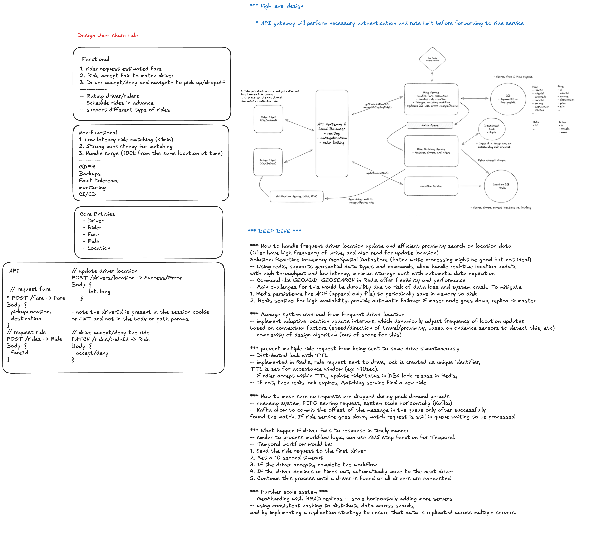
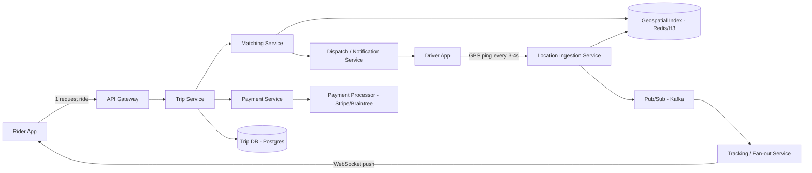

# Uber System Design

Design a ride-hailing platform: rider requests a car, system matches a nearby driver, both parties track each other in real-time, driver accepts and completes the trip, and payment is settled automatically.

---

## Functional Requirements

- **Request a ride** — rider specifies pickup/dropoff, gets fare estimate + ETA
- **Match a driver** — system finds and assigns the best available nearby driver
- **Accept/reject** — driver has a short window to accept; on timeout/reject, re-dispatch
- **Real-time tracking** — rider sees driver's live location en route to pickup, then during the trip
- **Payment** — fare calculated, charged automatically at trip end, receipt issued
- **Trip lifecycle** — requested → matched → driver en route → arrived → in progress → completed/cancelled

## Non-Functional Requirements

| Concern                   | Target                                                                             |
| ------------------------- | ---------------------------------------------------------------------------------- |
| Matching latency          | Driver found & notified within 2–5s                                                |
| Location update frequency | Every 3–4s per active driver (battery/bandwidth trade-off)                         |
| Tracking fan-out latency  | Rider sees driver position within ~1s of update                                    |
| Payment                   | Exactly-once charge, idempotent, PCI compliant                                     |
| Scale                     | Millions of concurrent trips globally, 100M+ location pings/minute in dense cities |
| Availability              | Matching & tracking must degrade gracefully; payment must never double-charge      |

---

## High-Level Architecture



**Core services:**

- **Trip Service** — owns trip state machine, source of truth (Postgres, strongly consistent)
- **Matching Service** — stateless, queries geospatial index for nearby drivers, scores candidates
- **Location Ingestion** — high write-throughput endpoint absorbing driver GPS pings
- **Geospatial Index** — Redis with geohash/H3 cells, or dedicated in-memory grid, holds _current_ driver positions only
- **Dispatch/Notification** — pushes ride offers to driver devices, manages accept/reject timers
- **Tracking/Fan-out** — subscribes to location stream, pushes filtered updates to the specific rider/driver watching a trip
- **Payment Service** — fare calculation, charge orchestration, idempotency, ledger

---

## Deep Dive 1: Requesting a Ride

**Flow:**

1. Rider app sends pickup/dropoff coordinates to Trip Service
2. Trip Service creates a trip record in state `REQUESTED`, computes a fare estimate (base fare + distance/time model + surge multiplier)
3. Trip Service asynchronously calls Matching Service to begin driver search
4. Rider app polls/subscribes (WebSocket) for trip status updates

**Fare estimation:**

- `fare = base_fare + (distance * per_km_rate) + (duration * per_min_rate) * surge_multiplier`
- Surge multiplier computed per geo-cell from a real-time demand/supply ratio (requests vs. available drivers in last N minutes), recalculated every 30–60s and cached
- Estimate shown to rider is a **range**, not a guarantee — final fare is computed from actual GPS trace at trip end

**Why async matching instead of synchronous?**

- Matching can take a few seconds (retries across candidates); blocking the request would hurt UX and time out clients
- Trip Service returns immediately with `trip_id` + status `SEARCHING`; rider app subscribes to status changes

**Idempotency:** rider can double-tap "Request Ride" — client sends an idempotency key (e.g., UUID generated on tap) so Trip Service dedupes duplicate trip creation.

---

## Deep Dive 2: Driver Matching

**Candidate retrieval — geospatial index:**

- Divide the map into cells using **H3 (hexagonal hierarchical index)** or geohash
- Each driver's last-known location is written to Redis keyed by cell: `SADD drivers:cell:\{cellId\} \{driverId\}`, plus a hash storing lat/lng, heading, status (`available`/`en_route`/`on_trip`)
- On ride request, look up the rider's cell + ring of neighboring cells (expanding radius search: try radius 1, if &lt;3 candidates expand to radius 2, etc.)
- This bounds candidate lookup to O(cells) instead of scanning all drivers

**Scoring & ranking candidates:**
Once you have ~10-20 nearby available drivers, score each by:

- **ETA to pickup** (via routing engine — road distance, not straight-line, adjusted for real-time traffic)
- **Driver acceptance rate** (deprioritize drivers who habitually reject/cancel)
- **Idle time** (fairness — drivers waiting longest get priority among near-equal ETAs)
- **Driver rating** (optional weighting)

Weighted score, e.g.: `score = w1 * (1/eta) + w2 * acceptance_rate + w3 * idle_time_norm`

**Dispatch strategy — sequential vs. batch:**

- **Sequential (Uber's original approach):** offer to best candidate, wait for accept/timeout (~10-15s), on reject/timeout move to next candidate. Simple, but slow if top candidates keep rejecting.
- **Batch/broadcast:** offer to top-K candidates simultaneously, first to accept wins, notify others "ride taken." Faster overall matching time, but requires atomic assignment to avoid double-booking.

**Preventing double-assignment (race condition):**

- Use a distributed lock or conditional write when a driver accepts: `SET trip:\{tripId\}:assigned_driver \{driverId\} NX` — only the first accept wins
- Once assigned, immediately update driver status to `en_route` in the geo-index so they're excluded from other searches
- Rejected/late drivers receive a "ride no longer available" push

**Matching at scale — sharding:**

- Geo-index sharded by region (e.g., city or larger metro cluster) since matching is inherently local — a driver in NYC will never match a rider in SF
- Each shard runs independent matching; no cross-shard coordination needed

---

## Deep Dive 3: Accepting the Ride (Driver Side)

**Offer/accept protocol:**

1. Dispatch service pushes a ride offer to the driver's app (via push notification + persistent WebSocket/long-poll)
2. Driver has a short window (~10-15s) to accept or reject
3. On accept: atomic compare-and-swap on trip assignment (see above), trip transitions to `DRIVER_ASSIGNED`, rider notified with driver info (name, photo, plate, ETA)
4. On reject or timeout: driver marked temporarily deprioritized for this trip, offer cascades to next candidate (or next batch)

**Handling flaky connectivity:**

- If driver app doesn't ACK within timeout, treat as implicit reject — don't block the rider indefinitely
- Use push notification + WebSocket redundancy: push wakes the app, WebSocket carries the real-time offer payload

**Trip state machine:**

```
REQUESTED → SEARCHING → DRIVER_ASSIGNED → DRIVER_ARRIVING → DRIVER_ARRIVED
  → IN_PROGRESS → COMPLETED
                → CANCELLED (rider or driver, at various stages, different penalty rules)
```

- Each transition is a Trip Service write (Postgres, single source of truth) — this must be strongly consistent since billing/support/disputes depend on accurate state history
- Cancellation windows/fees depend on which state the trip was in (e.g., free cancellation before driver assigned, fee after driver has been en route N minutes)

**Re-matching on driver cancellation:**

- If a driver cancels after accepting (e.g., car trouble), trip reverts to `SEARCHING`, matching re-runs excluding that driver, rider is notified with minimal disruption (ideally auto re-matched without rider re-requesting)

---

## Deep Dive 4: Real-Time Location Tracking

**Ingestion:**

- Driver app sends GPS ping every 3-4s (adaptive: less frequent when stationary/idle, more frequent when moving or near pickup/dropoff)
- High-throughput ingestion endpoint (e.g., gRPC or lightweight HTTP) writes to:
  1. **Geo-index** (Redis) — overwrite current position, used by Matching Service for candidate search
  2. **Event stream** (Kafka, partitioned by driver_id or trip_id) — used for real-time fan-out to riders and for historical trace (fare calc, ETA recompute, fraud/audit)

**Fan-out to the rider watching a specific trip:**

- Not every rider needs every driver's location — only riders with an active trip need updates for _their_ driver
- Tracking Service maintains an in-memory map of `trip_id → subscribed rider connection` (WebSocket)
- Consumes the Kafka stream, filters to only trips with active subscribers, pushes the matching driver's position over the rider's WebSocket
- This avoids fanning out all driver GPS pings to all clients — filter at the server before pushing

**Why not just poll?**

- Polling (rider app requests location every N seconds) wastes battery/bandwidth and adds latency; a persistent WebSocket push from server is far more efficient at this update frequency and scale

**ETA recomputation:**

- ETA isn't static — recomputed periodically (e.g., every 10-15s or on significant route deviation) using a routing engine with live traffic data
- Sudden large ETA jumps are smoothed client-side to avoid jarring UI changes

**Scaling location ingestion:**

- Partition by geography (same city-based sharding as matching) so ingestion, geo-index, and fan-out all colocate per-region
- Use a lightweight, connectionless protocol (UDP-like semantics over HTTP/gRPC) since occasional dropped pings are acceptable — the next ping in 3-4s supersedes it

---

## Deep Dive 5: Payment

**Fare finalization:**

- At `COMPLETED`, Trip Service computes final fare from the actual GPS trace (not the original estimate): actual distance/duration + applicable surge locked in at request time (or recalculated per policy) + tolls/fees
- Fare breakdown stored immutably on the trip record for dispute resolution

**Charging the rider — idempotency is critical:**

- Payment Service charges the rider's saved payment method using an **idempotency key = trip_id** (or trip_id + attempt number)
- If the charge request is retried (network blip, service restart), the payment processor (Stripe/Braintree) recognizes the duplicate idempotency key and returns the original result instead of double-charging
- Charge attempt recorded in a local payment ledger _before_ calling the processor (write-ahead), so a crash mid-call can be reconciled via processor status lookup rather than blindly retrying

**Handling failures:**

- Card declined → retry with backup payment method if on file, else trip marked `PAYMENT_PENDING`, rider prompted to resolve, account may be restricted from requesting new rides until resolved
- Processor timeout (unknown outcome) → do **not** immediately retry the charge; poll processor for the idempotency key's actual status first, only retry if genuinely not charged

**Split responsibilities (driver payout vs. rider charge):**

- These are decoupled: rider charge happens near-real-time; driver payout is typically batched (daily/weekly) via a separate ledger and payout service — this avoids coupling payout provider outages to the rider-facing charge path
- Internal ledger double-entry: debit rider, credit "Uber clearing account," later debit clearing account, credit driver payout batch

**PCI compliance:**

- Uber's servers never touch raw card numbers — tokenization via payment processor SDK on the client, only tokens/payment-method-IDs stored server-side

**Refunds/disputes:**

- Refund also idempotent, tied to original charge ID, reverses the ledger entry, doesn't touch the (already batched) driver payout unless fraud is confirmed

---

## Follow-up Interview Questions

1. **How do you prevent two drivers from being assigned the same rider simultaneously?** — Atomic conditional write (CAS) on trip assignment; first accept wins, others rejected.
2. **How do you handle a region with very few available drivers (rural/off-peak)?** — Expand search radius progressively; if none found within max radius/time, surface "no drivers available" and offer to notify when one is found.
3. **How would you reduce driver GPS ping cost at scale?** — Adaptive ping frequency (slower when idle/stationary), delta-compression, regional partitioning to avoid cross-datacenter hops.
4. **What happens if the Trip Service goes down mid-trip?** — Trip state persisted in Postgres before each transition; on recovery, reconcile from last known state; location tracking is independent so rider/driver apps can keep functioning with cached last-known state until Trip Service recovers.
5. **How do you avoid double-charging a rider?** — Idempotency key per trip on the payment call, write-ahead ledger entry before calling the processor, and status-check-before-retry on ambiguous failures.
6. **How would you design surge pricing to be fair and gameable-resistant?** — Compute per-geo-cell demand/supply ratio over a rolling window, cap multiplier, smooth changes to avoid rapid oscillation, and avoid exposing exact algorithm to prevent gaming by drivers artificially going offline to trigger surge.
