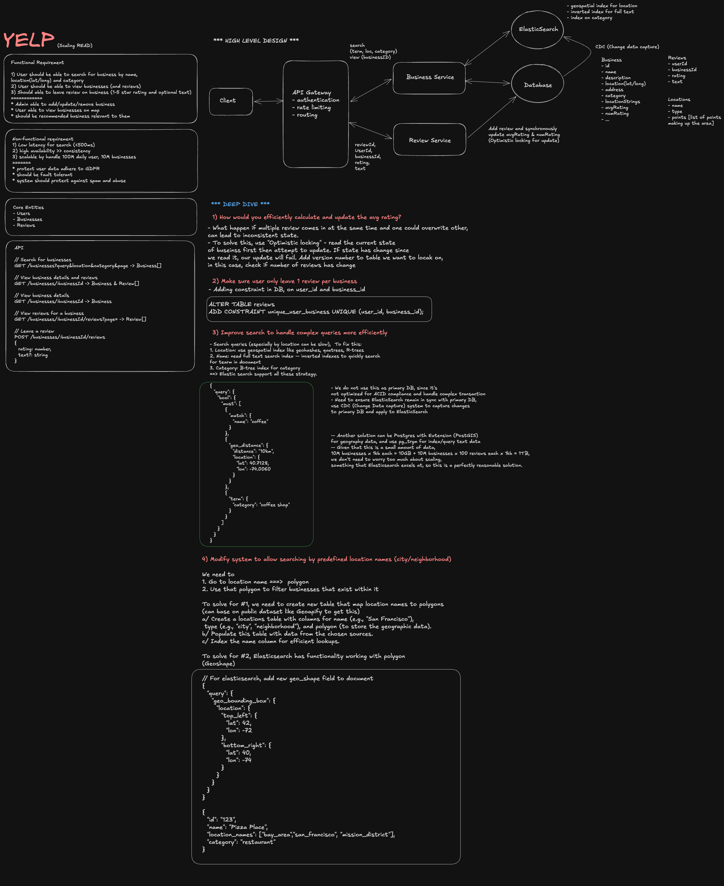

> **Editable diagram:** [Open in Excalidraw](https://excalidraw.com/#room=23d4c2ca2213378ad4d4,sJbwMv1dm4so7GJulAszwA)



---

## Problem Statement

Design a system like Yelp that allows users to **discover local businesses**, **read and write reviews**, and **search by location, category, and rating**. This is a geo-spatial search, content management, and social platform problem combined.

---

## Scale & Requirements

### Functional

- Business owners can register and manage their business listing (name, address, category, hours, photos)
- Users can search for businesses by location + keyword + filters (category, rating, price range, open now)
- Users can write reviews (text + star rating 1–5) and upload photos
- Users can view a business profile: info, aggregate rating, paginated reviews, photos
- Personalized recommendations (nearby trending, similar to past visits)

### Non-Functional

- **Search:** p99 latency &lt;200ms for geo+keyword queries
- **Reviews:** Eventual consistency acceptable; reviews visible within seconds
- **Scale:** 100M businesses globally, 200M monthly active users, 50M reviews/day reads, 500K reviews/day writes
- **Availability:** 99.99% for search and business profiles
- **Geo precision:** Support radius search (1km–50km), bounding box, city-level

### Scale Estimates

- Businesses: 100M × 1KB metadata = **100GB** — fits in memory for a hot index
- Reviews: 500K writes/day × 365 = ~180M/year; avg 500 bytes = **90GB/year**
- Photos: 2 photos/review avg, 250KB each → **1M photos/day → 3.5TB/month** (object storage)
- Search QPS: 200M MAU × 10 searches/day / 86400 ≈ **23K QPS peak**

---

## High-Level Architecture

```
┌──────────────────────────────────────────────────────────────────────┐
│                          Write Path                                  │
│  Business Registration / Review Submit                               │
│  → API Gateway → Write Service → DB (Postgres)                      │
│                              → Event (Kafka)                         │
│                              → Search Index Updater → Elasticsearch  │
│                              → Photo Upload → S3 → CDN               │
└──────────────────────────────────────────────────────────────────────┘

┌──────────────────────────────────────────────────────────────────────┐
│                          Read Path                                   │
│  Search Query (lat/lng + keyword + filters)                          │
│  → API Gateway → Search Service → Elasticsearch (geo+text)          │
│                                → Redis (hot business cache)          │
│  Business Profile                                                    │
│  → API Gateway → Profile Service → Postgres + Redis                 │
│                                  → Review Service → Cassandra        │
└──────────────────────────────────────────────────────────────────────┘
```

---

## Data Model

### Business Table (Postgres — source of truth for metadata)

```sql
CREATE TABLE businesses (
  id              UUID PRIMARY KEY DEFAULT gen_random_uuid(),
  owner_id        BIGINT REFERENCES users(id),
  name            TEXT NOT NULL,
  description     TEXT,
  category        TEXT NOT NULL,             -- 'restaurant', 'spa', 'plumber'
  subcategories   TEXT[],
  phone           TEXT,
  website         TEXT,
  price_range     SMALLINT CHECK (price_range BETWEEN 1 AND 4),   -- $ $$ $$$ $$$$
  address_line    TEXT NOT NULL,
  city            TEXT NOT NULL,
  state           TEXT,
  country         TEXT NOT NULL,
  zip             TEXT,
  lat             DOUBLE PRECISION NOT NULL,
  lng             DOUBLE PRECISION NOT NULL,
  hours           JSONB,                     -- { "mon": ["09:00","21:00"], ... }
  attributes      JSONB,                     -- { "wifi": true, "parking": "lot" }
  status          TEXT DEFAULT 'active',     -- active | closed | pending
  total_reviews   INT DEFAULT 0,
  avg_rating      NUMERIC(3,2) DEFAULT 0,    -- denormalized aggregate
  created_at      TIMESTAMPTZ DEFAULT now()
);

CREATE INDEX idx_businesses_geo ON businesses USING GIST (
  ll_to_earth(lat, lng)        -- PostGIS earth_distance extension
);
CREATE INDEX idx_businesses_category ON businesses(category, status);
```

### Reviews (Cassandra — high write throughput, time-ordered reads)

```
Table: reviews
Partition key: business_id
Clustering key: created_at DESC, review_id

Columns: review_id, user_id, rating, text, photos[], helpful_votes,
         owner_response, flagged, created_at
```

**Why Cassandra for reviews?**

- Reviews are append-only → LSM tree is ideal
- Query pattern is always `WHERE business_id = ? ORDER BY created_at DESC LIMIT 20` → perfect for partition + clustering key
- Write throughput is high (500K/day); Cassandra handles this better than Postgres under write load
- Reviews older than N months move to cold storage (S3 + Athena for analytics)

### Users Table (Postgres)

```sql
CREATE TABLE users (
  id              BIGSERIAL PRIMARY KEY,
  username        TEXT UNIQUE NOT NULL,
  email           TEXT UNIQUE NOT NULL,
  location        TEXT,
  elite_status    BOOLEAN DEFAULT false,
  review_count    INT DEFAULT 0,
  created_at      TIMESTAMPTZ DEFAULT now()
);
```

---

## Geo-Spatial Search Deep Dive

This is the hardest part of Yelp. Naively querying `WHERE lat BETWEEN x1 AND x2 AND lng BETWEEN y1 AND y2` doesn't use indexes efficiently on a spherical earth.

### Geohash (Recommended Primary Approach)

Geohash encodes a (lat, lng) pair into a string prefix where shared prefix = geographic proximity.

```
lat=37.7749, lng=-122.4194 (San Francisco)
→ Geohash: "9q8yy" (precision 5 = ~5km cell)
→ Geohash: "9q8yy1" (precision 6 = ~1km cell)

Search radius = "find all geohash cells that overlap the search circle"
  1. Compute center geohash at appropriate precision
  2. Find 8 neighboring geohash cells + center = 9 cells
  3. Query: WHERE geohash LIKE '9q8yy%'
  4. Post-filter: precise distance check on candidates
```

```sql
ALTER TABLE businesses ADD COLUMN geohash TEXT GENERATED ALWAYS AS (
  ST_GeoHash(ST_SetSRID(ST_Point(lng, lat), 4326), 6)
) STORED;

CREATE INDEX idx_businesses_geohash ON businesses(geohash, category, status);

-- Range query: all businesses within geohash prefix
SELECT * FROM businesses
WHERE geohash LIKE '9q8yy%'
  AND category = 'restaurant'
  AND status = 'active'
  AND earth_distance(ll_to_earth(lat, lng), ll_to_earth(37.7749, -122.4194)) < 5000
ORDER BY avg_rating DESC
LIMIT 20;
```

**Geohash precision guide:**

| Precision | Cell Size | Use Case            |
| --------- | --------- | ------------------- |
| 4         | ~40km     | City-level search   |
| 5         | ~5km      | Neighborhood search |
| 6         | ~1km      | Walking distance    |
| 7         | ~150m     | Precise location    |

### Elasticsearch for Production Geo Search

At 23K QPS with combined text + geo + filter queries, Elasticsearch is the right tool.

```json
{
  "query": {
    "bool": {
      "must": {
        "multi_match": {
          "query": "sushi",
          "fields": ["name^3", "description", "subcategories"]
        }
      },
      "filter": [
        {
          "geo_distance": {
            "distance": "5km",
            "location": { "lat": 37.7749, "lon": -122.4194 }
          }
        },
        { "term": { "category": "restaurant" } },
        { "term": { "status": "active" } },
        { "range": { "avg_rating": { "gte": 3.5 } } }
      ]
    }
  },
  "sort": [{ "_score": { "order": "desc" } }, { "avg_rating": { "order": "desc" } }]
}
```

**Index mapping** stores `location` as `geo_point` type — Elasticsearch internally uses quadtree/BKD-tree for efficient geo filtering.

**Sync strategy:** Postgres is the source of truth. Kafka events trigger an Elasticsearch indexer that updates the index asynchronously within &lt;1s of a business create/update. Full re-index runs weekly as a background job.

### Search Ranking

Yelp doesn't just sort by distance or rating — it uses a learned ranking model:

```
Score = f(
  text_relevance_score,         // BM25 tf-idf from Elasticsearch
  avg_rating,                   // aggregate of all reviews
  review_count,                 // more reviews = more confidence
  recency_of_reviews,           // recent activity signals quality
  distance_decay,               // closer = higher score (but not linear)
  price_range_match,            // user preference match
  photo_count,                  // richer profiles rank higher
  elite_review_ratio,           // Yelp Elite reviewer reviews weighted more
  business_completeness_score   // complete profiles rank higher
)
```

For MVP: use Elasticsearch's `function_score` query with Gaussian decay on distance. For production: train a gradient-boosted model (XGBoost/LightGBM) on click-through rate and booking conversion.

---

## Review System Deep Dive

### Write Path

```
User submits review
  → POST /api/businesses/{id}/reviews { rating, text, photos[] }
  → Rate limiting: 1 review per user per business (Redis SET check)
  → Spam/quality filter: ML model scores text (async, doesn't block submission)
  → Write to Cassandra: reviews table
  → Publish ReviewCreated event to Kafka
      ↓
  Aggregate Worker (consumes ReviewCreated):
    UPDATE businesses SET
      total_reviews = total_reviews + 1,
      avg_rating = ((avg_rating * total_reviews) + new_rating) / (total_reviews + 1)
    WHERE id = ?

    UPDATE users SET review_count = review_count + 1 WHERE id = ?
    Invalidate Redis cache for business profile
```

**Why not update avg_rating atomically?**
High-volume concurrent reviews would cause lock contention. Instead, use an async consumer that processes in batches. Eventual consistency on the aggregate (seconds of lag) is acceptable.

### Review Quality & Fraud Detection

```
ReviewCreated event → ML Scoring Pipeline
  Features:
    - Account age at review time
    - Review velocity (N reviews in last 24h)
    - IP geolocation vs business location
    - Text similarity to previous reviews (copy-paste detection)
    - Friend network (are reviewer and owner connected?)
    - Review language patterns (template detection)

  Output:
    - score: 0.0–1.0 (higher = more likely spam/fake)
    - action: PUBLISH | HOLD_FOR_REVIEW | REJECT | NOT_RECOMMENDED

  "Not Recommended" reviews:
    - Still stored, not counted in aggregate
    - Visible under a collapsed section ("X not recommended reviews")
    - Yelp's controversial but effective spam filter
```

### Helpful Votes

```
POST /api/reviews/{reviewId}/vote { type: 'useful' | 'funny' | 'cool' }
→ Write to votes table (Postgres): { review_id, user_id, type, created_at }
→ Unique constraint prevents double-voting
→ Async job updates reviews.helpful_count in Cassandra
→ Vote counts used in ranking: highly-voted reviews surfaced first
```

---

## Photo Storage

```
Client → POST /api/photos/upload
  → Server validates auth, checks quota (max 10 photos/review, 30/business)
  → Generates presigned S3 URL for direct upload
  → Client uploads directly to S3 (no bytes through app server)
  → S3 event → Lambda → resize to multiple sizes:
      thumbnail: 100×100
      medium:    400×300
      large:     1024×768
  → Store all sizes in S3: photos/{businessId}/{photoId}/{size}.jpg
  → CDN (CloudFront) serves all photo URLs
  → Write photo metadata to Postgres: { id, business_id, user_id, s3_key, caption, status }
```

**Moderation:** Photos go through content moderation (AWS Rekognition or custom model) before being marked `status = 'approved'`. Rejected photos are quarantined. Business owners can flag user photos; users can flag business photos.

---

## Business Profile API

The profile page aggregates: business metadata + recent reviews + photos + hours + similar businesses.

```
GET /api/businesses/{id}

Response assembled from:
  1. Business metadata      → Redis cache (TTL 5min) → Postgres fallback
  2. Recent reviews (page 1)→ Cassandra (first 20, sorted by date)
  3. Review summary         → Redis (aggregate: rating dist, top keywords)
  4. Cover photos (5)       → Postgres + CDN URLs
  5. Similar businesses     → Elasticsearch (same category, nearby, high rating)
  6. Owner response         → Cassandra (latest owner comment on each review)

All assembled in parallel → &lt;50ms server time
```

**Cache strategy:**

```
Key: business:{id}:profile
TTL: 5 minutes
Invalidation: on review write, business update, new photo approval
```

---

## Recommendations & Personalization

```
Offline (batch, nightly):
  Collaborative filtering: users who visited A also visited B
  → Stored as: user:{id}:recommendations → [businessId, score][]

Online (real-time per request):
  "Near you" feed: Elasticsearch geo query + trending weight
  "Trending in {city}": Redis sorted set, updated by review/view velocity
  "You might like": served from offline model output in Redis

Trending sorted set (Redis):
  ZINCRBY trending:{city}:{category}:{date} 1 {businessId}
  ZREVRANGE trending:sf:restaurant:2026-08-02 0 9  → top 10 trending restaurants in SF today
  Expire key at midnight
```

---

## Open / Closed in Real-Time

"Open now" is a filter users commonly apply. Business hours are stored in JSONB:

```json
{ "mon": ["09:00","21:00"], "tue": ["09:00","21:00"], ..., "sun": null }
```

At query time:

```python
def is_open_now(hours: dict, tz: str) -> bool:
    local_time = datetime.now(pytz.timezone(tz))
    day = local_time.strftime('%a').lower()  # 'mon', 'tue', ...
    if not hours.get(day):
        return False
    open_t, close_t = hours[day]
    current = local_time.strftime('%H:%M')
    return open_t <= current <= close_t
```

This runs in the application layer, not the DB. Elasticsearch indexes a precomputed `is_open_now` boolean updated hourly via a background job (avoids per-request timezone math at 23K QPS).

---

## Infrastructure & Capacity

| Component         | Technology            | Why                                                  |
| ----------------- | --------------------- | ---------------------------------------------------- |
| Business metadata | Postgres              | ACID, complex queries, PostGIS for geo               |
| Reviews           | Cassandra             | High write throughput, time-ordered reads            |
| Search            | Elasticsearch         | Geo+text+filter combined queries                     |
| Cache             | Redis                 | Hot business profiles, trending sets                 |
| Photos            | S3 + CloudFront       | Blob storage, CDN delivery                           |
| Events            | Kafka                 | Async fanout: index updates, aggregates, ML pipeline |
| Recommendations   | Redis + offline batch | Low-latency serving                                  |

---

## Failure Scenarios & Mitigations

| Failure                              | Impact                 | Mitigation                                                                 |
| ------------------------------------ | ---------------------- | -------------------------------------------------------------------------- |
| Elasticsearch down                   | Search unavailable     | Fallback to Postgres geo query (slower but correct); circuit breaker       |
| Cassandra node failure               | Partial review reads   | Replication factor 3 + QUORUM reads; remaining nodes serve requests        |
| Review aggregate consumer lag        | Stale avg_rating       | Acceptable — &lt;30s lag; display "ratings updating" if lag detected       |
| Photo upload S3 failure              | User sees error        | Retry with exponential backoff; queue upload for background retry          |
| Spam filter outage                   | Spam reviews published | Buffer reviews in Kafka; process once filter recovers; manual review queue |
| Redis eviction under memory pressure | Cache misses spike     | DB handles load; auto-scaling; LFU eviction to keep hottest data           |

---

## Key Design Decisions & Trade-offs

| Decision                                | Rationale                             | Trade-off                                                            |
| --------------------------------------- | ------------------------------------- | -------------------------------------------------------------------- |
| Cassandra for reviews                   | Write throughput, time-ordered reads  | No complex queries; must denormalize for other access patterns       |
| Elasticsearch for search                | Geo+text+filter in one query, 23K QPS | Eventual consistency with Postgres (seconds lag); infra cost         |
| Geohash prefix search                   | Simple, fast, works at scale          | Boundary artifacts (cells near geohash boundary need neighbor cells) |
| Async aggregate updates                 | Avoids write contention on avg_rating | Seconds of lag; acceptable for review aggregates                     |
| "Not Recommended" instead of delete     | Preserves data, auditable             | Controversial; reduces trust if over-applied                         |
| Denormalized avg_rating in business row | Fast reads; no join needed            | Must keep in sync with reviews; eventual consistency                 |

---

## Staff Interview Follow-ups

**"How do you handle the 'open now' filter at 23K QPS?"**
Pre-compute `is_open_now` boolean in Elasticsearch indexed field, updated by a background job every hour (or triggered on hour boundaries). At query time, simply filter `"term": \{"is_open": true\}`. Avoids per-request timezone arithmetic. Accuracy: worst case 59-minute stale for a business that changed hours — acceptable.

**"How do you prevent fake reviews?"**
Multi-layer defense: rate limiting (1 review per user per business), account age gate (accounts &lt;7 days old flagged), IP/device fingerprinting, ML text analysis (template detection, sentiment anomalies), graph analysis (reviewer-owner relationship), behavioral signals (reviewing only 1-star or only 5-star). "Not Recommended" bucket instead of delete — keeps data for model training.

**"How would you scale the search to handle global traffic spikes?"**
Elasticsearch cluster with dedicated data nodes per region (US, EU, APAC). Route search queries to nearest regional cluster via GeoDNS. Each region maintains a full replica of its regional data + a partial replica of global popular businesses. Index sharding: shard by geohash prefix so geo queries hit minimal shards. Auto-scaling data nodes on CPU and heap pressure.

**"What's your strategy for photo storage at 1M uploads/day?"**
Client-direct S3 multipart upload (no bytes through app servers). Lambda-triggered resizing pipeline generates 3 sizes. Content moderation before CDN publication. Storage tiering: recent photos in S3 Standard; photos older than 1 year move to S3 Infrequent Access; very old/rarely accessed photos to Glacier. CDN cache-control: `public, max-age=31536000, immutable` (content-addressed keys never change). Total monthly cost at 3.5TB/month ingestion: ~$80/month S3 + CloudFront egress.

**"How do you handle business owners disputing a review?"**
Flag → enters manual review queue (staffed moderation team). Automated escalation: if business has &gt;10 flags on a single review, auto-hold pending human review. Owner can post a public "owner response" visible below the review (most effective resolution). If review violates ToS (personal info, off-topic) → remove. If review is legitimate negative opinion → keep, owner can respond publicly. Track flag abuse: owners who over-flag get their flag weight reduced.
